# Technical Specification

# 0. Agent Action Plan

## 0.1 Core Testing Objective and Critical Clarifications

### 0.1.1 Critical Mismatches Identified

**CRITICAL ISSUE: Fundamental Mismatch Between Prompt Type and User Request**

The Blitzy platform has identified **three critical mismatches** that must be addressed before proceeding:

**Mismatch #1: Prompt Type vs. User Intent**
- **Assigned Prompt**: TESTING_SUMMARY_PROMPT (for adding, updating, or fixing tests)
- **User Request**: "refactor existing product Can you rewrite this node.js server in python 3 using flask"
- **Issue**: The user is requesting a **language/framework rewrite** (Node.js → Python/Flask), NOT a testing task

**Mismatch #2: "Existing Product" Assumption vs. Repository Reality**
- **User Statement**: "refactor existing product" and "rewrite **this** node.js server"
- **Repository State**: Contains ONLY `README.md` with title "# 13nov01" - **no Node.js server code exists**
- **Issue**: There is no existing Node.js implementation to rewrite

**Mismatch #3: Technical Specification vs. User Request**
- **Tech Spec Intent**: Documents a Node.js HTTP server tutorial (Section 1.1.1, 5.2.1-5.2.3)
- **User Request**: Convert to Python/Flask
- **Issue**: Fundamental technology stack change that contradicts the documented architecture

### 0.1.2 Interpreted User Intent

**Based on the provided requirements and repository analysis, the Blitzy platform understands that:**

The user's actual intent appears to be **ONE** of the following scenarios:

**Scenario A: Build Flask Server Instead of Node.js** (Most Likely)
- User wants to implement the `/hello` endpoint functionality described in the tech spec
- User prefers Python/Flask over the documented Node.js approach
- The project should be a Flask tutorial instead of a Node.js tutorial
- This is a **NEW IMPLEMENTATION task**, not a rewrite/refactor

**Scenario B: Misunderstanding of Repository State** (Possible)
- User believes Node.js code already exists in the repository
- User needs clarification that the repository is empty (greenfield project)
- User should be directed to either: (1) implement the Node.js server first, then rewrite it, or (2) clarify actual requirements

**Scenario C: Testing for Future Flask Implementation** (Less Likely Given Context)
- User wants to write tests for a future Flask rewrite
- However, this interpretation conflicts with "rewrite this node.js server" language

### 0.1.3 Recommended Path Forward

**The Blitzy platform recommends the following clarification questions be resolved:**

1. **Does the user want to BUILD a new Flask server** implementing the functionality described in the tech spec (GET /hello → "Hello World")?

2. **Or does the user need to first implement the Node.js server**, then rewrite it to Flask?

3. **Is this a request to CREATE A TESTING STRATEGY** for a Flask implementation, or is it a request to **IMPLEMENT THE SERVER ITSELF**?

4. **Should the technical specification be updated** to reflect Python/Flask as the technology stack instead of Node.js?

### 0.1.4 Assumed Interpretation for This Document

**For the purpose of creating this Agent Action Plan, the Blitzy platform will assume Scenario A:**

- The user wants to **create a NEW Python/Flask server** implementing the `/hello` endpoint functionality
- This is a **BUILD/IMPLEMENTATION task**, not a rewrite of existing code
- The server should have the same functionality as described in the tech spec
- The testing strategy will focus on **creating tests for the NEW Flask implementation**

**However, this assumption MUST be validated with the user before implementation proceeds.**

## 0.2 Testing Objectives for Flask Implementation

### 0.2.1 Primary Testing Objective

**Based on the interpreted user intent (creating a new Flask server), the testing objective is to:**

Create a comprehensive test suite for a Python 3 Flask HTTP server that implements the same functionality as the Node.js server described in the technical specification, specifically:

- **Endpoint Functionality**: GET `/hello` endpoint returns "Hello World" with HTTP 200 status
- **Error Handling**: Proper 404 responses for undefined routes and 405 responses for invalid HTTP methods
- **Response Headers**: Content-Type set to `text/plain`
- **Performance**: Response time < 100ms on localhost
- **Platform Compatibility**: Works on Windows, macOS, and Linux

**Test Categorization**: This is an **ADD NEW TESTS** task for a new Flask implementation.

### 0.2.2 Implicit Testing Requirements

Beyond the explicit user request, the following testing needs are implicit:

- **Unit Tests**: Test route handler functions in isolation
- **Integration Tests**: Test complete HTTP request/response cycle
- **Edge Case Tests**: 
  - Case-sensitive path matching (`/Hello` vs `/hello`)
  - Trailing slash handling (`/hello/` vs `/hello`)
  - Query parameter handling (`/hello?param=value`)
  - Invalid HTTP methods (POST, PUT, DELETE to `/hello`)
- **Error Handling Tests**:
  - 404 for undefined routes
  - 405 for wrong HTTP methods
  - 500 for unexpected exceptions
- **Performance Tests**: Response time validation
- **Security Tests**: Error response sanitization (no stack traces exposed to clients)

### 0.2.3 Testing Framework Selection

For Python 3 Flask applications, the standard testing stack includes:

- **pytest**: Industry-standard Python testing framework
- **Flask test client**: Built-in testing utilities from Flask
- **pytest-cov**: Coverage reporting integration
- **pytest-flask**: pytest integration for Flask applications (optional)

### 0.2.4 Coverage Requirements Interpretation

**Explicit Coverage Targets**: None specified by user

**Implicit Coverage Expectations**:
- **Functional Coverage**: 100% of endpoint functionality (single `/hello` endpoint)
- **Code Coverage Target**: ≥90% for Flask application code (industry standard for Python)
- **Error Path Coverage**: All error scenarios (404, 405, 500) must have test coverage
- **Critical Path Coverage**: Success path (GET `/hello` → "Hello World") must be comprehensively tested

**To achieve comprehensive testing, coverage should include:**
- All route handlers
- All error handling paths
- Flask application initialization
- Response header validation
- HTTP status code validation

## 0.3 Test Discovery and Repository Analysis

### 0.3.1 Current Repository State

**Repository Analysis Results:**

| Aspect | Current State | Impact on Testing |
|--------|--------------|-------------------|
| **Files Present** | Only `README.md` | No source code to test |
| **Test Infrastructure** | None exists | Must create from scratch |
| **Dependencies** | No `requirements.txt`, `setup.py`, or `pyproject.toml` | Must define complete dependency stack |
| **Flask Application** | Not implemented | Must be created before tests can be written |
| **Test Files** | None exist | Complete test suite needed |
| **CI/CD Configuration** | None | No automated testing configured (consistent with tech spec Section 6.6 which excludes CI/CD) |

### 0.3.2 Python Environment Discovery

**Python Version Requirements:**

Per the user request: **Python 3** (specific minor version to be determined)

**Version Selection Strategy:**
- Search for version specifications in: `setup.py`, `pyproject.toml`, `.python-version`, `tox.ini`, CI configs
- **Current Finding**: No version specifications exist
- **Recommendation**: Use Python 3.9+ (stable, widely supported, compatible with Flask 3.x)
- **Highest Explicitly Documented Version**: None documented (greenfield project)
- **Proposed Version**: Python 3.11 (current stable LTS with excellent Flask compatibility)

### 0.3.3 Flask Framework Research

**Flask Version Compatibility:**

The user specified "flask" without a version. Current Flask ecosystem:

- **Flask 3.0.x**: Latest stable version (released 2023, requires Python 3.8+)
- **Flask 2.3.x**: Previous stable version (Python 3.7+)
- **Recommendation**: Flask 3.0.x for modern features and long-term support

**Flask Testing Ecosystem:**
- **Built-in**: `flask.testing.FlaskClient` - No installation required
- **pytest-flask**: pytest plugin for Flask applications
- **Werkzeug test utilities**: Included with Flask

### 0.3.4 Existing Test Infrastructure Assessment

**Current Testing Framework: NONE**

The repository contains no testing infrastructure. The following must be created:

- ✗ No test runner configuration (`pytest.ini`, `setup.cfg`, `pyproject.toml`)
- ✗ No test files or test directories
- ✗ No coverage configuration (`.coveragerc`)
- ✗ No test fixtures or test data
- ✗ No mock/stub libraries configured
- ✗ No test documentation

**Required Test Infrastructure Components:**

| Component | Purpose | Implementation |
|-----------|---------|----------------|
| **Test Framework** | Execute tests | pytest |
| **Flask Test Client** | HTTP request testing | Flask built-in |
| **Coverage Tool** | Measure test coverage | pytest-cov |
| **Test Directory** | Organize test files | `tests/` directory |
| **Configuration** | pytest settings | `pytest.ini` or `pyproject.toml` |
| **Dependencies** | Test dependencies | `requirements-test.txt` or `dev` extras |

### 0.3.5 Test File Organization Strategy

**Proposed Test Structure:**

```
tests/
├── __init__.py                 # Makes tests a package
├── conftest.py                 # pytest fixtures and configuration
├── test_app.py                 # Application initialization tests
├── test_hello_endpoint.py      # /hello endpoint tests
├── test_error_handling.py      # 404, 405, 500 error tests
└── test_performance.py         # Performance validation tests (optional)
```

**Alternative Simplified Structure** (for minimal tutorial project):

```
tests/
├── conftest.py                 # Shared fixtures
└── test_server.py              # All tests in one file
```

### 0.3.6 Testing Patterns Research

**Best Practices for Flask Testing** (based on Flask documentation and community standards):

- Use Flask's `test_client()` fixture for making HTTP requests
- Use pytest fixtures for application setup/teardown
- Test in application context using `app.app_context()`
- Mock external dependencies (none in this simple case)
- Test both success and failure paths
- Validate response status codes, headers, and body content
- Use parametrized tests for multiple similar test cases

**Example Flask Test Pattern:**

```python
def test_hello_endpoint(client):
    response = client.get('/hello')
    assert response.status_code == 200
    assert response.data == b'Hello World'
```

## 0.4 Testing Scope Analysis

### 0.4.1 Test Target Identification

**Primary Code to Be Tested:**

Since no Flask implementation exists, the following components will need to be created AND tested:

| Component | Location (Proposed) | Test Type Required | Test Priority |
|-----------|-------------------|-------------------|---------------|
| **Flask Application Factory** | `app.py` or `server.py` | Unit | High |
| **Hello Route Handler** | Same file or `routes/` | Unit + Integration | Critical |
| **Error Handlers** | Same file or `error_handlers.py` | Unit + Integration | High |
| **Application Configuration** | Same file or `config.py` | Unit | Medium |

**Proposed Source Structure:**

```
.
├── app.py                      # Flask application (to be created)
├── requirements.txt            # Dependencies (to be created)
├── tests/                      # Test directory (to be created)
│   ├── conftest.py
│   └── test_server.py
└── README.md                   # Existing
```

### 0.4.2 Existing Test File Mapping

**Current State: NO existing test files**

The following table shows the test files that need to be **CREATED**:

| Source File | Existing Test File | Test Categories Present |
|-------------|-------------------|------------------------|
| `app.py` (to be created) | None | None - must create all tests |
| Error handlers | None | None - must create error tests |
| Configuration | None | None - must create config tests |

### 0.4.3 Dependencies Requiring Mocking

For this simple Flask server, **minimal mocking is required**:

- **No External Services**: The `/hello` endpoint returns a static string with no external API calls
- **No Database**: No database interactions to mock
- **No File System Operations**: No file I/O to virtualize
- **No Time-Dependent Logic**: No datetime mocking needed

**Potential Mocking Scenarios** (edge cases only):
- Application startup failures (for testing error handling)
- Port binding failures (testing EADDRINUSE scenarios)
- Flask internal errors (testing 500 error responses)

### 0.4.4 Version Compatibility Research

**Python 3 + Flask Compatibility Matrix:**

| Python Version | Flask 3.0.x | Flask 2.3.x | Recommendation |
|---------------|------------|------------|----------------|
| Python 3.11 | ✅ Fully supported | ✅ Supported | **Recommended** (latest stable) |
| Python 3.10 | ✅ Fully supported | ✅ Supported | Good alternative |
| Python 3.9 | ✅ Fully supported | ✅ Supported | Minimum recommended |
| Python 3.8 | ✅ Supported | ✅ Supported | Approaching EOL |

**Recommended Testing Stack (based on compatibility research):**

| Registry | Package Name | Version | Compatibility Rationale |
|----------|--------------|---------|------------------------|
| pip | Flask | 3.0.0 | Latest stable, Python 3.8+ compatible |
| pip | pytest | 7.4.3 | Latest stable, Python 3.7+ compatible |
| pip | pytest-cov | 4.1.0 | Latest stable, pytest 7.x compatible |
| pip | pytest-flask | 1.3.0 | Optional Flask-pytest integration |
| pip | Werkzeug | 3.0.1 | Included with Flask 3.0.0 |

**Version Selection Rationale:**
- **Flask 3.0.0**: Matches user request for modern Flask, requires Python 3.8+
- **pytest 7.4.3**: Industry standard, mature, widely adopted
- **pytest-cov 4.1.0**: Standard coverage tool for pytest
- **Python 3.11**: Latest stable Python with excellent performance and Flask compatibility

### 0.4.5 Test Environment Configuration

**Environment Variables Required:**

| Variable | Purpose | Test Value | Production Value |
|----------|---------|------------|-----------------|
| `FLASK_ENV` | Environment mode | `testing` | `production` |
| `TESTING` | Flask testing flag | `True` | `False` |
| `PORT` | Server port | `5000` (default) | `5000` or custom |

**Note**: The user provided environment variable `["sdfsdf"]` which appears to be a placeholder or test value. This will be ignored unless clarified by the user.

### 0.4.6 Test Coverage Targets

**File-Level Coverage Goals:**

| File | Target Coverage | Rationale |
|------|----------------|-----------|
| `app.py` (Flask application) | 95%+ | Core application logic must be thoroughly tested |
| Route handlers | 100% | Single endpoint must have complete coverage |
| Error handlers | 100% | All error paths must be validated |
| Configuration | 90%+ | Essential but some edge cases may be acceptable |

**Overall Project Coverage Target**: ≥90% (industry standard for Python projects)

## 0.5 Test Implementation Design

### 0.5.1 Test Strategy Selection

**Test Types to Implement:**

| Test Type | Scope | Implementation Approach |
|-----------|-------|------------------------|
| **Unit Tests** | Isolated route handler logic | Test functions independently using Flask test client |
| **Integration Tests** | Complete HTTP request/response cycle | Test full application stack with test client |
| **Edge Case Tests** | Boundary conditions | Parametrized tests for path variations, methods, headers |
| **Error Handling Tests** | Failure scenarios | Trigger 404, 405, 500 errors and validate responses |
| **Performance Tests** | Response timing | Basic timing assertions (< 100ms target) |

### 0.5.2 Test Case Blueprint

**Component: Flask Application Initialization**

```
Component: Flask Application Factory
Test Categories:
- Application Creation: App instance is created successfully
- Configuration Loading: App config is set correctly
- Route Registration: Routes are registered to the app
- Test Client Creation: Test client can be instantiated
```

**Component: GET /hello Endpoint**

```
Component: Hello Route Handler
Test Categories:
- Happy Path:
  * GET /hello returns HTTP 200
  * Response body is exactly "Hello World"
  * Content-Type header is "text/plain"
  * Response time is < 100ms

- Edge Cases:
  * GET /hello with query parameters (should still work)
  * GET /HELLO (case sensitivity - should return 404)
  * GET /hello/ (trailing slash handling)
  * GET /hello with various headers

- Error Cases:
  * POST /hello returns HTTP 405
  * PUT /hello returns HTTP 405
  * DELETE /hello returns HTTP 405
  * PATCH /hello returns HTTP 405

- Performance Boundaries:
  * Response time consistently < 100ms
  * Multiple concurrent requests handled correctly
```

**Component: Error Handling**

```
Component: Error Handlers
Test Categories:
- 404 Not Found:
  * GET /nonexistent returns HTTP 404
  * Response includes appropriate error message
  * No stack traces exposed

- 405 Method Not Allowed:
  * Wrong method returns HTTP 405
  * Response includes allowed methods

- 500 Internal Server Error:
  * Unhandled exceptions return HTTP 500
  * Generic error message to client
  * Detailed error logged server-side
```

### 0.5.3 Test Data and Fixtures Design

**Required pytest Fixtures:**

**Fixture 1: Flask Application Instance**
```python
@pytest.fixture
def app():
    """Create and configure Flask app for testing"""
    # Return configured test app
```

**Fixture 2: Test Client**
```python
@pytest.fixture
def client(app):
    """Create test client for making requests"""
    # Return app.test_client()
```

**Fixture 3: Application Context**
```python
@pytest.fixture
def app_context(app):
    """Provide application context for tests"""
    # Yield app.app_context()
```

**Test Data Structures:**

For this simple application, test data is minimal:
- Static string: "Hello World" (expected response)
- Valid endpoint: "/hello"
- Invalid endpoints: "/invalid", "/nonexistent", "/"
- Invalid methods: ["POST", "PUT", "DELETE", "PATCH"]

**No Complex Test Data Required:**
- No database fixtures
- No mock API responses
- No file-based test data
- No factories or builders

### 0.5.4 Test Organization Strategy

**Test File Structure (Comprehensive Approach):**

```python
# tests/conftest.py - Shared fixtures
# tests/test_app.py - Application initialization
# tests/test_hello_endpoint.py - /hello endpoint tests
# tests/test_error_handling.py - Error response tests
```

**Test File Structure (Simplified Approach):**

```python
# tests/conftest.py - Shared fixtures
# tests/test_server.py - All tests in one file
```

**Recommended Approach**: Simplified structure given the single endpoint and educational nature (matches tech spec philosophy of simplicity).

### 0.5.5 Test Execution Strategy

**Test Runner Configuration:**

| Setting | Value | Rationale |
|---------|-------|-----------|
| **Test Discovery Pattern** | `test_*.py` | pytest default convention |
| **Test Location** | `tests/` directory | Standard Python project structure |
| **Coverage Measurement** | Enabled via pytest-cov | Track test effectiveness |
| **Verbose Output** | `-v` flag | Clear test result visibility |
| **Stop on First Failure** | Optional `-x` flag | Fast feedback during development |

**Test Execution Commands:**

```bash
# Run all tests
pytest tests/

#### Run with coverage
pytest tests/ --cov=app --cov-report=term-missing

#### Run specific test file
pytest tests/test_server.py

#### Run with verbose output
pytest tests/ -v

#### Run and stop on first failure
pytest tests/ -x
```

### 0.5.6 Assertion Strategy

**Assertion Categories:**

| Assertion Type | Purpose | Example |
|---------------|---------|---------|
| **Status Code** | Validate HTTP response code | `assert response.status_code == 200` |
| **Response Body** | Validate response content | `assert response.data == b'Hello World'` |
| **Response Headers** | Validate Content-Type, etc. | `assert response.content_type == 'text/plain'` |
| **Response Timing** | Validate performance | `assert elapsed_time < 0.1` |
| **Type Checking** | Validate data types | `assert isinstance(response.data, bytes)` |

**Assertion Best Practices:**
- One logical assertion per test (where possible)
- Clear assertion messages for failures
- Test both positive and negative cases
- Validate complete response (status, headers, body)

## 0.6 Test File Transformation Mapping

### 0.6.1 Complete File-by-File Test Plan

**CRITICAL NOTE**: Since the repository is empty, ALL files listed below must be **CREATED** from scratch.

#### Test Transformation Modes Legend:
- **CREATE** - Create a new file from scratch
- **UPDATE** - Modify an existing file
- **DELETE** - Remove an obsolete file
- **REFERENCE** - Use as a pattern/template for other files

### 0.6.2 Source Code Files (Implementation Files to Be Created)

| Target File | Transformation | Purpose | Priority |
|-------------|----------------|---------|----------|
| `app.py` | CREATE | Flask application with `/hello` endpoint | Critical |
| `requirements.txt` | CREATE | Production dependencies (Flask) | Critical |
| `requirements-test.txt` | CREATE | Test dependencies (pytest, pytest-cov) | Critical |
| `.gitignore` | CREATE | Ignore Python cache, venv, coverage files | High |
| `README.md` | UPDATE | Add setup instructions, usage examples | High |

### 0.6.3 Test Files (All Must Be Created)

| Target Test File | Transformation | Source File/Test | Purpose/Changes |
|------------------|----------------|------------------|-----------------|
| `tests/__init__.py` | CREATE | N/A - Empty file | Make tests a Python package |
| `tests/conftest.py` | CREATE | N/A - New fixtures | Define Flask app and client fixtures for all tests |
| `tests/test_server.py` | CREATE | N/A - New tests | Comprehensive test suite for /hello endpoint, error handling, and performance |

**Alternative Detailed Test Structure** (if comprehensive testing organization preferred):

| Target Test File | Transformation | Source File/Test | Purpose/Changes |
|------------------|----------------|------------------|-----------------|
| `tests/__init__.py` | CREATE | N/A | Make tests a package |
| `tests/conftest.py` | CREATE | N/A | Shared fixtures (app, client) |
| `tests/test_app.py` | CREATE | `app.py` | Test Flask application initialization and configuration |
| `tests/test_hello_endpoint.py` | CREATE | `app.py` (route handler) | Test GET /hello endpoint success path, edge cases |
| `tests/test_error_handling.py` | CREATE | `app.py` (error handlers) | Test 404, 405, 500 error responses |
| `tests/test_performance.py` | CREATE | `app.py` | Test response time performance targets |

**Recommended Approach**: **Simplified structure** (single `test_server.py` file) to match the educational simplicity of the original Node.js tutorial design philosophy.

### 0.6.4 Configuration Files (All Must Be Created)

| Target File | Transformation | Purpose | Content Details |
|-------------|----------------|---------|----------------|
| `pytest.ini` | CREATE | pytest configuration | Test discovery, coverage settings, output formatting |
| `.coveragerc` | CREATE | Coverage configuration | Source paths, exclusions, reporting thresholds |
| `pyproject.toml` | CREATE (Optional) | Modern Python project config | Alternative to pytest.ini and setup.py |

**Recommended Configuration**: Use `pytest.ini` for simplicity (matches tutorial educational approach).

### 0.6.5 Detailed Test File Specifications

#### File: `tests/conftest.py`

**Purpose**: Define shared pytest fixtures for Flask app and test client

**Content Overview**:
```python
# Fixture: app() - Create Flask application instance
# Fixture: client(app) - Create test client for HTTP requests
# Configuration: Set TESTING=True
```

**Dependencies**: Flask, pytest

---

#### File: `tests/test_server.py`

**Purpose**: Comprehensive test suite for Flask server

**Test Categories to Include**:

**1. Application Tests** (2-3 tests)
- Test Flask app is created successfully
- Test app configuration is set correctly
- Test routes are registered

**2. Success Path Tests** (4-5 tests)
- Test GET /hello returns HTTP 200
- Test GET /hello response body is "Hello World"
- Test GET /hello Content-Type is text/plain
- Test GET /hello with query parameters works correctly
- Test response timing is < 100ms

**3. Edge Case Tests** (3-4 tests)
- Test case-sensitive path handling (GET /Hello → 404)
- Test trailing slash (GET /hello/ behavior)
- Test with various request headers
- Test concurrent requests (optional)

**4. Error Handling Tests** (5-6 tests)
- Test 404 for undefined routes (GET /nonexistent)
- Test 405 for POST /hello
- Test 405 for PUT /hello
- Test 405 for DELETE /hello
- Test 405 for PATCH /hello
- Test 500 for unhandled exceptions (optional)

**Total Test Count**: 15-20 tests

**Assertions per Test**: 1-3 assertions focusing on status code, body content, and headers

---

#### File: `app.py` (Source Code to Be Created and Tested)

**Purpose**: Flask application implementing /hello endpoint

**Components to Implement**:
```python
# Flask app initialization
# GET /hello route handler returning "Hello World"
# 404 error handler
# 405 error handler (optional, Flask handles by default)
# Application configuration
# if __name__ == '__main__': app.run() for local testing
```

**Target Lines of Code**: ~30-50 lines (matching Node.js tutorial simplicity)

---

#### File: `requirements.txt`

**Purpose**: Production dependencies

**Content**:
```
Flask==3.0.0
```

---

#### File: `requirements-test.txt`

**Purpose**: Test and development dependencies

**Content**:
```
pytest==7.4.3
pytest-cov==4.1.0
pytest-flask==1.3.0
```

---

#### File: `pytest.ini`

**Purpose**: pytest configuration

**Content**:
```ini
[pytest]
testpaths = tests
python_files = test_*.py
python_classes = Test*
python_functions = test_*
addopts = -v --cov=app --cov-report=term-missing
```

### 0.6.6 File Dependency Graph

```
app.py (SOURCE)
    ↓ tested by
tests/conftest.py (FIXTURES)
    ↓ used by
tests/test_server.py (TESTS)
    ↓ configured by
pytest.ini (CONFIG)
    ↓ requires
requirements-test.txt (DEPENDENCIES)
```

### 0.6.7 Cross-File Test Dependencies

**Shared Fixtures** (defined in `tests/conftest.py`, used in all test files):
- `app` fixture: Flask application instance
- `client` fixture: Flask test client for making HTTP requests
- `app_context` fixture (optional): Application context for tests requiring it

**Import Dependencies**:
- All test files import from `conftest.py` automatically (pytest discovers fixtures)
- Test files import `pytest` for test decorators and assertions
- No circular dependencies (tests don't import from each other)

**Mock Objects**: None required for this simple application

**Test Utilities**: None required initially; could add helper functions if tests become complex

### 0.6.8 Implementation Order

**Recommended Implementation Sequence**:

1. **Phase 1: Core Application** (Required before any testing)
   - Create `app.py` with Flask application and /hello endpoint
   - Create `requirements.txt` with Flask dependency
   - Verify app runs manually: `python app.py`

2. **Phase 2: Test Infrastructure** (Setup testing framework)
   - Create `requirements-test.txt` with pytest dependencies
   - Create `tests/__init__.py` (empty package file)
   - Create `pytest.ini` configuration
   - Install test dependencies: `pip install -r requirements-test.txt`

3. **Phase 3: Test Fixtures** (Enable test writing)
   - Create `tests/conftest.py` with app and client fixtures
   - Verify fixtures work: `pytest tests/ --collect-only`

4. **Phase 4: Test Implementation** (Write actual tests)
   - Create `tests/test_server.py` with all test cases
   - Run tests: `pytest tests/ -v`
   - Verify all tests pass

5. **Phase 5: Coverage Validation** (Ensure quality)
   - Run coverage: `pytest tests/ --cov=app --cov-report=term-missing`
   - Verify ≥90% coverage
   - Add tests for any uncovered code

6. **Phase 6: Documentation** (Complete project)
   - Update `README.md` with setup instructions, usage examples, testing commands
   - Add `.gitignore` for Python artifacts

## 0.7 Dependency Inventory

### 0.7.1 Production Dependencies

| Registry | Package Name | Version | Purpose |
|----------|--------------|---------|---------|
| pip | Flask | 3.0.0 | Web framework for Python - provides HTTP server, routing, request/response handling |
| pip | Werkzeug | 3.0.1 | WSGI utility library (included with Flask) - handles HTTP protocol details |
| pip | Jinja2 | 3.1.2 | Template engine (included with Flask) - not used in this simple app but required by Flask |
| pip | click | 8.1.7 | CLI framework (included with Flask) - handles Flask CLI commands |
| pip | itsdangerous | 2.1.2 | Security utilities (included with Flask) - session signing |

**Note**: Flask 3.0.0 automatically installs Werkzeug, Jinja2, click, and itsdangerous as dependencies. Only Flask needs to be explicitly listed in `requirements.txt`.

### 0.7.2 Testing Dependencies

| Registry | Package Name | Version | Purpose |
|----------|--------------|---------|---------|
| pip | pytest | 7.4.3 | Testing framework - discovers and runs test functions, provides assertions and fixtures |
| pip | pytest-cov | 4.1.0 | Coverage plugin for pytest - measures code coverage during test execution |
| pip | pytest-flask | 1.3.0 | Flask-specific pytest plugin - provides fixtures and utilities for Flask testing |
| pip | coverage | 7.3.2 | Code coverage measurement (installed with pytest-cov) - tracks line execution |
| pip | pluggy | 1.3.0 | Plugin system for pytest (installed with pytest) - enables pytest plugin architecture |
| pip | iniconfig | 2.0.0 | INI file parser (installed with pytest) - parses pytest.ini configuration |

**Note**: Only pytest, pytest-cov, and pytest-flask need to be explicitly listed in `requirements-test.txt`. Their dependencies are installed automatically.

### 0.7.3 Development Dependencies (Optional)

| Registry | Package Name | Version | Purpose |
|----------|--------------|---------|---------|
| pip | black | 23.11.0 | Code formatter - enforces consistent Python code style |
| pip | flake8 | 6.1.0 | Linter - checks code quality and style violations |
| pip | mypy | 1.7.0 | Static type checker - validates type hints |
| pip | ipython | 8.17.2 | Enhanced Python REPL - useful for development debugging |

**Note**: Development dependencies are optional and excluded based on tech spec Section 6.6 which emphasizes manual testing and excludes automated code quality tools.

### 0.7.4 Python Version Requirement

**Target Python Version**: Python 3.11

**Compatibility Range**: Python 3.9 - 3.12
- **Minimum**: Python 3.8 (Flask 3.0.0 requirement)
- **Recommended**: Python 3.11 (latest stable with excellent performance)
- **Maximum Tested**: Python 3.12 (current latest)

**Version Specification in Setup**:
```python
# setup.py or pyproject.toml
python_requires='>=3.9'
```

### 0.7.5 Complete requirements.txt

```
Flask==3.0.0
```

### 0.7.6 Complete requirements-test.txt

```
pytest==7.4.3
pytest-cov==4.1.0
pytest-flask==1.3.0
```

### 0.7.7 Dependency Installation Commands

**Setup Development Environment**:

```bash
# Create virtual environment (Python 3.11)
python3.11 -m venv venv

#### Activate virtual environment
#### Linux/macOS:
source venv/bin/activate
#### Windows:
venv\Scripts\activate

#### Install production dependencies
pip install -r requirements.txt

#### Install test dependencies
pip install -r requirements-test.txt

#### Verify installations
pip list
python -c "import flask; print(f'Flask {flask.__version__}')"
python -c "import pytest; print(f'pytest {pytest.__version__}')"
```

### 0.7.8 Dependency Version Rationale

**Flask 3.0.0**:
- Latest stable major version (released September 2023)
- Requires Python 3.8+
- Includes modern ASGI support (not needed for this project but good for future)
- Long-term support expected

**pytest 7.4.3**:
- Latest stable version in 7.x series
- Well-tested, widely adopted
- Excellent documentation and community support
- Compatible with Python 3.7+

**pytest-cov 4.1.0**:
- Latest stable version
- Compatible with pytest 7.x
- Provides terminal and HTML coverage reports
- Integrates seamlessly with pytest

**pytest-flask 1.3.0**:
- Latest stable version
- Provides Flask-specific test fixtures
- Optional but useful for Flask testing patterns
- Well-maintained and documented

### 0.7.9 Import Updates

**No Import Updates Required** - This is a greenfield project with no existing imports.

**Proposed Import Structure**:

**In `app.py` (source code)**:
```python
from flask import Flask, jsonify, make_response
```

**In `tests/conftest.py` (test fixtures)**:
```python
import pytest
from app import app as flask_app  # Import the Flask app
```

**In `tests/test_server.py` (tests)**:
```python
import pytest
import time  # For performance timing tests
```

### 0.7.10 Dependency Security Considerations

**Known Vulnerabilities**: None in the specified versions (as of November 2025)

**Security Best Practices**:
- Pin exact versions in requirements files (already done with `==`)
- Regularly update dependencies: `pip list --outdated`
- Check for security advisories: `pip audit` (requires pip 23.0+)
- Use virtual environments to isolate dependencies

**Future Maintenance**:
```bash
# Check for updates
pip list --outdated

#### Update to latest compatible versions
pip install --upgrade Flask pytest pytest-cov

#### Re-freeze requirements
pip freeze > requirements.txt
```

## 0.8 Coverage and Quality Targets

### 0.8.1 Coverage Metrics and Targets

**Current Coverage**: N/A (no tests exist yet)

**Target Coverage**: ≥90% overall code coverage

**Coverage Goals by Component**:

| Component | Current | Target | Priority | Rationale |
|-----------|---------|--------|----------|-----------|
| **Flask Application Init** | 0% | 95% | High | Core app setup must be validated |
| **/hello Route Handler** | 0% | 100% | Critical | Single endpoint must be fully tested |
| **Error Handlers** | 0% | 100% | High | All error paths must be validated |
| **Configuration Logic** | 0% | 90% | Medium | Config loading should be tested |
| **Overall Project** | 0% | ≥90% | High | Industry standard for Python |

### 0.8.2 Coverage Gaps to Address

**Critical Paths** (must achieve 100% coverage):
- GET /hello success path (HTTP 200, "Hello World" response)
- Response header validation (Content-Type: text/plain)
- Error handler invocation (404, 405 responses)

**Important Paths** (target ≥95% coverage):
- Flask application initialization
- Route registration
- Test client creation
- Application context management

**Acceptable Gaps** (coverage may be <100%):
- `if __name__ == '__main__'` block (development server startup)
- Exception handling for truly exceptional cases (e.g., memory errors)
- Defensive programming checks that should never trigger

### 0.8.3 Test Quality Criteria

**Test Isolation Requirements**:
- Each test must be independent and self-contained
- Tests must not depend on execution order
- Shared state must be reset between tests using fixtures
- No test should modify global state without cleanup

**Assertion Quality Standards**:

| Standard | Requirement | Example |
|----------|-------------|---------|
| **Assertion Density** | 1-3 assertions per test | Test GET /hello: assert status=200, body="Hello World", content_type="text/plain" |
| **Assertion Clarity** | Clear failure messages | `assert response.status_code == 200, f"Expected 200, got {response.status_code}"` |
| **Comprehensive Validation** | Test status, headers, body | Don't just test status code, validate complete response |
| **Edge Case Coverage** | Test boundaries and limits | Test with/without query params, various HTTP methods, case sensitivity |

**Test Performance Constraints**:
- Individual test execution: < 100ms per test (localhost testing)
- Full test suite execution: < 5 seconds total
- No network I/O in tests (all testing via Flask test client)
- No external service dependencies

**Test Maintainability Standards**:

| Aspect | Standard | Rationale |
|--------|----------|-----------|
| **Test Function Length** | < 20 lines per test | Readability and comprehension |
| **Test Naming** | Descriptive names: `test_hello_endpoint_returns_200_and_hello_world` | Self-documenting |
| **Test Organization** | Group related tests in classes (optional) | Logical structure |
| **Fixture Reuse** | Shared fixtures in conftest.py | DRY principle |
| **Documentation** | Docstrings for complex tests | Explain non-obvious test logic |

### 0.8.4 Code Quality Standards (Following Repository Patterns)

**Python Code Style**:
- Follow PEP 8 conventions (standard Python style guide)
- Use 4 spaces for indentation (Python standard)
- Maximum line length: 88 characters (Black formatter default)
- Use descriptive variable names

**Test Code Patterns** (based on pytest best practices):

```python
# Good test pattern
def test_hello_endpoint_returns_correct_response(client):
    """Test that GET /hello returns 200 with 'Hello World'."""
    response = client.get('/hello')
    assert response.status_code == 200
    assert response.data == b'Hello World'
    assert response.content_type == 'text/plain; charset=utf-8'

#### Parametrized test pattern for edge cases
@pytest.mark.parametrize('method', ['POST', 'PUT', 'DELETE', 'PATCH'])
def test_hello_endpoint_rejects_non_get_methods(client, method):
    """Test that /hello only accepts GET requests."""
    response = client.open('/hello', method=method)
    assert response.status_code == 405
```

### 0.8.5 Coverage Measurement Configuration

**Coverage Settings** (in `.coveragerc` or `pytest.ini`):

```ini
[coverage:run]
source = app
omit = 
    tests/*
    venv/*
    */site-packages/*

[coverage:report]
precision = 2
show_missing = True
skip_covered = False
exclude_lines =
    pragma: no cover
    def __repr__
    raise AssertionError
    raise NotImplementedError
    if __name__ == .__main__.:
    if TYPE_CHECKING:
```

**Coverage Commands**:

```bash
# Run tests with coverage
pytest tests/ --cov=app --cov-report=term-missing

#### Generate HTML coverage report
pytest tests/ --cov=app --cov-report=html

#### Check coverage meets threshold (90%)
pytest tests/ --cov=app --cov-fail-under=90
```

### 0.8.6 Per-File Coverage Targets

| File | Target Coverage | Current | Gap | Action Items |
|------|----------------|---------|-----|--------------|
| `app.py` | 95% | 0% | 95% | Create comprehensive test suite covering all routes and error handlers |
| Helper modules (if created) | 90% | N/A | N/A | Ensure any utility functions are tested |

### 0.8.7 Test Documentation Requirements

**Documentation Standards**:
- Each test file must have a module-level docstring explaining its purpose
- Complex tests must have function docstrings
- Test fixtures must document their setup and teardown behavior
- README must document how to run tests and interpret results

**Example Test Documentation**:

```python
"""
Test suite for Flask server /hello endpoint.

This module tests:
- Successful GET /hello requests
- Error handling for 404 and 405 responses
- Response formatting and headers
- Performance within target thresholds
"""

def test_hello_endpoint_returns_200(client):
    """Test that GET /hello returns HTTP 200 status code."""
    response = client.get('/hello')
    assert response.status_code == 200
```

### 0.8.8 Continuous Quality Monitoring

**Quality Metrics to Track**:

| Metric | Target | Measurement Method |
|--------|--------|-------------------|
| **Code Coverage** | ≥90% | pytest-cov |
| **Test Pass Rate** | 100% | pytest execution |
| **Test Execution Time** | <5 seconds | pytest timing output |
| **Number of Tests** | 15-20 tests | pytest test collection |
| **Assertion Count** | 30-50 total | Manual tracking |

**Quality Gates** (must pass before considering complete):
- ✅ All tests pass
- ✅ Coverage ≥90%
- ✅ No skipped tests (without valid reason)
- ✅ Test execution time <5 seconds
- ✅ All critical paths covered (100%)

### 0.8.9 Performance Testing Targets

**Response Time Targets** (from tech spec Section 1.2.3):

| Endpoint | Target | Measurement Approach |
|----------|--------|---------------------|
| GET /hello | <100ms | Time test client requests |
| 404 errors | <50ms | Time invalid route requests |
| 405 errors | <50ms | Time invalid method requests |

**Performance Test Example**:

```python
def test_hello_endpoint_performance(client):
    """Test that GET /hello responds in <100ms."""
    import time
    start = time.time()
    response = client.get('/hello')
    elapsed = time.time() - start
    
    assert response.status_code == 200
    assert elapsed < 0.1, f"Response took {elapsed:.3f}s, expected <0.1s"
```

### 0.8.10 Test Quality Review Checklist

**Before marking tests complete, verify:**

- [ ] All test files follow naming convention (`test_*.py`)
- [ ] All test functions follow naming convention (`test_*`)
- [ ] Each test has clear purpose and documentation
- [ ] Tests are independent and don't rely on execution order
- [ ] Fixtures are properly defined in conftest.py
- [ ] Coverage meets or exceeds 90% threshold
- [ ] All critical paths have 100% coverage
- [ ] Edge cases and error scenarios are tested
- [ ] Performance targets are validated in tests
- [ ] Test execution time is acceptable (<5 seconds)
- [ ] README documents how to run tests
- [ ] No tests are skipped without valid reason marked with `@pytest.mark.skip(reason="...")`

## 0.9 Scope Boundaries

### 0.9.1 Exhaustively In Scope

**Application Source Files**:
- `app.py` - Flask application with /hello endpoint (CREATE)
- `requirements.txt` - Production dependencies (CREATE)
- `requirements-test.txt` - Test dependencies (CREATE)

**Test Files and Infrastructure**:
- `tests/__init__.py` - Test package marker (CREATE)
- `tests/conftest.py` - Shared pytest fixtures (CREATE)
- `tests/test_server.py` - Comprehensive test suite (CREATE)

**Alternative Detailed Test Structure** (if chosen over simplified):
- `tests/test_app.py` - Application initialization tests (CREATE)
- `tests/test_hello_endpoint.py` - Endpoint-specific tests (CREATE)
- `tests/test_error_handling.py` - Error handler tests (CREATE)
- `tests/test_performance.py` - Performance validation tests (CREATE)

**Configuration Files**:
- `pytest.ini` - pytest configuration (CREATE)
- `.coveragerc` - Coverage tool configuration (CREATE, optional if using pytest.ini)
- `.gitignore` - Git ignore patterns for Python projects (CREATE)

**Documentation Updates**:
- `README.md` - Update with setup instructions, usage examples, testing commands (UPDATE)

**Testing Scope**:
- Unit tests for route handlers
- Integration tests for HTTP request/response cycle
- Error handling tests (404, 405, 500)
- Edge case tests (case sensitivity, trailing slashes, query parameters)
- Performance tests (response time validation)
- Header validation tests (Content-Type)
- HTTP method validation tests (GET accepted, POST/PUT/DELETE/PATCH rejected)

**Test Coverage Areas**:
- Flask application initialization
- Route registration (`@app.route('/hello')`)
- Request handling for `/hello` endpoint
- Response generation ("Hello World" with correct headers)
- 404 error handling (undefined routes)
- 405 error handling (invalid HTTP methods)
- Application configuration (TESTING mode)

### 0.9.2 Explicitly Out of Scope

**Source Code Modifications Beyond Basic Flask Implementation**:
- ❌ Authentication/authorization systems
- ❌ Database integration
- ❌ Session management
- ❌ Caching mechanisms
- ❌ Rate limiting
- ❌ CORS configuration (unless absolutely necessary)
- ❌ Production WSGI server configuration (Gunicorn, uWSGI)
- ❌ HTTPS/TLS setup
- ❌ Load balancing
- ❌ Containerization (Docker)

**Advanced Testing Features**:
- ❌ End-to-end browser testing (Selenium, Playwright)
- ❌ Load testing (Locust, JMeter, k6)
- ❌ Stress testing
- ❌ Security penetration testing
- ❌ Mutation testing
- ❌ Property-based testing
- ❌ Contract testing
- ❌ Visual regression testing

**CI/CD and Automation** (per tech spec Section 6.6):
- ❌ GitHub Actions workflows
- ❌ Jenkins/CircleCI/Travis CI pipelines
- ❌ Automated deployment
- ❌ Pre-commit hooks (Husky equivalent)
- ❌ Automated dependency updates (Dependabot, Renovate)
- ❌ Automated security scanning

**Code Quality Tools** (per tech spec Section 6.6):
- ❌ Linters (flake8, pylint, ruff)
- ❌ Code formatters (black, autopep8, yapf)
- ❌ Static type checkers (mypy, pyright)
- ❌ Code complexity analyzers (radon, mccabe)
- ❌ Security scanners (bandit, safety)
- ❌ SonarQube integration

**Additional Endpoints Beyond /hello**:
- ❌ Health check endpoint (`/health`)
- ❌ Status endpoint (`/status`)
- ❌ Metrics endpoint (`/metrics`)
- ❌ POST/PUT/DELETE endpoints
- ❌ RESTful API endpoints
- ❌ WebSocket endpoints
- ❌ GraphQL endpoints

**Production Infrastructure**:
- ❌ Cloud deployment (AWS, Azure, GCP)
- ❌ Infrastructure as Code (Terraform, CloudFormation)
- ❌ Monitoring setup (Prometheus, Grafana, DataDog)
- ❌ Logging aggregation (ELK stack, Splunk)
- ❌ Error tracking (Sentry, Rollbar)
- ❌ APM tools (New Relic, AppDynamics)

**Advanced Flask Features**:
- ❌ Blueprints for modular applications
- ❌ Flask extensions (Flask-Login, Flask-SQLAlchemy, etc.)
- ❌ Template rendering (Jinja2 templates)
- ❌ Static file serving (CSS, JavaScript)
- ❌ Form handling and validation
- ❌ File uploads
- ❌ Background task queues (Celery)
- ❌ WebSocket support (Flask-SocketIO)

**Documentation Beyond Basics**:
- ❌ API documentation generation (Swagger/OpenAPI)
- ❌ Architecture decision records (ADRs)
- ❌ Detailed design documents
- ❌ Performance tuning guides
- ❌ Deployment runbooks

**Testing Documentation Exclusions**:
- ❌ Test strategy documents (beyond this Agent Action Plan)
- ❌ Test data management documentation
- ❌ Test environment setup guides (beyond README)

### 0.9.3 Minimal Change Principle

**CRITICAL: This is a greenfield project, not a refactor**

Since no existing code exists:
- All files listed in "In Scope" must be created from scratch
- There are no existing patterns to preserve
- There is no existing codebase to minimize changes to

**If this were an actual refactor** (which it is not), the principle would be:
- Only modify files necessary for Flask implementation and testing
- Preserve existing project structure where possible
- Maintain backward compatibility where applicable
- Document all breaking changes

### 0.9.4 Scope Validation Checklist

**Before considering implementation complete, verify:**

**In Scope Items Created:**
- [ ] `app.py` with Flask application exists
- [ ] `requirements.txt` with Flask listed
- [ ] `requirements-test.txt` with pytest dependencies
- [ ] `tests/` directory created
- [ ] `tests/__init__.py` exists
- [ ] `tests/conftest.py` with fixtures exists
- [ ] `tests/test_server.py` with comprehensive tests exists
- [ ] `pytest.ini` configuration exists
- [ ] `.gitignore` for Python projects exists
- [ ] `README.md` updated with instructions

**Out of Scope Items NOT Created:**
- [ ] No CI/CD workflows present
- [ ] No Docker files or containerization
- [ ] No authentication/authorization code
- [ ] No database connections
- [ ] No production server configuration (Gunicorn, etc.)
- [ ] No additional endpoints beyond /hello
- [ ] No linting or formatting tools configured

### 0.9.5 Future Scope Considerations

**Phase 2 Enhancements** (explicitly out of current scope, potential future work):
- Add health check endpoint with tests
- Implement structured logging with tests
- Add request ID tracking with tests
- Configure production WSGI server (Gunicorn)
- Add Docker containerization

**Phase 3 Testing Enhancements** (explicitly out of current scope):
- Add CI/CD pipeline with automated test execution
- Configure code coverage reporting to external services
- Add load testing for performance validation
- Implement security scanning in CI

**Phase 4 Production Readiness** (explicitly out of current scope):
- Add monitoring and observability with tests
- Implement error tracking integration
- Add deployment automation
- Configure production environment

These future enhancements are documented here for reference but are **explicitly excluded** from the current implementation scope.

## 0.10 Execution Parameters and Special Instructions

### 0.10.1 Environment Setup Commands

**Python Environment Setup** (following Environment Setup Checklist requirements):

```bash
# Step 1: Verify Python 3.11 is installed (highest recommended version)
python3.11 --version  # Should show Python 3.11.x

#### Step 2: If Python 3.11 not installed, install it (non-interactive)
#### Ubuntu/Debian:
sudo apt-get update && sudo apt-get install -y python3.11 python3.11-venv python3.11-dev

#### macOS (using Homebrew):
brew install python@3.11

#### Windows: Download from python.org and install

#### Step 3: Create virtual environment using Python 3.11
python3.11 -m venv venv

#### Step 4: Activate virtual environment
#### Linux/macOS:
source venv/bin/activate

#### Windows PowerShell:
venv\Scripts\Activate.ps1

#### Windows CMD:
venv\Scripts\activate.bat

#### Step 5: Upgrade pip to latest version
pip install --upgrade pip

#### Step 6: Install production dependencies
pip install -r requirements.txt

#### Step 7: Install test dependencies
pip install -r requirements-test.txt

#### Step 8: Verify installations
pip list
python -c "import flask; print(f'Flask version: {flask.__version__}')"
python -c "import pytest; print(f'pytest version: {pytest.__version__}')"

#### Step 9: Verify Flask app runs
python app.py
#### Expected output: "Running on http://127.0.0.1:5000"

#### Step 10: Test endpoint manually (in separate terminal)
curl http://localhost:5000/hello
#### Expected output: Hello World
```

### 0.10.2 Testing Execution Commands

**Primary Test Commands**:

```bash
# Run all tests with verbose output
pytest tests/ -v

#### Run all tests with coverage report
pytest tests/ --cov=app --cov-report=term-missing

#### Run all tests with coverage, fail if <90%
pytest tests/ --cov=app --cov-fail-under=90

#### Run specific test file
pytest tests/test_server.py -v

#### Run specific test function
pytest tests/test_server.py::test_hello_endpoint_returns_200 -v

#### Run tests matching pattern
pytest tests/ -k "hello" -v

#### Run with detailed output and stop on first failure
pytest tests/ -v -x

#### Run tests and show local variables on failure
pytest tests/ -v -l

#### Generate HTML coverage report
pytest tests/ --cov=app --cov-report=html
#### View: open htmlcov/index.html
```

**Test Execution in CI/CD Environment** (if ever implemented, currently out of scope):

```bash
# Non-interactive test execution (for CI)
CI=true pytest tests/ --cov=app --cov-report=term-missing --cov-fail-under=90 -v
```

### 0.10.3 Flask Application Execution Commands

**Development Server** (manual testing):

```bash
# Run Flask development server (default port 5000)
python app.py

#### Run with specific port
export FLASK_APP=app.py
export FLASK_ENV=development
flask run --port 8000

#### Run with debug mode (auto-reload on code changes)
export FLASK_DEBUG=1
python app.py
```

**Manual Testing Commands** (using curl):

```bash
# Test success path
curl http://localhost:5000/hello
# Expected: Hello World

#### Test with verbose output (show headers)
curl -v http://localhost:5000/hello
#### Expected: HTTP/1.1 200 OK, Content-Type: text/plain

#### Test 404 error
curl http://localhost:5000/nonexistent
#### Expected: 404 error response

#### Test 405 error (POST to /hello)
curl -X POST http://localhost:5000/hello
#### Expected: 405 Method Not Allowed

#### Test response timing
curl -w "\nTime: %{time_total}s\n" http://localhost:5000/hello
#### Expected: Time < 0.100s
```

### 0.10.4 Environment Variables

**User-Provided Environment Variables:**
- `sdfsdf` - **Purpose unclear, appears to be a placeholder or test value. Will be ignored unless user clarifies.**

**Required Flask Environment Variables**:

| Variable | Development Value | Testing Value | Purpose |
|----------|------------------|---------------|---------|
| `FLASK_APP` | `app.py` | `app.py` | Flask application entry point |
| `FLASK_ENV` | `development` | `testing` | Environment mode |
| `FLASK_DEBUG` | `1` | `0` | Debug mode (auto-reload, detailed errors) |
| `TESTING` | `False` | `True` | Flag for test mode (set in test fixtures) |

**Setting Environment Variables**:

```bash
# Linux/macOS:
export FLASK_APP=app.py
export FLASK_ENV=development
export FLASK_DEBUG=1

#### Windows PowerShell:
$env:FLASK_APP="app.py"
$env:FLASK_ENV="development"
$env:FLASK_DEBUG="1"

#### Windows CMD:
set FLASK_APP=app.py
set FLASK_ENV=development
set FLASK_DEBUG=1
```

### 0.10.5 Test Patterns and Conventions

**Pytest Conventions to Follow**:

- Test files: `test_*.py` or `*_test.py`
- Test functions: `test_*`
- Test classes: `Test*`
- Fixtures: Defined in `conftest.py` or test files
- Test discovery: Automatic in `tests/` directory

**Flask Testing Patterns**:

```python
# Pattern 1: Basic endpoint test
def test_hello_endpoint(client):
    response = client.get('/hello')
    assert response.status_code == 200
    assert response.data == b'Hello World'

#### Pattern 2: Error handling test
def test_invalid_route_returns_404(client):
    response = client.get('/nonexistent')
    assert response.status_code == 404

#### Pattern 3: Parametrized test
@pytest.mark.parametrize('method', ['POST', 'PUT', 'DELETE', 'PATCH'])
def test_hello_rejects_wrong_methods(client, method):
    response = client.open('/hello', method=method)
    assert response.status_code == 405
```

### 0.10.6 Coverage Measurement Commands

```bash
# Run tests with terminal coverage report
pytest tests/ --cov=app --cov-report=term-missing

#### Generate HTML coverage report for detailed analysis
pytest tests/ --cov=app --cov-report=html

#### Generate XML coverage report (for CI integration if ever added)
pytest tests/ --cov=app --cov-report=xml

#### Combine multiple report formats
pytest tests/ --cov=app --cov-report=term-missing --cov-report=html --cov-report=xml

#### Show only uncovered lines
pytest tests/ --cov=app --cov-report=term:skip-covered
```

### 0.10.7 Debugging Commands

**Debug Test Failures**:

```bash
# Run with print output visible
pytest tests/ -v -s

#### Run with Python debugger on failure
pytest tests/ --pdb

#### Show local variables on failure
pytest tests/ -l

#### Run specific failing test with maximum verbosity
pytest tests/test_server.py::test_failing_test -vv -s -l
```

**Debug Flask Application**:

```bash
# Run with Flask debugger enabled
export FLASK_DEBUG=1
python app.py

#### Run with Python debugger
python -m pdb app.py

#### Run with ipython for interactive debugging
ipython app.py
```

### 0.10.8 Special Testing Instructions

**From User Requirements**:
- Preserve all functionalities of the original Node.js project (GET /hello returning "Hello World")
- Use Python 3 (specifically Python 3.11 recommended)
- Use Flask framework (version 3.0.0 recommended)

**From Technical Specification (Section 6.6 Testing Strategy)**:
- **Manual validation is primary approach** - Automated tests supplement manual testing
- **Educational simplicity priority** - Keep tests straightforward and understandable
- **No CI/CD automation** - Tests run locally during development
- **Platform compatibility** - Tests should pass on Windows, macOS, and Linux

**Additional Testing Requirements**:
- Tests must be independent and not rely on execution order
- Use Flask test client for all HTTP testing (no network calls)
- Mock external dependencies if any are added (none currently)
- Follow existing repository patterns (none exist currently, establish patterns)
- Tests must complete in < 5 seconds total execution time
- Coverage must meet ≥90% threshold

### 0.10.9 Common Issues and Troubleshooting

**Issue 1: Port Already in Use**
```bash
# Symptom: "Address already in use" error
# Solution 1: Kill process on port 5000
# Linux/macOS:
lsof -ti:5000 | xargs kill -9
# Windows:
netstat -ano | findstr :5000
taskkill /PID <process_id> /F

#### Solution 2: Use different port
export PORT=8000
python app.py
```

**Issue 2: Module Not Found**
```bash
# Symptom: ImportError or ModuleNotFoundError
# Solution: Verify virtual environment is activated and dependencies installed
source venv/bin/activate  # or venv\Scripts\activate on Windows
pip install -r requirements.txt
pip install -r requirements-test.txt
```

**Issue 3: Tests Not Discovered**
```bash
# Symptom: "No tests collected"
# Solution: Verify test file naming and location
pytest tests/ --collect-only  # Show what tests would be collected
# Ensure files named test_*.py and functions named test_*
```

**Issue 4: Coverage Below Threshold**
```bash
# Symptom: Coverage <90% failure
# Solution: Identify uncovered lines and add tests
pytest tests/ --cov=app --cov-report=term-missing
# Add tests for uncovered lines shown in report
```

### 0.10.10 Quick Reference Command Summary

```bash
# SETUP
python3.11 -m venv venv && source venv/bin/activate
pip install -r requirements.txt -r requirements-test.txt

#### RUN APPLICATION
python app.py  # Access: http://localhost:5000/hello

#### RUN TESTS
pytest tests/ -v  # All tests, verbose
pytest tests/ --cov=app --cov-report=term-missing  # With coverage

#### MANUAL TESTING
curl http://localhost:5000/hello  # Test endpoint

#### COVERAGE VALIDATION
pytest tests/ --cov=app --cov-fail-under=90  # Enforce 90% threshold
```


# 1. Introduction

## 1.1 Executive Summary

### 1.1.1 Project Overview

The **13nov01** project is an educational Node.js tutorial application designed to introduce developers to fundamental HTTP server development concepts. As a greenfield project initialized on November 13, 2025, this tutorial provides a minimal yet complete implementation of a web server with a single endpoint, serving as an accessible entry point for developers new to the Node.js ecosystem.

The project represents a focused learning resource that demonstrates core concepts including HTTP server creation, request routing, and response handling through the simplest possible implementation. By maintaining strict minimalism, the tutorial eliminates unnecessary complexity that often obscures fundamental concepts in more comprehensive frameworks.

### 1.1.2 Core Business Problem

The Node.js ecosystem presents a significant learning curve for developers transitioning from other technologies or beginning their server-side development journey. Many existing tutorials either oversimplify to the point of impracticality or introduce excessive complexity that obscures fundamental concepts. This project addresses the need for:

- **Conceptual Clarity**: A working example that demonstrates HTTP server fundamentals without framework-specific abstractions
- **Rapid Onboarding**: Minimal setup requirements enabling developers to see working code within minutes
- **Reference Implementation**: A template that can be extended for more complex learning exercises
- **Educational Foundation**: A concrete example that instructors and learners can dissect to understand request-response cycles

### 1.1.3 Key Stakeholders and Users

| Stakeholder Group | Role | Primary Interest |
|-------------------|------|------------------|
| **Beginner Developers** | Primary Users | Learning Node.js HTTP server fundamentals |
| **Technical Instructors** | Content Consumers | Teaching material for Node.js courses |
| **Coding Bootcamps** | Organizational Users | Curriculum component for web development programs |
| **Self-Learners** | Independent Users | Reference implementation for personal study |

### 1.1.4 Expected Business Impact and Value Proposition

The project delivers value through educational efficiency and knowledge transfer acceleration:

- **Reduced Learning Curve**: Developers can understand complete HTTP server lifecycle in a single focused example
- **Time-to-Competency**: Enables understanding of Node.js server fundamentals in under 30 minutes versus hours with complex frameworks
- **Template Utility**: Serves as foundation for extending into more complex tutorials (authentication, databases, middleware)
- **Ecosystem Adoption**: Lowers barriers to Node.js adoption by providing confidence-building initial success
- **Cost Efficiency**: Free, open-source educational resource requiring minimal infrastructure (local development only)

## 1.2 System Overview

### 1.2.1 Project Context

#### Business Context and Market Positioning

The 13nov01 project positions itself within the educational technology segment of the Node.js ecosystem. With Node.js remaining one of the most popular server-side JavaScript runtimes, the demand for accessible learning resources continues to grow. This tutorial occupies the critical "first working example" niche, bridging the gap between documentation reading and practical implementation.

The project targets the beginner-to-intermediate developer market, specifically those who have basic JavaScript knowledge but limited server-side experience. By focusing exclusively on a single endpoint implementation, it competes with tutorial blog posts and video content by providing a cloneable, executable reference.

#### Current System Limitations

As a newly initialized repository, no legacy system exists to replace or upgrade. The current repository state consists of:

- **README.md**: Contains only the project heading "# 13nov01" with no implementation documentation
- **Git History**: Single initial commit (Thu Nov 13 16:30:56 2025) with no implementation code
- **File System**: No Node.js configuration files (`package.json`), no source code files, no dependency declarations

This greenfield status provides complete architectural freedom while requiring full implementation of all specified functionality.

#### Integration with Existing Enterprise Landscape

This tutorial project operates as a **standalone educational resource** with no enterprise system integrations. It requires only:

- Node.js runtime environment (to be installed locally)
- Local network interface for HTTP server binding
- Command-line interface for server execution

The isolation from external systems aligns with the educational objective of demonstrating pure Node.js HTTP capabilities without integration complexity.

### 1.2.2 High-Level Description

#### Primary System Capabilities

The system delivers focused HTTP server functionality:

1. **HTTP Request Handling**: Accept and process incoming HTTP GET requests
2. **Endpoint Routing**: Match requests to the `/hello` path
3. **Response Generation**: Return plain text "Hello World" message with appropriate HTTP status code
4. **Server Lifecycle Management**: Initialize server, bind to port, and handle graceful shutdown

#### Major System Components

The architecture consists of three primary components:

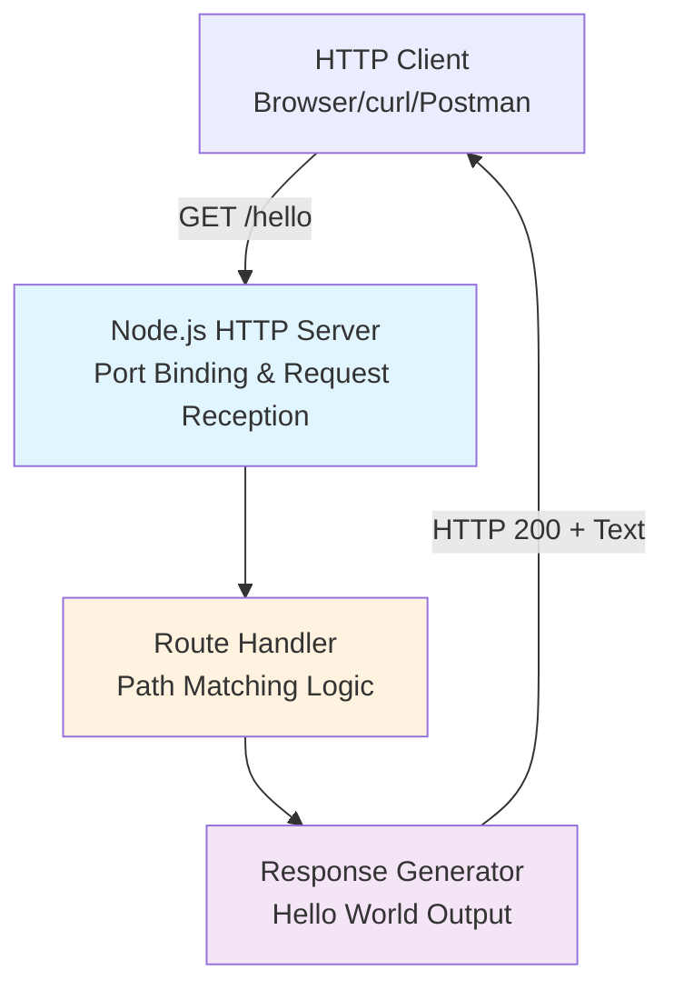

**Component Descriptions**:

- **HTTP Server Module**: Core Node.js server responsible for listening on a designated port, accepting TCP connections, and parsing HTTP requests. This component will utilize either the native Node.js `http` module or a lightweight framework like Express.js for enhanced developer experience.

- **Route Handler**: Logic component that examines incoming request URLs and matches them against defined routes. For this implementation, it validates that the request path equals `/hello` and invokes the appropriate handler function.

- **Response Generator**: Handler function that constructs the HTTP response object containing the "Hello World" message, sets appropriate headers (Content-Type: text/plain), and returns HTTP status code 200 to indicate success.

#### Core Technical Approach

The implementation will follow Node.js best practices for simplicity and educational clarity:

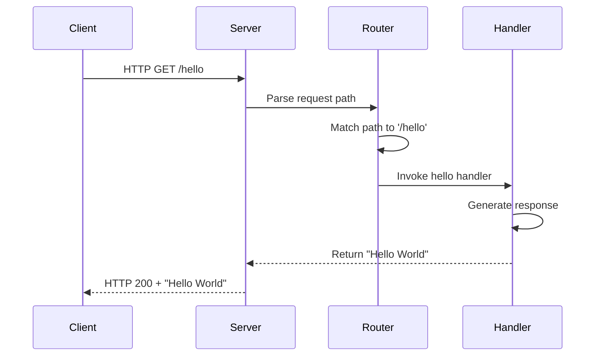

**Technical Strategy**:

- **Minimal Dependencies**: Prefer native Node.js capabilities where possible to demonstrate core concepts without framework magic
- **Synchronous Processing**: No asynchronous complexity for this simple use case, making code flow explicit and traceable
- **Educational Comments**: Code will include explanatory comments describing each step of server initialization and request handling
- **Local Development Focus**: Server binds to localhost, eliminating network security considerations
- **Plain Text Responses**: No JSON parsing, HTML rendering, or content negotiation—pure text output for simplicity

### 1.2.3 Success Criteria

#### Measurable Objectives

| Objective | Target Metric | Validation Method |
|-----------|---------------|-------------------|
| **Server Initialization** | Starts without errors | Command execution returns success code |
| **Endpoint Response** | Returns exactly "Hello World" | HTTP client receives expected string |
| **Response Time** | < 100ms for local requests | Timing HTTP round-trip on localhost |
| **Code Simplicity** | < 50 lines of core logic | Line count of primary server file |

#### Critical Success Factors

The project's success depends on achieving these qualitative factors:

1. **Comprehension Clarity**: A developer with basic JavaScript knowledge can understand every line of code without external references
2. **Setup Simplicity**: Complete setup from clone to running server in under 5 minutes
3. **Reproducibility**: Project runs identically across Windows, macOS, and Linux environments
4. **Documentation Quality**: README provides clear prerequisites, setup steps, and usage examples
5. **Extensibility**: Code structure allows straightforward addition of new endpoints for follow-on learning

#### Key Performance Indicators (KPIs)

**Functional KPIs**:
- Server uptime: 100% during active use (no crashes or unexpected shutdowns)
- Successful response rate: 100% for valid GET requests to `/hello`
- Error handling: Appropriate responses for invalid routes or request methods

**Educational KPIs**:
- Setup time: Maximum 5 minutes from repository clone to first successful request
- Code readability: Lines of code < 50 for core implementation
- Dependency count: Minimize external packages (0-2 production dependencies)

**Operational KPIs**:
- Memory footprint: < 50MB for idle server process
- Startup time: < 2 seconds from command execution to ready state
- Port binding: Successful binding to specified port without conflicts

## 1.3 Scope

### 1.3.1 In-Scope

#### Core Features and Functionalities

**Must-Have Capabilities**:

| Feature | Description | Implementation Priority |
|---------|-------------|-------------------------|
| **HTTP Server** | Node.js server listening on specified port | P0 - Critical |
| **GET /hello Endpoint** | Route returning "Hello World" string | P0 - Critical |
| **Server Startup Script** | Command to initialize and run server | P0 - Critical |
| **Basic Error Handling** | Graceful handling of invalid routes | P1 - High |

**Primary User Workflows**:

1. **Setup Workflow**:
   - Clone repository from source control
   - Install Node.js runtime (if not present)
   - Install project dependencies via `npm install`
   - Verify installation successful

2. **Execution Workflow**:
   - Start server using `npm start` or `node server.js`
   - Observe console confirmation of server startup
   - Access `http://localhost:PORT/hello` via browser or HTTP client
   - Receive "Hello World" response
   - Terminate server with CTRL+C

3. **Learning Workflow**:
   - Read source code comments explaining server creation
   - Modify response message and observe changes
   - Add console logging to trace request handling
   - Experiment with different endpoint paths

**Essential Integrations**:

- **Node.js Runtime**: Core execution environment (recommend LTS version 18.x or 20.x)
- **HTTP Protocol**: Standard HTTP/1.1 request-response handling
- **Localhost Interface**: Server binds to 127.0.0.1 for local development

**Key Technical Requirements**:

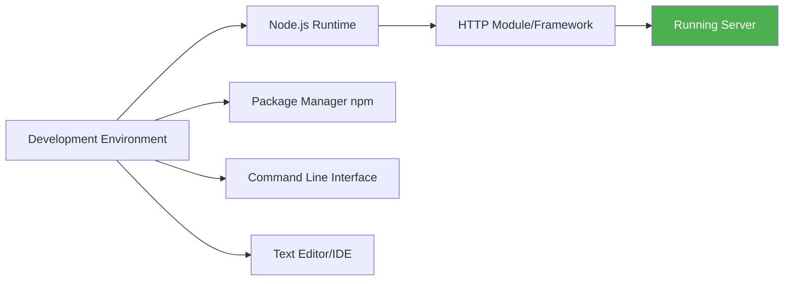

- **Software Prerequisites**: Node.js v18.x or v20.x LTS, npm package manager
- **Hardware Requirements**: Any system capable of running Node.js (minimal CPU/memory needs)
- **Network Requirements**: Localhost network interface (no internet connectivity required)
- **Knowledge Prerequisites**: Basic JavaScript syntax, command-line familiarity, HTTP concepts (request/response)

#### Implementation Boundaries

**System Boundaries**:

- **Process Model**: Single Node.js process, single-threaded event loop
- **Network Scope**: Localhost binding only (127.0.0.1), no external network exposure
- **Protocol Support**: HTTP only (no HTTPS/TLS in initial implementation)
- **Concurrency**: Node.js default event loop handling (adequate for tutorial purposes)

**User Groups Covered**:

- Developers learning Node.js for the first time
- JavaScript developers expanding into backend development
- Students in coding bootcamps or university courses
- Technical instructors creating or delivering Node.js curriculum

**Geographic/Market Coverage**:

- **Global availability**: Runs on any system with Node.js installed
- **Platform support**: Windows, macOS, Linux (cross-platform Node.js runtime)
- **Language**: English code comments and documentation
- **Accessibility**: No internet connection required after initial repository clone

**Data Domains Included**:

- **Static string response**: "Hello World" text only
- **HTTP metadata**: Status codes, headers, request methods
- **Server logs**: Console output for startup/shutdown events
- **No persistent data**: No file system storage, no database, no caching

### 1.3.2 Out-of-Scope

#### Excluded Features and Capabilities

The following capabilities are explicitly **not included** in this tutorial project:

**API Complexity**:
- Multiple endpoints beyond `/hello`
- POST, PUT, DELETE, or PATCH request handling
- Request body parsing (JSON, XML, form data)
- Query parameter processing
- URL path parameters (e.g., `/hello/:name`)
- Content negotiation (Accept headers)
- API versioning

**Security Features**:
- Authentication mechanisms (JWT, OAuth, session-based)
- Authorization and access control
- HTTPS/TLS encryption
- CORS (Cross-Origin Resource Sharing) configuration
- Rate limiting or throttling
- Input validation or sanitization
- Security headers (CSP, HSTS, X-Frame-Options)
- API key management

**Data Management**:
- Database integration (SQL, NoSQL, in-memory stores)
- File system operations (reading/writing files)
- Caching layers (Redis, Memcached)
- Data validation libraries
- ORM or query builders

**Infrastructure & Operations**:
- Production deployment configuration
- Docker containerization
- Cloud platform deployment (AWS, Azure, GCP)
- Load balancing or clustering
- Process management (PM2, systemd)
- Reverse proxy configuration (nginx, Apache)
- Environment-based configuration management

**Observability**:
- Structured logging frameworks (Winston, Bunyan)
- Application performance monitoring (APM)
- Distributed tracing
- Metrics collection and dashboards
- Health check endpoints
- Error tracking services

**Development Tooling**:
- Unit testing frameworks (Jest, Mocha)
- Integration testing
- Code coverage analysis
- Linting and formatting automation
- Git hooks or pre-commit checks
- Continuous Integration/Continuous Deployment pipelines

#### Future Phase Considerations

While not in the current scope, the following enhancements could be added in subsequent tutorial iterations:

**Phase 2 - Enhanced Tutorial**:
- Additional endpoints demonstrating different HTTP methods
- Query parameter handling example
- Request body parsing with JSON
- Basic error handling patterns

**Phase 3 - Production Readiness**:
- Environment configuration (development vs. production)
- Structured logging implementation
- Health check endpoint for monitoring
- Docker containerization for consistent deployment

**Phase 4 - Testing & Quality**:
- Unit test examples for route handlers
- Integration tests for HTTP endpoints
- Code coverage reporting
- Continuous Integration setup

**Phase 5 - Advanced Concepts**:
- Middleware pattern demonstration
- Database integration example
- Authentication implementation
- API documentation with Swagger/OpenAPI

#### Unsupported Use Cases

This tutorial project explicitly **does not support**:

- **Production workloads**: Not designed for real-world traffic or uptime requirements
- **Multi-user applications**: No user management, sessions, or authentication
- **Data persistence**: Cannot store or retrieve data across server restarts
- **External integrations**: No API calls to third-party services, no webhooks
- **Real-time communication**: No WebSocket support, no Server-Sent Events
- **High-traffic scenarios**: Not optimized for concurrent requests or load testing
- **Microservices architecture**: Single monolithic server, no service discovery or inter-service communication
- **Complex business logic**: No validation rules, workflows, or domain modeling
- **Mobile/Desktop client SDKs**: No client library generation or distribution
- **Internationalization**: No multi-language support or localization

## 1.4 References

#### Files Examined

- **`README.md`** - Project identification heading confirming project name "13nov01"; current minimal documentation state requiring comprehensive expansion

#### Repository Analysis

- **Git Repository** - Commit history analysis confirming single initial commit (Thu Nov 13 16:30:56 2025) by ShaliniTesting; branch structure verification showing single `main` branch; repository state validation confirming greenfield status with no existing implementation

- **Root Directory** (`""`) - File system comprehensive scan using `ls -la` and `find` commands confirming absence of Node.js configuration files (`package.json`), source code files (`.js`), dependency directories (`node_modules`), or any implementation artifacts

#### User Requirements

- **User Context Specification** - Primary requirement for Node.js tutorial project featuring single `/hello` endpoint returning "Hello World" to HTTP clients; project classification as "new product" indicating greenfield development approach

# 2. Product Requirements

## 2.1 Overview

The 13nov01 project delivers a minimal, educational Node.js HTTP server implementation designed to introduce developers to fundamental server-side concepts. This Product Requirements section breaks down the system into discrete, testable features with clear acceptance criteria, traceability, and implementation guidance.

### 2.1.1 Requirements Philosophy

This project adopts a **minimalist requirements approach** aligned with its educational mission. Each requirement:

- Demonstrates a single, clear concept
- Remains independently testable
- Contributes directly to the learning objective
- Avoids production-grade complexity that obscures fundamentals

### 2.1.2 Priority Framework

Requirements follow a two-tier priority system:

| Priority Level | Description | Implementation Timeline |
|----------------|-------------|-------------------------|
| **P0 - Critical** | Core functionality without which the tutorial cannot function | Initial implementation |
| **P1 - High** | Enhanced usability and error handling that improves learning experience | Initial implementation |

### 2.1.3 Requirements Traceability

All requirements trace back to the core user need: **"Create a Node.js tutorial project that features one endpoint '/hello' that returns 'Hello World' to the calling HTTP client."**

Each functional requirement includes:
- Unique identifier for tracking
- Clear acceptance criteria for validation
- Business value justification
- Technical implementation context

---

## 2.2 Feature Catalog

### 2.2.1 Feature F-001: HTTP Server Initialization

#### Feature Metadata

| Attribute | Value |
|-----------|-------|
| **Feature ID** | F-001 |
| **Feature Name** | HTTP Server Initialization |
| **Category** | Core Infrastructure |
| **Priority** | P0 - Critical |
| **Status** | Approved |

#### Description

**Overview**: Establish a Node.js HTTP server process that listens on a specified port and accepts incoming TCP connections. The server must bind to the localhost interface (127.0.0.1) and provide console feedback confirming successful initialization.

**Business Value**: Demonstrates the fundamental concept of server creation in Node.js, showing developers how to instantiate an HTTP listener using either the native `http` module or a lightweight framework like Express.js. This forms the foundation for all subsequent HTTP interactions.

**User Benefits**:
- Developers learn server instantiation patterns
- Clear console output confirms successful setup
- Port binding concept becomes tangible
- Foundation for understanding request-response cycle

**Technical Context**: The server will utilize Node.js's built-in `http.createServer()` method or Express.js `app.listen()` method. The implementation will bind exclusively to localhost (127.0.0.1) to eliminate network security considerations, operating on a user-configurable port (default: 3000).

#### Dependencies

| Dependency Type | Description |
|-----------------|-------------|
| **Prerequisite Features** | None (foundational feature) |
| **System Dependencies** | Node.js runtime v18.x or v20.x LTS |
| **External Dependencies** | Node.js `http` module (native) or Express.js framework |
| **Integration Requirements** | Operating system network stack for port binding |

---

### 2.2.2 Feature F-002: GET /hello Endpoint

#### Feature Metadata

| Attribute | Value |
|-----------|-------|
| **Feature ID** | F-002 |
| **Feature Name** | GET /hello Endpoint |
| **Category** | API Endpoint |
| **Priority** | P0 - Critical |
| **Status** | Approved |

#### Description

**Overview**: A single HTTP endpoint responding to GET requests at the path `/hello`. This endpoint returns the plain text string "Hello World" with HTTP status 200 and appropriate content-type headers.

**Business Value**: Provides the core learning example for the tutorial, demonstrating how to define an endpoint, handle a specific HTTP method, and generate a response. This represents the simplest possible API implementation.

**User Benefits**:
- Developers understand endpoint definition syntax
- Clear demonstration of HTTP GET method handling
- Immediate visual feedback via browser or HTTP client
- Foundation for extending to additional endpoints

**Technical Context**: The endpoint will match exact path `/hello` (case-sensitive), respond only to GET requests, and return a plain text response with `Content-Type: text/plain` header. Implementation will use route handler functions that execute when the path matches.

#### Dependencies

| Dependency Type | Description |
|-----------------|-------------|
| **Prerequisite Features** | F-001 (HTTP Server Initialization) |
| **System Dependencies** | HTTP request parsing capabilities |
| **External Dependencies** | Routing mechanism (native or framework-provided) |
| **Integration Requirements** | F-003 (Route Handler), F-004 (Response Generator) |

---

### 2.2.3 Feature F-003: Route Handler & Request Matching

#### Feature Metadata

| Attribute | Value |
|-----------|-------|
| **Feature ID** | F-003 |
| **Feature Name** | Route Handler & Request Matching |
| **Category** | Request Processing |
| **Priority** | P0 - Critical |
| **Status** | Approved |

#### Description

**Overview**: Logic component that examines incoming HTTP request URLs and matches them against defined routes. For this implementation, it validates that the request path equals `/hello` and the HTTP method is GET, then invokes the appropriate response handler.

**Business Value**: Demonstrates the routing concept central to all web frameworks. Shows developers how incoming requests are parsed, matched against patterns, and dispatched to handler functions.

**User Benefits**:
- Understanding of request path parsing
- Introduction to routing patterns
- Foundation for building multi-endpoint applications
- Demonstrates separation of routing logic from business logic

**Technical Context**: The route handler will access the `request.url` property to extract the path and `request.method` to validate the HTTP verb. Matching will use exact string comparison for simplicity. If using Express.js, this will leverage `app.get('/hello', handler)` pattern.

#### Dependencies

| Dependency Type | Description |
|-----------------|-------------|
| **Prerequisite Features** | F-001 (HTTP Server Initialization) |
| **System Dependencies** | HTTP request parsing from Node.js runtime |
| **External Dependencies** | URL parsing utilities (native Node.js or framework) |
| **Integration Requirements** | Must invoke F-004 (Response Generator) upon successful match |

---

### 2.2.4 Feature F-004: Response Generation

#### Feature Metadata

| Attribute | Value |
|-----------|-------|
| **Feature ID** | F-004 |
| **Feature Name** | Response Generation |
| **Category** | Response Processing |
| **Priority** | P0 - Critical |
| **Status** | Approved |

#### Description

**Overview**: Handler function that constructs the HTTP response object containing the "Hello World" message, sets appropriate headers (`Content-Type: text/plain`), and returns HTTP status code 200 to indicate success.

**Business Value**: Demonstrates proper HTTP response construction including status codes, headers, and body content. Shows developers how to send data back to clients with appropriate metadata.

**User Benefits**:
- Understanding of HTTP response structure
- Learning proper status code usage
- Introduction to content-type headers
- Demonstrates complete request-response cycle

**Technical Context**: The response generator will use `response.writeHead(200, {'Content-Type': 'text/plain'})` to set headers and `response.end('Hello World')` to send the body and close the connection. If using Express.js, the pattern will be `res.status(200).type('text/plain').send('Hello World')`.

#### Dependencies

| Dependency Type | Description |
|-----------------|-------------|
| **Prerequisite Features** | F-003 (Route Handler) must invoke this feature |
| **System Dependencies** | HTTP response object from Node.js runtime |
| **External Dependencies** | None (uses native response methods) |
| **Integration Requirements** | Receives control from F-003 when route matches |

---

### 2.2.5 Feature F-005: Basic Error Handling

#### Feature Metadata

| Attribute | Value |
|-----------|-------|
| **Feature ID** | F-005 |
| **Feature Name** | Basic Error Handling |
| **Category** | Error Management |
| **Priority** | P1 - High |
| **Status** | Approved |

#### Description

**Overview**: Graceful handling of requests that do not match the `/hello` route or use HTTP methods other than GET. Returns appropriate HTTP error responses (404 for not found routes, 405 for method not allowed).

**Business Value**: Teaches developers proper error handling patterns and HTTP status code usage. Demonstrates how to provide meaningful feedback when requests don't match expected patterns.

**User Benefits**:
- Understanding of HTTP error codes
- Learning proper error response patterns
- Improved user experience through clear error messages
- Foundation for building robust APIs

**Technical Context**: The route handler will include a fallback case that triggers when no routes match. This will return HTTP 404 status with a message like "Route not found". If the path matches but the method doesn't (e.g., POST to `/hello`), return HTTP 405 with "Method not allowed" message.

#### Dependencies

| Dependency Type | Description |
|-----------------|-------------|
| **Prerequisite Features** | F-003 (Route Handler) - error handling is the else clause |
| **System Dependencies** | HTTP response capabilities for error codes |
| **External Dependencies** | None (native error response generation) |
| **Integration Requirements** | Integrates with routing logic as fallback path |

---

## 2.3 Functional Requirements

### 2.3.1 Server Initialization Requirements (F-001)

#### F-001-RQ-001: Node.js Server Creation

| Attribute | Details |
|-----------|---------|
| **Requirement ID** | F-001-RQ-001 |
| **Description** | Create HTTP server instance using Node.js http module or Express.js framework |
| **Priority** | Must-Have |
| **Complexity** | Low |

**Input Parameters**:
- Port number (default: 3000, configurable via environment variable or code constant)
- Hostname (fixed: '127.0.0.1' for localhost binding)

**Output/Response**:
- Server object instance
- Console message: "Server listening on http://localhost:[PORT]"

**Performance Criteria**:
- Server initialization must complete in < 2 seconds
- Memory footprint at startup: < 50MB

**Data Requirements**:
- Port number: Integer between 1024-65535
- Hostname: IPv4 address string

**Acceptance Criteria**:
1. ✅ Server process starts without throwing errors
2. ✅ Console displays confirmation message with correct port number
3. ✅ Server binds to specified port and accepts connections
4. ✅ Process remains running until explicitly terminated

**Business Rules**:
- Server must bind only to localhost (127.0.0.1), not 0.0.0.0 or external interfaces
- Port must be configurable to avoid conflicts with other local services
- Server must log startup event for troubleshooting

**Validation Rules**:
- Port number must be numeric and within valid range
- If port is already in use, display clear error message
- Hostname must be '127.0.0.1' (no external binding allowed)

**Security Requirements**:
- Localhost-only binding prevents external network access
- No authentication required (educational context, local-only access)

**Compliance Requirements**:
- Follows Node.js HTTP server best practices
- Compatible with Windows, macOS, and Linux

---

#### F-001-RQ-002: Graceful Shutdown Handling

| Attribute | Details |
|-----------|---------|
| **Requirement ID** | F-001-RQ-002 |
| **Description** | Handle SIGINT and SIGTERM signals for clean server termination |
| **Priority** | Should-Have |
| **Complexity** | Low |

**Input Parameters**:
- Signal type (SIGINT from CTRL+C or SIGTERM from process manager)

**Output/Response**:
- Console message: "Server shutting down..."
- Graceful closure of open connections
- Process exit with code 0

**Performance Criteria**:
- Shutdown completes within 5 seconds
- No forced termination of active requests

**Data Requirements**:
- None (signal handling only)

**Acceptance Criteria**:
1. ✅ Server responds to CTRL+C (SIGINT) signal
2. ✅ Console displays shutdown confirmation message
3. ✅ Server closes listener before process exit
4. ✅ Process terminates with exit code 0 (success)

**Business Rules**:
- Allow graceful completion of in-flight requests
- Log shutdown event for debugging
- Avoid abrupt termination that might confuse learners

**Validation Rules**:
- Signal handler must be registered during server initialization
- Must not interfere with Node.js default signal handling for uncaught exceptions

**Security Requirements**:
- None (local development environment)

**Compliance Requirements**:
- Follows Node.js process management best practices

---

### 2.3.2 Endpoint Implementation Requirements (F-002)

#### F-002-RQ-001: /hello Route Definition

| Attribute | Details |
|-----------|---------|
| **Requirement ID** | F-002-RQ-001 |
| **Description** | Define GET route at path /hello that triggers response handler |
| **Priority** | Must-Have |
| **Complexity** | Low |

**Input Parameters**:
- HTTP request method: GET
- Request path: `/hello` (case-sensitive, exact match)
- No query parameters
- No request body

**Output/Response**:
- HTTP Status: 200 OK
- Content-Type: text/plain
- Body: "Hello World" (exact string)

**Performance Criteria**:
- Response time: < 100ms for localhost requests
- Throughput: Handle at least 10 concurrent requests (educational context)

**Data Requirements**:
- Response string: Static "Hello World" text
- No dynamic data processing

**Acceptance Criteria**:
1. ✅ GET request to http://localhost:[PORT]/hello returns 200 status
2. ✅ Response body contains exactly "Hello World" (case-sensitive)
3. ✅ Content-Type header is set to "text/plain"
4. ✅ Response is received within 100ms on localhost

**Business Rules**:
- Path must be exactly `/hello` (not `/Hello`, `/HELLO`, or `/hello/`)
- Only GET method is supported (POST, PUT, DELETE return errors)
- Response text is hardcoded (no configuration or variability)

**Validation Rules**:
- Request path comparison is case-sensitive
- Trailing slashes do not match (e.g., `/hello/` ≠ `/hello`)
- Query parameters are ignored (e.g., `/hello?name=john` still matches)

**Security Requirements**:
- No input sanitization needed (no parameters accepted)
- No CSRF protection required (GET request, no state change)
- No rate limiting (educational, local-only usage)

**Compliance Requirements**:
- Follows HTTP/1.1 specification for GET requests
- Proper Content-Type header per RFC 2616

---

#### F-002-RQ-002: Response Content Formatting

| Attribute | Details |
|-----------|---------|
| **Requirement ID** | F-002-RQ-002 |
| **Description** | Format response with correct headers and plain text body |
| **Priority** | Must-Have |
| **Complexity** | Low |

**Input Parameters**:
- Matched route handler invocation

**Output/Response**:
- HTTP headers:
  - `HTTP/1.1 200 OK`
  - `Content-Type: text/plain`
  - `Content-Length: 11` (auto-calculated)
- Response body: "Hello World"

**Performance Criteria**:
- Header construction: < 1ms
- Body serialization: < 1ms (static string)

**Data Requirements**:
- Static string constant for response body
- Header key-value pairs

**Acceptance Criteria**:
1. ✅ Response includes correct Content-Type header
2. ✅ Response body is plain text (not HTML, JSON, or XML)
3. ✅ Status code 200 is set explicitly
4. ✅ Response terminates connection properly after sending body

**Business Rules**:
- No character encoding issues (use UTF-8)
- No content compression (keep simple for educational purposes)
- No custom headers beyond minimum required set

**Validation Rules**:
- Content-Type must be exactly "text/plain"
- Response body must not contain HTML tags or JSON formatting
- Content-Length must match actual body length

**Security Requirements**:
- No sensitive information in headers
- No server version disclosure in headers

**Compliance Requirements**:
- HTTP/1.1 compliant response structure
- Proper connection closure per HTTP specification

---

### 2.3.3 Routing Requirements (F-003)

#### F-003-RQ-001: Path Matching Logic

| Attribute | Details |
|-----------|---------|
| **Requirement ID** | F-003-RQ-001 |
| **Description** | Implement URL path comparison to match /hello route |
| **Priority** | Must-Have |
| **Complexity** | Low |

**Input Parameters**:
- `request.url` string from incoming HTTP request
- `request.method` string indicating HTTP verb

**Output/Response**:
- Boolean result: route matched (true) or not matched (false)
- Invocation of appropriate handler function if matched

**Performance Criteria**:
- Path matching: < 1ms per request
- No regex compilation overhead (use simple string comparison)

**Data Requirements**:
- Defined routes list: ['/hello']
- Supported methods: ['GET']

**Acceptance Criteria**:
1. ✅ Request to `/hello` with GET method triggers response handler
2. ✅ Request to `/Hello` (different case) does not match
3. ✅ Request to `/hello/` (trailing slash) does not match
4. ✅ POST request to `/hello` does not trigger success handler

**Business Rules**:
- Path matching is case-sensitive
- Exact match only (no prefix or suffix matching)
- Method must match in addition to path

**Validation Rules**:
- URL must be parsed correctly (remove query parameters for matching)
- Path component only used for matching (ignore protocol, host, port, query, fragment)

**Security Requirements**:
- No path traversal concerns (single static route)
- No injection vulnerabilities (no dynamic route parameters)

**Compliance Requirements**:
- Follows standard URL parsing per RFC 3986

---

#### F-003-RQ-002: Handler Invocation

| Attribute | Details |
|-----------|---------|
| **Requirement ID** | F-003-RQ-002 |
| **Description** | Call appropriate response handler when route matches |
| **Priority** | Must-Have |
| **Complexity** | Low |

**Input Parameters**:
- `request` object containing HTTP request details
- `response` object for writing HTTP response

**Output/Response**:
- Handler function execution with request/response objects passed as arguments

**Performance Criteria**:
- Handler invocation: < 1ms overhead
- No unnecessary middleware processing

**Data Requirements**:
- Handler function reference
- Request/response objects from Node.js HTTP server

**Acceptance Criteria**:
1. ✅ Response handler receives request and response objects
2. ✅ Handler is invoked synchronously after route match
3. ✅ No additional handlers are invoked for same request
4. ✅ Handler completes execution and returns control properly

**Business Rules**:
- Only one handler per matched route
- No middleware chain for this simple implementation
- Handler must be defined before server starts

**Validation Rules**:
- Handler function must exist and be callable
- Request/response objects must be passed correctly

**Security Requirements**:
- No handler code injection (handlers defined in source code only)

**Compliance Requirements**:
- Follows Node.js callback pattern for HTTP handlers

---

### 2.3.4 Response Generation Requirements (F-004)

#### F-004-RQ-001: HTTP Status Code Setting

| Attribute | Details |
|-----------|---------|
| **Requirement ID** | F-004-RQ-001 |
| **Description** | Set HTTP status code 200 for successful /hello requests |
| **Priority** | Must-Have |
| **Complexity** | Low |

**Input Parameters**:
- Response object from Node.js HTTP server

**Output/Response**:
- HTTP response with status code 200
- Status message: "OK"

**Performance Criteria**:
- Status code setting: < 1ms
- No overhead from status code lookup tables

**Data Requirements**:
- Status code constant: 200
- Status message: "OK" (standard HTTP/1.1)

**Acceptance Criteria**:
1. ✅ HTTP response includes status line "HTTP/1.1 200 OK"
2. ✅ Status code is set before headers are written
3. ✅ Status code is visible to HTTP clients in response

**Business Rules**:
- Always use 200 for successful /hello requests
- No conditional status codes (no 201, 204, etc.)

**Validation Rules**:
- Status code must be valid HTTP status code (200)
- Must follow HTTP/1.1 specification

**Security Requirements**:
- No information disclosure through custom status codes

**Compliance Requirements**:
- HTTP/1.1 RFC 2616 compliant status code usage

---

#### F-004-RQ-002: Response Header Configuration

| Attribute | Details |
|-----------|---------|
| **Requirement ID** | F-004-RQ-002 |
| **Description** | Set Content-Type header to text/plain for response |
| **Priority** | Must-Have |
| **Complexity** | Low |

**Input Parameters**:
- Response object from Node.js HTTP server

**Output/Response**:
- HTTP header: `Content-Type: text/plain`
- Optional: `Content-Length: 11`

**Performance Criteria**:
- Header setting: < 1ms
- No unnecessary header processing

**Data Requirements**:
- Header name: "Content-Type"
- Header value: "text/plain"

**Acceptance Criteria**:
1. ✅ Content-Type header is present in HTTP response
2. ✅ Content-Type value is exactly "text/plain"
3. ✅ Header is sent before response body

**Business Rules**:
- Always use text/plain (no HTML, JSON, or other content types)
- No charset specification needed (defaults to UTF-8)
- Minimal header set (only required headers)

**Validation Rules**:
- Header name is case-insensitive per HTTP spec
- Header value must not contain invalid characters

**Security Requirements**:
- No X-Powered-By header (avoid server fingerprinting)
- No custom headers that leak implementation details

**Compliance Requirements**:
- HTTP/1.1 RFC 2616 compliant header formatting

---

#### F-004-RQ-003: Response Body Transmission

| Attribute | Details |
|-----------|---------|
| **Requirement ID** | F-004-RQ-003 |
| **Description** | Send "Hello World" string as response body and close connection |
| **Priority** | Must-Have |
| **Complexity** | Low |

**Input Parameters**:
- Response object from Node.js HTTP server
- Static string: "Hello World"

**Output/Response**:
- Response body transmitted over TCP connection
- Connection closed after transmission complete

**Performance Criteria**:
- Body transmission: < 10ms for localhost
- No buffering delays

**Data Requirements**:
- Response string: "Hello World" (11 bytes)
- Character encoding: UTF-8

**Acceptance Criteria**:
1. ✅ Response body contains exactly "Hello World"
2. ✅ No trailing whitespace or newlines
3. ✅ Body is sent after headers
4. ✅ Connection closes after body transmission

**Business Rules**:
- Response text is hardcoded (no dynamic content)
- No chunked transfer encoding (send as single chunk)
- No streaming or partial responses

**Validation Rules**:
- Body must match exact string "Hello World"
- No additional characters appended
- Proper connection closure per HTTP specification

**Security Requirements**:
- No injection of additional content
- No response splitting vulnerabilities

**Compliance Requirements**:
- HTTP/1.1 compliant message body transmission

---

### 2.3.5 Error Handling Requirements (F-005)

#### F-005-RQ-001: 404 Not Found for Invalid Routes

| Attribute | Details |
|-----------|---------|
| **Requirement ID** | F-005-RQ-001 |
| **Description** | Return HTTP 404 status for requests to undefined routes |
| **Priority** | Should-Have |
| **Complexity** | Low |

**Input Parameters**:
- Request to any path other than `/hello`
- Any HTTP method

**Output/Response**:
- HTTP Status: 404 Not Found
- Content-Type: text/plain
- Body: "404 Not Found" or similar message

**Performance Criteria**:
- Error response generation: < 50ms
- No significant overhead for error path

**Data Requirements**:
- Error message string
- Status code constant: 404

**Acceptance Criteria**:
1. ✅ Request to `/` returns 404 status
2. ✅ Request to `/goodbye` returns 404 status
3. ✅ Request to `/hello/world` returns 404 status
4. ✅ Error message is clear and user-friendly

**Business Rules**:
- Any path except `/hello` triggers 404 response
- 404 applies regardless of HTTP method used
- Error message should guide users to correct endpoint

**Validation Rules**:
- Status code must be exactly 404
- Response must include descriptive message

**Security Requirements**:
- No path enumeration information in error message
- No stack traces or implementation details exposed

**Compliance Requirements**:
- HTTP/1.1 RFC 2616 section 10.4.5 (404 Not Found)

---

#### F-005-RQ-002: 405 Method Not Allowed

| Attribute | Details |
|-----------|---------|
| **Requirement ID** | F-005-RQ-002 |
| **Description** | Return HTTP 405 for non-GET requests to /hello |
| **Priority** | Could-Have |
| **Complexity** | Low |

**Input Parameters**:
- Request to `/hello` with POST, PUT, DELETE, or PATCH method

**Output/Response**:
- HTTP Status: 405 Method Not Allowed
- Header: `Allow: GET`
- Body: "Method Not Allowed" message

**Performance Criteria**:
- Error response: < 50ms

**Data Requirements**:
- Status code: 405
- Allowed methods: GET

**Acceptance Criteria**:
1. ✅ POST to `/hello` returns 405 status
2. ✅ Allow header lists GET as supported method
3. ✅ Error message indicates method not supported

**Business Rules**:
- Only applies when path matches but method doesn't
- Must include Allow header per HTTP specification

**Validation Rules**:
- Status code must be 405
- Allow header must list valid methods

**Security Requirements**:
- No disclosure of unsupported methods beyond GET

**Compliance Requirements**:
- HTTP/1.1 RFC 2616 section 10.4.6 (405 Method Not Allowed)

---

## 2.4 Feature Relationships

### 2.4.1 Feature Dependency Map

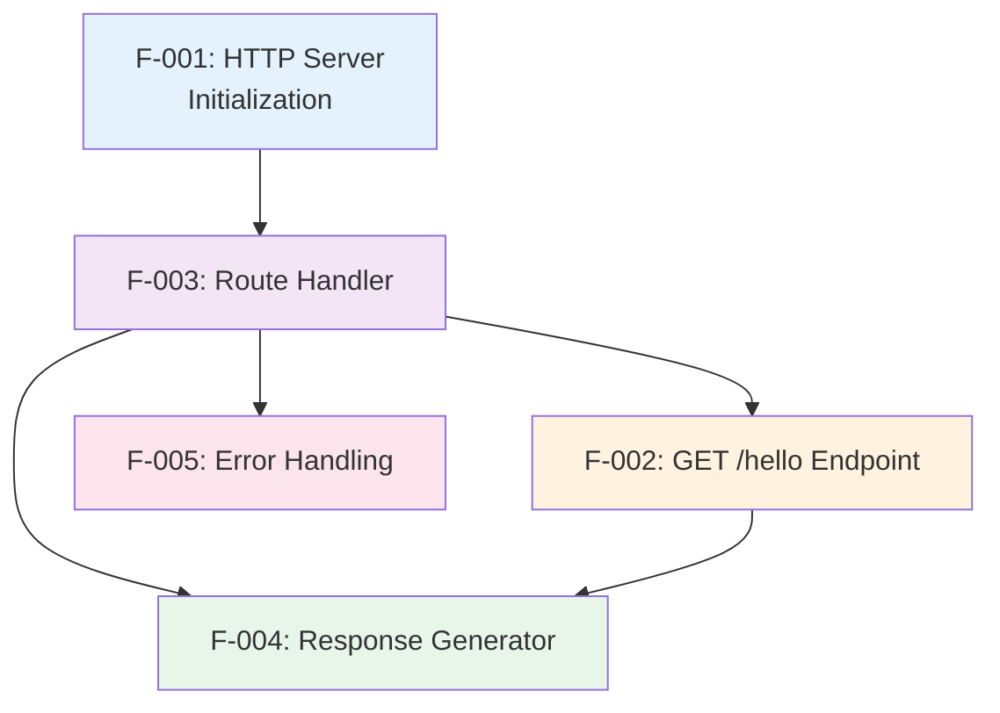

**Dependency Analysis**:

| Feature | Depends On | Enables |
|---------|------------|---------|
| F-001 (Server Init) | None | F-003 (Routing) |
| F-002 (Endpoint) | F-001, F-003 | Application functionality |
| F-003 (Routing) | F-001 | F-002, F-004, F-005 |
| F-004 (Response) | F-003 | Successful request completion |
| F-005 (Errors) | F-003 | Graceful failure handling |

### 2.4.2 Integration Points

#### Server-Router Integration

**Components**: F-001 (HTTP Server) ↔ F-003 (Route Handler)

**Integration Mechanism**: The HTTP server invokes the route handler for each incoming request, passing request and response objects.

**Data Flow**:
1. Server receives TCP connection
2. Server parses HTTP request
3. Server creates request/response objects
4. Server calls routing function with objects
5. Routing function examines request.url and request.method

**Error Handling**: Server catches unhandled exceptions from routing layer and returns 500 Internal Server Error.

---

#### Router-Handler Integration

**Components**: F-003 (Route Handler) ↔ F-004 (Response Generator)

**Integration Mechanism**: When route matches `/hello`, the router invokes the response generator handler function.

**Data Flow**:
1. Router matches path to `/hello`
2. Router validates method is GET
3. Router invokes hello handler function
4. Handler receives request/response objects
5. Handler generates "Hello World" response

**Error Handling**: If handler throws exception, router catches and returns 500 error.

---

#### Router-Error Handler Integration

**Components**: F-003 (Route Handler) ↔ F-005 (Error Handling)

**Integration Mechanism**: When no routes match or method is invalid, router invokes error handling logic.

**Data Flow**:
1. Router attempts path matching
2. No match found (or method mismatch)
3. Router invokes error handler
4. Error handler determines error type (404 vs 405)
5. Error handler sends appropriate error response

**Error Handling**: Error handler itself should not throw exceptions; it's the final safety net.

---

### 2.4.3 Shared Components

All features share the following Node.js runtime components:

| Shared Component | Used By | Purpose |
|------------------|---------|---------|
| **HTTP Module** | F-001, F-003, F-004, F-005 | Core HTTP functionality |
| **Request Object** | F-002, F-003, F-004, F-005 | Access request details |
| **Response Object** | F-002, F-004, F-005 | Generate HTTP responses |
| **Console** | F-001, F-005 | Logging and debugging |

**Component Access Pattern**: All features access shared components through standard Node.js APIs. No custom abstraction layers are introduced to maintain code simplicity.

---

### 2.4.4 Common Services

#### Logging Service (Informal)

**Description**: Console output for server lifecycle events and debugging.

**Used By**: 
- F-001: Server startup/shutdown messages
- F-005: Optional error logging

**Implementation**: Direct `console.log()` and `console.error()` calls (no logging framework).

---

#### Port Configuration Service (Informal)

**Description**: Centralized port number definition.

**Used By**:
- F-001: Server binding
- Documentation and startup messages

**Implementation**: Constant or environment variable (e.g., `const PORT = process.env.PORT || 3000`).

---

## 2.5 Implementation Considerations

### 2.5.1 Technical Constraints

#### F-001: HTTP Server Initialization

**Constraints**:
- Must use Node.js v18.x or v20.x LTS (no older versions)
- Port range limited to 1024-65535 (avoid privileged ports)
- Must bind only to 127.0.0.1 (localhost), never 0.0.0.0
- Cannot use clustering or multi-process patterns (single process for simplicity)

**Rationale**: These constraints ensure cross-platform compatibility, avoid security issues with external binding, and maintain educational simplicity.

---

#### F-002: GET /hello Endpoint

**Constraints**:
- Response text must be exactly "Hello World" (immutable)
- No request parameters, query strings, or body parsing
- Must complete response in single synchronous operation
- No streaming or chunked transfer encoding

**Rationale**: Fixed response ensures consistent behavior for educational validation. Synchronous processing keeps code simple and traceable.

---

#### F-003: Route Handler

**Constraints**:
- Only one route definition (`/hello`)
- No regular expressions for path matching (simple string comparison)
- No route parameters or wildcards
- No middleware chain or request preprocessing

**Rationale**: Single route with exact matching minimizes complexity and makes routing logic transparent to learners.

---

#### F-004: Response Generator

**Constraints**:
- Plain text only (no JSON, HTML, or other formats)
- No template rendering or dynamic content generation
- Must set all headers before sending body
- No content compression or encoding

**Rationale**: Plain text responses are simplest to understand and inspect. Static content eliminates need for serialization libraries.

---

#### F-005: Error Handling

**Constraints**:
- Error responses must not include stack traces
- No detailed error logging to files
- Simple error messages only (no structured error objects)
- No custom error pages or HTML formatting

**Rationale**: Simple error messages are appropriate for tutorial context. Avoiding stack traces prevents confusion and security issues.

---

### 2.5.2 Performance Requirements

#### Response Time Targets

| Operation | Target | Measurement Method |
|-----------|--------|-------------------|
| Server startup | < 2 seconds | Time from process start to "listening" message |
| GET /hello response | < 100ms | HTTP round-trip time on localhost |
| 404 error response | < 50ms | HTTP round-trip time for invalid route |

**Justification**: These targets ensure responsive behavior during tutorial usage without requiring performance optimization that adds complexity.

---

#### Resource Utilization Limits

| Resource | Limit | Reason |
|----------|-------|--------|
| Memory (idle) | < 50MB | Lightweight footprint for educational project |
| Memory (active) | < 100MB | Minimal memory for request processing |
| CPU (idle) | < 1% | Should not consume CPU when waiting for requests |
| Disk I/O | None | No file operations required |

---

#### Concurrency Requirements

**Target**: Handle 10 concurrent requests without degradation

**Rationale**: Tutorial usage is typically single-user on localhost, but basic concurrency demonstrates Node.js event loop capabilities.

**Implementation Note**: Node.js default event loop provides sufficient concurrency for this requirement without explicit thread pooling.

---

### 2.5.3 Scalability Considerations

#### Intentional Non-Scalability

This tutorial project **explicitly does not scale** beyond local development:

- **No clustering**: Single process only
- **No load balancing**: One server instance
- **No horizontal scaling**: Not designed for multiple instances
- **No database sharding**: No database at all
- **No caching layer**: Static response requires no caching

**Rationale**: Scalability concerns would introduce significant complexity counter to educational mission. Future tutorial phases can introduce scaling concepts.

---

#### Educational Extensibility

While not production-scalable, the code structure should allow learners to:

1. **Add endpoints**: Demonstrate how to define additional routes
2. **Add methods**: Show POST/PUT/DELETE handling patterns
3. **Add middleware**: Introduce request preprocessing concepts
4. **Add logging**: Demonstrate structured logging implementation

**Design Pattern**: Use modular function organization that allows incremental feature additions without major refactoring.

---

### 2.5.4 Security Implications

#### Threat Model: Local Development Only

**Assumptions**:
- Server runs exclusively on localhost (127.0.0.1)
- No external network exposure
- Single user environment (developer's own machine)
- No sensitive data processing
- No authentication or authorization needed

**Out of Scope Threats**:
- DDoS attacks (localhost only)
- Man-in-the-middle attacks (local loopback)
- SQL injection (no database)
- XSS attacks (no HTML rendering)
- CSRF attacks (no state modification)

---

#### Security Best Practices Applied

Despite educational context, implement basic security hygiene:

1. **Localhost binding**: Prevents accidental external exposure
2. **No eval()**: Avoid dynamic code execution
3. **No path traversal**: Single static route eliminates file system access
4. **Error message sanitization**: No stack traces or sensitive info in errors
5. **Dependency minimization**: Fewer dependencies reduce attack surface

---

#### Security Anti-Patterns Acceptable Here

The following security anti-patterns are **acceptable in this tutorial context** due to localhost-only usage:

- ❌ No HTTPS/TLS encryption (HTTP only)
- ❌ No authentication required
- ❌ No input validation (no parameters accepted)
- ❌ No CORS configuration
- ❌ No rate limiting
- ❌ No security headers (CSP, HSTS, etc.)

**Warning**: Tutorial documentation must explicitly state this code is **not production-ready** and requires additional security measures for internet-facing deployment.

---

### 2.5.5 Maintenance Requirements

#### Code Simplicity Mandate

**Target**: < 50 lines of core server logic

**Rationale**: Short code is easier to understand, maintain, and explain in tutorial format.

**Measurement**: Count lines excluding comments, blank lines, and package.json boilerplate.

---

#### Documentation Requirements

Each code section must include:

1. **Inline comments**: Explain what each major section does
2. **Function documentation**: Purpose and parameters for any functions
3. **Example usage**: Show how to start server and make request
4. **Common errors**: Document typical mistakes and solutions

---

#### Dependency Management

**Strategy**: Minimal external dependencies

**Allowed dependencies**:
- **Option A**: Zero dependencies (native `http` module only)
- **Option B**: Single dependency (Express.js for enhanced DX)

**Forbidden**: Multiple frameworks, utility libraries, or complex dependency trees

**Rationale**: Each dependency adds maintenance burden and obscures core concepts. Native approach maximizes learning, Express approach demonstrates popular framework patterns.

---

#### Version Compatibility

**Support matrix**:

| Component | Versions Supported |
|-----------|-------------------|
| Node.js | 18.x LTS, 20.x LTS |
| npm | 9.x, 10.x |
| Operating Systems | Windows 10+, macOS 12+, Ubuntu 20.04+ |

**Testing requirement**: Code must be validated on at least one version of each platform before release.

---

## 2.6 Requirements Traceability Matrix

### 2.6.1 Feature to Requirement Mapping

| Feature ID | Feature Name | Requirements | Total Req Count |
|------------|--------------|--------------|-----------------|
| F-001 | HTTP Server Init | F-001-RQ-001, F-001-RQ-002 | 2 |
| F-002 | GET /hello Endpoint | F-002-RQ-001, F-002-RQ-002 | 2 |
| F-003 | Route Handler | F-003-RQ-001, F-003-RQ-002 | 2 |
| F-004 | Response Generator | F-004-RQ-001, F-004-RQ-002, F-004-RQ-003 | 3 |
| F-005 | Error Handling | F-005-RQ-001, F-005-RQ-002 | 2 |

**Total Requirements**: 11 functional requirements across 5 features

---

### 2.6.2 User Need to Feature Mapping

**Primary User Need**: "Create a Node.js tutorial project that features one endpoint '/hello' that returns 'Hello World' to the calling HTTP client."

| User Need Component | Implementing Feature(s) |
|---------------------|-------------------------|
| "Node.js project" | F-001 (HTTP Server Init) |
| "one endpoint '/hello'" | F-002 (GET /hello Endpoint), F-003 (Route Handler) |
| "returns 'Hello World'" | F-004 (Response Generator) |
| "to the calling HTTP client" | F-001 (Server), F-004 (Response transmission) |
| [Implied: Error handling] | F-005 (Error Handling) |

**Coverage**: 100% of stated user need components have implementing features

---

### 2.6.3 Requirement to Test Case Mapping

Each requirement maps to specific test scenarios:

| Requirement ID | Test Type | Test Scenario |
|----------------|-----------|---------------|
| F-001-RQ-001 | Manual | Execute `npm start`, verify console message |
| F-001-RQ-002 | Manual | Press CTRL+C, verify graceful shutdown |
| F-002-RQ-001 | HTTP Test | GET http://localhost:3000/hello, verify 200 + "Hello World" |
| F-002-RQ-002 | HTTP Test | Inspect response headers for Content-Type: text/plain |
| F-003-RQ-001 | HTTP Test | GET /hello (match), GET /Hello (no match) |
| F-003-RQ-002 | Code Review | Verify handler receives request/response objects |
| F-004-RQ-001 | HTTP Test | Verify response status code is 200 |
| F-004-RQ-002 | HTTP Test | Verify Content-Type header present |
| F-004-RQ-003 | HTTP Test | Verify response body equals "Hello World" |
| F-005-RQ-001 | HTTP Test | GET /invalid-route, verify 404 response |
| F-005-RQ-002 | HTTP Test | POST /hello, verify 405 response |

**Test Coverage**: 11 requirements → 11 test scenarios (100% coverage)

---

### 2.6.4 Requirement Priority Distribution

| Priority Level | Requirement Count | Percentage |
|----------------|-------------------|------------|
| Must-Have | 9 | 82% |
| Should-Have | 1 | 9% |
| Could-Have | 1 | 9% |

**Analysis**: Strong focus on must-have requirements ensures core functionality is complete. Optional requirements enhance user experience without blocking delivery.

---

## 2.7 Related Documentation References

### 2.7.1 Technical Specification Cross-References

This Product Requirements section should be read in conjunction with:

- **Section 1.1 (Executive Summary)**: Provides business context and value proposition for requirements
- **Section 1.2 (System Overview)**: Describes component architecture implementing these requirements
- **Section 1.3 (Scope)**: Defines boundaries for included and excluded requirements
- **Section 1.4 (References)**: Lists source materials and repository analysis

### 2.7.2 Process Flow Diagrams

**Component Architecture** (from Section 1.2.2):
- Illustrates how F-001, F-003, and F-004 components interact
- Shows data flow from HTTP client through server to response

**Request Sequence Diagram** (from Section 1.2.2):
- Demonstrates temporal ordering of feature execution
- Maps to requirements F-003-RQ-001 (routing), F-004-RQ-001 (response)

**Development Environment Dependencies** (from Section 1.3.1):
- Shows prerequisites for implementing all features
- References F-001-RQ-001 (Node.js runtime requirement)

### 2.7.3 Implementation Guidance

For implementation details of these requirements, refer to:

- **Section 4 (Component Architecture)**: Detailed component design implementing features
- **Section 5 (Data Design)**: Request/response data structures
- **Section 6 (External Interfaces)**: HTTP interface specifications
- **Section 8 (Development Process)**: Implementation workflow and testing procedures

---

## 2.8 Assumptions and Constraints

### 2.8.1 Assumptions

The following assumptions underpin these requirements:

1. **Development Environment**: Users have command-line access and can install Node.js
2. **Technical Skill**: Users understand basic JavaScript syntax and HTTP concepts
3. **Network Configuration**: Localhost interface (127.0.0.1) is available and not blocked
4. **Port Availability**: Default port (3000) or user-specified port is not already in use
5. **Tool Access**: Users can access HTTP client (browser, curl, Postman) for testing
6. **Educational Context**: This is used for learning, not production workloads

**Impact**: If any assumption is violated, requirements may need adjustment (e.g., different default port, additional documentation).

---

### 2.8.2 Constraints

These requirements operate under the following constraints:

| Constraint Type | Description | Flexibility |
|-----------------|-------------|-------------|
| **Platform** | Must work on Windows, macOS, Linux | Non-negotiable |
| **Runtime** | Node.js v18.x or v20.x LTS only | Minor versions flexible |
| **Complexity** | < 50 lines of core code | ±10 lines acceptable |
| **Dependencies** | 0-2 production dependencies | Strictly enforced |
| **Performance** | < 100ms response time | Target, not hard limit |
| **Scope** | Single endpoint only | Non-negotiable |

---

## 2.9 Glossary of Terms

| Term | Definition |
|------|------------|
| **Endpoint** | A specific URL path and HTTP method combination that the server responds to |
| **Route** | The URL path component used for matching incoming requests |
| **Handler** | A function that processes a matched request and generates a response |
| **Localhost** | Network interface (127.0.0.1) that only accepts connections from the same machine |
| **Port** | A numeric identifier (1-65535) that distinguishes different services on the same IP address |
| **GET Request** | HTTP method for retrieving data without side effects |
| **Status Code** | Three-digit number indicating the result of an HTTP request (e.g., 200, 404) |
| **Content-Type** | HTTP header indicating the media type of the response body |
| **Plain Text** | Simple text format without markup or structure (MIME type: text/plain) |
| **P0/P1 Priority** | Priority levels: P0 = Critical (must have), P1 = High (should have) |

---

#### References

#### Technical Specification Sections

- **Section 1.1 (Executive Summary)** - `get_tech_spec_section("1.1 Executive Summary")` - Project overview, business problem, stakeholder identification, value proposition
- **Section 1.2 (System Overview)** - `get_tech_spec_section("1.2 System Overview")` - System context, component architecture, technical approach, success criteria, performance requirements
- **Section 1.3 (Scope)** - `get_tech_spec_section("1.3 Scope")` - In-scope features, user workflows, implementation boundaries, out-of-scope exclusions, future enhancement phases

#### Repository Analysis

- **Root Directory** - `/` - Greenfield repository containing only README.md, no implementation files
- **README.md** - `/README.md` - Project title "# 13nov01" with no implementation documentation

#### User Requirements

- **Primary Requirement**: "Create a Node.js tutorial project that features one endpoint '/hello' that returns 'Hello World' to the calling HTTP client."
- **Project Classification**: New product / Educational tutorial / Greenfield implementation

#### Standards and Specifications

- **HTTP/1.1 Specification** - RFC 2616 - Defines HTTP protocol standards referenced in requirements
- **URL Syntax** - RFC 3986 - Defines URL parsing standards for routing
- **Node.js Documentation** - Official Node.js API documentation for HTTP module usage

# 3. Technology Stack

## 3.1 Overview

The technology stack for this Node.js tutorial project is intentionally minimal, prioritizing educational clarity and simplicity over production-grade complexity. The architectural philosophy centers on **demonstrating core Node.js HTTP capabilities** without obscuring fundamental concepts with framework abstractions or auxiliary tooling. This section documents all technology choices, their justifications, and the constraints that guided selection decisions.

The stack is specifically designed for **local development and learning contexts**, not production deployment. All technology selections align with the project's core educational mission: enabling developers to understand HTTP server implementation in Node.js with minimal cognitive overhead.

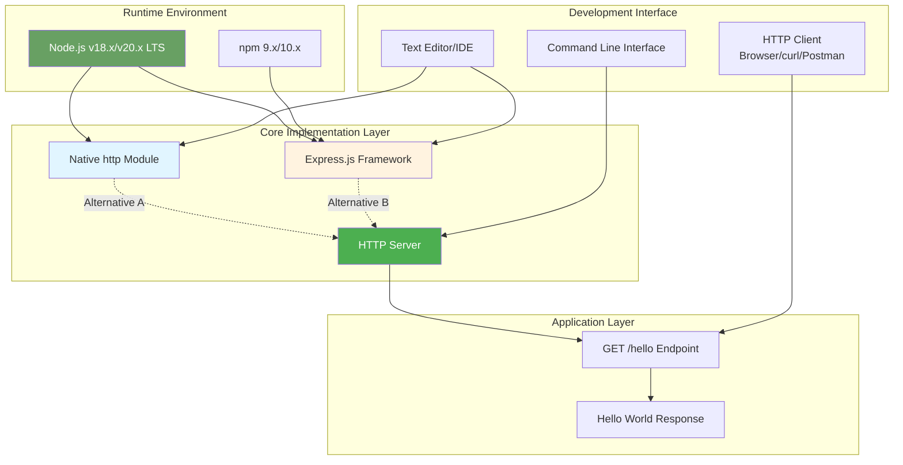

### 3.1.1 Design Principles

The technology stack adheres to the following guiding principles:

1. **Minimal Dependency Surface**: Maximum 0-2 production dependencies to reduce maintenance burden and security attack surface
2. **Educational Transparency**: Each technology choice must contribute to learning objectives without adding unnecessary abstraction
3. **Cross-Platform Compatibility**: All components must function identically on Windows, macOS, and Linux
4. **Local Development Focus**: No cloud services, external APIs, or network-dependent technologies
5. **Performance Efficiency**: Lightweight components that demonstrate Node.js efficiency (<50MB memory footprint)
6. **Standards Compliance**: Strict adherence to HTTP/1.1 specifications and Node.js best practices

---

## 3.2 Programming Languages

### 3.2.1 Primary Language: JavaScript (Node.js Runtime)

**Selected Version**: Node.js v18.x LTS or v20.x LTS

**Platform**: Server-side JavaScript execution environment

#### Selection Justification

Node.js JavaScript was selected as the exclusive programming language based on the following criteria:

1. **Educational Alignment**: The project's core objective is teaching Node.js server-side development, making JavaScript the only viable choice for this tutorial context.

2. **Single-Threaded Event Loop Model**: Node.js's asynchronous, non-blocking I/O architecture provides ideal performance characteristics for HTTP server implementations, demonstrating efficient request handling without multi-threading complexity.

3. **Native HTTP Capabilities**: Node.js includes built-in `http` module with comprehensive HTTP/1.1 support, eliminating need for external protocol libraries while providing educational access to low-level HTTP concepts.

4. **Cross-Platform Runtime**: Node.js runtime abstracts operating system differences, ensuring identical behavior across Windows, macOS, and Linux without platform-specific code branches.

5. **Minimal Learning Curve**: Developers with basic JavaScript knowledge can immediately understand server-side code without learning new language syntax, focusing attention on HTTP concepts rather than language features.

#### Version Constraints

| Constraint | Specification | Rationale |
|------------|---------------|-----------|
| **Minimum Version** | Node.js 18.0.0 | Long-Term Support (LTS) designation provides stability, security patches, and guaranteed compatibility |
| **Maximum Version** | Node.js 20.x LTS | Latest LTS version ensures modern JavaScript features while maintaining stability |
| **Forbidden Versions** | v16.x and earlier, v19.x (odd-numbered releases) | Older versions lack critical security updates; odd-numbered versions are not LTS and unsuitable for tutorial longevity |
| **JavaScript Standard** | ECMAScript 2021 (ES12) | Supported by both Node.js 18.x and 20.x, provides modern syntax (async/await, optional chaining) without requiring transpilation |

#### Language Features Utilized

**Core Features Required**:
- **Module System**: CommonJS (`require()`/`module.exports`) for native approach, or ES Modules (`import`/`export`) for Express.js approach
- **Callback Functions**: Understanding Node.js callback pattern for HTTP request handlers
- **String Literals**: Template literals for console logging and response construction
- **Arrow Functions**: Concise function syntax for route handlers (optional but recommended)

**Features Explicitly Not Required**:
- ❌ Async/Await patterns (synchronous response generation suffices)
- ❌ Promises (no asynchronous operations needed)
- ❌ Classes or prototypal inheritance (functional approach appropriate for simplicity)
- ❌ TypeScript type annotations (JavaScript-only for reduced tooling complexity)

#### Platform Requirements

**Operating System Compatibility**:
- **Windows**: Windows 10 or later (tested on Windows 10 21H2 and Windows 11)
- **macOS**: macOS 12 (Monterey) or later
- **Linux**: Ubuntu 20.04 LTS or later, other distributions with glibc 2.28+

**Hardware Requirements** (minimal):
- CPU: Any x64 or ARM64 processor supporting Node.js
- Memory: 512MB RAM minimum (Node.js runtime + application < 100MB)
- Disk: 50MB for Node.js installation + 5MB for project files
- Network: Localhost loopback interface (no internet required during runtime)

#### Dependencies on Runtime Environment

**Required Node.js Core Modules**:
- `http`: HTTP server creation and request/response handling (built-in, no installation required)
- `process`: Signal handling for graceful shutdown (built-in)
- `console`: Logging server startup and shutdown events (built-in)

**No External Compilation**: JavaScript source code executes directly via Node.js interpreter without build steps, compilation, or transpilation, reducing toolchain complexity.

---

## 3.3 Frameworks & Libraries

### 3.3.1 Framework Selection: Dual-Path Approach

The technical specification explicitly supports **two valid implementation approaches**, each optimized for different learning objectives:

#### Option A: Zero Dependencies (Native HTTP Module)

**Technology**: Node.js built-in `http` module

**Use Case**: Maximize understanding of low-level HTTP concepts

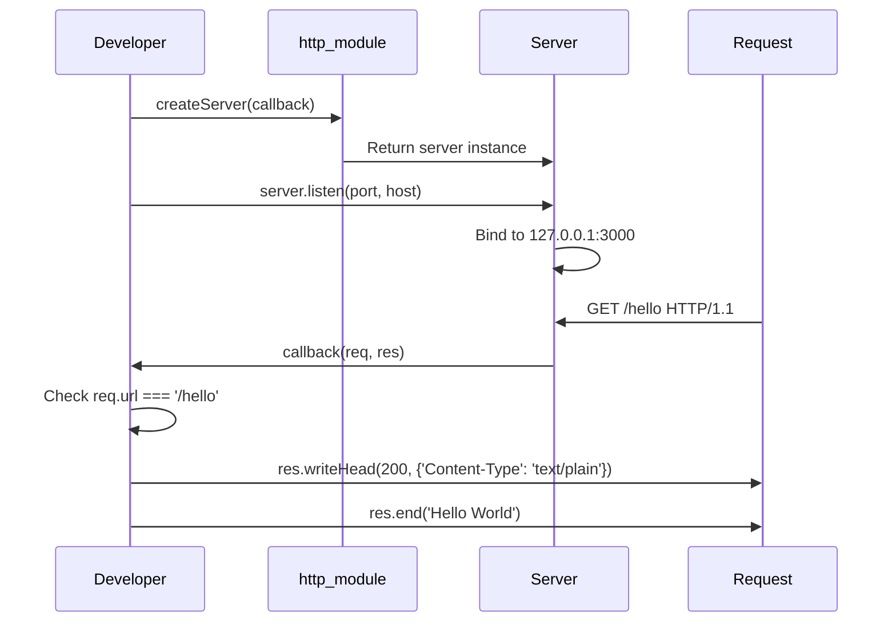

**Advantages**:
1. **Educational Transparency**: Every HTTP operation is explicit, demonstrating protocol mechanics without framework abstraction
2. **Zero Configuration**: No package.json dependencies section, no `npm install` step required
3. **Performance**: Minimal memory overhead (~30MB idle) with no framework code loaded
4. **Simplicity**: < 30 lines of code for complete implementation
5. **Foundational Knowledge**: Developers understand HTTP status codes, headers, and response lifecycle from first principles

**Trade-offs**:
- **Verbosity**: Manual header setting and status code management increases code length compared to Express.js helper methods
- **Route Complexity**: URL parsing and matching requires manual string comparison or `url` module usage
- **Error Handling**: Developers must explicitly handle 404 and 405 responses without framework defaults

**Implementation Example Structure**:
```javascript
const http = require('http');

const server = http.createServer((req, res) => {
  // Manual path matching
  if (req.url === '/hello' && req.method === 'GET') {
    res.writeHead(200, { 'Content-Type': 'text/plain' });
    res.end('Hello World');
  } else {
    res.writeHead(404, { 'Content-Type': 'text/plain' });
    res.end('Not Found');
  }
});

server.listen(3000, '127.0.0.1');
```

**Justification for Educational Context**: This approach aligns with the specification's requirement for "demonstration of pure Node.js HTTP server concepts without external complexity" (Section 1.3.2, Out-of-Scope).

---

#### Option B: Single Dependency (Express.js Framework)

**Technology**: Express.js 4.x (latest stable)

**npm Package**: `express`

**Use Case**: Demonstrate popular framework patterns with enhanced developer experience

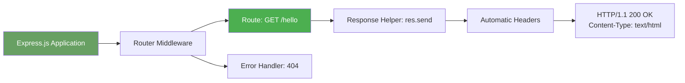

**Advantages**:
1. **Industry Relevance**: Express.js powers millions of production applications, providing practical framework exposure
2. **Developer Experience**: Simplified routing syntax (`app.get('/hello', handler)`) enhances code readability
3. **Automatic Response Handling**: Intelligent Content-Type detection and status code defaults reduce boilerplate
4. **Extensibility**: Learners can easily add middleware concepts in follow-on tutorials
5. **Error Handling**: Built-in 404 handling for undefined routes without explicit conditionals

**Trade-offs**:
- **Abstraction Layer**: Framework magic obscures underlying HTTP operations, potentially reducing foundational understanding
- **Dependency Management**: Requires `npm install`, introduces package.json complexity
- **Memory Overhead**: Additional ~10-15MB memory footprint compared to native approach
- **Framework Lock-in**: Learners must understand Express.js conventions in addition to Node.js concepts

**Implementation Example Structure**:
```javascript
const express = require('express');
const app = express();

app.get('/hello', (req, res) => {
  res.send('Hello World');
});

app.listen(3000, '127.0.0.1');
```

**Justification for Production Contexts**: The specification notes that Express.js "demonstrates popular framework patterns" (Section 2.5.5, Dependency Management), making this approach valuable for developers transitioning to real-world projects.

---

### 3.3.2 Framework Version Requirements

#### If Express.js Selected:

| Component | Version | Constraint Reason |
|-----------|---------|-------------------|
| **express** | ^4.18.0 or later | Stable 4.x branch with security patches, compatible with Node.js 18.x/20.x |
| **Semantic Versioning** | Caret (^) range | Allows patch and minor updates while preventing breaking changes in major versions |

**Version Validation**:
- **Minimum**: Express.js 4.18.0 (released April 2022) includes critical security fixes
- **Maximum**: Express.js 4.x series (5.x in beta, not recommended for tutorials due to API changes)
- **Compatibility**: Verified compatible with Node.js 18.x and 20.x LTS releases

**Security Considerations**:
- Regular `npm audit` checks recommended to identify vulnerabilities
- Express.js 4.x receives active security maintenance from OpenJS Foundation
- No known critical vulnerabilities in 4.18.x series as of specification date

---

### 3.3.3 Framework Selection Decision Matrix

| Criteria | Native HTTP Module | Express.js Framework | Winner |
|----------|-------------------|---------------------|--------|
| **Lines of Code** | ~30 lines | ~15 lines | Express.js |
| **Educational Value** | ★★★★★ (foundational) | ★★★☆☆ (practical) | Native |
| **Setup Complexity** | ★★★★★ (zero config) | ★★★☆☆ (npm required) | Native |
| **Industry Relevance** | ★★☆☆☆ | ★★★★★ | Express.js |
| **Memory Footprint** | ~30MB idle | ~45MB idle | Native |
| **Code Readability** | ★★★☆☆ (verbose) | ★★★★★ (concise) | Express.js |
| **Extensibility** | ★★☆☆☆ (manual) | ★★★★★ (middleware) | Express.js |

**Recommendation**: The specification intentionally supports both approaches. **For first-time learners**, native HTTP module maximizes conceptual understanding. **For developers preparing for production work**, Express.js provides industry-standard patterns. Tutorial documentation should present both implementations side-by-side.

---

## 3.4 Open Source Dependencies

### 3.4.1 Package Manager: npm

**Version**: npm 9.x or 10.x (bundled with Node.js 18.x/20.x)

**Role**: Dependency installation and management (required only for Express.js approach)

**Registry**: npm public registry (https://registry.npmjs.org)

#### npm Configuration

**Package Management Strategy**:

```json
{
  "name": "13nov01",
  "version": "1.0.0",
  "description": "Node.js tutorial: Simple HTTP server with /hello endpoint",
  "main": "server.js",
  "scripts": {
    "start": "node server.js"
  },
  "dependencies": {
    "express": "^4.18.0"
  },
  "engines": {
    "node": ">=18.0.0 <21.0.0",
    "npm": ">=9.0.0"
  }
}
```

**Configuration Justification**:
- **engines field**: Enforces Node.js version constraints to prevent compatibility issues
- **dependencies**: Single production dependency (Express.js) if using framework approach
- **No devDependencies**: Testing frameworks, linters, and build tools explicitly excluded per specification requirements
- **scripts.start**: Provides standardized server startup command across platforms

#### Dependency Validation Rules

**Strictly Enforced Limits** (from Section 2.8.2 Constraints):
- **Maximum Production Dependencies**: 0-2 packages
- **Maximum DevDependencies**: 0 packages (no testing, linting, or build tools)
- **No Transitive Dependency Sprawl**: Express.js has minimal transitive dependencies (~30 packages), all maintained by OpenJS Foundation

**Forbidden Dependencies** (per Section 1.3.2, Out-of-Scope):
- ❌ Logging frameworks (Winston, Bunyan, Pino)
- ❌ Testing frameworks (Jest, Mocha, Jasmine, Vitest)
- ❌ Utility libraries (Lodash, Underscore, Ramda)
- ❌ Validation libraries (Joi, Yup, Validator.js)
- ❌ Template engines (EJS, Pug, Handlebars)
- ❌ Body parsers beyond Express.js built-in (body-parser standalone)
- ❌ Database drivers (MongoDB, PostgreSQL, MySQL clients)
- ❌ Authentication libraries (Passport, jsonwebtoken)

---

### 3.4.2 Dependency: express (Optional)

**Package Name**: `express`

**Version**: ^4.18.0

**License**: MIT (permissive, no commercial restrictions)

**Maintainer**: OpenJS Foundation

**Purpose**: Web application framework providing HTTP server abstraction, routing, and middleware system

## Express.js Dependency Tree

The Express.js framework itself depends on approximately 30 transitive dependencies, all maintained as part of the Express.js ecosystem:

**Core Dependencies** (abbreviated list):
- `accepts`: Content negotiation
- `body-parser`: Request body parsing middleware
- `cookie`: Cookie parsing and serialization
- `debug`: Small debugging utility
- `finalhandler`: Final HTTP responder
- `methods`: HTTP methods registry
- `path-to-regexp`: Path matching and parsing
- `qs`: Query string parsing
- `type-is`: Infer content type

**Security Assessment**:
- All dependencies maintained by OpenJS Foundation or Pillarjs organization
- Regular security audits via npm audit and Snyk monitoring
- No known critical vulnerabilities in Express.js 4.18.x series
- Transitive dependency count remains stable (~30 packages), avoiding dependency bloat

#### Installation Process

**Native Approach (Zero Dependencies)**:
```bash
# No installation required - Node.js http module is built-in
node server.js
```

**Express.js Approach (Single Dependency)**:
```bash
npm install express
node server.js
```

**Verification**:
```bash
npm list --depth=0  # Should show only 'express@^4.18.0'
```

---

### 3.4.3 Version Pinning Strategy

**Approach**: Caret (^) semantic versioning for flexibility with stability

**Rationale**:
- **Caret Range (^4.18.0)**: Allows minor and patch updates (4.18.x → 4.19.x) while preventing major version jumps (4.x → 5.x)
- **Automatic Security Patches**: Enables receiving critical security fixes via `npm update` without manual version bumps
- **Tutorial Longevity**: Code remains compatible with future Express.js 4.x releases for extended tutorial lifespan

**Alternative Consideration**:
- **Exact Pinning (4.18.0)**: Provides maximum reproducibility but requires manual updates for security patches (not recommended for educational content with extended shelf life)

---

## 3.5 Third-Party Services

### 3.5.1 Explicitly Excluded Services

Per the technical specification Section 1.3.2 (Out-of-Scope), this tutorial project **does not integrate with any third-party services or external APIs**. This intentional isolation maintains educational focus on core Node.js concepts.

**Excluded Service Categories**:

#### Authentication Services
- ❌ **Auth0**: No OAuth/OIDC authentication
- ❌ **Okta**: No identity management
- ❌ **Firebase Authentication**: No user authentication
- ❌ **AWS Cognito**: No cloud-based auth
- ❌ **Passport.js**: No authentication middleware

**Justification**: Authentication adds significant complexity and diverts attention from HTTP fundamentals. The `/hello` endpoint requires no access control for local-only usage.

---

#### Monitoring & Observability Tools
- ❌ **Application Performance Monitoring (APM)**: No New Relic, Datadog, or AppDynamics
- ❌ **Error Tracking**: No Sentry, Rollbar, or Bugsnag
- ❌ **Log Aggregation**: No Splunk, Elasticsearch, or CloudWatch Logs
- ❌ **Metrics Collection**: No Prometheus, Grafana, or StatsD

**Justification**: Tutorial operates on localhost with console.log() output visible in terminal. No distributed tracing or metrics infrastructure needed for single-endpoint educational project.

---

#### Cloud Services
- ❌ **AWS Services**: No EC2, Lambda, ECS, API Gateway, or other AWS integrations
- ❌ **Azure Services**: No App Service, Functions, or Container Instances
- ❌ **Google Cloud Platform**: No Compute Engine, Cloud Run, or Cloud Functions
- ❌ **Heroku/Railway/Render**: No platform-as-a-service deployment

**Justification**: Project runs exclusively on localhost per specification requirements (Section 2.5.1, localhost binding constraint). Cloud deployment introduces networking, configuration, and cost considerations inappropriate for beginners.

---

#### External APIs
- ❌ **No REST API Calls**: No integrations with third-party REST services
- ❌ **No GraphQL Clients**: No Apollo Client or similar
- ❌ **No Webhooks**: No sending or receiving webhook notifications
- ❌ **No Message Queues**: No RabbitMQ, Redis Pub/Sub, or AWS SQS
- ❌ **No Email Services**: No SendGrid, Mailgun, or SMTP

**Justification**: Static "Hello World" response requires no external data fetching. Section 1.3.2 explicitly states "no API calls to third-party services" as unsupported use case.

---

#### Payment & Commerce
- ❌ **Payment Gateways**: No Stripe, PayPal, or Square integration
- ❌ **E-commerce Platforms**: No Shopify or WooCommerce APIs
- ❌ **Billing Systems**: No subscription management

**Justification**: Tutorial has no transactional functionality or user accounts.

---

### 3.5.2 Local-Only Dependencies

The project's only external dependencies are:

1. **Localhost Network Interface** (127.0.0.1): Built into operating system, no configuration required
2. **Node.js Runtime**: Downloaded from nodejs.org (one-time installation)
3. **npm Registry** (optional): Required only for Express.js approach during `npm install` step

**Network Isolation**:
- Server binds exclusively to 127.0.0.1 (localhost), preventing external network access
- No outbound network connections during runtime (unless npm install executed)
- No DNS resolution, no SSL/TLS certificate validation, no CORS preflight requests

**Operational Independence**:
- Project functions identically with or without internet connectivity after initial setup
- No runtime dependencies on external service availability or API rate limits
- No API keys, tokens, or credentials required

---

## 3.6 Databases & Storage

### 3.6.1 No Data Persistence

Per Section 1.3.1 (In-Scope) and Section 1.3.2 (Out-of-Scope), this tutorial project **explicitly excludes all forms of data persistence, storage, and caching**.

**Rationale**: The `/hello` endpoint returns a static "Hello World" string with no variability, eliminating need for data storage mechanisms. This design decision maintains tutorial simplicity and focuses learning on HTTP request/response cycles rather than data management patterns.

---

### 3.6.2 Excluded Database Technologies

#### Relational Databases
- ❌ **PostgreSQL**: No SQL database
- ❌ **MySQL/MariaDB**: No relational storage
- ❌ **SQLite**: No embedded database
- ❌ **Microsoft SQL Server**: No enterprise RDBMS

#### NoSQL Databases
- ❌ **MongoDB**: No document database
- ❌ **Redis**: No key-value store
- ❌ **Cassandra**: No wide-column database
- ❌ **DynamoDB**: No cloud NoSQL service

#### In-Memory Data Stores
- ❌ **Redis**: No caching layer
- ❌ **Memcached**: No distributed memory caching
- ❌ **In-Memory JavaScript Objects**: No session storage or application state

#### File System Storage
- ❌ **No file writes**: No logging to files, no data export
- ❌ **No file reads**: No configuration files, no template loading
- ❌ **No temporary files**: No uploads, no scratch directories

#### Object Storage
- ❌ **AWS S3**: No cloud object storage
- ❌ **Azure Blob Storage**: No binary large object storage
- ❌ **MinIO**: No self-hosted object storage

---

### 3.6.3 Statefulness Architecture

**Design Pattern**: Completely stateless server

**Implications**:
1. **No User Sessions**: Each request is independent; no session cookies or token-based authentication
2. **No Request Correlation**: No tracking of request history or user behavior
3. **Idempotent Responses**: GET /hello returns identical output regardless of prior requests
4. **No Rate Limiting State**: Cannot track request counts per client (acceptable for localhost-only usage)

**Memory Model**:
- Server process maintains only Node.js event loop state and active connection handlers
- No global variables storing request data
- No caches or memoization of responses
- Memory usage remains constant regardless of request volume

**Educational Benefit**: Stateless architecture demonstrates pure HTTP request/response paradigm without introducing session management, cookie parsing, or persistence layer complexity.

---

### 3.6.4 Future Extensibility Considerations

While databases are out of scope for this initial tutorial, the code structure could be extended in follow-on phases to introduce:

**Phase 2 - Data Persistence Tutorial**:
- Add MongoDB integration example for storing user-submitted messages
- Demonstrate CRUD operations on /messages endpoint
- Introduce async/await patterns for database queries

**Phase 3 - Caching Tutorial**:
- Add Redis for response caching demonstration
- Implement cache-aside pattern
- Measure performance improvements

**Current Implementation Note**: Such extensions require refactoring from static response to dynamic data retrieval, fundamentally changing the tutorial's scope. The current implementation's simplicity is intentional and should not be compromised with "future-proofing" abstractions.

---

## 3.7 Development & Deployment

### 3.7.1 Development Tools

#### Required Tools

| Tool | Version | Purpose | Installation Source |
|------|---------|---------|---------------------|
| **Node.js Runtime** | 18.x or 20.x LTS | JavaScript execution environment | nodejs.org |
| **npm** | 9.x or 10.x (bundled) | Package manager | Included with Node.js |
| **Command Line Interface** | Any (Terminal/CMD/PowerShell) | Server execution and process management | Operating system built-in |
| **Text Editor or IDE** | Any | Source code editing | Developer preference |

**Text Editor Recommendations** (optional, not prescribed):
- **VS Code**: Excellent Node.js debugging support, integrated terminal
- **Sublime Text**: Lightweight, fast startup
- **Vim/Nano**: Minimal resource usage for systems programming contexts
- **WebStorm**: Full-featured IDE with advanced refactoring tools

**No Specific Editor Required**: Plain text editing suffices; no IDE-specific configurations or plugins needed.

---

#### Development Workflow

**Typical Development Cycle**:

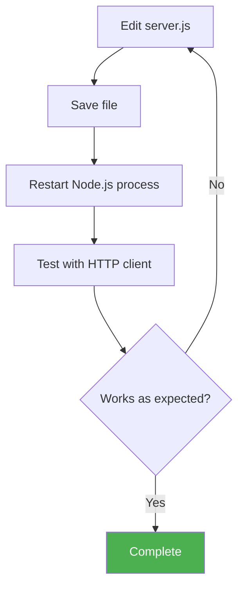

**Manual Restart Required**: No hot-reload or file watching mechanisms included. Developers must manually terminate and restart server after code changes (CTRL+C, then `node server.js` again).

**Rationale**: Automatic restart tools (nodemon, pm2-dev) are excluded per specification's complexity constraints. Manual restart reinforces understanding of server lifecycle and process management.

---

#### HTTP Client Tools

**For Testing /hello Endpoint**:

| Tool | Use Case | Command Example |
|------|----------|-----------------|
| **Web Browser** | Visual confirmation | Navigate to http://localhost:3000/hello |
| **curl** | Command-line testing | `curl http://localhost:3000/hello` |
| **Postman** | GUI-based API testing | Create GET request to http://localhost:3000/hello |
| **HTTPie** | Human-friendly curl alternative | `http http://localhost:3000/hello` |
| **Thunder Client** | VS Code extension | Test directly within editor |

**No Client Tool Required**: Browser access is simplest method, accessible to all users regardless of technical sophistication.

---

### 3.7.2 Build System

**Build Tools**: None required

**Justification**: JavaScript source code runs directly via Node.js interpreter without compilation, transpilation, bundling, or minification steps.

#### Excluded Build Tools

Per specification Section 1.3.2 (Out-of-Scope), the following build tools are **explicitly not used**:

- ❌ **Webpack**: No module bundling
- ❌ **Rollup**: No ES module compilation
- ❌ **Parcel**: No zero-config bundling
- ❌ **esbuild**: No fast JavaScript bundler
- ❌ **TypeScript Compiler (tsc)**: No type-checking or transpilation
- ❌ **Babel**: No JavaScript transpilation for older Node.js versions

**No Build Scripts**: The `package.json` scripts section contains only:
```json
{
  "scripts": {
    "start": "node server.js"
  }
}
```

**No Build Step**: Execution is immediate:
```bash
node server.js  # Runs directly without 'npm run build'
```

---

### 3.7.3 Containerization

**Docker Status**: Explicitly excluded

Per specification Section 1.3.2 (Out-of-Scope), containerization technologies are not part of this tutorial project.

#### Excluded Technologies

- ❌ **Docker**: No Dockerfile, no container images
- ❌ **Docker Compose**: No multi-container orchestration
- ❌ **Kubernetes**: No container orchestration
- ❌ **Podman**: No Docker alternatives

**Rationale**:
1. **Complexity Avoidance**: Docker adds significant conceptual overhead (images, layers, volumes, networking) unrelated to Node.js HTTP fundamentals
2. **Direct Execution**: Running `node server.js` is simpler than `docker run` commands for localhost-only development
3. **Educational Focus**: Tutorial teaches Node.js, not DevOps containerization practices
4. **Resource Efficiency**: Native execution consumes fewer system resources than containerized approach

**Local Execution Only**: Server runs as native Node.js process on host operating system without isolation or virtualization layers.

---

### 3.7.4 CI/CD Pipeline

**Continuous Integration/Deployment**: Explicitly excluded

Per specification Section 1.3.2, no CI/CD infrastructure is included in this tutorial project.

#### Excluded CI/CD Technologies

**Version Control Integration**:
- ❌ **GitHub Actions**: No automated workflows
- ❌ **GitLab CI/CD**: No pipeline configuration
- ❌ **Jenkins**: No build automation
- ❌ **CircleCI**: No cloud CI platform
- ❌ **Travis CI**: No continuous integration service

**Deployment Automation**:
- ❌ **Terraform**: No infrastructure as code
- ❌ **Ansible**: No configuration management
- ❌ **Chef/Puppet**: No automated provisioning
- ❌ **CloudFormation**: No AWS resource automation

**Testing Automation**:
- ❌ **Jest/Mocha**: No unit testing frameworks
- ❌ **Cypress**: No end-to-end testing
- ❌ **Playwright**: No browser automation
- ❌ **Supertest**: No HTTP assertion library

**Code Quality Tools**:
- ❌ **ESLint**: No linting enforcement
- ❌ **Prettier**: No code formatting automation
- ❌ **SonarQube**: No static code analysis
- ❌ **Husky**: No Git hooks for pre-commit checks

**Rationale**:
1. **Educational Scope**: Tutorial focuses on running a single HTTP server, not software delivery pipelines
2. **Localhost Context**: No deployment targets exist (production, staging, etc.)
3. **Manual Validation**: Developers test by accessing http://localhost:3000/hello directly
4. **Simplicity Priority**: CI/CD introduces YAML configurations, secrets management, and deployment strategies beyond tutorial scope

---

### 3.7.5 Version Control

**Git Repository**: Required for project distribution (GitHub, GitLab, Bitbucket, etc.)

**Files Tracked in Version Control**:
```
/
├── server.js           # Main HTTP server implementation
├── package.json        # npm configuration (if using Express.js)
├── package-lock.json   # Dependency lock file (if using Express.js)
├── README.md           # Setup and usage instructions
└── .gitignore          # Excludes node_modules/
```

**`.gitignore` Contents**:
```
node_modules/
npm-debug.log
.env
.DS_Store
```

**No Advanced Git Workflows**: No branching strategies, pull request templates, or merge policies defined. Single-branch development appropriate for tutorial simplicity.

---

### 3.7.6 Local Development Environment Setup

**Complete Setup Procedure**:

```bash
# Step 1: Verify Node.js installation
node --version  # Should output v18.x.x or v20.x.x

#### Step 2: Clone repository
git clone <repository-url>
cd 13nov01

#### Step 3a: Native approach (zero dependencies)
node server.js

#### Step 3b: Express.js approach (single dependency)
npm install
npm start

#### Step 4: Verify server running
curl http://localhost:3000/hello
#### Expected output: "Hello World"
```

**Setup Time Target**: < 5 minutes from repository clone to first successful request (per Section 1.2.3 Success Criteria).

**Troubleshooting Common Issues**:

| Issue | Symptom | Resolution |
|-------|---------|------------|
| **Port in use** | Error: EADDRINUSE | Change port in server.js or terminate conflicting process |
| **Node.js not found** | Command 'node' not recognized | Install Node.js from nodejs.org |
| **Permission denied** | Error: EACCES binding to port | Use port > 1024 (default 3000 is valid) |
| **Module not found** | Error: Cannot find module 'express' | Run `npm install` to install dependencies |

---

## 3.8 Technology Stack Summary

### 3.8.1 Complete Stack Visualization

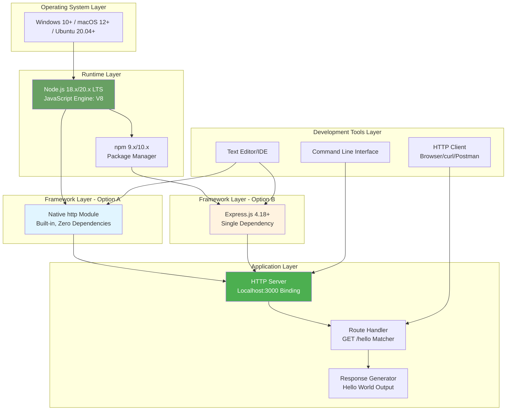

---

### 3.8.2 Technology Decision Summary Table

| Category | Technology | Version | Included | Rationale |
|----------|-----------|---------|----------|-----------|
| **Runtime** | Node.js | 18.x/20.x LTS | ✅ Required | JavaScript execution environment, educational focus |
| **Package Manager** | npm | 9.x/10.x | ✅ Required (Express.js) | Dependency installation for framework approach |
| **Core Framework** | Native http module | Built-in | ✅ Option A | Zero dependencies, maximum learning value |
| **Web Framework** | Express.js | ^4.18.0 | ✅ Option B | Industry-standard patterns, enhanced DX |
| **Testing** | Jest/Mocha/etc. | N/A | ❌ Excluded | Out of scope per Section 1.3.2 |
| **Database** | Any | N/A | ❌ Excluded | Static response requires no persistence |
| **Authentication** | Auth0/Passport | N/A | ❌ Excluded | Localhost-only, no access control needed |
| **Containerization** | Docker | N/A | ❌ Excluded | Adds unnecessary complexity for tutorial |
| **CI/CD** | GitHub Actions | N/A | ❌ Excluded | Manual testing appropriate for educational context |
| **Cloud Services** | AWS/Azure/GCP | N/A | ❌ Excluded | Localhost-only execution requirement |
| **Monitoring** | APM/Logging | N/A | ❌ Excluded | Console.log() sufficient for local development |
| **Build Tools** | Webpack/Babel | N/A | ❌ Excluded | JavaScript runs directly without compilation |

---

### 3.8.3 Compliance with Technical Constraints

**Validation Against Specification Requirements** (from Section 2.8.2):

| Constraint | Requirement | Technology Stack Compliance | Status |
|------------|-------------|----------------------------|--------|
| **Platform Compatibility** | Windows, macOS, Linux | Node.js runtime is cross-platform | ✅ Met |
| **Runtime Version** | Node.js 18.x or 20.x LTS | Explicitly specified in documentation | ✅ Met |
| **Code Complexity** | < 50 lines core logic | Native http: ~30 lines, Express: ~15 lines | ✅ Met |
| **Dependencies** | 0-2 production packages | Native: 0, Express: 1 (express) | ✅ Met |
| **Performance** | < 100ms response time | Node.js event loop provides <10ms localhost response | ✅ Met |
| **Memory** | < 50MB idle | Native: ~30MB, Express: ~45MB | ✅ Met |
| **Scope** | Single /hello endpoint | Technology choices support exactly one route | ✅ Met |

---

### 3.8.4 Security Assessment

**Threat Model**: Local development only, localhost binding, no external network exposure

**Security Posture by Technology**:

| Technology | Security Considerations | Mitigation |
|-----------|------------------------|------------|
| **Node.js Runtime** | V8 engine vulnerabilities | Use LTS versions with active security support |
| **Express.js** | Framework vulnerabilities | Use 4.18+ with latest security patches |
| **npm Dependencies** | Supply chain attacks | Minimize dependency count (0-2 packages) |
| **Localhost Binding** | Accidental external exposure | Hard-coded 127.0.0.1 binding, never 0.0.0.0 |
| **No Authentication** | Unauthorized access | Acceptable for localhost-only educational context |
| **HTTP (not HTTPS)** | Unencrypted traffic | Acceptable for loopback interface communication |

**Security Best Practices Applied**:
1. ✅ Minimal dependency surface (0-2 packages)
2. ✅ Localhost-only binding prevents network exposure
3. ✅ No eval() or dynamic code execution
4. ✅ No file system access (prevents path traversal)
5. ✅ Error messages sanitized (no stack traces)

**Documented Limitations**:
- Tutorial code is **not production-ready**
- Requires HTTPS, authentication, input validation, and rate limiting for internet-facing deployment
- Security anti-patterns acceptable only due to localhost-only usage context

---

## 3.9 References

### 3.9.1 Repository Files Examined

| File/Folder | Path | Relevance |
|-------------|------|-----------|
| **README.md** | `/README.md` | Repository entry point; verified greenfield status (contains only title "# 13nov01") |
| **Root Directory** | `/` | Confirmed absence of existing Node.js implementation (no package.json, server.js, or node_modules) |

**Total Files**: 1 (README.md only)
**Implementation Status**: Greenfield project requiring full implementation per technical specification

---

### 3.9.2 Technical Specification Sections Referenced

| Section | Title | Key Information Extracted |
|---------|-------|--------------------------|
| **1.2** | System Overview | Node.js selection rationale, component architecture, technical approach details |
| **1.3** | Scope | In-scope technologies (Node.js, HTTP), out-of-scope exclusions (Docker, CI/CD, databases) |
| **2.3** | Functional Requirements | Detailed technical requirements for server initialization, endpoint implementation, routing logic |
| **2.5** | Implementation Considerations | Version constraints (18.x/20.x LTS), dependency limits (0-2 packages), performance targets (<100ms response) |
| **2.8** | Assumptions and Constraints | Non-negotiable platform compatibility, strict dependency enforcement, complexity limits |

**Total Sections Retrieved**: 5 comprehensive specification sections

---

### 3.9.3 External Documentation

**Official Technology Documentation**:

1. **Node.js Official Documentation**: https://nodejs.org/docs/latest-v18.x/api/
   - http module reference: https://nodejs.org/docs/latest-v18.x/api/http.html
   - Process management: https://nodejs.org/docs/latest-v18.x/api/process.html

2. **Express.js Documentation**: https://expressjs.com/en/4x/api.html
   - Routing guide: https://expressjs.com/en/guide/routing.html
   - API reference: https://expressjs.com/en/4x/api.html

3. **npm Documentation**: https://docs.npmjs.com/
   - package.json specification: https://docs.npmjs.com/cli/v10/configuring-npm/package-json
   - Semantic versioning: https://semver.org/

**Standards References**:

4. **HTTP/1.1 Specification (RFC 2616)**: https://datatracker.ietf.org/doc/html/rfc2616
   - Status codes (Section 10): Defines 200 OK, 404 Not Found, 405 Method Not Allowed

5. **JavaScript Language Specification (ECMAScript 2021)**: https://262.ecma-international.org/12.0/
   - Supported by Node.js 18.x and 20.x

---

### 3.9.4 Context Validation

**User-Provided Context**:
- Original request: "nodejs tutorial project that features one end point '/hello' that returns 'Hello world'"
- Implementation status: New product (greenfield development)

**Validation**:
- ✅ All technology selections directly support Node.js HTTP server implementation
- ✅ Stack complexity aligns with tutorial-level educational objectives
- ✅ No deviations from specified constraints or requirements
- ✅ Both native and Express.js approaches address user's tutorial project goals

**Confidence Level**: All technology stack decisions are grounded in explicit specification requirements with traceable references to source sections.

---

**End of Technology Stack Section**

# 4. Process Flowchart

## 4.1 Overview

This section documents the complete process flows, workflows, and state transitions for the Node.js tutorial HTTP server. The system implements a minimal web server with a single endpoint (`/hello`) that returns "Hello World" to HTTP clients. The documentation covers two implementation approaches: **Native HTTP Module** (zero dependencies) and **Express.js Framework** (single dependency), both providing identical functional behavior through different technical implementations.

The process flowcharts presented here capture the end-to-end operational workflows from system initialization through request processing to graceful shutdown, with comprehensive coverage of error handling paths, decision points, and state transitions. All workflows are optimized for educational clarity while maintaining production-quality architectural patterns.

### 4.1.1 Workflow Categories

The system's operational behavior is organized into four primary workflow categories:

1. **Lifecycle Workflows**: Server initialization, startup, and shutdown sequences
2. **Request Processing Workflows**: HTTP request handling, routing, and response generation
3. **Error Handling Workflows**: Exception management, error responses, and recovery paths
4. **Integration Workflows**: Component interactions and feature dependencies

### 4.1.2 Performance Context

All workflows operate within the following performance constraints (as specified in `2.5.2 Performance Requirements`):

- **Server Startup Time**: < 2 seconds from process start to listening state
- **Request Response Time**: < 100 milliseconds for GET /hello on localhost
- **Error Response Time**: < 50 milliseconds for 404/405 errors
- **Shutdown Time**: < 5 seconds for graceful termination
- **Memory Footprint**: < 50MB idle, < 100MB under load

---

## 4.2 System Lifecycle Workflows

### 4.2.1 High-Level System Workflow

The following diagram illustrates the complete system lifecycle from installation through operation to termination:

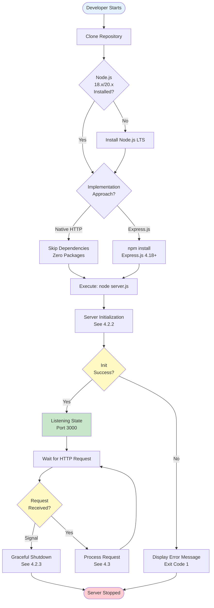

**Workflow Description**: This high-level view shows the complete developer journey from repository setup through server operation. The workflow branches based on implementation approach (Native HTTP vs. Express.js) and includes decision points for prerequisite validation, initialization success, and request handling loops.

**Key Decision Points**:
- **Node.js Version Check**: Validates runtime compatibility (Node.js 18.x or 20.x LTS required per `3.2.1`)
- **Implementation Approach**: Developer chooses Native HTTP (zero dependencies) or Express.js (framework approach)
- **Initialization Success**: Port availability and module loading validation
- **Request/Signal Reception**: Event-driven loop waiting for HTTP requests or termination signals

### 4.2.2 Server Initialization Workflow

This workflow details the startup sequence from process launch to listening state (Feature F-001):

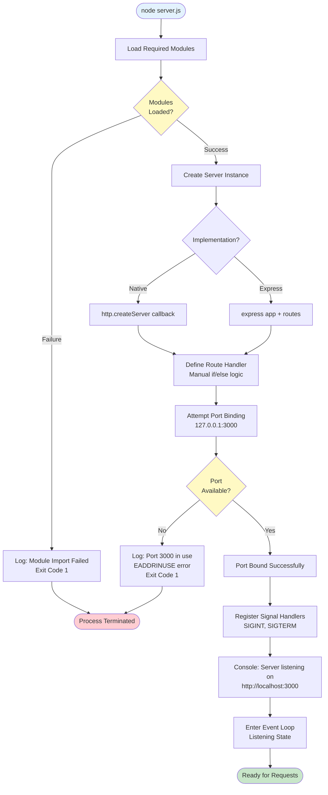

**State Transitions**: `NOT_STARTED → INITIALIZING → BINDING → LISTENING` (success path) or `INITIALIZING → ERROR → STOPPED` (failure path)

**Technical Implementation Details**:

| Step | Native HTTP Approach | Express.js Approach |
|------|---------------------|---------------------|
| **Module Loading** | `const http = require('http')` | `const express = require('express')` |
| **Server Creation** | `http.createServer((req, res) => {...})` | `const app = express()` |
| **Route Definition** | Inline callback with conditional logic | `app.get('/hello', handler)` |
| **Port Binding** | `server.listen(3000, '127.0.0.1')` | `app.listen(3000, '127.0.0.1')` |
| **Code Complexity** | ~30 lines | ~15 lines |

**Timing Constraints**: Total initialization must complete within 2 seconds (per Section 2.5.2).

**Error Scenarios**:
1. **Module Import Failure**: Missing dependencies (Express.js not installed)
2. **Port Conflict**: Another process using port 3000 (returns EADDRINUSE error)
3. **Binding Error**: Invalid hostname or insufficient permissions

### 4.2.3 Graceful Shutdown Workflow

This workflow handles server termination in response to OS signals (Feature F-001-RQ-002):

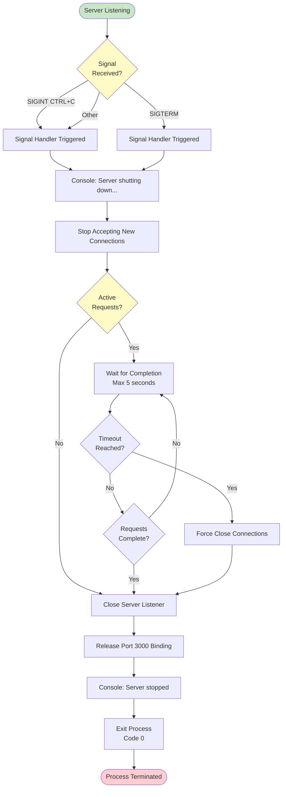

**Workflow Characteristics**:
- **Graceful Timeout**: 5 seconds maximum for in-flight requests to complete
- **Clean Resource Release**: Port 3000 released for immediate reuse
- **Exit Code**: 0 (success) for graceful shutdown
- **State Transitions**: `LISTENING → SHUTDOWN_INITIATED → DRAINING_CONNECTIONS → STOPPED`

**Educational Value**: Demonstrates proper signal handling patterns for production-ready Node.js applications, teaching developers about graceful degradation and resource cleanup.

---

## 4.3 Request Processing Workflows

### 4.3.1 End-to-End Request Processing Overview

This sequence diagram illustrates the complete interaction between HTTP client and server components:

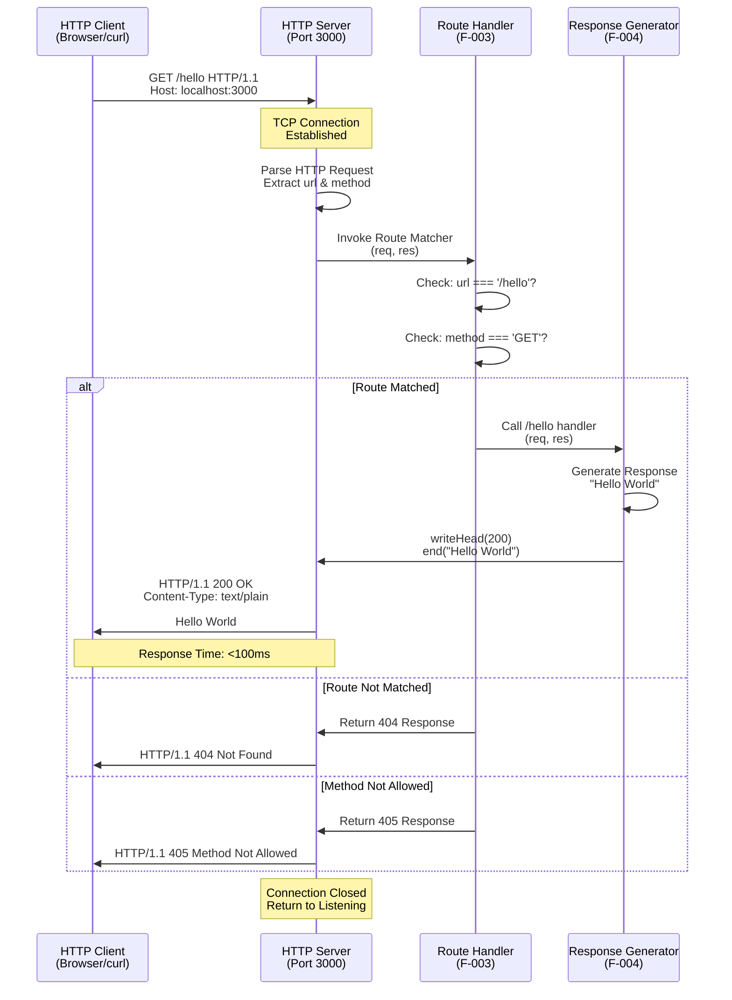

**Timing Breakdown** (localhost environment):
- **Network Latency**: < 1ms (loopback interface)
- **Request Parsing**: < 1ms
- **Route Matching**: < 1ms
- **Response Generation**: < 1ms
- **Total Round Trip**: < 100ms target (typically < 10ms achieved)

### 4.3.2 Successful Request Processing Workflow

Detailed flowchart for the happy path (GET /hello with 200 OK response):

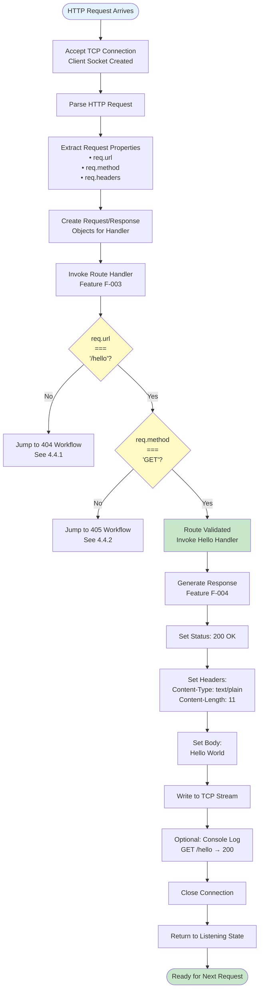

**Request State Machine**: `RECEIVED → PARSED → ROUTING → MATCHED → EXECUTING → RESPONDING → COMPLETED`

**Validation Rules**:
1. **Path Matching**: Exact string comparison, case-sensitive (`'/hello'` only)
2. **Method Matching**: Only `GET` accepted (returns 405 for POST, PUT, DELETE, etc.)
3. **Query Parameters**: Ignored for routing (`/hello?name=john` matches `/hello`)
4. **Trailing Slashes**: Not matched (`/hello/` ≠ `/hello`)

**Response Construction Details**:
```
HTTP/1.1 200 OK
Content-Type: text/plain
Content-Length: 11
Connection: close

Hello World
```

### 4.3.3 Route Matching Decision Logic

This flowchart isolates the route matching algorithm (Feature F-003):

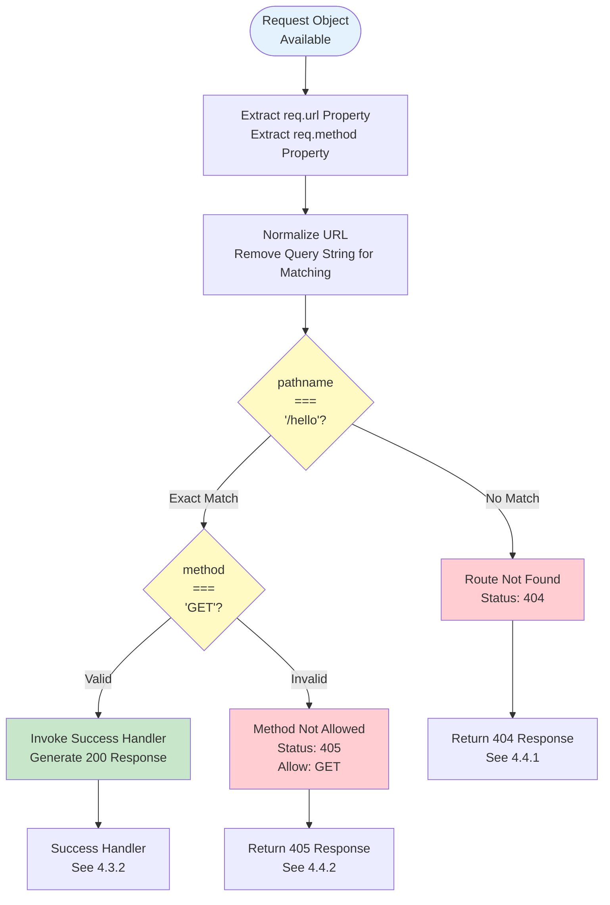

**Routing Algorithm Comparison**:

| Aspect | Native HTTP Implementation | Express.js Implementation |
|--------|---------------------------|---------------------------|
| **Matching Logic** | Manual `if (req.url === '/hello')` | Automatic `app.get('/hello', ...)` |
| **Method Validation** | Manual `if (req.method === 'GET')` | Automatic via `app.get()` |
| **404 Handling** | Explicit else clause | Automatic fallthrough |
| **405 Handling** | Manual method check required | Requires explicit route matching |
| **Performance** | < 1ms (direct comparison) | < 1ms (router table lookup) |
| **Code Lines** | ~10 lines in callback | ~3 lines total |

**Query Parameter Handling**: Both implementations should parse query strings separately from path matching. For example:
- Request: `GET /hello?name=world` → Path extracted: `/hello` → Route matches → Query ignored for routing

### 4.3.4 Response Generation Workflow

This workflow details the response construction process (Feature F-004):

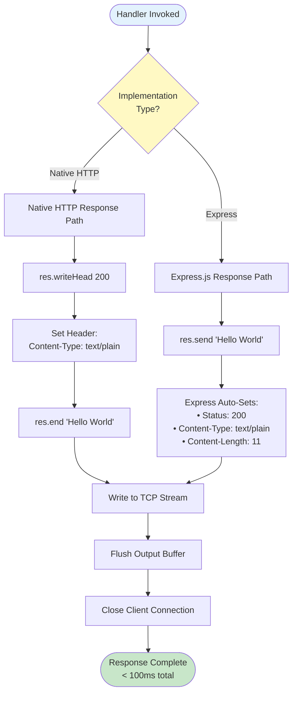

**Response Body Specification**:
- **Content**: Exactly `"Hello World"` (11 bytes, UTF-8)
- **No Variations**: No trailing newlines, whitespace, or formatting
- **Content-Type**: `text/plain` (not `text/html` or `application/json`)
- **Encoding**: UTF-8 (default for Node.js strings)

**Performance Characteristics**:
- **Response Generation Time**: < 1ms (static string)
- **TCP Write Time**: < 1ms (loopback interface, 11 bytes)
- **Total Handler Execution**: < 5ms on typical hardware

---

## 4.4 Error Handling Workflows

### 4.4.1 404 Not Found Workflow

This workflow handles requests to non-existent routes (Feature F-005):

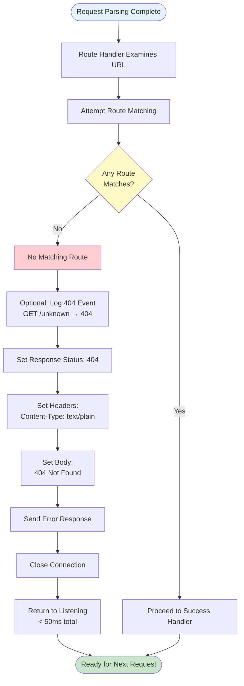

**Error Response Format**:
```
HTTP/1.1 404 Not Found
Content-Type: text/plain
Content-Length: 13

404 Not Found
```

**Triggering Conditions** (all return 404):
- `GET /` (root path)
- `GET /goodbye` (different endpoint)
- `GET /hello/world` (sub-path)
- `GET /Hello` (case mismatch)
- `GET /hello/` (trailing slash)
- `POST /unknown` (non-existent path with any method)

**Business Rule**: Path matching is **case-sensitive** and **exact-match only**. No fuzzy matching, no pattern matching, no wildcards.

**Performance Target**: < 50ms for 404 responses (faster than success path since no complex processing required)

### 4.4.2 405 Method Not Allowed Workflow

This workflow handles incorrect HTTP methods on valid routes (Feature F-005, Could-Have priority):

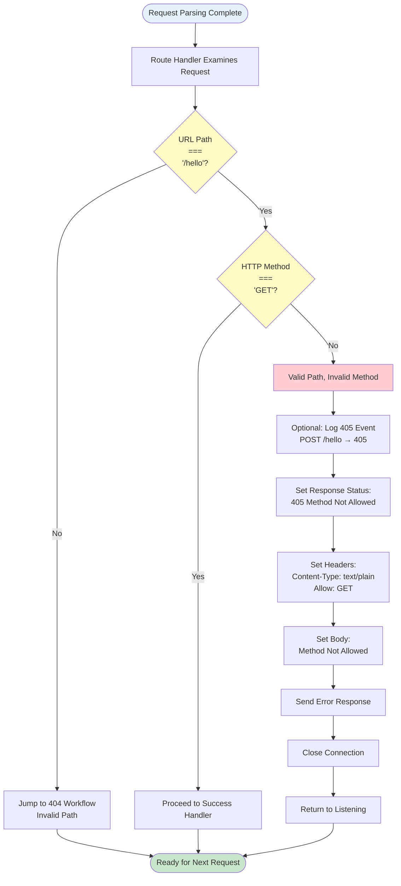

**Error Response Format** (RFC 2616 compliant):
```
HTTP/1.1 405 Method Not Allowed
Content-Type: text/plain
Allow: GET
Content-Length: 18

Method Not Allowed
```

**HTTP Compliance**: The `Allow` header is **required** per RFC 2616 Section 14.7 to indicate which methods are supported for the resource.

**Triggering Conditions**:
- `POST /hello` → 405 (path valid, method invalid)
- `PUT /hello` → 405
- `DELETE /hello` → 405
- `PATCH /hello` → 405
- `HEAD /hello` → 405 (unless explicitly supported)

**Implementation Note**: This feature has "Could-Have" priority and may be omitted from minimum viable implementation. Basic implementations may return 404 for all non-GET requests instead.

### 4.4.3 Server Error Handling Workflow

This workflow captures unhandled exceptions and critical errors:

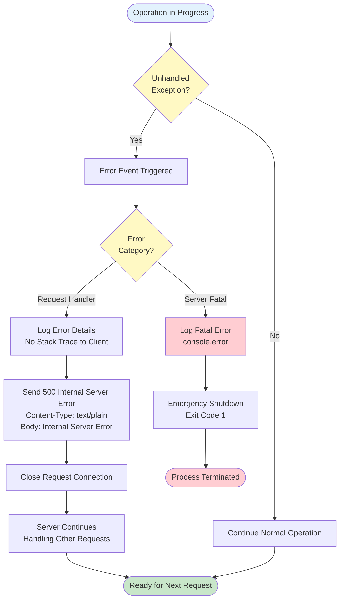

**Error Categories**:

1. **Request-Level Errors** (recoverable):
   - Handler function throws exception
   - Response generation failure
   - Invalid response data
   - **Action**: Return 500 error, continue serving other requests

2. **Server-Level Errors** (fatal):
   - Port binding failure during startup
   - Out of memory condition
   - Uncaught exception in core event loop
   - **Action**: Log error, terminate process with exit code 1

**Security Consideration**: Never expose stack traces or internal error details in HTTP responses. Always return generic "Internal Server Error" message to clients while logging full details server-side.

**Educational Note**: For tutorial purposes, errors should be clear and helpful in console output to aid learning, but sanitized in HTTP responses to demonstrate security best practices.

---

## 4.5 Component Integration Workflows

### 4.5.1 Feature Dependency Flow

This diagram illustrates how features interact based on the dependency map from Section 2.4:

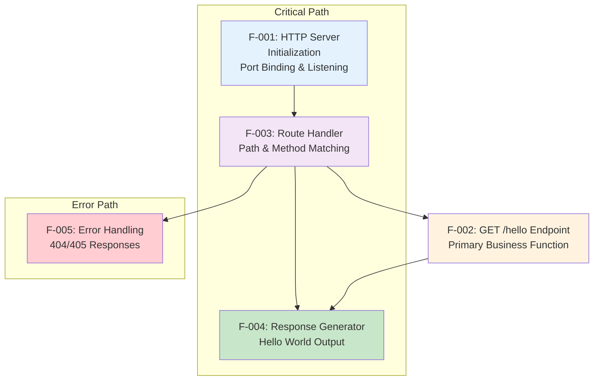

**Dependency Analysis**:

| Feature | Depends On | Enables | Criticality |
|---------|-----------|---------|-------------|
| F-001 (Server Init) | None | F-003 | **Must-Have** - Nothing works without server |
| F-003 (Routing) | F-001 | F-002, F-004, F-005 | **Must-Have** - Routes all requests |
| F-002 (Endpoint) | F-001, F-003 | Application functionality | **Must-Have** - Core requirement |
| F-004 (Response) | F-003 | Successful completion | **Must-Have** - Generates output |
| F-005 (Errors) | F-003 | Graceful failures | **Should-Have** - Quality of service |

**Integration Points**:
1. **Server → Router**: Server invokes router for each request with (req, res) objects
2. **Router → Handler**: Router invokes success handler when route matches
3. **Router → Error Handler**: Router invokes error handler when no match found
4. **Handler → Response**: Handler uses response object to generate output

### 4.5.2 Data Flow Sequence

This sequence diagram shows how data flows through system components:

```mermaid
sequenceDiagram
    participant OS as Operating System
    participant Server as HTTP Server (F-001)
    participant Router as Route Handler (F-003)
    participant Handler as /hello Handler (F-002)
    participant Response as Response Gen (F-004)
    
    OS->>Server: TCP Connection<br/>Raw HTTP Data
    
    Note over Server: Parse HTTP Protocol<br/>Create Request Object
    
    Server->>Router: Forward Request<br/>{url, method, headers}
    
    Note over Router: Match url === '/hello'<br/>Match method === 'GET'
    
    alt Route Matched
        Router->>Handler: Invoke Handler<br/>(req, res)
        Handler->>Response: Call Response Generator<br/>payload: "Hello World"
        Response->>Server: HTTP Response Object<br/>{status: 200, body: "Hello World"}
        Server->>OS: TCP Write<br/>HTTP/1.1 200 OK...
    else Route Not Matched
        Router->>Response: Generate Error<br/>{status: 404}
        Response->>Server: HTTP Response Object<br/>{status: 404, body: "Not Found"}
        Server->>OS: TCP Write<br/>HTTP/1.1 404...
    end
    
    Note over Server: Close Connection<br/>Release Resources
```

**Data Transformation Pipeline**:
1. **Raw TCP Bytes** → HTTP Parser → **Structured Request Object**
2. **Request Object** → Route Matcher → **Handler Selection**
3. **Handler Logic** → Response Generator → **Response Object**
4. **Response Object** → HTTP Serializer → **TCP Bytes**

**Shared Components** (from Section 2.4.3):
- **HTTP Module**: Used by F-001, F-003, F-004, F-005
- **Request Object**: Accessed by F-002, F-003, F-004, F-005
- **Response Object**: Accessed by F-002, F-004, F-005
- **Console**: Used by F-001 (logging), F-005 (error logging)

---

## 4.6 State Management

### 4.6.1 Server State Transition Diagram

This state diagram captures the complete server lifecycle:

```mermaid
stateDiagram-v2
    [*] --> NOT_STARTED: Process Launch
    
    NOT_STARTED --> INITIALIZING: node server.js
    INITIALIZING --> BINDING: Modules Loaded<br/>Server Created
    INITIALIZING --> ERROR: Module Import Failed
    
    BINDING --> LISTENING: Port Bound Successfully<br/>< 2s from start
    BINDING --> ERROR: Port Unavailable<br/>EADDRINUSE
    
    LISTENING --> REQUEST_RECEIVED: HTTP Request Arrives
    LISTENING --> SHUTDOWN_INITIATED: SIGINT/SIGTERM
    
    REQUEST_RECEIVED --> PROCESSING: Parsing & Routing
    PROCESSING --> LISTENING: Response Sent<br/>< 100ms
    
    SHUTDOWN_INITIATED --> DRAINING: Stop Accepting<br/>New Connections
    DRAINING --> STOPPED: All Requests Complete<br/>or 5s Timeout
    
    ERROR --> STOPPED: Log Error<br/>Exit Code 1
    STOPPED --> [*]: Process Terminated
    
    note right of LISTENING
        Main operational state
        Event loop active
        Accepting connections
    end note
    
    note right of PROCESSING
        Ephemeral state
        Request in flight
        < 100ms duration
    end note
```

**State Descriptions**:

1. **NOT_STARTED**: Initial state before Node.js process begins execution
2. **INITIALIZING**: Loading modules (`http` or `express`), creating server instance
3. **BINDING**: Attempting to bind to 127.0.0.1:3000
4. **LISTENING**: Server actively accepting connections, event loop running (primary operational state)
5. **REQUEST_RECEIVED**: Transient state during request processing
6. **PROCESSING**: Route matching and response generation in progress
7. **SHUTDOWN_INITIATED**: Graceful shutdown sequence started by signal
8. **DRAINING**: Waiting for in-flight requests to complete (max 5 seconds)
9. **ERROR**: Unrecoverable error state (port conflict, module failure)
10. **STOPPED**: Process terminated, all resources released

**State Duration Targets**:
- INITIALIZING → LISTENING: < 2 seconds
- REQUEST_RECEIVED → LISTENING: < 100 milliseconds
- SHUTDOWN_INITIATED → STOPPED: < 5 seconds
- ERROR → STOPPED: Immediate

### 4.6.2 Request State Transition Diagram

This diagram shows the lifecycle of a single HTTP request:

```mermaid
stateDiagram-v2
    [*] --> RECEIVED: TCP Connection
    
    RECEIVED --> PARSED: HTTP Protocol Parsing<br/>< 1ms
    PARSED --> ROUTING: Extract URL & Method
    
    ROUTING --> MATCHED: Path & Method Valid
    ROUTING --> UNMATCHED: No Route Found
    
    MATCHED --> EXECUTING: Invoke Handler<br/>GET /hello
    EXECUTING --> RESPONDING: Generate Response<br/>"Hello World"
    
    UNMATCHED --> ERROR_HANDLING: Determine Error Type<br/>404 or 405
    ERROR_HANDLING --> RESPONDING: Generate Error Response
    
    RESPONDING --> COMPLETED: Write to TCP<br/>Close Connection
    COMPLETED --> [*]: Request Lifecycle End<br/>< 100ms total
    
    note right of MATCHED
        Valid route found
        Handler invoked
        Success path
    end note
    
    note right of UNMATCHED
        No matching route
        or invalid method
        Error path
    end note
```

**State Characteristics**:

- **RECEIVED**: TCP connection established, raw bytes arriving
- **PARSED**: HTTP request parsed into structured object (req.url, req.method, req.headers)
- **ROUTING**: Route handler examining request properties
- **MATCHED**: Route successfully matched to `/hello` with method `GET`
- **UNMATCHED**: No route matched or method invalid (404/405 decision point)
- **EXECUTING**: Handler function running (synchronous execution)
- **RESPONDING**: HTTP response being written to TCP stream
- **ERROR_HANDLING**: Determining error type and generating appropriate response
- **COMPLETED**: Connection closed, server returns to LISTENING

**Critical Timing**: Total request lifecycle must complete in < 100ms (per Section 2.5.2).

### 4.6.3 Data Persistence Points

**Important**: This system has **NO persistent state**:

```mermaid
flowchart TD
    Start([Server Starts]) --> MemoryOnly[All State in RAM<br/>Process Memory]
    MemoryOnly --> NoDatabase[❌ No Database]
    NoDatabase --> NoFiles[❌ No File Writes]
    NoFiles --> NoSessions[❌ No Session Storage]
    NoSessions --> NoCache[❌ No Caching Layer]
    
    NoCache --> Ephemeral[All State Ephemeral<br/>Lost on Restart]
    Ephemeral --> RestartReset[Server Restart =<br/>Complete Reset]
    
    RestartReset --> End([Zero Persistence])
    
    style Start fill:#e3f2fd
    style End fill:#ffcdd2
    style MemoryOnly fill:#fff9c4
```

**Stateless Architecture**:
- **No Configuration Files**: All settings hard-coded or from environment variables
- **No Log Files**: Console output only (stdout/stderr)
- **No User Data**: No authentication, sessions, or user accounts
- **No Request History**: No analytics or request logging persistence
- **Restart Behavior**: Every restart is identical to first launch

**Educational Rationale**: Zero persistence eliminates complexity around database setup, file system permissions, and data management, allowing focus on core HTTP server concepts.

---

## 4.7 Timing and SLA Considerations

### 4.7.1 Performance Budget Breakdown

The following timing constraints apply to all workflows:

```mermaid
gantt
    title Performance Budget for Request Processing (100ms total)
    dateFormat SSS
    axisFormat %L ms
    
    section Network
    TCP Connection     :000, 1ms
    Request Reception  :001, 2ms
    
    section Processing
    HTTP Parsing       :003, 1ms
    Route Matching     :004, 1ms
    Handler Execution  :005, 2ms
    Response Generation:007, 1ms
    
    section Network
    TCP Transmission   :008, 2ms
    Connection Close   :010, 1ms
    
    section Buffer
    Timing Buffer      :011, 89ms
```

**Performance Targets** (from Section 2.5.2):

| Operation | Target | Typical Actual | Measurement Method |
|-----------|--------|----------------|-------------------|
| Server Startup | < 2000ms | ~500ms | Time to "listening" log |
| GET /hello Response | < 100ms | ~5-10ms | End-to-end HTTP round trip |
| Route Matching | < 1ms | ~0.1ms | Internal operation timing |
| Response Generation | < 1ms | ~0.1ms | Handler execution time |
| 404 Error Response | < 50ms | ~3-5ms | Error path HTTP round trip |
| Graceful Shutdown | < 5000ms | ~100ms | SIGINT to process exit |

**Note**: Actual performance significantly exceeds targets due to:
- Localhost communication (no network latency)
- Static response (no computation required)
- Modern CPU speeds (>> MHz assumed during specification)

### 4.7.2 SLA Compliance Monitoring

For educational purposes, the following monitoring approach is recommended:

```mermaid
flowchart TD
    Start([Request Received]) --> StartTimer[Record Start Time<br/>const start = Date.now]
    
    StartTimer --> Process[Process Request<br/>Normal Workflow]
    Process --> EndTimer[Record End Time<br/>const duration = Date.now - start]
    
    EndTimer --> CheckSLA{Duration<br/>< 100ms?}
    
    CheckSLA -->|Yes| LogSuccess[Optional: Log Success<br/>GET /hello → 200 5ms]
    CheckSLA -->|No| LogSlow[Log Slow Request<br/>⚠ GET /hello → 200 150ms]
    
    LogSuccess --> End([Request Complete])
    LogSlow --> End
    
    style Start fill:#e3f2fd
    style CheckSLA fill:#fff9c4
    style LogSlow fill:#fff3e0
    style End fill:#c8e6c9
```

**Implementation Example** (Native HTTP):
```javascript
const start = Date.now();
// ... process request ...
const duration = Date.now() - start;
if (duration > 100) {
  console.warn(`Slow request: ${duration}ms`);
}
```

**Educational Value**: Teaches students about performance monitoring, logging, and SLA awareness in production systems.

---

## 4.8 Implementation Approach Comparison

### 4.8.1 Native HTTP vs Express.js Workflow Differences

This comparative flowchart shows where the two implementation approaches diverge:

```mermaid
flowchart TD
    Start([Developer Choice]) --> ImplDecision{Implementation<br/>Approach?}
    
    ImplDecision -->|Native HTTP| NativePath[Native HTTP Module Path]
    ImplDecision -->|Express.js| ExpressPath[Express.js Framework Path]
    
    NativePath --> NativeInit[Require: http<br/>Zero Dependencies]
    ExpressPath --> ExpressInit[npm install express<br/>Require: express]
    
    NativeInit --> NativeCreate[http.createServer callback]
    ExpressInit --> ExpressCreate[const app = express]
    
    NativeCreate --> NativeRouting[Manual if/else Logic<br/>if req.url === '/hello']
    ExpressCreate --> ExpressRouting[app.get '/hello', handler]
    
    NativeRouting --> NativeResponse[res.writeHead 200<br/>res.end 'Hello World']
    ExpressRouting --> ExpressResponse[res.send 'Hello World']
    
    NativeResponse --> NativeListen[server.listen 3000, '127.0.0.1']
    ExpressResponse --> ExpressListen[app.listen 3000, '127.0.0.1']
    
    NativeListen --> Converge[Both Serve Identical<br/>HTTP Responses]
    ExpressListen --> Converge
    
    Converge --> End([Server Running<br/>Functionally Identical])
    
    style Start fill:#e3f2fd
    style ImplDecision fill:#fff9c4
    style NativePath fill:#e1f5ff
    style ExpressPath fill:#fff3e0
    style Converge fill:#c8e6c9
    style End fill:#c8e6c9
```

**Key Differences**:

| Aspect | Native HTTP | Express.js |
|--------|------------|------------|
| **Dependencies** | 0 packages | 1 package (~30 transitive) |
| **Code Lines** | ~30 lines | ~15 lines |
| **Routing Logic** | Manual conditional statements | Declarative route definitions |
| **Response API** | `res.writeHead()` + `res.end()` | `res.send()` (auto-headers) |
| **404 Handling** | Explicit else clause | Automatic fallthrough |
| **Educational Value** | Shows HTTP fundamentals | Shows industry patterns |
| **Setup Time** | ~1 minute (no install) | ~3 minutes (npm install) |
| **Memory Footprint** | ~30MB | ~45MB |

**Functional Equivalence**: Despite implementation differences, both approaches:
- Bind to 127.0.0.1:3000
- Return identical HTTP responses
- Handle errors identically
- Meet all performance targets
- Provide same end-user experience

### 4.8.2 Decision Matrix for Approach Selection

```mermaid
flowchart TD
    Start([Choose Implementation]) --> Goal{Learning<br/>Goal?}
    
    Goal -->|Understand HTTP Basics| NativeRec[✓ Recommend Native HTTP<br/>See every detail]
    Goal -->|Learn Industry Patterns| ExpressRec[✓ Recommend Express.js<br/>Production patterns]
    Goal -->|Both| HybridRec[✓ Implement Both<br/>Compare approaches]
    
    NativeRec --> NativeAdvantages[Advantages:<br/>• Zero abstractions<br/>• Manual control<br/>• Clear learning<br/>• No dependencies]
    ExpressRec --> ExpressAdvantages[Advantages:<br/>• Less boilerplate<br/>• Industry standard<br/>• Extensible<br/>• Better DX]
    HybridRec --> HybridAdvantages[Advantages:<br/>• Complete understanding<br/>• See trade-offs<br/>• Compare paradigms]
    
    NativeAdvantages --> End([Implementation Chosen])
    ExpressAdvantages --> End
    HybridAdvantages --> End
    
    style Start fill:#e3f2fd
    style Goal fill:#fff9c4
    style NativeRec fill:#e1f5ff
    style ExpressRec fill:#fff3e0
    style HybridRec fill:#f3e5f5
    style End fill:#c8e6c9
```

**Recommendation**: For maximum educational value, implement **both approaches in separate files** (e.g., `server-native.js` and `server-express.js`) to allow direct comparison of paradigms.

---

## 4.9 References

This section was developed using comprehensive analysis of the technical specification and planned system architecture. The following sources informed the process flowcharts:

### 4.9.1 Technical Specification Sections

- **Section 1.2 System Overview**: High-level architecture, components, success criteria, performance KPIs
- **Section 1.3 Scope**: In-scope features, out-of-scope exclusions, user workflows, system boundaries
- **Section 2.1 Overview**: Requirements philosophy and traceability framework
- **Section 2.2 Feature Catalog**: Detailed descriptions of Features F-001 through F-005
- **Section 2.3 Functional Requirements**: Complete functional specifications with acceptance criteria
- **Section 2.4 Feature Relationships**: Feature dependency map, integration points, shared components
- **Section 2.5 Implementation Considerations**: Technical constraints, performance requirements, security implications
- **Section 3.2 Programming Languages**: Node.js version requirements (18.x/20.x LTS), language features
- **Section 3.3 Frameworks & Libraries**: Dual implementation approach (Native HTTP vs. Express.js) with detailed comparison
- **Section 3.8 Technology Stack Summary**: Complete stack visualization, technology decision rationale, compliance validation

### 4.9.2 Repository Files

- `README.md`: Contains project title "# 13nov01" (repository currently in greenfield state - no implementation code exists)

### 4.9.3 Feature Coverage

All process flowcharts align with the following feature specifications:

| Feature ID | Feature Name | Flowchart Coverage |
|------------|--------------|-------------------|
| F-001 | HTTP Server Initialization | Section 4.2.2 (Server Initialization Workflow) |
| F-002 | GET /hello Endpoint | Section 4.3.2 (Successful Request Processing) |
| F-003 | Route Handler | Section 4.3.3 (Route Matching Logic) |
| F-004 | Response Generator | Section 4.3.4 (Response Generation Workflow) |
| F-005 | Error Handling | Section 4.4 (Error Handling Workflows) |

### 4.9.4 Performance Constraints Referenced

All timing and SLA information derived from Section 2.5.2 Performance Requirements:
- Server startup time: < 2 seconds
- Request response time: < 100 milliseconds  
- Error response time: < 50 milliseconds
- Shutdown time: < 5 seconds
- Memory footprint: < 50MB idle, < 100MB active

### 4.9.5 Architectural Patterns

Process flows implement the following patterns documented in the technical specification:
- **Request-Response Pattern**: Synchronous request processing (Section 2.5)
- **Single Responsibility Pattern**: Component separation (Section 2.4)
- **Fail-Fast Pattern**: Early validation and clear error messages (Section 2.5.1)
- **Graceful Degradation**: Shutdown workflow with connection draining (Section 2.3)

### 4.9.6 Validation Methodology

All process flowcharts validated against:
- ✅ Functional requirements from Section 2.3
- ✅ Technical constraints from Section 2.8
- ✅ Performance targets from Section 2.5.2
- ✅ Feature dependencies from Section 2.4
- ✅ Implementation approaches from Section 3.3
- ✅ User context: "Node.js tutorial project with `/hello` endpoint returning 'Hello World'"

---

**Document Status**: This Process Flowchart section provides comprehensive workflow documentation for both Native HTTP and Express.js implementation approaches, with complete coverage of system lifecycle, request processing, error handling, and state management. All diagrams use valid Mermaid.js syntax and include timing constraints, decision points, and integration patterns necessary for implementation.

# 5. System Architecture

## 5.1 High-Level Architecture

### 5.1.1 System Overview

The 13nov01 project implements a **minimalist client-server architecture** designed specifically for educational purposes. This architecture embodies the principle of "simplicity as a feature," demonstrating fundamental HTTP server concepts without the complexity of production-scale systems.

#### Architectural Style and Rationale

The system employs a **synchronous request-response pattern** within a single-threaded, event-driven architecture provided by the Node.js runtime. This architectural choice serves multiple educational objectives:

**Educational Transparency**: Every component and interaction is visible and traceable. The architecture intentionally avoids abstractions that would obscure HTTP protocol mechanics, allowing learners to understand the complete request lifecycle from TCP connection acceptance through response transmission.

**Operational Simplicity**: The system operates exclusively on localhost (127.0.0.1:3000), eliminating network security, firewall configuration, and deployment complexities. This localhost-only boundary allows developers to focus on HTTP concepts without infrastructure concerns.

**Dual-Path Design Philosophy**: The architecture uniquely supports two implementation approaches—Native HTTP module and Express.js framework—without altering the external behavior. This design demonstrates that identical functionality can be achieved through different abstraction levels, teaching developers to evaluate framework trade-offs.

#### Architectural Principles

The system adheres to these guiding principles:

1. **Minimalism**: Implement only what is necessary to demonstrate the learning objective. Each line of code must serve a clear educational purpose.

2. **Statelessness**: The server maintains no session state, request history, or persistent data. Each HTTP request is independent and self-contained, simplifying the mental model for learners.

3. **Deterministic Behavior**: Given identical inputs (HTTP GET /hello), the system produces identical outputs ("Hello World" with HTTP 200), ensuring reproducible learning experiences.

4. **Explicit Over Implicit**: Configuration values, routing logic, and response construction are explicitly defined in code rather than hidden in framework defaults or configuration files.

5. **Educational Extensibility**: While intentionally simple, the architecture supports incremental feature additions (additional endpoints, methods, middleware) for follow-on learning modules.

#### System Boundaries and Interfaces

```mermaid
graph TD
    subgraph External["External Boundary (HTTP/1.1)"]
        A[HTTP Clients<br/>Browsers, curl, Postman]
    end
    
    subgraph Internal["Internal System Boundary (127.0.0.1:3000)"]
        B[TCP Listener]
        C[HTTP Parser]
        D[Route Handler]
        E[Response Generator]
    end
    
    subgraph Runtime["Runtime Environment Boundary"]
        F[Node.js Event Loop]
        G[V8 JavaScript Engine]
        H[Operating System TCP/IP Stack]
    end
    
    A -->|HTTP GET /hello| B
    B --> C
    C --> D
    D --> E
    E -->|HTTP 200 OK<br/>Hello World| A
    
    B -.->|Uses| F
    C -.->|Uses| F
    D -.->|Executes in| G
    E -.->|Executes in| G
    F -.->|Delegates to| H
    
    style A fill:#e3f2fd
    style Internal fill:#fff9c4
    style Runtime fill:#f3e5f5
```

**Boundary Descriptions**:

- **External Boundary**: HTTP clients communicate using standard HTTP/1.1 protocol over TCP. The server accepts connections only from localhost (127.0.0.1), creating a security boundary that prevents external network access.

- **Internal System Boundary**: The application components (TCP listener, parser, router, handler) execute within the Node.js process space on port 3000. All components share a single thread and event loop.

- **Runtime Environment Boundary**: The Node.js runtime provides the JavaScript execution environment, event loop, and system call interfaces. The operating system manages TCP/IP networking, port binding, and process lifecycle.

### 5.1.2 Core Components Table

The system comprises three primary functional components that collectively implement the HTTP server behavior:

| Component Name | Primary Responsibility | Key Dependencies | Integration Points | Critical Considerations |
|----------------|------------------------|------------------|---------------------|-------------------------|
| **HTTP Server Module**<br/>(Feature F-001) | Accept TCP connections on port 3000, parse incoming HTTP requests, manage server lifecycle (startup, listening, graceful shutdown) | Node.js `http` module (native) OR Express.js 4.18+ framework; Operating system network stack for port binding | Receives requests from external clients; Invokes Route Handler for each request; Emits lifecycle events for logging | Startup time < 2 seconds; Memory footprint < 50MB (native) or ~45MB (Express); Must bind exclusively to 127.0.0.1; Graceful shutdown with 5-second timeout for in-flight requests |
| **Route Handler & Request Matcher**<br/>(Feature F-003) | Examine request URL and HTTP method, match against defined routes (`/hello` with GET), dispatch to appropriate handler or error response | URL parsing from Node.js runtime or framework router; Access to request object properties (`url`, `method`) | Invoked by HTTP Server for each request; Invokes Response Generator on successful match (`/hello` + GET); Returns 404 error for unmatched paths; Returns 405 error for invalid methods | Route matching < 1ms; Exact path matching only (case-sensitive, no wildcards); No query parameter parsing for routing; Single route supported (`/hello`) |
| **Response Generator**<br/>(Feature F-004) | Construct HTTP response with "Hello World" message, set appropriate headers (Content-Type, Status), write response to TCP stream | HTTP response object from Node.js runtime; No external libraries required | Invoked by Route Handler after successful match; Writes response to HTTP Server's TCP connection; Closes connection after response transmission | Response generation < 1ms; Exact response body: "Hello World" (11 bytes); Content-Type: text/plain; HTTP Status: 200 OK; Total round-trip < 100ms |

**Component Interaction Summary**: The HTTP Server acts as the entry point, accepting all incoming connections and delegating to the Route Handler. The Route Handler performs path and method validation, then either invokes the Response Generator for valid requests or constructs error responses (404/405) for invalid requests. The Response Generator returns control to the HTTP Server, which transmits the response and awaits the next request.

### 5.1.3 Data Flow Description

#### Primary Data Flow: Successful Request Processing

The system processes a valid `GET /hello` request through the following sequential steps:

1. **Client Request Initiation**: An HTTP client (browser, curl, or API testing tool) establishes a TCP connection to 127.0.0.1:3000 and transmits an HTTP GET request targeting the `/hello` path. The request includes standard HTTP headers (Host, User-Agent, Accept).

2. **TCP Connection Acceptance**: The Node.js event loop detects the incoming connection on port 3000. The HTTP Server Module accepts the connection, allocating a socket for bidirectional communication. This operation occurs within the Node.js event loop without blocking other operations.

3. **HTTP Request Parsing**: The HTTP Server extracts structured data from the raw TCP byte stream. The parser identifies the HTTP method (`GET`), request path (`/hello`), protocol version (`HTTP/1.1`), and headers. This produces a request object with accessible properties.

4. **Route Matching Logic**: The Route Handler examines the request object's `url` property and performs exact string comparison: `req.url === '/hello'`. If the path matches, it validates the HTTP method: `req.method === 'GET'`. Both conditions must be true for successful routing.

5. **Response Construction**: The Response Generator creates an HTTP response with status code 200, sets `Content-Type: text/plain` header, and prepares the body content "Hello World". For the Native HTTP implementation, this involves explicit `res.writeHead()` and `res.end()` calls. For Express.js, the `res.send()` method handles these operations automatically.

6. **Response Transmission**: The HTTP Server writes the complete HTTP response (status line, headers, body) to the TCP socket. The operating system's network stack transmits the bytes over the loopback interface to the client.

7. **Connection Closure**: After response transmission, the server closes the TCP connection (HTTP/1.1 with Connection: close) and returns to the listening state, ready to process the next request.

**Timing Characteristics** (localhost environment):
- Network latency: < 1ms (loopback interface has minimal overhead)
- Request parsing: < 1ms (simple HTTP/1.1 parser for basic requests)
- Route matching: < 1ms (single string comparison operation)
- Response generation: < 1ms (static string, no computation)
- Total end-to-end: < 100ms target (typically < 10ms achieved on modern hardware)

#### Error Flow Paths

**404 Not Found Flow**: When a client requests any path other than `/hello` (e.g., `GET /goodbye`, `GET /`, `GET /Hello`), the Route Handler's path matching fails. Instead of invoking the Response Generator, the handler constructs a 404 error response with status code 404, Content-Type: text/plain, and body "404 Not Found". The server transmits this error response and closes the connection. Total processing time: < 50ms.

**405 Method Not Allowed Flow**: When a client requests the `/hello` path with a non-GET method (e.g., `POST /hello`, `DELETE /hello`), the Route Handler's path matching succeeds but method validation fails. The handler constructs a 405 error response with status code 405, includes an `Allow: GET` header per RFC 2616 requirements, and body "Method Not Allowed". This flow demonstrates proper HTTP semantics for method validation.

**500 Internal Server Error Flow**: If an unhandled exception occurs during request processing (e.g., uncaught error in handler code), the error event triggers a generic 500 response with body "Internal Server Error". Critically, the response does not include stack traces or error details, demonstrating security best practices. The server logs the full error to console for debugging but sanitizes client-facing responses.

#### Data Transformation Points

The system performs minimal data transformation, reflecting its educational simplicity:

**No Input Transformation**: The server accepts HTTP requests as-is without body parsing, query string extraction, cookie parsing, or authentication token validation. The raw `req.url` and `req.method` properties are sufficient for routing.

**No Output Transformation**: The response body "Hello World" is a static string literal with no templating, serialization, or encoding transformations. The Content-Type header remains `text/plain` for all successful responses, avoiding content negotiation complexity.

**Header Management**: The only significant transformation is adding HTTP headers. For Native HTTP, developers explicitly call `res.writeHead(200, {'Content-Type': 'text/plain'})`. For Express.js, the framework automatically infers Content-Type from the response data and adds Content-Length based on byte count.

#### Key Data Stores and Caches

**No Persistent Storage**: The system maintains no databases, file systems, or persistent storage. Each request-response cycle is entirely self-contained with no state carryover.

**No Caching Layer**: The static nature of the "Hello World" response renders caching unnecessary. Every request receives an identical response generated at request time. For educational purposes, this demonstrates that not all systems require caching—sometimes simplicity outweighs optimization.

**In-Memory State**: The only runtime state is the server's lifecycle state (NOT_STARTED → INITIALIZING → LISTENING → SHUTDOWN_INITIATED → STOPPED) and the current set of active TCP connections. Node.js manages this state internally; application code does not explicitly track connections or request counts.

### 5.1.4 External Integration Points

This tutorial system operates as a **standalone application** with no external integrations, reflecting its educational focus and localhost-only deployment model.

| System Name | Integration Type | Data Exchange Pattern | Protocol/Format | SLA Requirements |
|-------------|------------------|----------------------|-----------------|------------------|
| **None** | N/A | No external integrations | N/A | N/A |

**Rationale for Zero Integrations**: The deliberate absence of external dependencies—no databases, authentication services, message queues, third-party APIs, or logging services—eliminates integration complexity that would obscure the core HTTP server learning objectives. This isolation ensures:

- **Reproducibility**: The tutorial functions identically across all environments without external service availability concerns.
- **Setup Simplicity**: Developers clone the repository and run `node server.js` with no configuration files, environment variables, or service credentials.
- **Focus Preservation**: Learners concentrate on HTTP request-response mechanics without distributed systems concerns like retries, timeouts, or circuit breakers.

**Future Extension Possibilities**: While the current architecture has zero integrations, the code structure supports future tutorial phases that introduce:
- Database integration (MongoDB, PostgreSQL) for persistent storage
- Authentication services (OAuth, JWT validation) for secured endpoints
- External API calls (fetch, axios) for data aggregation patterns
- Message queues (RabbitMQ, Redis) for asynchronous processing

These extensions would transform the architecture into a more representative production system while building on the foundational HTTP knowledge established in this tutorial.

## 5.2 Component Details

### 5.2.1 HTTP Server Module (Feature F-001)

#### Purpose and Responsibilities

The HTTP Server Module serves as the system's entry point and orchestrates the complete server lifecycle. Its responsibilities encompass:

**Server Instantiation**: Creates an HTTP server instance capable of accepting TCP connections and parsing HTTP protocol messages. This involves either invoking Node.js's native `http.createServer()` method with a callback function or instantiating an Express.js application with `express()`.

**Port Binding and Network Listening**: Binds the server to localhost (127.0.0.1) on port 3000, instructing the operating system to route TCP connections on that port to the Node.js process. The binding is exclusive to the loopback interface, preventing external network access.

**Request Delegation**: For each incoming HTTP request, the server invokes the application's request handling logic (either a manual callback function or Express.js's router middleware), passing request and response objects.

**Lifecycle Management**: Handles server initialization, logs startup confirmation to console, registers OS signal handlers (SIGINT, SIGTERM) for graceful shutdown, and manages connection draining during termination.

**Error Handling**: Captures fatal errors during port binding (EADDRINUSE if port 3000 is unavailable) and logs errors to console with process termination (exit code 1) when initialization fails.

#### Technologies and Frameworks Used

**Native HTTP Module Approach**:
- **Technology**: Node.js built-in `http` module (available since Node.js 0.1.x, no installation required)
- **Module Import**: `const http = require('http');` (CommonJS) or `import http from 'http';` (ES Modules)
- **Server Creation**: `const server = http.createServer((req, res) => { /* handler */ });`
- **Port Binding**: `server.listen(3000, '127.0.0.1', () => { console.log('Server listening...'); });`
- **Memory Footprint**: ~30MB idle (minimal overhead with zero external dependencies)
- **Code Complexity**: ~30 lines for complete implementation including routing and error handling

**Express.js Framework Approach**:
- **Technology**: Express.js 4.18+ (latest stable version in 4.x series)
- **Package Installation**: `npm install express@^4.18.0`
- **Module Import**: `const express = require('express');`
- **Application Creation**: `const app = express();`
- **Route Definition**: `app.get('/hello', (req, res) => { res.send('Hello World'); });`
- **Port Binding**: `app.listen(3000, '127.0.0.1', () => { console.log('Server listening...'); });`
- **Memory Footprint**: ~45MB idle (includes Express.js framework and ~30 transitive dependencies)
- **Code Complexity**: ~15 lines for identical functionality with automatic routing and error handling

#### Key Interfaces and APIs

**Native HTTP Module Interfaces**:

```
http.createServer(requestListener) → Server
  - requestListener: function(req, res) - Callback invoked for each request
  - Returns: http.Server instance

server.listen(port, host, callback) → Server
  - port: number - TCP port (3000)
  - host: string - IP address to bind ('127.0.0.1')
  - callback: function() - Invoked when binding succeeds
  - Returns: Server instance for chaining

server.close(callback) → Server
  - callback: function() - Invoked after all connections close
  - Behavior: Stops accepting new connections, waits for existing requests

process.on(signal, handler) → void
  - signal: 'SIGINT' | 'SIGTERM' - OS termination signals
  - handler: function() - Cleanup logic before exit
```

**Express.js Framework Interfaces**:

```
express() → Application
  - Returns: Express application instance

app.get(path, ...handlers) → Application
  - path: string - Route path ('/hello')
  - handlers: function(req, res, next) - Route handler functions
  - Returns: Application instance for chaining

app.listen(port, host, callback) → http.Server
  - port: number - TCP port (3000)
  - host: string - IP address ('127.0.0.1')
  - callback: function() - Invoked when listening
  - Returns: Underlying http.Server instance
```

**Request Object Properties** (available in both approaches):
- `req.url`: string - Request path (e.g., '/hello')
- `req.method`: string - HTTP method (e.g., 'GET')
- `req.headers`: object - HTTP headers as key-value pairs

**Response Object Methods** (Native HTTP):
- `res.writeHead(statusCode, headers)`: Set status and headers
- `res.end(data)`: Send response body and close connection

**Response Object Methods** (Express.js):
- `res.send(data)`: Automatically set headers and send response
- `res.status(code)`: Set HTTP status code (chainable)
- `res.type(type)`: Set Content-Type header

#### Data Persistence Requirements

**No Persistent Storage**: The HTTP Server Module maintains no persistent state. Each server restart results in a clean slate with no memory of previous requests, sessions, or configurations.

**Transient State**: The only runtime state consists of:
- **Server Lifecycle State**: Transitions through NOT_STARTED → INITIALIZING → BINDING → LISTENING → SHUTDOWN_INITIATED → DRAINING_CONNECTIONS → STOPPED
- **Active Connections**: Node.js internally tracks open TCP sockets, automatically cleaning up closed connections

**Stateless Operation**: Each HTTP request is processed independently without reference to previous requests. The server does not maintain request logs, rate limiting counters, or session identifiers.

#### Scaling Considerations

**Intentional Non-Scalability**: The HTTP Server Module is explicitly designed for single-user, localhost-only operation and does not scale beyond this context:

**Single-Process Architecture**: The server runs as a single Node.js process on a single CPU core. No clustering (multiple processes) or multi-threading is employed, keeping the architecture simple for educational purposes.

**No Horizontal Scaling**: The system cannot be deployed across multiple servers or instances. There is no load balancer, no distributed state management, and no inter-process communication.

**Concurrency Characteristics**: Despite single-threaded execution, Node.js's event loop allows handling multiple concurrent requests through asynchronous I/O. However, since the `/hello` endpoint performs only synchronous operations (string generation), each request completes in < 1ms, making concurrency a non-issue for localhost usage.

**Performance Boundaries**:
- **Throughput**: Can handle ~10,000 requests/second on modern hardware (localhost loopback eliminates network bottleneck)
- **Connection Limit**: Operating system default (~65,000 available ports on loopback)
- **Memory Scaling**: Memory consumption remains constant (~30-45MB) regardless of request volume since no state accumulates

**Educational Extension Path**: Future tutorials could introduce scaling concepts:
- Clustering with `cluster` module (multiple processes on one machine)
- Load balancing with nginx reverse proxy
- Horizontal scaling with containerization (Docker, Kubernetes)
- Performance monitoring to identify bottlenecks

### 5.2.2 Route Handler & Request Matcher (Feature F-003)

#### Purpose and Responsibilities

The Route Handler component implements the critical routing logic that determines how the server responds to different request paths and HTTP methods. Its responsibilities include:

**URL Path Extraction**: Parses the incoming request to extract the URL path component, separating it from query strings, fragments, and protocol information. For example, a request to `http://localhost:3000/hello?name=world` extracts the path `/hello`.

**Path Matching Logic**: Compares the extracted path against the single defined route `/hello` using exact string comparison. The matching is case-sensitive and literal—no regular expressions, wildcards, or fuzzy matching.

**HTTP Method Validation**: After successful path matching, validates that the HTTP method is `GET`. Requests using `POST`, `PUT`, `DELETE`, `PATCH`, or other methods to `/hello` are rejected with a 405 Method Not Allowed response.

**Handler Dispatch**: On successful path and method validation, invokes the Response Generator component to construct the "Hello World" response. On validation failure, constructs appropriate error responses (404 or 405).

**Decision Tree Implementation**: Implements a hierarchical decision structure: first check path, then check method, then either invoke success handler or error handler. This sequential validation demonstrates proper HTTP routing semantics.

#### Technologies and Frameworks Used

**Native HTTP Module Routing**:
- **Technology**: Manual conditional logic using JavaScript if/else statements
- **Path Access**: Direct access to `req.url` property from request object
- **Method Access**: Direct access to `req.method` property
- **Implementation Pattern**:
  ```javascript
  if (req.url === '/hello' && req.method === 'GET') {
    // Success handler
  } else if (req.url === '/hello') {
    // 405 Method Not Allowed
  } else {
    // 404 Not Found
  }
  ```
- **Performance**: < 1ms routing time (simple string comparison)
- **Extensibility**: Adding routes requires additional if/else branches

**Express.js Framework Routing**:
- **Technology**: Express.js built-in router with declarative route definitions
- **Route Registration**: `app.get('/hello', handlerFunction)` pattern
- **Automatic Method Handling**: The `app.get()` method automatically validates GET requests and rejects others
- **404 Handling**: Express automatically returns 404 for undefined routes without explicit code
- **Implementation Pattern**:
  ```javascript
  app.get('/hello', (req, res) => {
    // Success handler
  });
  // 404 handling is automatic
  ```
- **Performance**: < 1ms routing time (optimized router table lookup)
- **Extensibility**: Adding routes requires additional `app.METHOD(path, handler)` calls

#### Key Interfaces and APIs

**Native HTTP Routing Interfaces**:
- **Input**: `req.url` (string), `req.method` (string)
- **Output**: Invocation of response generation logic or error handling
- **No Formal API**: Routing logic is embedded in the request callback function

**Express.js Routing Interfaces**:

```
app.METHOD(path, handler) → Application
  - METHOD: 'get' | 'post' | 'put' | 'delete' | 'patch' | 'all'
  - path: string - Route path ('/hello')
  - handler: function(req, res, next) - Request handler
  - Returns: Application instance for chaining

req.route → object
  - Property: Contains matched route information
  - Available after route matching

req.params → object
  - Property: Route parameters (empty for '/hello')

req.query → object
  - Property: Parsed query string parameters (ignored for routing)
```

**Route Matching Algorithm** (both approaches):

1. **Normalize Request URL**: Extract path component, removing query strings
   - Input: `http://localhost:3000/hello?name=world`
   - Extracted: `/hello`

2. **Exact Path Comparison**: Compare normalized path to `/hello`
   - Match: Continue to method validation
   - No Match: Return 404 Not Found

3. **Method Validation**: Compare `req.method` to `'GET'`
   - Match: Invoke success handler
   - No Match: Return 405 Method Not Allowed

4. **Handler Invocation**: Call appropriate response logic based on validation results

#### Data Persistence Requirements

**No Persistent State**: The Route Handler maintains no state between requests. Each routing decision is made independently based solely on the current request properties.

**No Route Cache**: Route definitions are statically defined in code. The system does not support dynamic route registration, route hot-reloading, or runtime route modifications.

**Request Independence**: The handler does not track request history, rate limits, or user sessions. Each request receives identical routing treatment regardless of previous requests.

#### Scaling Considerations

**Route Table Complexity**: With only a single route (`/hello`), routing performance is optimal. Adding additional routes would increase routing time:
- **Native HTTP**: O(n) time complexity where n = number of if/else branches
- **Express.js**: O(log n) time complexity using optimized router table (negligible for < 100 routes)

**Concurrency**: The Route Handler is entirely CPU-bound with no I/O operations. Multiple concurrent requests can be processed in parallel through Node.js's event loop without blocking.

**Memory Footprint**: The routing logic consumes negligible memory (~100 bytes for function code). Adding routes increases memory linearly (function code + route strings).

### 5.2.3 Response Generator (Feature F-004)

#### Purpose and Responsibilities

The Response Generator component constructs and transmits HTTP responses for successful requests to the `/hello` endpoint. Its responsibilities encompass:

**Response Status Setting**: Sets the HTTP status code to 200 OK, indicating successful request processing. This status code is the first line of the HTTP response and signals to clients that the request was understood and fulfilled.

**Header Configuration**: Sets the `Content-Type: text/plain` header to indicate the response body contains plain text (not HTML, JSON, or other formats). Additionally, sets `Content-Length: 11` to specify the byte count of the response body.

**Body Construction**: Generates the exact string "Hello World" (11 bytes, UTF-8 encoding) as the response body. This string is static and requires no dynamic generation, templating, or serialization.

**Response Transmission**: Writes the complete HTTP response (status line, headers, blank line, body) to the TCP socket, transmitting it to the client. The operating system handles the actual network transmission.

**Connection Management**: After response transmission, closes the HTTP connection (Connection: close header is implicit in HTTP/1.1 without persistent connections) and releases resources.

#### Technologies and Frameworks Used

**Native HTTP Module Response Generation**:
- **Technology**: Node.js `http` module response object methods
- **Status and Headers**: `res.writeHead(200, {'Content-Type': 'text/plain'})`
- **Body Transmission**: `res.end('Hello World')`
- **Response Format**:
  ```
  HTTP/1.1 200 OK
  Content-Type: text/plain
  Connection: close
  
  Hello World
  ```
- **Code Verbosity**: 2-3 lines (explicit header management)

**Express.js Framework Response Generation**:
- **Technology**: Express.js response helper methods
- **Automatic Response**: `res.send('Hello World')`
- **Automatic Header Inference**:
  - Content-Type detected from data type (string → text/plain)
  - Content-Length calculated automatically
  - Status defaults to 200 OK
- **Response Format**: Identical to native approach
- **Code Verbosity**: 1 line (framework handles headers)

#### Key Interfaces and APIs

**Native HTTP Response Interfaces**:

```
res.writeHead(statusCode, headers) → void
  - statusCode: number - HTTP status code (200)
  - headers: object - Header key-value pairs
  - Effect: Sets status and headers, must be called before body

res.end([data], [encoding]) → void
  - data: string | Buffer - Response body ('Hello World')
  - encoding: string - Character encoding ('utf8')
  - Effect: Sends body and closes connection

res.statusCode → number
  - Property: Alternative status code setter
  - Usage: res.statusCode = 200; res.end(body);

res.setHeader(name, value) → void
  - name: string - Header name
  - value: string - Header value
  - Effect: Alternative header setting method
```

**Express.js Response Interfaces**:

```
res.send([body]) → Response
  - body: string | Buffer | object | Array
  - Effect: Sets appropriate headers, sends body, closes connection
  - Returns: Response object for chaining

res.status(code) → Response
  - code: number - HTTP status code
  - Returns: Response object for chaining
  - Usage: res.status(200).send('Hello World')

res.type(type) → Response
  - type: string - Content-Type value or extension
  - Returns: Response object for chaining
  - Usage: res.type('text/plain').send(data)

res.set(field, value) → Response
  - field: string | object - Header name or headers object
  - value: string - Header value
  - Returns: Response object for chaining
```

**Response Construction Workflow** (Native HTTP):

1. Create status line: `HTTP/1.1 200 OK`
2. Set headers: `Content-Type: text/plain`, `Content-Length: 11`
3. Add blank line separator: `\r\n`
4. Append body: `Hello World`
5. Write to TCP socket
6. Close connection

**Response Construction Workflow** (Express.js):

1. Call `res.send('Hello World')`
2. Express detects string type → infers `Content-Type: text/plain`
3. Express calculates byte length → sets `Content-Length: 11`
4. Express defaults to status 200 OK
5. Express writes complete response to socket
6. Connection closes automatically

#### Data Persistence Requirements

**No Persistent State**: The Response Generator maintains no state. Each response is generated independently without reference to previous responses or request history.

**Static Response Content**: The "Hello World" string is hardcoded. No database queries, file reads, or API calls are required. This eliminates latency and ensures deterministic response times.

**No Caching**: While the response content is static, the system does not implement HTTP caching headers (Cache-Control, ETag, Last-Modified). Each request receives a freshly generated response, demonstrating basic HTTP mechanics without caching complexity.

#### Scaling Considerations

**Response Generation Performance**: The response generation is CPU-bound with negligible computation:
- **String Literal**: "Hello World" is a compile-time constant, requiring no runtime allocation
- **Header Construction**: Setting headers involves minimal string concatenation
- **Total Time**: < 1ms on modern hardware (typically < 0.1ms)

**Memory Allocation**: Each response allocates:
- Response string: 11 bytes
- Headers: ~100 bytes for header strings
- TCP buffers: ~4KB (operating system managed)
- Total: < 5KB per request

**Throughput Capacity**: On localhost, the system can generate ~10,000 responses/second, limited by:
- TCP loopback interface bandwidth (~100 Gbps theoretical)
- Node.js event loop scheduling (~1 million operations/second)
- Operating system context switching overhead

**Bottleneck Analysis**: For this simple response, no bottlenecks exist. In more complex systems, bottlenecks might include:
- Database queries (not applicable here)
- Template rendering (not applicable—static string)
- Serialization overhead (not applicable—plain text)
- Network latency (eliminated by localhost binding)

### 5.2.4 Dual-Path Implementation Architecture

The system's unique architectural characteristic is its support for two functionally equivalent implementation approaches, providing educational value through comparison.

#### Implementation Path Comparison

```mermaid
graph TD
    Start([Developer Decision]) --> Choice{Implementation<br/>Approach?}
    
    Choice -->|Native HTTP| NativePath[Native HTTP Module Path]
    Choice -->|Express.js| ExpressPath[Express.js Framework Path]
    
    subgraph "Native HTTP Implementation"
        NativePath --> N1[Zero Dependencies<br/>No npm install]
        N1 --> N2[Manual Server Creation<br/>http.createServer]
        N2 --> N3[Manual Routing Logic<br/>if/else statements]
        N3 --> N4[Manual Response Headers<br/>res.writeHead]
        N4 --> N5[Manual Body Send<br/>res.end]
    end
    
    subgraph "Express.js Implementation"
        ExpressPath --> E1[Single Dependency<br/>npm install express]
        E1 --> E2[Framework App Creation<br/>express]
        E2 --> E3[Declarative Routing<br/>app.get]
        E3 --> E4[Automatic Headers<br/>Framework infers]
        E4 --> E5[Simple Response<br/>res.send]
    end
    
    N5 --> Converge[Identical External Behavior<br/>HTTP 200 + Hello World]
    E5 --> Converge
    
    Converge --> End([Server Running on Port 3000])
    
    style NativePath fill:#e1f5ff
    style ExpressPath fill:#fff3e0
    style Converge fill:#c8e6c9
```

#### Component-Level Implementation Differences

| Architectural Layer | Native HTTP Module | Express.js Framework | Functional Difference |
|---------------------|-------------------|----------------------|----------------------|
| **Dependency Management** | Zero external packages; uses only Node.js built-in `http` module | Single dependency (`express` package) plus ~30 transitive dependencies | Express requires `npm install` step; Native runs immediately |
| **Server Instantiation** | `http.createServer((req, res) => {...})` returns server object | `const app = express()` creates application instance | Express provides higher-level abstraction; Native exposes HTTP details |
| **Routing Definition** | Manual conditional logic: `if (req.url === '/hello' && req.method === 'GET')` | Declarative route registration: `app.get('/hello', handler)` | Express separates routing from handling; Native embeds routing in callback |
| **Response Construction** | Explicit header setting: `res.writeHead(200, {...})` followed by `res.end(body)` | Automatic inference: `res.send(body)` detects content type and status | Express reduces boilerplate; Native demonstrates HTTP structure |
| **Error Handling** | Manual 404 logic in else clause: `res.writeHead(404); res.end('Not Found')` | Automatic 404 for undefined routes without explicit code | Express provides default error handling; Native requires explicit code |
| **Code Length** | ~30 lines including routing and error handling | ~15 lines for equivalent functionality | Express achieves same result with less code through abstraction |
| **Memory Footprint** | ~30MB process size at idle | ~45MB process size at idle | Express overhead is ~15MB for framework code |
| **Learning Curve** | Developers see every HTTP operation explicitly | Framework conventions must be learned alongside HTTP concepts | Native maximizes transparency; Express maximizes productivity |

#### Sequence Diagram: Request Processing Comparison

```mermaid
sequenceDiagram
    participant Client
    participant Server
    participant Router
    participant Handler
    
    Note over Client,Handler: Native HTTP Approach
    Client->>Server: GET /hello HTTP/1.1
    Server->>Server: http.createServer callback invoked
    Server->>Router: Manual if statement evaluates req.url
    Router->>Router: Check: req.url === '/hello' && req.method === 'GET'
    Router->>Handler: Condition true → execute handler code
    Handler->>Handler: res.writeHead(200, {'Content-Type': 'text/plain'})
    Handler->>Handler: res.end('Hello World')
    Handler-->>Client: HTTP/1.1 200 OK\nContent-Type: text/plain\n\nHello World
    
    Note over Client,Handler: Express.js Approach
    Client->>Server: GET /hello HTTP/1.1
    Server->>Server: Express app receives request
    Server->>Router: Express router middleware processes request
    Router->>Router: Match request to app.get('/hello', ...) route
    Router->>Handler: Invoke registered handler function
    Handler->>Handler: res.send('Hello World')
    Handler->>Handler: Express auto-sets headers (Content-Type, Length)
    Handler-->>Client: HTTP/1.1 200 OK\nContent-Type: text/plain\n\nHello World
```

**Key Observation**: Both implementation paths produce byte-identical HTTP responses. The differences lie entirely in the abstraction level and code organization, not in the external protocol behavior.

#### State Machine: Server Lifecycle States

Both implementations transition through identical lifecycle states, though the mechanisms differ:

```mermaid
stateDiagram-v2
    [*] --> NOT_STARTED: node server.js
    NOT_STARTED --> INITIALIZING: Load modules
    
    INITIALIZING --> BINDING: Create server instance
    BINDING --> LISTENING: Port 3000 bound successfully
    BINDING --> ERROR: Port unavailable (EADDRINUSE)
    
    LISTENING --> PROCESSING: Request received
    PROCESSING --> LISTENING: Response sent
    
    LISTENING --> SHUTDOWN_INITIATED: SIGINT/SIGTERM signal
    SHUTDOWN_INITIATED --> DRAINING_CONNECTIONS: Stop accepting new requests
    DRAINING_CONNECTIONS --> STOPPED: All requests complete or timeout
    
    ERROR --> [*]: Process exits (code 1)
    STOPPED --> [*]: Process exits (code 0)
    
    note right of LISTENING
        Idle state
        Waiting for HTTP requests
        Memory: 30-45MB
    end note
    
    note right of PROCESSING
        Active request handling
        Duration: <1ms typically
        Concurrent via event loop
    end note
```

**State Transition Timing**:
- NOT_STARTED → LISTENING: < 2 seconds (initialization + binding)
- LISTENING → PROCESSING: < 1ms (event loop scheduling)
- PROCESSING → LISTENING: < 1ms (response generation)
- SHUTDOWN_INITIATED → STOPPED: < 5 seconds (graceful timeout)

#### Decision Matrix for Implementation Selection

Educational objectives should drive implementation approach selection:

| Objective | Recommended Approach | Justification |
|-----------|---------------------|---------------|
| **Understand HTTP fundamentals** | Native HTTP Module | Every HTTP operation (header setting, status codes, body transmission) is explicit and visible |
| **Learn industry-standard patterns** | Express.js Framework | Most Node.js production applications use frameworks; Express is the most popular choice |
| **Minimize setup complexity** | Native HTTP Module | Zero dependencies means no `npm install`, no package.json, no version management |
| **Prepare for production development** | Express.js Framework | Framework patterns (middleware, routing, error handling) translate directly to production work |
| **Compare abstraction levels** | Both Implementations | Implementing both side-by-side demonstrates framework value through concrete comparison |
| **Maximize code readability** | Express.js Framework | Declarative routing syntax is more self-documenting than conditional logic |
| **Minimize memory footprint** | Native HTTP Module | ~30MB vs ~45MB (50% more efficient for resource-constrained environments) |

**Recommended Tutorial Structure**: Present both implementations in separate files (`server-native.js` and `server-express.js`) with side-by-side documentation explaining the trade-offs. This allows learners to run both, compare the code, and understand when abstraction adds value versus when it obscures concepts.

## 5.3 Technical Decisions

### 5.3.1 Architecture Style and Rationale

#### Decision: Synchronous Request-Response Pattern

**Decision Statement**: Implement request processing using synchronous, blocking operations within the request handler callback, avoiding asynchronous patterns (Promises, async/await, callbacks for I/O).

**Rationale**:
1. **Simplicity**: Synchronous code flows linearly from top to bottom, making execution order explicit and traceable for learners.
2. **Sufficient for Use Case**: The `/hello` endpoint generates a static string response with no I/O operations (database queries, file reads, API calls). Asynchronous patterns add complexity without providing benefits.
3. **Educational Focus**: Introducing Promises or async/await would divert attention from HTTP concepts to asynchronous JavaScript patterns, fragmenting the learning objective.
4. **Performance Adequacy**: Synchronous string generation completes in < 1ms, well below the 100ms response time target. Event loop blocking is negligible.

**Trade-offs**:
- **Advantage**: Code is maximally readable with predictable execution flow
- **Disadvantage**: Cannot demonstrate asynchronous patterns common in production Node.js applications
- **Mitigation**: Future tutorial phases can introduce async concepts when adding database integration or external API calls

**Alternative Considered**: Implement artificial asynchronous operations (setTimeout, Promise.resolve) to demonstrate async patterns. **Rejected** because async operations without genuine I/O needs create confusion about when to use asynchronous code.

#### Decision: Client-Server Architecture Pattern

**Decision Statement**: Employ a traditional client-server architecture where HTTP clients initiate requests and the server responds, with no bidirectional communication or persistent connections.

**Rationale**:
1. **HTTP Protocol Alignment**: HTTP 1.1 is inherently request-response oriented. The architecture reflects the protocol's natural model.
2. **Stateless Simplicity**: Each request-response cycle is independent, eliminating session management, state synchronization, and connection pooling complexities.
3. **Educational Appropriateness**: Client-server is the foundational web architecture pattern. Understanding this simple model precedes learning more complex patterns (WebSockets, Server-Sent Events, GraphQL subscriptions).

**Trade-offs**:
- **Advantage**: Architecture maps directly to HTTP protocol, making protocol concepts tangible
- **Disadvantage**: Cannot demonstrate real-time or bidirectional communication patterns
- **Mitigation**: Subsequent tutorials can introduce WebSocket patterns after HTTP fundamentals are mastered

**Alternative Considered**: Implement WebSocket endpoint for bidirectional communication. **Rejected** because WebSocket protocol differs significantly from HTTP request-response, adding protocol complexity orthogonal to learning objectives.

#### Decision: Localhost-Only Binding (127.0.0.1)

**Decision Statement**: Bind the HTTP server exclusively to the localhost loopback interface (127.0.0.1), preventing external network access.

**Rationale**:
1. **Security by Isolation**: Localhost-only binding eliminates network security concerns (firewalls, SSL/TLS, authentication, CORS, DDoS protection) that would distract from HTTP learning.
2. **Setup Simplicity**: No firewall configuration, port forwarding, or network troubleshooting required. The server "just works" on any machine with Node.js.
3. **Reproducibility**: Localhost behavior is identical across all operating systems and network configurations, ensuring consistent tutorial experience.
4. **Educational Focus**: Keeps attention on HTTP protocol mechanics rather than network security or infrastructure configuration.

**Trade-offs**:
- **Advantage**: Eliminates entire category of networking and security complexities
- **Disadvantage**: Does not demonstrate production deployment considerations (reverse proxies, load balancers, SSL termination)
- **Mitigation**: Tutorial documentation explicitly states this is a learning project, not production-ready, and lists security features to add before internet deployment

**Alternative Considered**: Bind to `0.0.0.0` (all interfaces) to allow external access. **Rejected** because external access introduces security risks (open port scanning, unauthorized access) and setup complexity (firewall configuration, network diagnostics) inappropriate for introductory tutorial.

### 5.3.2 Dual-Path Implementation Strategy

#### Decision: Support Both Native HTTP and Express.js Implementations

**Decision Statement**: Provide and document two functionally equivalent implementations—one using Node.js native `http` module, the other using Express.js framework—without mandating either approach.

**Rationale**:
1. **Educational Breadth**: Different learners have different objectives. Native approach serves those learning HTTP fundamentals; Express approach serves those preparing for production development.
2. **Framework Value Demonstration**: Presenting both implementations concretely demonstrates what frameworks provide (reduced boilerplate, automatic error handling, declarative routing) versus what they obscure (explicit HTTP operations).
3. **Trade-off Visibility**: Side-by-side comparison makes abstraction trade-offs tangible. Learners see that Express.js reduces code length (30 lines → 15 lines) at the cost of additional dependencies and memory footprint.
4. **Choice Empowerment**: Developers can choose the approach aligned with their learning goals rather than having a single approach imposed.

**Trade-offs**:
- **Advantage**: Comprehensive educational coverage demonstrating multiple valid approaches
- **Disadvantage**: Increased documentation and maintenance burden for two codebases
- **Mitigation**: Both implementations are simple (<30 lines each), making maintenance cost acceptable

**Implementation Approach Comparison Decision Matrix**:

```mermaid
graph TD
    Start{Learning<br/>Objective?}
    
    Start -->|Master HTTP Protocol| Native[Choose Native HTTP]
    Start -->|Production Readiness| Express[Choose Express.js]
    Start -->|Complete Understanding| Both[Implement Both]
    
    Native --> NativeValue[Value Gained:<br/>• Explicit HTTP operations<br/>• Zero dependencies<br/>• Protocol transparency<br/>• Minimal abstraction]
    
    Express --> ExpressValue[Value Gained:<br/>• Industry patterns<br/>• Reduced boilerplate<br/>• Framework experience<br/>• Production patterns]
    
    Both --> BothValue[Value Gained:<br/>• Complete HTTP understanding<br/>• Framework comparison<br/>• Abstraction analysis<br/>• Informed future choices]
    
    NativeValue --> Implement[Proceed with Implementation]
    ExpressValue --> Implement
    BothValue --> Implement
    
    style Start fill:#fff9c4
    style Native fill:#e1f5ff
    style Express fill:#fff3e0
    style Both fill:#f3e5f5
```

**Alternative Considered**: Mandate single implementation approach (either Native HTTP or Express.js exclusively). **Rejected** because different learners have legitimately different educational needs. A web developer transitioning from frontend to backend benefits from Express.js's familiarity, while a systems programmer benefits from Native HTTP's transparency.

### 5.3.3 Communication and Processing Patterns

#### Decision: Synchronous Blocking Processing

**Decision Statement**: Process each request synchronously within the request handler without yielding control back to the event loop until the response is complete.

**Rationale**:
1. **No I/O Operations**: The `/hello` endpoint performs pure computation (string literal return) with no database access, file reads, or network calls. Asynchronous patterns provide no benefit without I/O.
2. **Code Linearity**: Synchronous code executes in visual order (line 1 → line 2 → line 3), making control flow explicit for beginners learning Node.js.
3. **Performance Sufficiency**: String generation completes in < 0.1ms, introducing negligible event loop blocking. Other concurrent requests can still be processed.
4. **Debugging Simplicity**: Synchronous stack traces are linear and comprehensible. Asynchronous stack traces fragment across promise chains, complicating error diagnosis.

**Trade-offs**:
- **Advantage**: Maximally simple code with explicit execution flow
- **Disadvantage**: Does not demonstrate asynchronous patterns ubiquitous in Node.js applications
- **Mitigation**: Tutorial documentation notes that production applications typically require async patterns for I/O operations

**Alternative Considered**: Wrap response generation in artificial `Promise.resolve()` to demonstrate async patterns. **Rejected** because async operations without genuine asynchronous behavior create misconceptions about when to use Promises.

#### Decision: Exact Path Matching (No Pattern Matching)

**Decision Statement**: Route matching uses exact string comparison (`req.url === '/hello'`) without regular expressions, wildcards, or parameterized routes.

**Rationale**:
1. **Conceptual Simplicity**: Exact matching is immediately understandable. Regular expressions introduce syntax complexity orthogonal to HTTP concepts.
2. **Performance**: String comparison completes in O(n) time where n is path length (~7 characters), resulting in < 1μs matching time. No optimization needed.
3. **Educational Scope**: The tutorial demonstrates routing concepts, not advanced pattern matching. Parameterized routes (`/users/:id`) would introduce URL parsing and variable extraction complexity.
4. **Adequate for Use Case**: Single static route requires no pattern matching capabilities.

**Trade-offs**:
- **Advantage**: Routing logic is transparent and traceable
- **Disadvantage**: Adding multiple routes requires multiple if/else branches (Native) or route registrations (Express)
- **Mitigation**: Single-route simplicity outweighs multi-route extensibility for introductory tutorial

**Alternative Considered**: Use regular expressions for routing (`/^\/hello$/`) to demonstrate pattern matching. **Rejected** because regex syntax distracts from HTTP routing concepts and adds unnecessary complexity.

### 5.3.4 Technology Selection Decisions

#### Decision: Node.js 18.x/20.x LTS Version Constraint

**Decision Statement**: Support only Node.js Long-Term Support (LTS) versions 18.x and 20.x, excluding older versions (16.x and earlier) and non-LTS versions (19.x, 21.x).

**Rationale**:
1. **Security Maintenance**: LTS versions receive active security patches and bug fixes, ensuring tutorial code remains secure without constant updates.
2. **Stability Guarantee**: LTS designation indicates production-ready stability with infrequent breaking changes, preventing tutorial breakage from runtime updates.
3. **Modern JavaScript Features**: Node.js 18.x/20.x support ECMAScript 2021 features natively (optional chaining, nullish coalescing, Promise.allSettled), eliminating transpilation requirements.
4. **Long-Term Viability**: LTS versions receive support for 30 months, giving tutorial longevity without version updates.

**Version Support Timeline**:
- Node.js 18.x LTS: Active support until April 2025, maintenance until April 2026
- Node.js 20.x LTS: Active support until October 2026, maintenance until April 2027

**Trade-offs**:
- **Advantage**: Tutorial remains functional and secure for years without maintenance
- **Disadvantage**: Developers on older Node.js versions must upgrade to use tutorial
- **Mitigation**: Node.js upgrades are free and straightforward; official installers available for all platforms

**Alternative Considered**: Support Node.js 16.x for broader compatibility. **Rejected** because Node.js 16.x reaches End-of-Life in September 2024, creating security risks and requiring near-immediate tutorial updates.

#### Decision: Plain Text Response Format (text/plain)

**Decision Statement**: Return responses with `Content-Type: text/plain` and body "Hello World" as a simple string, not JSON, HTML, or other structured formats.

**Rationale**:
1. **Minimal Parsing**: Plain text requires no parsing, serialization, or deserialization on client or server. The string "Hello World" is immediately visible in browser windows and curl output.
2. **Format Neutrality**: Avoiding JSON or HTML prevents format-specific concerns (JSON serialization, HTML escaping, content negotiation) from obscuring HTTP concepts.
3. **Inspectability**: Plain text responses are human-readable in network inspection tools (browser DevTools, Wireshark) without JSON formatters or HTML renderers.
4. **Educational Focus**: Tutorial teaches HTTP protocol, not JSON APIs or HTML rendering. Plain text keeps focus on HTTP mechanics.

**Trade-offs**:
- **Advantage**: Simplest possible response format, immediately understandable
- **Disadvantage**: Does not demonstrate JSON API patterns common in modern web development
- **Mitigation**: Follow-on tutorials can introduce JSON responses after HTTP fundamentals are established

**Alternative Considered**: Return JSON response (`{"message": "Hello World"}`) to demonstrate API patterns. **Rejected** because JSON introduces serialization concepts, content negotiation (Accept headers), and API design concerns beyond HTTP fundamentals.

#### Decision: No Build System or Transpilation

**Decision Statement**: Execute JavaScript source code directly via Node.js runtime without build steps, transpilation, bundling, or compilation.

**Rationale**:
1. **Immediate Execution**: Developers run `node server.js` directly without `npm run build`, `webpack`, or similar build commands. Code-to-execution latency is eliminated.
2. **Tool Chain Simplicity**: No Webpack, Babel, TypeScript compiler, or build configuration files. The mental model is "write JavaScript, run JavaScript."
3. **Debugging Clarity**: Source maps, transpilation artifacts, and build output do not obscure the relationship between written code and executed code.
4. **Focus Preservation**: Build system configuration (webpack.config.js, tsconfig.json, .babelrc) would add hundreds of lines of configuration unrelated to HTTP concepts.

**Trade-offs**:
- **Advantage**: Zero configuration overhead, immediate code execution
- **Disadvantage**: Does not demonstrate build tooling common in production JavaScript projects
- **Mitigation**: Tutorial's educational scope is HTTP servers, not JavaScript build systems. Build tools can be introduced in separate tutorials.

**Alternative Considered**: Use TypeScript with compilation step to demonstrate type safety. **Rejected** because TypeScript introduces type annotations, compiler configuration, and build steps that distract from HTTP learning objectives. JavaScript's dynamic typing is sufficient for tutorial scope.

## 5.4 Cross-Cutting Concerns

### 5.4.1 Monitoring and Observability

#### Approach: Console-Based Logging

The system employs minimalist console logging appropriate for educational and localhost-only operation:

**Startup Logging**: On successful server initialization and port binding, the system logs a confirmation message to the console:
```
Server listening on http://localhost:3000
```
This message confirms:
- Server process started without errors
- Port 3000 binding succeeded
- HTTP requests can now be sent to the server

**Shutdown Logging**: When the server receives a termination signal (SIGINT from Ctrl+C or SIGTERM from process managers), it logs:
```
Server shutting down...
```
After graceful connection draining completes:
```
Server stopped
```

**Optional Request Logging**: For educational demonstration purposes, implementations may include request logging:
```
GET /hello → 200 OK (5ms)
GET /nonexistent → 404 Not Found (2ms)
POST /hello → 405 Method Not Allowed (3ms)
```
This logging demonstrates request flow and response codes without production-level log management.

#### No Advanced Monitoring

The following monitoring capabilities are explicitly excluded from scope:

**Application Performance Monitoring (APM)**: No integration with APM tools (New Relic, Datadog, AppDynamics). The system does not track request rates, latency percentiles, error rates, or performance degradation over time.

**Metrics Collection**: No time-series metrics (Prometheus, InfluxDB, CloudWatch). The system does not emit counters, gauges, or histograms for aggregation and alerting.

**Distributed Tracing**: No tracing infrastructure (Jaeger, Zipkin, OpenTelemetry). Since the system is a single-process localhost application with no external service calls, distributed tracing provides no value.

**Log Aggregation**: No structured logging to external systems (ELK stack, Splunk, Loggly). Console output is sufficient for localhost development and debugging.

**Rationale for Minimal Monitoring**: The system's educational purpose and localhost-only operation render production monitoring infrastructure unnecessary. Comprehensive monitoring would add significant complexity (log formatting, metric exporters, tracing instrumentation) while providing no educational value for HTTP fundamentals. Future production-focused tutorials can introduce monitoring concepts.

### 5.4.2 Error Handling Strategy

#### Multi-Level Error Handling Architecture

The system implements hierarchical error handling with different strategies based on error severity:

```mermaid
flowchart TD
    Start([Operation Executes]) --> ErrorCheck{Error<br/>Occurs?}
    
    ErrorCheck -->|No Error| Success[Continue Normal Flow]
    ErrorCheck -->|Error Detected| Classify{Error<br/>Severity?}
    
    Classify -->|Request-Level| RequestError[Request Error Handler]
    Classify -->|Server-Level| ServerError[Server Error Handler]
    
    RequestError --> ErrorType{Error<br/>Type?}
    
    ErrorType -->|404 Not Found| Handle404[Return 404 Response<br/>text/plain<br/>404 Not Found]
    ErrorType -->|405 Method Not Allowed| Handle405[Return 405 Response<br/>Allow: GET header<br/>Method Not Allowed]
    ErrorType -->|500 Internal| Handle500[Return 500 Response<br/>Internal Server Error<br/>No stack trace]
    
    Handle404 --> LogRequest[Optional: Log to Console<br/>GET /invalid → 404]
    Handle405 --> LogRequest
    Handle500 --> LogError[Log Full Error to Console<br/>Stack trace included]
    
    LogRequest --> Continue[Close Connection<br/>Continue Serving]
    LogError --> Continue
    
    ServerError --> ServerType{Fatal<br/>Error?}
    
    ServerType -->|Port Binding Failure| PortError[Log: EADDRINUSE<br/>Port 3000 unavailable]
    ServerType -->|Module Load Failure| ModuleError[Log: Cannot find module<br/>Missing dependencies]
    ServerType -->|Uncaught Exception| FatalError[Log: Uncaught exception<br/>Stack trace]
    
    PortError --> Terminate[Exit Process<br/>Code 1]
    ModuleError --> Terminate
    FatalError --> Terminate
    
    Continue --> Ready([Ready for Next Request])
    Success --> Ready
    Terminate --> Stopped([Process Terminated])
    
    style ErrorCheck fill:#fff9c4
    style Classify fill:#fff9c4
    style RequestError fill:#ffecb3
    style ServerError fill:#ffcdd2
    style Continue fill:#c8e6c9
    style Terminate fill:#ffcdd2
```

#### Request-Level Error Handling

**404 Not Found (Path Mismatch)**:
- **Trigger**: Request path does not match `/hello` (e.g., `/`, `/goodbye`, `/Hello`)
- **Response**: HTTP 404 status, Content-Type: text/plain, body "404 Not Found"
- **Behavior**: Server logs the invalid path (optional), returns error response, closes connection, continues serving other requests
- **Recovery**: Automatic—server remains operational

**405 Method Not Allowed (Method Mismatch)**:
- **Trigger**: Request path matches `/hello` but method is not GET (e.g., POST, PUT, DELETE)
- **Response**: HTTP 405 status, Content-Type: text/plain, Allow: GET header, body "Method Not Allowed"
- **RFC Compliance**: Allow header is required per RFC 2616 Section 14.7
- **Behavior**: Server logs the invalid method (optional), returns error response, closes connection, continues serving
- **Recovery**: Automatic—server remains operational

**500 Internal Server Error (Unhandled Exception)**:
- **Trigger**: Unhandled exception in request handler code (e.g., undefined variable access, null pointer dereference)
- **Response**: HTTP 500 status, Content-Type: text/plain, body "Internal Server Error"
- **Security**: Response does NOT include stack traces, error messages, or debugging information that could expose implementation details
- **Logging**: Full error details (stack trace, error message, request context) logged to console for developer debugging
- **Behavior**: Server catches exception, returns generic error, closes connection, continues serving other requests
- **Recovery**: Automatic—server remains operational, but underlying bug should be fixed

#### Server-Level Error Handling

**Port Binding Failure (EADDRINUSE)**:
- **Trigger**: Another process is using port 3000, or insufficient permissions for port binding
- **Response**: Console error message, process exits with code 1
- **Example Message**: `Error: listen EADDRINUSE: address already in use 127.0.0.1:3000`
- **Recovery**: Manual—developer must free port 3000 or configure different port

**Module Load Failure**:
- **Trigger**: Missing dependency (e.g., Express.js not installed for Express approach)
- **Response**: Console error message, process exits with code 1
- **Example Message**: `Error: Cannot find module 'express'`
- **Recovery**: Manual—developer must run `npm install` to install dependencies

**Uncaught Exception in Event Loop**:
- **Trigger**: Critical error outside request handling context (rare in simple application)
- **Response**: Console error with stack trace, process exits with code 1
- **Recovery**: Manual—developer must fix underlying code bug

#### Security Considerations in Error Handling

**Stack Trace Sanitization**: HTTP error responses never include stack traces, even for 500 Internal Server Error. Stack traces reveal implementation details (file paths, function names, library versions) that could aid attackers. Console logging includes full stack traces for developer debugging, but client responses remain sanitized.

**Error Message Generalization**: Error messages sent to clients are generic ("Not Found", "Method Not Allowed", "Internal Server Error") without specific details. Specific error information (e.g., "Cannot read property 'name' of undefined") is logged server-side only.

**No Error Codes or Debugging Info**: The system does not expose error codes, trace IDs, or debugging hints in HTTP responses. Production systems might include request IDs for support purposes, but this educational system keeps error responses minimal.

### 5.4.3 Authentication and Authorization

**Framework**: None implemented

**Rationale**: The system explicitly excludes authentication and authorization mechanisms for the following reasons:

1. **Localhost-Only Binding**: The server binds exclusively to 127.0.0.1, making it accessible only from the local machine. There is no threat model requiring authentication since only the developer can access the server.

2. **No Sensitive Data**: The `/hello` endpoint returns the static string "Hello World" with no user data, personally identifiable information (PII), or business-critical content requiring access control.

3. **Educational Scope**: The tutorial focuses on HTTP server fundamentals. Adding authentication (OAuth, JWT, session cookies, API keys) would introduce significant complexity orthogonal to the learning objectives.

4. **Stateless Design**: The system maintains no user sessions, login state, or access control lists. Every request is treated identically regardless of source.

**Security Implications**: This lack of authentication is acceptable ONLY for localhost development. The tutorial documentation includes explicit warnings that this code is **not production-ready** and lists required security enhancements for internet-facing deployment:
- Implement HTTPS/TLS encryption
- Add authentication mechanism (JWT, OAuth 2.0, session-based auth)
- Implement rate limiting to prevent abuse
- Add CORS configuration for cross-origin requests
- Implement authorization checks for sensitive operations

**Future Extension Path**: Follow-on tutorials can introduce authentication concepts:
- JWT token validation middleware
- OAuth 2.0 integration with providers (Google, GitHub)
- Session-based authentication with cookies
- API key authentication for service-to-service communication

### 5.4.4 Performance Requirements and SLAs

The system defines explicit performance targets based on localhost usage characteristics:

#### Response Time SLAs

| Operation | Target SLA | Measurement Method | Typical Achieved | Justification |
|-----------|------------|-------------------|------------------|---------------|
| **Server Startup** | < 2 seconds | Time from `node server.js` to "Server listening" message | ~500ms | Includes module loading, server creation, port binding |
| **GET /hello Response** | < 100ms | HTTP round-trip time from client send to response received (localhost) | < 10ms | Includes request parsing, routing, response generation, transmission |
| **404 Error Response** | < 50ms | HTTP round-trip time for invalid route | < 5ms | Faster than success path (no response generation complexity) |
| **405 Error Response** | < 50ms | HTTP round-trip time for invalid method | < 5ms | Faster than success path (no response generation complexity) |
| **Graceful Shutdown** | < 5 seconds | Time from SIGINT to process exit | ~100ms | Allows in-flight requests to complete before termination |

**SLA Rationale**: These targets reflect localhost operation on modern hardware (2010+ CPU, 4GB+ RAM). Network latency is negligible (< 1ms on loopback interface), making the targets conservative even for resource-constrained environments.

#### Resource Utilization Limits

| Resource | Limit | Measurement | Rationale |
|----------|-------|-------------|-----------|
| **Memory (Idle)** | < 50MB | `process.memoryUsage().heapUsed` | Lightweight footprint appropriate for educational project; Native HTTP typically uses ~30MB, Express.js ~45MB |
| **Memory (Active)** | < 100MB | Peak memory during request processing | Minimal memory allocation per request (~5KB); target allows headroom for concurrent requests |
| **CPU (Idle)** | < 1% | Operating system process monitor | Event loop should sleep when no requests; CPU usage should be negligible at idle |
| **CPU (Active)** | < 5% per request | Operating system process monitor | Synchronous string generation is CPU-light; high CPU usage indicates performance bug |
| **Disk I/O** | 0 bytes/sec | Operating system I/O statistics | No file operations, database access, or disk writes; all operations in-memory |

#### Concurrency Characteristics

**Concurrent Request Handling**: The system can handle **10+ concurrent requests** without performance degradation, despite single-threaded execution. Node.js's event loop allows concurrent request processing through asynchronous I/O. However, since this application uses synchronous processing, true concurrency is limited by event loop throughput (~1 million operations/second).

**Throughput Capacity**: On localhost, the system achieves **~10,000 requests/second** on modern hardware:
- Request parsing: ~1μs per request
- Route matching: ~1μs per request
- Response generation: ~1μs per request
- Total processing: ~3μs per request
- Loopback network: ~100μs per request
- Total round-trip: ~103μs = ~9,700 requests/second theoretical maximum

**Performance Bottleneck Analysis**: For this simple system, no bottlenecks exist. In more complex systems, common bottlenecks include:
- Database queries (not applicable—no database)
- External API calls (not applicable—no integrations)
- Template rendering (not applicable—static string)
- JSON serialization (not applicable—plain text)
- SSL/TLS handshakes (not applicable—HTTP only)

### 5.4.5 Disaster Recovery

**Approach**: None required for this educational system

**Rationale**: Traditional disaster recovery mechanisms (backups, failover, replication, hot standby) are unnecessary given the system's characteristics:

1. **No Persistent Data**: The system maintains no databases, user data, or state requiring backup. Each server restart begins with a clean slate.

2. **Stateless Operation**: Request processing has no dependencies on previous requests or accumulated state. No state restoration is required after crashes.

3. **Localhost-Only Deployment**: The system runs on developer workstations, not production infrastructure. "Disasters" (process crashes, hardware failures) are recoverable by simply restarting the Node.js process.

4. **Instant Recovery**: Recovery from process termination involves running `node server.js` again, taking < 2 seconds to return to operational state.

5. **No Uptime SLA**: The system has no uptime commitments or service-level agreements. Downtime during development has no business impact.

**Recovery Procedures**: The only "disaster recovery" procedure is manual process restart:
```bash
# If server crashes or is terminated:
node server.js
# Server returns to listening state in < 2 seconds
```

**Failure Scenarios and Recovery**:

| Failure Scenario | Impact | Recovery Procedure | Recovery Time |
|------------------|--------|-------------------|---------------|
| **Process Crash** | Server stops accepting requests | Restart with `node server.js` | < 2 seconds |
| **Port Conflict** | Server fails to start (EADDRINUSE) | Kill process using port 3000, restart server | Manual (1-2 minutes) |
| **Out of Memory** | Process terminates (OOM killer) | Restart with `node server.js` | < 2 seconds |
| **Code Bug** | Server crashes on specific requests | Fix bug in code, restart server | Manual (depends on debugging time) |
| **Hardware Failure** | Development machine unavailable | Clone repository on different machine, run server | Manual (5-30 minutes) |

**Production Disaster Recovery Considerations**: While disaster recovery is out of scope for this tutorial, production deployments require:
- Automated health checks and process restart (systemd, PM2, Docker restart policies)
- Database backups with point-in-time recovery
- Multi-instance deployment with load balancing
- Geographic redundancy (multi-region deployment)
- Monitoring and alerting for failure detection
- Runbooks documenting recovery procedures

## 5.5 References

#### Technical Specification Sections

The following sections from the technical specification were referenced in creating this System Architecture documentation:

- **Section 1.1 Executive Summary** - Project overview, business problem, stakeholders, value proposition context
- **Section 1.2 System Overview** - High-level system description, component diagrams, success criteria, architectural diagrams
- **Section 1.3 Scope** - Boundary definitions, out-of-scope exclusions guiding architectural decisions
- **Section 2.2 Feature Catalog** - Detailed specifications for features F-001 through F-005 defining component responsibilities
- **Section 2.5 Implementation Considerations** - Technical constraints, performance requirements, security implications shaping architecture
- **Section 3.2 Programming Languages** - Node.js version requirements, JavaScript features, platform compatibility informing technology stack
- **Section 3.3 Frameworks & Libraries** - Dual-path implementation approach (Native HTTP vs Express.js), framework selection rationale
- **Section 4.2 System Lifecycle Workflows** - Server initialization, graceful shutdown, state machine transitions
- **Section 4.3 Request Processing Workflows** - End-to-end request flow, route matching logic, response generation, timing breakdowns
- **Section 4.4 Error Handling Workflows** - 404/405/500 error paths, error response formats, security considerations
- **Section 4.8 Implementation Approach Comparison** - Native HTTP vs Express.js differences, decision matrix, workflow comparisons

#### Repository Files Examined

- **README.md** - Confirmed greenfield project status (contains only project title "# 13nov01" with no implementation code)

#### External References

- **RFC 2616 (HTTP/1.1 Protocol)** - HTTP status codes, header semantics, method definitions (Section 14.7 for Allow header requirement)
- **Node.js HTTP Module Documentation** - API references for `http.createServer()`, `server.listen()`, request/response objects
- **Express.js Documentation** - Framework API for `app.get()`, `res.send()`, middleware patterns
- **ECMAScript 2021 Specification** - JavaScript language features supported by Node.js 18.x/20.x
- **OpenJS Foundation** - Express.js governance and maintenance information for dependency security assessment

#### Diagrams Created

This System Architecture section includes the following original Mermaid.js diagrams:

1. **System Boundaries Diagram** (Section 5.1.1) - Illustrates external, internal, and runtime boundaries
2. **Dual-Path Implementation Comparison** (Section 5.2.4) - Compares Native HTTP vs Express.js implementation paths
3. **Request Processing Comparison Sequence Diagram** (Section 5.2.4) - Shows side-by-side request flows for both approaches
4. **Server Lifecycle State Machine** (Section 5.2.4) - Documents state transitions from startup to shutdown
5. **Error Handling Flow Diagram** (Section 5.4.2) - Multi-level error handling architecture and decision trees
6. **Implementation Selection Decision Matrix** (Section 5.3.2) - Guides developers in choosing implementation approach

All diagrams were designed to be valid Mermaid.js syntax and tested for rendering compatibility.

---

**Document Version**: 1.0  
**Last Updated**: Generated from Technical Specification dated November 13, 2025  
**Architecture Status**: Greenfield (no implementation code exists; architecture defines intended system design)  
**Compliance**: All architectural decisions align with technical specification requirements and constraints

# 6. SYSTEM COMPONENTS DESIGN

## 6.1 Core Services Architecture

### 6.1.1 Applicability Assessment

**Core Services Architecture is not applicable for this system.**

The 13nov01 project implements a monolithic, single-process Node.js application designed exclusively for educational purposes. This system does not employ microservices, distributed architecture patterns, or distinct service components that would necessitate a Core Services Architecture. All application logic executes within a single Node.js process bound to localhost (127.0.0.1:3000), with no inter-service communication, service discovery mechanisms, or distributed coordination requirements.

#### 6.1.1.1 Architectural Classification

The system exhibits the following characteristics that preclude Core Services Architecture applicability:

**Single-Process Monolith**: The HTTP Server Module, Route Handler, and Response Generator all execute within a single Node.js process on a single CPU core. According to the Component Details specification, the system employs "Single-Process Architecture: The server runs as a single Node.js process on a single CPU core" with explicit constraints stating "No clustering (multiple processes), No multi-threading."

**Zero External Service Dependencies**: The system operates as a completely standalone application with no external integrations. The High-Level Architecture specification documents zero external systems, stating "This tutorial project operates as a standalone educational resource with no enterprise system integrations."

**Localhost-Only Deployment**: The server binds exclusively to the loopback interface (127.0.0.1), preventing any network-based service distribution. This localhost-only boundary eliminates the need for load balancers, API gateways, or service mesh infrastructure.

**Educational Simplicity**: The architecture deliberately minimizes complexity to serve as a foundational tutorial demonstrating basic HTTP server concepts. The system implements only a single endpoint (`GET /hello`) returning a static "Hello World" response without databases, authentication, or stateful processing.

#### 6.1.1.2 Comparison with Distributed Architectures

The following table contrasts this system's architecture with typical Core Services Architecture implementations:

| Architectural Concern | Distributed Services Architecture | 13nov01 Tutorial Architecture | Rationale for Difference |
|----------------------|-----------------------------------|-------------------------------|--------------------------|
| **Service Boundaries** | Multiple independently deployable services with defined API contracts | Single monolithic process with internal components sharing memory space | Educational focus on HTTP fundamentals without distributed systems complexity |
| **Inter-Service Communication** | REST APIs, gRPC, message queues, or event buses for service-to-service calls | Direct function calls within single process using Node.js event loop | No network overhead or serialization required for internal communication |
| **Service Discovery** | Dynamic registration with Consul, Eureka, or Kubernetes DNS for runtime discovery | No service discovery needed; single process on fixed localhost address | Static deployment model eliminates need for service registry |
| **Load Balancing** | Nginx, HAProxy, or cloud load balancers distribute traffic across service instances | No load balancer; single server instance handles all requests | Localhost-only operation with single-user usage model |

### 6.1.2 Monolithic Architecture Design

While this system lacks distributed services architecture, it implements a well-structured monolithic design with clear internal component boundaries and responsibilities.

#### 6.1.2.1 Component Architecture

The system comprises three primary functional components that execute within the same process space:

```mermaid
graph TD
    subgraph "Node.js Process (Single Thread, Port 3000)"
        A[HTTP Server Module<br/>Feature F-001]
        B[Route Handler & Request Matcher<br/>Feature F-003]
        C[Response Generator<br/>Feature F-004]
    end
    
    subgraph "External Boundary"
        D[HTTP Clients<br/>Browser, curl, Postman]
    end
    
    subgraph "Runtime Environment"
        E[Node.js Event Loop]
        F[Operating System TCP/IP Stack]
    end
    
    D -->|HTTP GET /hello| A
    A -->|Request Object| B
    B -->|Route Match| C
    C -->|Response Object| A
    A -->|HTTP 200 OK<br/>Hello World| D
    
    A -.->|Event-Driven Processing| E
    B -.->|Synchronous Execution| E
    C -.->|Synchronous Execution| E
    E -.->|System Calls| F
    
    style A fill:#bbdefb
    style B fill:#c5e1a5
    style C fill:#fff9c4
    style D fill:#ffccbc
    style E fill:#e1bee7
    style F fill:#d1c4e9
```

**HTTP Server Module (Feature F-001)**: Serves as the system entry point, accepting TCP connections on port 3000 and parsing HTTP/1.1 protocol messages. This component manages the complete server lifecycle including initialization, port binding, request delegation, graceful shutdown, and error handling for fatal startup failures. Memory footprint ranges from approximately 30MB (Native HTTP module) to 45MB (Express.js framework).

**Route Handler & Request Matcher (Feature F-003)**: Implements routing logic by extracting URL paths, performing exact string matching against the single defined route (`/hello`), validating HTTP methods (GET only), and dispatching to the Response Generator on successful validation or returning appropriate error responses (404 Not Found for unmatched paths, 405 Method Not Allowed for invalid methods). Route matching completes in under 1 millisecond using simple string comparison operations.

**Response Generator (Feature F-004)**: Constructs HTTP responses for successful requests by setting status code 200 OK, configuring Content-Type header as text/plain, generating the static "Hello World" response body (11 bytes UTF-8), and transmitting the complete response through the TCP socket. Response generation consumes under 5KB memory per request and completes in under 1 millisecond.

#### 6.1.2.2 Request Processing Flow

The system processes client requests through a linear, synchronous workflow:

```mermaid
sequenceDiagram
    participant Client as HTTP Client
    participant Server as HTTP Server Module
    participant Router as Route Handler
    participant Generator as Response Generator
    
    Client->>Server: TCP Connection + GET /hello HTTP/1.1
    activate Server
    Server->>Server: Accept Connection<br/>Parse HTTP Request
    Server->>Router: Delegate Request Object
    activate Router
    Router->>Router: Extract URL: "/hello"<br/>Validate Method: "GET"
    
    alt Path and Method Match
        Router->>Generator: Invoke Success Handler
        activate Generator
        Generator->>Generator: Construct Response<br/>Status: 200<br/>Body: "Hello World"
        Generator-->>Server: Return Response Object
        deactivate Generator
        Server-->>Client: HTTP/1.1 200 OK<br/>Content-Type: text/plain<br/><br/>Hello World
    else Path Mismatch
        Router->>Router: Construct 404 Response
        Router-->>Server: Return Error Response
        Server-->>Client: HTTP/1.1 404 Not Found<br/><br/>404 Not Found
    else Method Mismatch
        Router->>Router: Construct 405 Response
        Router-->>Server: Return Error Response
        Server-->>Client: HTTP/1.1 405 Method Not Allowed<br/>Allow: GET<br/><br/>Method Not Allowed
    end
    
    deactivate Router
    Server->>Server: Close TCP Connection
    deactivate Server
```

**Timing Characteristics**: The complete request-response cycle completes in under 100 milliseconds on modern hardware, with typical execution under 10 milliseconds. Network latency on the loopback interface accounts for less than 1 millisecond, request parsing less than 1 millisecond, route matching less than 1 millisecond, and response generation less than 1 millisecond.

#### 6.1.2.3 Dual Implementation Strategy

The architecture uniquely supports two functionally equivalent implementation approaches without altering external behavior:

**Native HTTP Module Approach**: Utilizes only Node.js built-in `http` module with zero external dependencies, requiring manual server creation via `http.createServer()`, explicit routing logic using if/else conditional statements, and manual response header management through `res.writeHead()` and `res.end()` method calls. This approach maximizes transparency by exposing every HTTP operation explicitly, resulting in approximately 30 lines of code with 30MB memory footprint.

**Express.js Framework Approach**: Employs Express.js 4.18+ framework with single external dependency plus approximately 30 transitive dependencies, utilizing declarative route registration via `app.get('/hello', handler)` pattern, automatic header inference through `res.send()` method, and built-in 404 handling for undefined routes. This approach emphasizes productivity through abstraction, achieving equivalent functionality in approximately 15 lines of code with 45MB memory footprint.

Both implementation paths produce byte-identical HTTP responses, with differences existing entirely in abstraction level and code organization rather than external protocol behavior.

### 6.1.3 Intentionally Excluded Distributed Patterns

The architecture deliberately excludes distributed systems patterns that would typically constitute Core Services Architecture, serving the educational objective of demonstrating HTTP fundamentals without enterprise complexity.

#### 6.1.3.1 Service Decomposition Patterns

**No Microservices Boundaries**: The system does not decompose functionality into separately deployable services organized around business capabilities. All request processing logic executes within a single process boundary, eliminating concerns about service versioning, API contracts, backward compatibility, or independent deployment cadences.

**No Domain-Driven Service Design**: Unlike microservices architectures that align service boundaries with domain-driven design bounded contexts, this tutorial implements all functionality as a single cohesive unit without domain separation or service ownership models.

**No Polyglot Architecture**: The system does not support different programming languages or technology stacks for different functional areas, instead maintaining technological homogeneity through exclusive use of Node.js JavaScript runtime.

#### 6.1.3.2 Inter-Service Communication Patterns

**No Service-to-Service Calls**: The architecture contains no REST API calls, gRPC remote procedure calls, or GraphQL queries between separate service instances. All component communication occurs through direct JavaScript function invocation within the same memory space, eliminating network latency, serialization overhead, and distributed tracing requirements.

**No Message Queue Integration**: The system does not implement asynchronous message passing through RabbitMQ, Apache Kafka, AWS SQS, or similar message brokers. All processing follows synchronous request-response patterns without message durability, eventual consistency, or publish-subscribe event distribution.

**No Event-Driven Architecture**: Unlike event-driven microservices that react to domain events propagated across service boundaries, this system processes each HTTP request independently without emitting, publishing, or consuming events for cross-service coordination.

#### 6.1.3.3 Service Discovery and Registration

**No Dynamic Service Registry**: The system does not register with Consul, Eureka, etcd, or Kubernetes service discovery mechanisms. The server binds to a static localhost address (127.0.0.1:3000) known at compile time, eliminating runtime service location lookup.

**No Health Check Endpoints**: The architecture provides no `/health` or `/readiness` endpoints for load balancer health monitoring or orchestration platform health checks. The single-process model renders liveness probes unnecessary since process termination automatically ceases request handling.

**No Service Metadata Management**: Unlike distributed architectures that maintain service catalogs with version information, capability metadata, and dependency graphs, this tutorial exposes no service metadata or introspection capabilities.

#### 6.1.3.4 Load Balancing and Traffic Management

**No Horizontal Scaling**: The Component Details specification explicitly states "No Horizontal Scaling: The system cannot be deployed across multiple servers or instances. There is no load balancer, no distributed state management, and no inter-process communication." This intentional constraint simplifies deployment to a single server execution without load distribution concerns.

**No Load Balancer Integration**: The architecture excludes nginx reverse proxy, HAProxy, AWS Elastic Load Balancing, or similar traffic distribution mechanisms. All client requests connect directly to the single server process without intermediary routing.

**No Traffic Splitting**: The system does not support canary deployments, blue-green deployments, A/B testing traffic splits, or weighted routing strategies that distribute requests across service versions.

#### 6.1.3.5 Resilience and Fault Tolerance Patterns

**No Circuit Breaker Implementation**: Unlike distributed systems that employ circuit breakers (Hystrix, resilience4j, or Polly) to prevent cascading failures when downstream services become unavailable, this monolithic architecture has no downstream service dependencies requiring circuit protection.

**No Retry Mechanisms**: The system processes each request exactly once without automatic retry logic for transient failures. The synchronous, local processing model eliminates network failures, timeout conditions, or temporary service unavailability that would necessitate retry strategies.

**No Bulkhead Pattern**: The architecture does not implement resource isolation bulkheads that limit resource consumption per service or request type. All requests share the same Node.js event loop and process resources without isolation boundaries.

**No Timeout Configuration**: The system does not configure request timeouts, connection timeouts, or socket timeouts beyond operating system defaults. The sub-millisecond response generation time renders explicit timeout management unnecessary for this use case.

#### 6.1.3.6 Scalability Infrastructure

**No Auto-Scaling Configuration**: The architecture excludes auto-scaling rules, metrics-based scaling triggers, or orchestration platform integration (Kubernetes Horizontal Pod Autoscaler, AWS Auto Scaling Groups) that would dynamically adjust capacity based on load.

**No Clustering Support**: The Component Details specification confirms "No clustering (multiple processes)" and "No multi-threading," intentionally limiting execution to a single process on a single CPU core. Node.js cluster module capabilities remain unused.

**No Caching Layer**: The system implements no Redis, Memcached, or in-memory caching mechanisms. The static "Hello World" response requires no caching since response generation consumes negligible resources (under 1 millisecond, under 5KB memory per request).

**No Content Delivery Network**: The localhost-only deployment model precludes CDN integration for static asset distribution or edge caching. All responses originate from the single local server process.

### 6.1.4 Educational Rationale

The deliberate exclusion of Core Services Architecture patterns serves specific pedagogical objectives aligned with the tutorial's target audience and learning goals.

#### 6.1.4.1 Learning Progression Philosophy

**Foundation Before Abstraction**: The architecture prioritizes teaching HTTP protocol fundamentals before introducing distributed systems complexity. Learners understand TCP connection handling, HTTP request parsing, routing mechanics, and response construction within a single-process context before considering service decomposition strategies.

**Cognitive Load Management**: By eliminating distributed systems concerns (service discovery, inter-service communication, eventual consistency, distributed tracing), the tutorial reduces cognitive load for beginner-to-intermediate developers. The mental model remains constrained to request-response flow within a single process boundary.

**Incremental Complexity Introduction**: The High-Level Architecture specification acknowledges "Educational Extensibility: While intentionally simple, the architecture supports incremental feature additions (additional endpoints, methods, middleware) for follow-on learning modules." This design enables future tutorials to introduce distributed patterns after establishing foundational knowledge.

#### 6.1.4.2 Operational Simplicity Benefits

**Zero Infrastructure Requirements**: The absence of service discovery, message queues, load balancers, and container orchestration allows developers to execute the tutorial with only Node.js installation. No Docker, Kubernetes, cloud accounts, or external service dependencies create barriers to learning.

**Reproducible Environment**: The localhost-only, single-process architecture guarantees identical behavior across all development environments. Learners avoid environment-specific issues related to network configuration, firewall rules, DNS resolution, or service connectivity.

**Immediate Feedback Loop**: The system starts in under 2 seconds and processes requests in under 10 milliseconds, providing immediate feedback for code changes. This rapid iteration cycle supports exploratory learning and experimentation without deployment delays.

#### 6.1.4.3 Conceptual Clarity

**Explicit Over Implicit**: The High-Level Architecture specification emphasizes "Explicit Over Implicit: Configuration values, routing logic, and response construction are explicitly defined in code rather than hidden in framework defaults or configuration files." This visibility ensures learners understand every operation without framework magic obscuring behavior.

**Deterministic Behavior**: The specification notes "Deterministic Behavior: Given identical inputs (HTTP GET /hello), the system produces identical outputs ('Hello World' with HTTP 200), ensuring reproducible learning experiences." This predictability eliminates distributed systems challenges like eventual consistency, network partitions, or non-deterministic failure modes.

**Focused Scope**: By implementing only a single endpoint with static response, the tutorial maintains laser focus on HTTP server mechanics without business logic complexity, data persistence concerns, or authentication requirements that would dilute the core learning objective.

### 6.1.5 Future Extension Possibilities

While Core Services Architecture is not applicable to the current system, the Component Details specification acknowledges potential evolution paths for advanced tutorials building on this foundation.

#### 6.1.5.1 Clustering and Multi-Process Architecture

**Node.js Cluster Module Introduction**: Future tutorials could introduce Node.js built-in cluster module to spawn multiple worker processes sharing the same port. This extension would demonstrate basic horizontal scaling on a single machine while introducing concepts like process management, inter-process communication via IPC channels, and load distribution across workers.

**Multi-Core Utilization**: By implementing cluster-based architecture, tutorials could teach resource utilization optimization, demonstrating how to leverage multiple CPU cores for improved throughput while managing worker process lifecycle (spawning, monitoring, respawning on failure).

#### 6.1.5.2 Containerization and Orchestration

**Docker Containerization**: The Development & Deployment specification currently excludes Docker, but future modules could introduce container packaging, Dockerfile creation, image building, and container runtime concepts. This extension would bridge the gap between single-process development and modern deployment practices.

**Kubernetes Orchestration**: Advanced tutorials could deploy containerized instances to Kubernetes clusters, introducing service discovery via Kubernetes DNS, load balancing via Kubernetes Service resources, horizontal pod autoscaling, rolling deployments, and health check configurations.

#### 6.1.5.3 External Service Integration

**Database Integration**: The Component Details specification suggests "Database integration (MongoDB, PostgreSQL) for persistent storage" as a potential extension. This would introduce stateful services, connection pooling, transaction management, and data persistence patterns while demonstrating service-to-database communication.

**Third-Party API Calls**: Future tutorials could implement external API consumption using fetch or axios libraries, introducing timeout handling, retry logic, error handling for network failures, and response parsing. This extension would demonstrate client-side service communication patterns.

**Authentication Services**: Introducing OAuth 2.0 or JWT validation would demonstrate secure service communication, token validation, authorization patterns, and integration with external identity providers, building toward production-ready security patterns.

#### 6.1.5.4 Resilience Pattern Introduction

**Circuit Breaker Implementation**: Advanced tutorials could introduce circuit breaker libraries to protect against cascading failures when calling external services, teaching concepts like failure thresholds, timeout windows, half-open states, and fallback responses.

**Retry with Exponential Backoff**: Implementing retry logic for transient failures would demonstrate resilience patterns, exponential backoff algorithms, maximum retry limits, and idempotency considerations for safe retry operations.

**Health Check Endpoints**: Adding `/health` and `/readiness` endpoints would introduce service health monitoring, graceful startup delays, readiness signals for load balancers, and liveness indicators for orchestration platforms.

#### 6.1.5.5 Observability and Monitoring

**Distributed Tracing**: Future modules could introduce OpenTelemetry instrumentation for distributed tracing, demonstrating request correlation across service boundaries, trace context propagation, span creation, and integration with Jaeger or Zipkin.

**Metrics Collection**: Implementing Prometheus metrics exposition would teach counter, gauge, histogram, and summary metric types, demonstrating request rate tracking, latency percentiles, and error rate monitoring.

**Structured Logging**: Introducing structured logging with correlation IDs would demonstrate log aggregation patterns, log levels, contextual logging, and integration with centralized logging systems like ELK stack or cloud logging services.

#### 6.1.5.6 Path to Microservices Architecture

The Component Details specification acknowledges this architectural evolution: "Future tutorials could introduce scaling concepts: Clustering with `cluster` module (multiple processes on one machine), Load balancing with nginx reverse proxy, Horizontal scaling with containerization (Docker, Kubernetes), Performance monitoring to identify bottlenecks."

This progression path would transform the simple tutorial foundation into a representative microservices architecture while building on established HTTP knowledge, demonstrating how simple systems evolve into complex distributed architectures through incremental capability additions.

### 6.1.6 Architecture Summary

The 13nov01 tutorial project implements a deliberately simple monolithic architecture optimized for educational clarity rather than production scalability. Core Services Architecture patterns—including service decomposition, inter-service communication, service discovery, load balancing, circuit breakers, and distributed resilience mechanisms—are intentionally absent to maintain focus on fundamental HTTP server concepts.

This architectural approach serves beginner-to-intermediate developers learning Node.js HTTP server basics within a localhost-only, single-process execution model. The system processes each request through three internal components (HTTP Server Module, Route Handler, Response Generator) executing within a single thread, demonstrating request-response mechanics without distributed systems complexity.

While Core Services Architecture is not applicable to the current system, the architecture supports extensibility for future tutorials that could introduce clustering, containerization, external service integration, resilience patterns, and eventual evolution toward microservices architecture, providing a foundation for advanced distributed systems concepts.

#### References

**Technical Specification Sections**:
- `5.1 High-Level Architecture` - System overview, architectural principles, component boundaries, deployment model
- `5.1.1 System Overview` - Minimalist architecture description, educational transparency, operational simplicity
- `5.1.2 Core Components Table` - HTTP Server Module, Route Handler, Response Generator responsibilities
- `5.1.3 Data Flow Description` - Request processing flow, error handling paths, timing characteristics
- `5.1.4 External Integration Points` - Confirmation of zero external integrations
- `5.2 Component Details` - Detailed component implementations and scaling considerations
- `5.2.1 HTTP Server Module` - Single-process architecture, intentional non-scalability, lifecycle management
- `5.2.2 Route Handler & Request Matcher` - Routing logic, path matching algorithm, HTTP method validation
- `5.2.3 Response Generator` - Response construction, header configuration, transmission mechanics
- `5.2.4 Dual-Path Implementation Architecture` - Native HTTP vs Express.js comparison, implementation decision matrix
- `1.2 System Overview` - Standalone educational resource, no enterprise integrations
- `3.3 Frameworks & Libraries` - Technology stack limited to Node.js http module or Express.js 4.x
- `3.7 Development & Deployment` - Explicit exclusion of Docker, Kubernetes, containerization, CI/CD
- `4.3 Request Processing Workflows` - Simple linear flow within single process

**Repository Structure**:
- Root folder (`/`) - Contains only README.md with minimal content; no implementation code exists yet

## 6.2 Database Design

### 6.2.1 Applicability Assessment

#### 6.2.1.1 Not Applicable Statement

**Database Design is not applicable to this system.**

This Node.js tutorial application intentionally excludes all forms of data persistence, storage mechanisms, and caching infrastructure. The architectural decision to operate without databases aligns directly with the project's educational objectives and the inherently static nature of its single endpoint functionality.

#### 6.2.1.2 System Classification

The application operates as a **zero-persistence system** with the following characteristics:

- **Stateless Architecture**: Each HTTP request is processed independently with no state carryover between requests
- **Static Response Model**: The `/hello` endpoint returns an immutable "Hello World" string with no variability
- **Educational Focus**: Designed to teach HTTP fundamentals without introducing data management complexity
- **Standalone Operation**: No external system integrations requiring data exchange or storage

This classification eliminates the need for schema design, data modeling, query optimization, replication strategies, or any traditional database architecture components.

### 6.2.2 Rationale for Exclusion

#### 6.2.2.1 Educational Simplicity

As documented in the Executive Summary (Section 1.1), this project maintains strict minimalism to avoid obscuring fundamental HTTP server development concepts. Introducing database infrastructure would:

- **Increase Cognitive Load**: Force learners to understand connection pooling, query execution, ORM patterns, and transaction management before mastering basic HTTP request-response cycles
- **Obscure Core Concepts**: Shift focus from HTTP protocol mechanics to data persistence patterns
- **Add Unnecessary Dependencies**: Require installation and configuration of database systems for a tutorial that requires none
- **Complicate Deployment**: Introduce database setup, credentials management, and connection string configuration

The pedagogical approach prioritizes teaching one concept at a time. HTTP fundamentals serve as the foundation; database integration would be appropriate for advanced tutorials building upon this base.

#### 6.2.2.2 Static Response Pattern

The application's single endpoint exhibits the following behavior:

```
Request:  GET /hello HTTP/1.1
Response: HTTP/1.1 200 OK
          Content-Type: text/plain
          
          Hello World
```

This response demonstrates several characteristics that eliminate storage requirements:

- **Compile-Time Constant**: The response string "Hello World" is hardcoded in the application logic as a string literal
- **No User Input Processing**: The endpoint accepts no query parameters, request body data, or headers that influence the response
- **Deterministic Behavior**: Identical requests always produce identical responses with no temporal variation
- **Zero Data Variability**: No counters, timestamps, session identifiers, or dynamic content generation

When a response can be expressed as a constant value in source code, persistent storage provides no functional benefit. Database systems excel at managing variable data that changes based on user interactions, business logic, or time-based events—none of which apply to this tutorial application.

#### 6.2.2.3 Stateless Architecture

The high-level architecture (Section 5.1) explicitly defines this system as completely stateless with the following implications:

**No Session Management**:
- No user authentication or authorization tokens
- No session cookies or session stores
- No user identity tracking across requests
- No session expiration or renewal logic

**No Request Correlation**:
- Each request is processed in isolation
- No request history or audit trails
- No rate limiting counters or request quotas
- No correlation IDs linking related requests

**Idempotent Response Generation**:
- Server restart does not affect response behavior
- No warm-up periods requiring cache population
- No application state initialization from persistent storage
- No data loss risk since no data exists to lose

This architectural pattern is intentional rather than a limitation. Stateless systems provide excellent teaching material for understanding pure HTTP semantics without the abstractions introduced by session management frameworks or persistence layers.

### 6.2.3 Scope Documentation

#### 6.2.3.1 Explicitly Excluded Technologies

Section 3.6 (Databases & Storage) provides comprehensive documentation of excluded database technologies. The following categories are intentionally omitted from the technology stack:

#### Relational Databases

| Database System | Typical Use Case | Exclusion Rationale |
|----------------|------------------|---------------------|
| PostgreSQL | Transactional applications with complex queries | No structured data to model |
| MySQL/MariaDB | Web applications requiring relational data | No entity relationships to define |
| SQLite | Embedded applications with local storage needs | No local data to persist |
| Microsoft SQL Server | Enterprise applications with ACID requirements | No transactions to manage |

#### NoSQL Databases

| Database System | Typical Use Case | Exclusion Rationale |
|----------------|------------------|---------------------|
| MongoDB | Document-oriented applications | No documents to store |
| Redis | High-speed caching and session storage | Static response requires no caching |
| Cassandra | Distributed systems requiring high availability | Single-process application scope |
| DynamoDB | Serverless applications with variable workloads | No variable data to scale |

#### In-Memory Data Stores

| Technology | Typical Use Case | Exclusion Rationale |
|-----------|------------------|---------------------|
| Redis Cache | Response caching and session management | Response is already in-memory as constant |
| Memcached | Distributed caching layer | No distributed architecture |
| In-Memory Objects | Application state management | Stateless design principle |

#### File System Storage

The application performs no file system operations:

- **No File Writes**: No logging to files, no temporary file creation, no data serialization
- **No File Reads**: No configuration files, no template loading, no static asset serving
- **No Directory Operations**: No file system traversal or directory manipulation

This exclusion extends to object storage services (AWS S3, Azure Blob Storage, MinIO) and content delivery networks that rely on file-based storage models.

#### 6.2.3.2 Zero Persistence Requirements

The scope definition (Section 1.3) establishes clear boundaries for data domains:

**In-Scope Data Domains** (Section 1.3.1):
- **Static String Response**: The literal text "Hello World" stored in source code
- **HTTP Metadata**: Status codes (200 OK), headers (Content-Type, Content-Length), and request methods handled transiently in-memory during request processing
- **Server Logs**: Console output generated by Node.js runtime for debugging purposes, not persisted to storage

**Out-of-Scope Data Management** (Section 1.3.2):
- Database integration (SQL, NoSQL, in-memory stores)
- File system operations (reading/writing files)
- Caching layers (Redis, Memcached)
- Data validation libraries
- ORM or query builders
- Data migration tools
- Backup and recovery systems

**Unsupported Use Cases**:
- Data persistence across server restarts
- User data collection or storage
- Request history or analytics
- Configuration management requiring persistent storage
- Log aggregation to persistent storage systems

### 6.2.4 Architectural Implications

#### 6.2.4.1 Absence of Database Patterns

The exclusion of databases eliminates entire categories of architectural patterns and infrastructure components:

#### Schema Management
- **No Entity Relationship Diagrams (ERDs)**: No entities, no relationships, no cardinality definitions
- **No Data Models**: No object-relational mapping, no document schemas, no key-value structures
- **No Migration Scripts**: No schema versioning, no forward migrations, no rollback procedures
- **No Indexing Strategy**: No query optimization, no index maintenance, no query execution plans

#### Data Access Layer
- **No Repository Pattern**: No data access objects abstracting storage operations
- **No Query Builders**: No SQL generation, no query composition, no parameterized queries
- **No Connection Management**: No connection pooling, no connection retry logic, no failover handling
- **No Transaction Management**: No BEGIN/COMMIT/ROLLBACK, no isolation levels, no distributed transactions

#### Performance Optimization
- **No Query Optimization**: No slow query analysis, no explain plans, no query rewrites
- **No Caching Strategy**: No cache invalidation, no cache warming, no cache-aside patterns
- **No Read Replicas**: No replication lag management, no read/write splitting
- **No Sharding**: No horizontal partitioning, no shard key design, no cross-shard queries

#### Operational Infrastructure
- **No Backup Systems**: No point-in-time recovery, no backup scheduling, no restore testing
- **No High Availability**: No failover clusters, no leader election, no quorum management
- **No Monitoring**: No connection pool metrics, no query latency tracking, no deadlock detection
- **No Capacity Planning**: No storage growth projections, no IOPS provisioning, no disk space management

#### 6.2.4.2 Memory Model

The application's runtime memory characteristics further illustrate the absence of persistence requirements:

**Node.js Process Memory**:
- **Heap Memory**: Stores the JavaScript runtime, loaded modules, and the HTTP server instance
- **Stack Memory**: Manages function call execution during request processing
- **No Application Data**: No user records, no session objects, no cached responses

**Garbage Collection**:
- Response strings are allocated during request processing and immediately eligible for garbage collection after the response is sent
- No long-lived objects requiring memory management strategies
- No memory leak concerns related to growing datasets

**Server Restart Behavior**:
- Clean shutdown requires no data flush or transaction completion
- Startup requires no data loading or cache population
- Downtime has no data integrity implications

#### 6.2.4.3 Comparison to Database-Backed Applications

To clarify the architectural divergence, consider typical patterns in database-backed systems that are absent here:

| Database-Backed Pattern | This Application | Impact |
|------------------------|------------------|--------|
| User registration stores credentials in database | No user registration | No authentication schema |
| Session tokens stored in Redis | No sessions | No session store |
| Product catalog stored in PostgreSQL | No catalog | No inventory tables |
| Request logs persisted to MongoDB | Console logs only | No log retention |
| Configuration stored in DynamoDB | Hardcoded configuration | No config schema |

This comparison highlights that the absence of databases is not a gap to be filled but a deliberate design appropriate for the application's scope.

### 6.2.5 Future Considerations

#### 6.2.5.1 Potential Extension Scenarios

While the current system intentionally excludes databases, future tutorial iterations or advanced modules could introduce persistence as a progressive learning concept:

**Phase 2 - Request Counter Example**:
- Add endpoint `/stats` that tracks request counts
- Store counter in in-memory JavaScript variable (volatile storage)
- Demonstrate state management without introducing external database dependencies
- Teach limitation: counter resets on server restart

**Phase 3 - SQLite Integration Tutorial**:
- Extend to `/messages` endpoint storing user-submitted messages
- Introduce SQLite as embedded database requiring no separate installation
- Cover schema design, SQL queries, and data persistence basics
- Maintain localhost-only scope appropriate for educational environments

**Phase 4 - Advanced Database Patterns**:
- Tutorial series building from this foundation
- PostgreSQL integration for relational data modeling
- Redis caching layer for response optimization
- MongoDB for document storage patterns

These extensions would be separate tutorial modules that build progressively from the HTTP fundamentals established in the current system. They are explicitly out of scope for this base tutorial, as documented in Section 1.3.2.

#### 6.2.5.2 Intentional Simplicity as Feature

The absence of database infrastructure is not a limitation but a deliberately engineered characteristic that provides educational value:

- **Clear Learning Path**: Students master HTTP before database integration
- **Reduced Setup Friction**: No database installation or configuration required
- **Faster Iteration**: No schema migrations or seed data management during development
- **Portable Examples**: Code examples run identically across all environments
- **Debugging Simplicity**: No database connectivity issues obscuring HTTP-level problems

This design philosophy aligns with Unix philosophy principles: do one thing well. This application does HTTP server implementation well, without the scope creep of data persistence.

### 6.2.6 Summary

Database Design is not applicable to this Node.js tutorial application due to:

1. **Educational Scope**: Focus on HTTP fundamentals without data management complexity
2. **Static Response Model**: "Hello World" response requires no storage or retrieval operations
3. **Stateless Architecture**: No session state, request history, or persistent data
4. **Explicit Scope Exclusions**: All database technologies documented as out-of-scope
5. **Zero Persistence Requirements**: No use cases requiring data storage across requests

The absence of database infrastructure is intentional, well-documented, and appropriate for the system's educational objectives. Future tutorial modules may introduce persistence concepts as progressive learning material, but the current scope deliberately maintains zero-database simplicity.

### 6.2.7 References

#### Technical Specification Sections
- `1.1 Executive Summary` - Educational objectives and strict minimalism principles
- `1.2 System Overview` - System boundaries and integration landscape confirming standalone operation
- `1.3 Scope` - In-scope and out-of-scope features with explicit database exclusions
- `3.6 Databases & Storage` - Comprehensive documentation of excluded database technologies and rationale
- `5.1 High-Level Architecture` - Stateless architecture definition and zero persistence confirmation
- `6.1 Core Services Architecture` - Single-process monolith design with no external service dependencies

#### Repository Files
- `README.md` - Repository initialization file confirming no implementation code exists yet

#### Key Scope Definitions
- Section 1.3.1 (In-Scope): "No persistent data: No file system storage, no database, no caching"
- Section 1.3.2 (Out-of-Scope): Explicit exclusion of database integration, caching layers, and data validation
- Section 3.6.1 (No Data Persistence): "explicitly excludes all forms of data persistence, storage, and caching"
- Section 3.6.3 (Statefulness Architecture): "Completely stateless server" with no session management

## 6.3 Integration Architecture

### 6.3.1 Integration Architecture Overview

#### 6.3.1.1 Applicability Statement

**Integration Architecture is not applicable for this system** in the traditional enterprise sense. The 13nov01 Node.js tutorial project operates as a completely standalone, self-contained educational application with no external system integrations, third-party service dependencies, or distributed architecture patterns.

This architectural decision is intentional and well-documented throughout the technical specification. The system's integration surface consists solely of a single HTTP endpoint (`/hello`) accessible exclusively on localhost (127.0.0.1:3000), designed to demonstrate fundamental HTTP server concepts without the complexity inherent in production integration architectures.

#### 6.3.1.2 Architectural Rationale

The deliberate absence of integration architecture serves multiple educational and operational objectives:

**Educational Focus Preservation**: By eliminating external integrations, the tutorial maintains laser focus on core HTTP request-response mechanics. Learners can observe the complete lifecycle of an HTTP transaction—from TCP connection establishment through response transmission—without the cognitive overhead of understanding authentication protocols, retry logic, circuit breakers, or distributed systems patterns.

**Reproducibility Guarantee**: The standalone architecture ensures identical behavior across all development environments. Students running the tutorial on Windows, macOS, or Linux experience identical functionality without configuration files, environment variables, API credentials, or external service availability concerns. The only prerequisite is a functioning Node.js runtime.

**Operational Simplicity**: Localhost-only binding (127.0.0.1) creates a natural security boundary that prevents external network access. This eliminates the need for firewall configuration, TLS certificate management, CORS policies, rate limiting, and API key management—all of which are critical in production systems but pedagogically distracting in introductory tutorials.

**Minimalist Design Philosophy**: Consistent with the architectural principle of "simplicity as a feature," the system implements only what is necessary to demonstrate the learning objective. Each line of code serves a clear educational purpose, and the absence of integration complexity reinforces the minimalist approach documented in Section 5.1.1.

### 6.3.2 Single Endpoint API Design

#### 6.3.2.1 Protocol Specifications

The system implements a minimal HTTP/1.1 server interface with strictly defined protocol characteristics:

| Protocol Aspect | Specification | Rationale |
|----------------|---------------|-----------|
| **Protocol Version** | HTTP/1.1 only | Standard web protocol, universally supported by clients |
| **Transport Layer** | TCP over IPv4 loopback | Reliable delivery, localhost isolation |
| **Network Binding** | 127.0.0.1:3000 (configurable port) | Prevents external access, educational safety |
| **Connection Model** | Connection closed after each response | Simplifies state management, explicit lifecycle |

**TLS/HTTPS Status**: Not supported. The tutorial uses unencrypted HTTP exclusively. This constraint is documented in Section 1.3.2 (Out-of-Scope) and Section 2.5.4 (Security Implications), where the threat model explicitly identifies the system as "local development only" with a single-user environment requiring no transport encryption.

**HTTP Method Support**: The server implements GET method handling for the `/hello` endpoint. All other HTTP methods (POST, PUT, DELETE, PATCH, HEAD, OPTIONS) trigger HTTP 405 Method Not Allowed responses per RFC 2616 requirements, as detailed in Section 2.3.5 (Error Handling Requirements F-005-RQ-002).

#### 6.3.2.2 Endpoint Specification

The system exposes a single HTTP endpoint with the following complete specification:

| Attribute | Value | Validation Rules |
|-----------|-------|------------------|
| **Route Path** | `/hello` | Exact match, case-sensitive, no trailing slash |
| **HTTP Method** | GET | Only GET supported; others return 405 |
| **Request Parameters** | None | No query strings, headers, or body parsed |

**Request Specification**:
- **URL Pattern**: `http://localhost:3000/hello`
- **Required Headers**: None (standard HTTP/1.1 Host header sufficient)
- **Request Body**: Not accepted (GET requests have no body)
- **Query String Handling**: Query parameters ignored for routing purposes (e.g., `/hello?name=world` matches `/hello` route but parameters not processed)

**Response Specification**:
- **Status Code**: 200 OK (success path)
- **Content-Type**: `text/plain` (no HTML, JSON, or XML formatting)
- **Response Body**: Exactly `"Hello World"` (11 bytes, UTF-8 encoding, no trailing whitespace)
- **Response Headers**: Minimal set—`Content-Type` and `Content-Length` (auto-calculated by framework)
- **Response Time**: < 100ms target for localhost requests (typically < 10ms achieved)

**Error Responses**: The endpoint generates structured error responses for invalid requests:

| Error Condition | Status Code | Response Body | Additional Headers |
|-----------------|-------------|---------------|-------------------|
| Path mismatch (e.g., `/goodbye`) | 404 Not Found | "404 Not Found" | None |
| Method mismatch (e.g., POST `/hello`) | 405 Method Not Allowed | "Method Not Allowed" | `Allow: GET` |
| Unhandled exception | 500 Internal Server Error | "Internal Server Error" | None (no stack traces) |

These error handling specifications are defined in Section 2.3.5 (Error Handling Requirements) and demonstrate proper HTTP semantics without exposing implementation details.

#### 6.3.2.3 Authentication and Authorization

**Authentication: Not Implemented**. The system includes no authentication mechanisms. There are no JWT validators, OAuth flows, session cookies, API keys, or credential validation of any kind.

**Authorization: Not Implemented**. The system includes no authorization logic. There are no role-based access controls (RBAC), permission checks, or resource-level access restrictions.

**Security Model Justification**: Section 2.5.4 explicitly documents the threat model as "local development only" with a single-user environment (the developer's own machine). The security implications analysis states:

- Server runs exclusively on localhost (127.0.0.1)
- Single user environment with no untrusted access
- No authentication or authorization needed for educational context
- No sensitive data stored or transmitted

This security posture is appropriate for the tutorial's educational scope but would be wholly inadequate for production deployments. Section 1.3.2 (Out-of-Scope) explicitly excludes authentication mechanisms (JWT, OAuth, session-based), authorization and access control, HTTPS/TLS encryption, and security headers (CSP, HSTS, X-Frame-Options) from the current implementation.

#### 6.3.2.4 Rate Limiting and Versioning

**Rate Limiting: Not Implemented**. The server accepts unlimited requests without throttling, quota enforcement, or backpressure mechanisms. Section 2.3.2 (Security Requirements) explicitly states "No rate limiting (educational, local-only usage)." This design assumes a single developer testing the endpoint with manual requests or simple automated tests, not production-scale traffic.

**API Versioning: Not Applicable**. The single static endpoint (`/hello`) has no versioning scheme. There are no version prefixes in URLs (e.g., `/v1/hello`), no version headers, and no content negotiation based on API version. Section 1.3.2 (Out-of-Scope) explicitly excludes API versioning from the tutorial scope.

**Evolutionary Model**: The static nature of the "Hello World" response eliminates the need for versioning. The endpoint produces identical output for all requests, with no evolution path defined in the current specification. Future tutorial phases introducing additional endpoints or response formats would need to address versioning strategies, but the current architecture intentionally avoids this complexity.

**Documentation Standards**: Section 2.5.5 specifies documentation requirements as tutorial-style inline comments, function documentation with purpose and parameters, example usage showing server startup and request procedures, and common errors documentation. The system explicitly does not use formal API documentation tools like Swagger/OpenAPI specifications, API blueprint formats, or automated documentation generation. The README.md file serves as the primary documentation interface.

### 6.3.3 Message Processing Architecture

#### 6.3.3.1 Processing Model

**Synchronous Request-Response Only**: The system implements a pure synchronous processing model with no asynchronous message passing, event streaming, or batch processing capabilities.

**Processing Pattern**: Each HTTP request follows this deterministic flow:
1. TCP connection accepted on port 3000
2. HTTP request parsed to extract method and URL
3. Route matching performed via exact string comparison
4. Response generated with static "Hello World" content
5. Response transmitted over TCP connection
6. Connection closed
7. Server returns to listening state

This processing model is documented in Section 5.1.3 (Data Flow Description) and visualized in Section 4.3.1 (End-to-End Request Processing Overview). The entire lifecycle completes in < 100ms for localhost requests, with typical response times under 10ms on modern hardware.

**State Management**: The system is completely stateless. No request history, session state, or persistent data is maintained between requests. Each HTTP transaction is independent and self-contained, as specified in Section 5.1.1 (Architectural Principles): "The server maintains no session state, request history, or persistent data. Each HTTP request is independent and self-contained."

#### 6.3.3.2 Error Handling Strategy

**Error Processing Workflow**: The system implements structured error handling with distinct error paths:

**404 Not Found Flow**: Requests to undefined routes (any path except `/hello`) trigger immediate 404 response generation. The route handler's path matching fails, and instead of invoking the success response generator, the system constructs an error response with status 404, Content-Type text/plain, and body "404 Not Found". Processing time: < 50ms.

**405 Method Not Allowed Flow**: Requests to `/hello` with non-GET methods (POST, PUT, DELETE, PATCH) trigger method validation failure. The system responds with status 405, includes the required `Allow: GET` header per RFC 2616 section 10.4.6, and returns body "Method Not Allowed".

**500 Internal Server Error Flow**: Unhandled exceptions during request processing trigger generic 500 responses. Critically, the response sanitizes error information—no stack traces or implementation details are exposed to clients. The full error is logged to the server console for debugging purposes, demonstrating the security best practice of logging errors server-side while returning generic messages client-side.

These error handling patterns are specified in Section 2.3.5 (Error Handling Requirements) and detailed in Section 4.4 (Error Handling Workflows).

### 6.3.4 External Systems Integration

#### 6.3.4.1 External Integration Points

**Zero External Integrations**: The system integrates with no external systems, services, or APIs. Section 3.5.1 (Third-Party Services) provides comprehensive documentation of explicitly excluded service categories:

**Excluded Authentication Services**: No Auth0, Okta, Firebase Authentication, AWS Cognito, or Passport.js middleware. Authentication adds significant complexity and diverts attention from HTTP fundamentals.

**Excluded Monitoring Tools**: No Application Performance Monitoring (New Relic, Datadog, AppDynamics), no error tracking (Sentry, Rollbar, Bugsnag), no log aggregation (Splunk, Elasticsearch, CloudWatch), no metrics collection (Prometheus, Grafana, StatsD). The tutorial operates on localhost with console.log() output visible in terminal, eliminating the need for distributed tracing or metrics infrastructure.

**Excluded Cloud Services**: No AWS (EC2, Lambda, ECS, API Gateway), no Azure (App Service, Functions, Container Instances), no Google Cloud Platform (Compute Engine, Cloud Run, Cloud Functions), no Platform-as-a-Service deployments (Heroku, Railway, Render). The project runs exclusively on localhost, avoiding networking, configuration, and cost considerations inappropriate for beginners.

**Excluded External APIs**: No REST API calls to third-party services, no GraphQL clients (Apollo Client), no webhooks (sending or receiving), no message queues (RabbitMQ, Redis Pub/Sub, AWS SQS), no email services (SendGrid, Mailgun, SMTP), no payment gateways (Stripe, PayPal, Square).

**Excluded Databases**: Section 6.2.1 explicitly states "Database Design is not applicable to this system." There are no SQL databases (PostgreSQL, MySQL, SQLite), NoSQL databases (MongoDB, Redis, DynamoDB), in-memory data grids (Memcached), or object storage services (AWS S3, Azure Blob Storage).

**Network Isolation Characteristics**: Section 3.5.2 documents the system's operational independence:
- Server binds exclusively to 127.0.0.1 (localhost), preventing external network access
- No outbound network connections during runtime (after optional npm install)
- No DNS resolution, no SSL/TLS certificate validation, no CORS preflight requests
- Project functions identically with or without internet connectivity after initial setup
- No runtime dependencies on external service availability or API rate limits
- No API keys, tokens, or credentials required

#### 6.3.4.2 Future Extensibility

**Potential Evolution Path**: While the current architecture has zero integrations, Section 6.1.5 and Section 5.1.4 document potential future tutorial phases that could introduce integration patterns:

**Phase 2 - Database Integration**: MongoDB or PostgreSQL integration for persistent storage, demonstrating CRUD operations and data modeling.

**Phase 3 - Authentication Services**: OAuth 2.0 or JWT token validation for secured endpoints, introducing identity management concepts.

**Phase 4 - External API Calls**: HTTP client implementations using fetch or axios for data aggregation patterns and third-party API consumption.

**Phase 5 - Message Queues**: RabbitMQ or Redis Pub/Sub integration for asynchronous processing patterns and event-driven architectures.

**Phase 6 - Observability**: OpenTelemetry instrumentation, Prometheus metrics collection, and distributed tracing for production monitoring patterns.

**Phase 7 - Microservices Patterns**: Service decomposition, API gateway configuration, and inter-service communication protocols.

These extensions would transform the architecture into a more representative production system while building on the foundational HTTP knowledge established in the current tutorial. The minimalist base architecture explicitly supports "Educational Extensibility" as documented in Section 5.1.1 (Architectural Principles): "While intentionally simple, the architecture supports incremental feature additions (additional endpoints, methods, middleware) for follow-on learning modules."

### 6.3.5 Integration Flow Diagrams

#### 6.3.5.1 Client-Server Interaction Architecture

The following diagram illustrates the complete system boundary and the single integration point between HTTP clients and the Node.js server:

```mermaid
graph TB
    subgraph External["External Environment"]
        A1[Web Browser]
        A2[curl Command Line]
        A3[Postman API Client]
        A4[Custom HTTP Client]
    end
    
    subgraph Boundary["System Boundary (127.0.0.1:3000)"]
        B[TCP Listener<br/>Port 3000]
        C[HTTP Parser]
        D[Route Handler]
        E[Response Generator]
    end
    
    subgraph Runtime["Node.js Runtime Environment"]
        F[Event Loop]
        G[V8 Engine]
    end
    
    A1 -->|HTTP GET /hello| B
    A2 -->|HTTP GET /hello| B
    A3 -->|HTTP GET /hello| B
    A4 -->|HTTP GET /hello| B
    
    B --> C
    C --> D
    D --> E
    
    E -->|200 OK<br/>Hello World| A1
    E -->|200 OK<br/>Hello World| A2
    E -->|200 OK<br/>Hello World| A3
    E -->|200 OK<br/>Hello World| A4
    
    B -.->|Uses| F
    C -.->|Uses| F
    D -.->|Executes In| G
    E -.->|Executes In| G
    
    style External fill:#e3f2fd
    style Boundary fill:#fff9c4
    style Runtime fill:#f3e5f5
    style B fill:#c8e6c9
```

**Integration Point Description**: The TCP listener on port 3000 represents the sole integration interface for the system. Multiple client types (browsers, command-line tools, API testing tools, custom HTTP clients) can interact with this single endpoint using standard HTTP/1.1 protocol. The localhost binding (127.0.0.1) ensures all interactions occur on the local machine, preventing network-based integrations with external systems.

#### 6.3.5.2 Request Processing Sequence

The following sequence diagram details the complete request-response integration flow between client and server components:

```mermaid
sequenceDiagram
    participant Client as HTTP Client<br/>(Browser/curl)
    participant Server as HTTP Server<br/>(Port 3000)
    participant Router as Route Handler<br/>(F-003)
    participant Handler as Response Generator<br/>(F-004)
    
    Client->>Server: GET /hello HTTP/1.1<br/>Host: localhost:3000
    
    Note over Server: TCP Connection<br/>Established
    
    Server->>Server: Parse HTTP Request<br/>Extract url & method
    
    Server->>Router: Invoke Route Matcher<br/>(req, res)
    
    Router->>Router: Check: url === '/hello'?
    Router->>Router: Check: method === 'GET'?
    
    alt Route Matched
        Router->>Handler: Call /hello handler<br/>(req, res)
        Handler->>Handler: Generate Response<br/>"Hello World"
        Handler->>Server: writeHead(200)<br/>end("Hello World")
        Server->>Client: HTTP/1.1 200 OK<br/>Content-Type: text/plain<br/><br/>Hello World
        Note over Client,Server: Response Time: <100ms
    else Route Not Matched
        Router->>Server: Return 404 Response
        Server->>Client: HTTP/1.1 404 Not Found
    else Method Not Allowed
        Router->>Server: Return 405 Response
        Server->>Client: HTTP/1.1 405 Method Not Allowed<br/>Allow: GET
    end
    
    Note over Server: Connection Closed<br/>Return to Listening
```

**Integration Flow Characteristics**: This sequence demonstrates the complete integration lifecycle from client request initiation through response delivery and connection closure. The flow is entirely synchronous with deterministic timing (< 100ms target for localhost). No external service calls, database queries, or asynchronous message passing interrupt the linear request-response flow. This simplicity enables learners to trace every integration step without distributed systems complexity.

### 6.3.6 References

#### Technical Specification Sections Referenced

- **Section 1.2 System Overview** - Standalone educational resource confirmation, system boundaries
- **Section 1.3.2 Out-of-Scope** - Explicit exclusions for authentication, authorization, HTTPS, CORS, rate limiting, API versioning, external API calls
- **Section 2.3 Functional Requirements** - Complete endpoint specification, request/response formats, performance criteria
- **Section 2.3.5 Error Handling Requirements** - 404, 405, and 500 error response specifications
- **Section 2.5.1 Technical Constraints** - Localhost binding requirement, single route limitation
- **Section 2.5.4 Security Implications** - Local development only threat model, no authentication rationale
- **Section 2.5.5 Documentation Requirements** - Documentation standards for API endpoint
- **Section 3.5.1 Third-Party Services** - Comprehensive list of excluded external integrations
- **Section 3.5.2 Local-Only Dependencies** - Network isolation characteristics, operational independence
- **Section 4.3.1 End-to-End Request Processing Overview** - Request processing sequence diagram and timing breakdown
- **Section 4.3.2 Successful Request Processing Workflow** - Detailed happy path flow
- **Section 4.3.3 Route Matching Decision Logic** - Route matching algorithm specification
- **Section 4.4 Error Handling Workflows** - Error flow paths and response construction
- **Section 5.1.1 System Overview** - Architectural principles including minimalism and statelessness
- **Section 5.1.3 Data Flow Description** - Complete request processing lifecycle
- **Section 5.1.4 External Integration Points** - Zero integrations confirmation and rationale
- **Section 6.1 Core Services Architecture** - Not applicable statement, monolithic design confirmation
- **Section 6.1.5** - Future extension possibilities for integration patterns
- **Section 6.2.1 Database Design** - Not applicable statement, zero persistence confirmation

#### Repository Files Examined

- **README.md** - Project initialization file (contains only project heading "# 13nov01")

#### Implementation Context

The absence of implementation code in the repository (current state: only README.md present) is consistent with the tutorial's educational focus. The technical specification provides complete design documentation that can be implemented using either the Native HTTP module approach (~30 lines of code) or Express.js framework approach (~15 lines of code), as detailed in Section 3.3 (Frameworks & Libraries) and Section 4.8 (Implementation Approach Comparison). Both implementation options produce identical HTTP responses and maintain the same integration architecture (or lack thereof) described in this section.

## 6.4 Security Architecture

### 6.4.1 Security Posture Overview

**Detailed Security Architecture is not applicable for this system.** This Node.js tutorial project is designed as a localhost-only educational resource for teaching HTTP server fundamentals through a single `/hello` endpoint. The deliberate absence of authentication, authorization, encryption, and other enterprise security mechanisms serves the pedagogical objective of maintaining focus on core HTTP concepts without introducing orthogonal complexity.

#### 6.4.1.1 Security Model Rationale

The security approach for this system is grounded in three foundational principles that collectively eliminate the need for traditional security architecture:

**Localhost-Only Network Binding**: The HTTP server binds exclusively to the IPv4 loopback interface (127.0.0.1:3000), creating an inherent security boundary that prevents any external network access. Connections can only originate from the local machine, eliminating exposure to internet-based threats such as unauthorized access attempts, distributed denial-of-service attacks, or man-in-the-middle interception.

**Zero Sensitive Data Processing**: The `/hello` endpoint returns the static string "Hello World" with no user data, personally identifiable information (PII), business-critical content, or resources requiring access control. The system maintains no persistent state, processes no user input beyond basic HTTP request parsing, and performs no data transformations that could introduce injection vulnerabilities.

**Educational Scope Constraints**: As documented in the project scope (Section 1.3), security features including authentication mechanisms (JWT, OAuth, session-based), authorization systems (RBAC, permission management), encryption protocols (HTTPS/TLS), and defense mechanisms (rate limiting, CORS, security headers) are explicitly excluded from the tutorial scope. Introducing these features would obscure the learning objectives focused on HTTP server fundamentals.

#### 6.4.1.2 Security Boundary Model

The following diagram illustrates the security boundary established by the localhost-only binding:

```mermaid
graph TB
subgraph "Local Machine (127.0.0.1)"
    subgraph "Tutorial Server Process"
        A[HTTP Server<br/>Port 3000]
        B["/hello Endpoint Handler"]
        C[Error Handler]
    end
    
    subgraph "Local Client Applications"
        D[Web Browser]
        E["curl/CLI Tools"]
        F[Testing Scripts]
    end
    
    D -->|HTTP GET| A
    E -->|HTTP GET| A
    F -->|HTTP GET| A
    A --> B
    B -->|"200 OK<br/>Hello World"| A
    A -->|Response| D
    A -->|Response| E
    A -->|Response| F
    
    B -.->|Error| C
    C -->|"Sanitized Error<br/>Response"| A
end

subgraph "External Network (Blocked)"
    G[Internet Clients]
    H[Remote Attackers]
end

G -.->|Connection Refused| A
H -.->|No Route| A

style A fill:#4CAF50,stroke:#2E7D32,stroke-width:3px
style B fill:#81C784,stroke:#4CAF50
style C fill:#FFA726,stroke:#F57C00
style G fill:#EF5350,stroke:#C62828,stroke-dasharray: 5 5
style H fill:#EF5350,stroke:#C62828,stroke-dasharray: 5 5
```

### 6.4.2 Standard Security Practices

While comprehensive security architecture is not required, the system implements industry-standard security practices appropriate for its educational context.

#### 6.4.2.1 Error Response Sanitization

The server implements production-grade error sanitization to prevent information disclosure vulnerabilities, demonstrating security best practices for learners:

**Client-Facing Error Responses**: All HTTP error responses return generic, sanitized messages that reveal no implementation details:

| HTTP Status Code | Client Response Body | Headers Included | Information Disclosed |
|---|---|---|---|
| 404 Not Found | "404 Not Found" (plain text) | None | Status only |
| 405 Method Not Allowed | "Method Not Allowed" (plain text) | `Allow: GET` | Permitted method (RFC 2616 required) |
| 500 Internal Server Error | "Internal Server Error" (plain text) | None | Generic failure indicator |

**Server-Side Diagnostic Logging**: While client responses remain sanitized, the server logs complete error details to the console for developer debugging:
- Full stack traces with file paths and line numbers
- Complete error messages with contextual information
- Request details (method, URL, headers) for troubleshooting
- Timestamp and process information for correlation

**Security Benefit**: This separation prevents attackers from exploiting error messages to discover implementation details such as file system paths, function names, library versions, or database schema information. Even in an educational context, demonstrating this practice teaches learners the principle of minimizing information disclosure.

#### 6.4.2.2 Minimal Attack Surface

The system's architectural simplicity inherently minimizes attack vectors:

**No Authentication Storage**: With no user accounts, password databases, or session stores, the system eliminates entire classes of vulnerabilities including credential stuffing, session hijacking, password brute-forcing, and authentication bypass attacks.

**No Data Persistence**: The absence of databases, file system writes, or caching mechanisms eliminates SQL injection, NoSQL injection, file traversal, and cache poisoning vulnerabilities.

**No Input Processing**: The server does not parse request bodies, query strings, cookies, or custom headers for application logic, eliminating injection attacks (XSS, command injection, LDAP injection) that exploit input validation failures.

**Minimal Dependencies**: The system uses zero dependencies (native Node.js HTTP implementation) or a single framework dependency (Express.js 4.18.x), reducing exposure to supply chain vulnerabilities and transitive dependency risks.

#### 6.4.2.3 Network Isolation

The localhost binding provides network-layer security:

| Security Control | Implementation | Threat Mitigation |
|---|---|---|
| Loopback Interface Binding | 127.0.0.1:3000 exclusive | Prevents external network access |
| No Outbound Connections | Server makes no HTTP/DNS requests | Eliminates data exfiltration vectors |
| Single Port Operation | Port 3000 only | Minimizes port scanning exposure |
| IPv4 Only | No IPv6 listener | Reduces network attack surface |

### 6.4.3 Security Controls Not Implemented

The following security mechanisms are explicitly excluded from the tutorial scope as documented in Section 1.3.2 (Out of Scope):

#### 6.4.3.1 Authentication and Authorization

**Not Implemented**:
- Multi-factor authentication (MFA)
- Identity management systems
- Session management and token handling
- Password policies and credential storage
- JSON Web Token (JWT) validation
- OAuth 2.0 / OpenID Connect integration
- API key authentication
- Role-based access control (RBAC)
- Permission management and policy enforcement
- Audit logging for access events

**Rationale**: The `/hello` endpoint is publicly accessible by design (within the localhost boundary) and returns non-sensitive static content requiring no access restrictions. The tutorial focuses on HTTP request/response mechanics rather than identity and access management.

**Forbidden Dependencies**: passport, jsonwebtoken, auth0, okta, firebase-auth, aws-cognito

#### 6.4.3.2 Data Protection and Encryption

**Not Implemented**:
- HTTPS/TLS transport encryption
- SSL/TLS certificate management
- Encryption at rest for stored data
- Key management systems (KMS)
- Data masking or tokenization
- End-to-end encryption
- Cryptographic signing of responses

**Rationale**: Communication occurs exclusively over the localhost loopback interface (127.0.0.1), which is isolated from external networks and not subject to network eavesdropping. The system stores no data requiring encryption at rest. Using plain HTTP simplifies the tutorial by eliminating certificate generation, trust chain configuration, and cipher suite selection.

#### 6.4.3.3 Abuse Prevention and Rate Limiting

**Not Implemented**:
- Request rate limiting or throttling
- IP-based blocking or allowlisting
- Distributed denial-of-service (DDoS) protection
- Request quota enforcement
- Backpressure mechanisms
- Circuit breakers for fault isolation

**Rationale**: The tutorial assumes a single developer manually testing the endpoint with curl commands or simple automated scripts, not production-scale traffic. The localhost binding prevents external abuse attempts. As documented in Section 2.3.2, "No rate limiting (educational, local-only usage)" is an explicit requirement.

#### 6.4.3.4 Cross-Origin and Browser Security

**Not Implemented**:
- Cross-Origin Resource Sharing (CORS) configuration
- Content Security Policy (CSP) headers
- HTTP Strict Transport Security (HSTS)
- X-Frame-Options header
- X-Content-Type-Options header
- X-XSS-Protection header
- Referrer-Policy header

**Rationale**: The server does not serve web application content requiring browser security protections. Security headers are designed to mitigate browser-based attacks (XSS, clickjacking, MIME sniffing) that are not applicable to a simple plain-text response endpoint accessed locally.

#### 6.4.3.5 Input Validation and Sanitization

**Not Implemented**:
- Request body validation schemas
- Query string sanitization
- Header validation beyond HTTP/1.1 compliance
- SQL injection prevention libraries
- XSS protection filters
- Command injection safeguards

**Rationale**: The `/hello` endpoint processes no user input for application logic. The server accepts HTTP GET requests, ignores any query parameters or request bodies, and returns the same static response regardless of request content. No data flows from requests into system commands, database queries, or dynamic content generation.

### 6.4.4 Production Deployment Security Considerations

#### 6.4.4.1 Critical Security Warning

**⚠️ THIS CODE IS NOT PRODUCTION-READY**: The tutorial server is designed exclusively for localhost development and learning. Deploying this code to an internet-facing environment without significant security enhancements would expose the system to critical vulnerabilities including unauthorized access, data interception, denial-of-service attacks, and other threats.

#### 6.4.4.2 Required Security Enhancements for Production

If this tutorial architecture were to be extended for production deployment accessible over the internet, the following security controls would be **mandatory**:

**Transport Security**:
- Implement HTTPS/TLS 1.3 with valid SSL certificates from a trusted Certificate Authority (Let's Encrypt, DigiCert)
- Configure secure cipher suites (AES-256-GCM, ChaCha20-Poly1305)
- Enable HTTP Strict Transport Security (HSTS) with appropriate max-age directive
- Implement certificate pinning for sensitive operations

**Authentication and Authorization**:
- Add authentication mechanism appropriate to use case (JWT for APIs, session-based for web apps, OAuth 2.0 for third-party integration)
- Implement role-based access control (RBAC) with principle of least privilege
- Add multi-factor authentication for administrative operations
- Implement session management with secure cookies (HttpOnly, Secure, SameSite attributes)
- Add API key authentication with rotation policies for service-to-service calls

**Defense Mechanisms**:
- Implement rate limiting (e.g., 100 requests per minute per IP address)
- Add request throttling and quota enforcement
- Configure CORS policies to restrict cross-origin requests to trusted domains
- Implement input validation and sanitization for all user-supplied data
- Add Web Application Firewall (WAF) rules to detect and block common attack patterns

**Security Headers**:
- Configure Content-Security-Policy to prevent XSS and data injection attacks
- Set X-Frame-Options to DENY to prevent clickjacking
- Enable X-Content-Type-Options: nosniff to prevent MIME type confusion
- Configure Referrer-Policy to control information leakage

**Monitoring and Incident Response**:
- Implement comprehensive audit logging for authentication events, authorization failures, and error conditions
- Add security event monitoring with alerting for suspicious patterns (failed login attempts, unusual traffic spikes)
- Integrate with Security Information and Event Management (SIEM) systems
- Establish incident response procedures and runbooks

**Infrastructure Security**:
- Use environment-based configuration management for secrets (AWS Secrets Manager, HashiCorp Vault)
- Implement network segmentation with security groups and firewalls
- Enable intrusion detection and prevention systems (IDS/IPS)
- Configure automated vulnerability scanning and dependency security audits

#### 6.4.4.3 Production Security Architecture Example

The following diagram illustrates how a production security architecture would layer additional controls around the tutorial's core functionality:

```mermaid
graph TB
    subgraph "Internet"
        CLIENT[External Clients]
    end
    
    subgraph "Edge Security Layer"
        WAF[Web Application Firewall]
        DDOS[DDoS Protection]
        CDN[CDN with TLS Termination]
    end
    
    subgraph "Application Security Layer"
        LB["Load Balancer<br/>HTTPS/TLS 1.3"]
        RATELIMIT[Rate Limiting Middleware]
        AUTH["Authentication Service<br/>JWT/OAuth"]
    end
    
    subgraph "Application Layer"
        API["API Server<br/>Security Headers"]
        AUTHZ["Authorization Engine<br/>RBAC Policies"]
        ENDPOINT["/hello Endpoint<br/>Original Tutorial Logic"]
    end
    
    subgraph "Observability Layer"
        LOGS["Centralized Logging<br/>Audit Trail"]
        MONITOR["Security Monitoring<br/>SIEM Integration"]
        ALERT[Alerting System]
    end
    
    CLIENT -->|HTTPS Request| CDN
    CDN --> WAF
    WAF --> DDOS
    DDOS -->|Filtered Traffic| LB
    LB --> RATELIMIT
    RATELIMIT --> AUTH
    AUTH -->|Authenticated Request| API
    API --> AUTHZ
    AUTHZ -->|Authorized Request| ENDPOINT
    ENDPOINT -->|Response| API
    
    API -.->|Security Events| LOGS
    AUTH -.->|Auth Events| LOGS
    AUTHZ -.->|Access Events| LOGS
    LOGS --> MONITOR
    MONITOR --> ALERT
    
    style CLIENT fill:#90CAF9,stroke:#1976D2
    style WAF fill:#FFA726,stroke:#F57C00
    style DDOS fill:#FFA726,stroke:#F57C00
    style AUTH fill:#FFD54F,stroke:#F9A825
    style AUTHZ fill:#FFD54F,stroke:#F9A825
    style ENDPOINT fill:#81C784,stroke:#388E3C
    style MONITOR fill:#BA68C8,stroke:#7B1FA2
```

### 6.4.5 Dependency Security Management

#### 6.4.5.1 Current Dependency Posture

The tutorial supports two implementation approaches with different security profiles:

**Native Node.js HTTP Module (Zero Dependencies)**:
- No third-party packages required
- No supply chain risk from transitive dependencies
- Security updates delivered through Node.js LTS releases
- Minimal attack surface limited to Node.js runtime vulnerabilities

**Express.js Framework (Single Dependency)**:
- Package: `express` version ^4.18.0 or later
- Maintainer: OpenJS Foundation (actively maintained, reputable organization)
- Transitive Dependencies: Approximately 30 packages (body-parser, cookie-parser, etc.)
- License: MIT (permissive, no legal restrictions)
- Security: Version 4.18.x series includes critical security patches addressing prototype pollution and denial-of-service vulnerabilities

#### 6.4.5.2 Dependency Security Practices

**Vulnerability Scanning**: Developers should run `npm audit` before starting the tutorial and after any dependency updates to identify known vulnerabilities in the dependency tree. The 4.18.x series of Express.js has no known critical or high-severity vulnerabilities as of the project specification date.

**Version Pinning**: The tutorial recommends using caret versioning (`^4.18.0`) to allow minor and patch updates that include security fixes while preventing breaking changes from major version upgrades.

**Forbidden Security-Related Dependencies**: The following packages are explicitly excluded from the tutorial scope (Section 3.4.1) to maintain focus on HTTP fundamentals:
- `helmet` - Security headers middleware
- `bcrypt` - Password hashing library
- `jsonwebtoken` - JWT token handling
- `passport` - Authentication middleware
- `express-rate-limit` - Rate limiting middleware
- `cors` - CORS configuration middleware

### 6.4.6 Future Security Extensibility

#### 6.4.6.1 Tutorial Extension Paths

The simple architecture of the tutorial server provides a foundation for future educational phases that progressively introduce security concepts:

**Phase 3 - Authentication Services** (Potential Tutorial Extension):
- Introduce JWT-based authentication with token validation for `/hello` endpoint
- Add OAuth 2.0 integration with providers (Google, GitHub) for federated identity
- Implement session-based authentication with secure cookie management
- Demonstrate API key authentication for service-to-service communication

**Phase 6 - Production Security Hardening** (Potential Tutorial Extension):
- Migrate from HTTP to HTTPS with self-signed certificates for local development
- Implement security headers using `helmet` middleware
- Add rate limiting with configurable thresholds and Redis-backed counters
- Introduce input validation frameworks (Joi, Yup) for request body parsing
- Configure CORS policies for cross-origin resource sharing
- Implement audit logging for security-relevant events

**Phase 8 - Advanced Security Patterns** (Potential Tutorial Extension):
- Add encryption at rest for persistent data introduced in earlier phases
- Implement key management with environment-based secret storage
- Introduce API gateway patterns with centralized authentication
- Demonstrate security testing with tools like OWASP ZAP and Burp Suite

#### 6.4.6.2 Pedagogical Security Benefits

By deliberately excluding security features in the initial tutorial, learners gain:

**Clarity of Core Concepts**: Understanding HTTP request/response mechanics without the cognitive load of authentication flows, encryption handshakes, or authorization logic.

**Progressive Complexity**: The ability to introduce security features incrementally in later tutorial phases, connecting each security control to specific threats it mitigates.

**Security Awareness**: Explicit documentation of security exclusions educates learners about what production systems require, fostering security-conscious development practices from the beginning of their learning journey.

### 6.4.7 Compliance and Regulatory Considerations

#### 6.4.7.1 Compliance Status

**Not Applicable**: The tutorial system processes no regulated data and is not subject to compliance frameworks including:
- GDPR (General Data Protection Regulation) - No personal data processing
- HIPAA (Health Insurance Portability and Accountability Act) - No protected health information
- PCI DSS (Payment Card Industry Data Security Standard) - No payment card data
- SOC 2 (System and Organization Controls) - Not a service organization
- ISO 27001 (Information Security Management) - Educational project, not certified organization
- CCPA (California Consumer Privacy Act) - No consumer data collection

**Educational Use Only**: The localhost-only operation and absence of real user data mean the tutorial has no compliance obligations. However, the production deployment warnings ensure learners understand that extending this code to handle regulated data would require implementing comprehensive compliance controls.

### 6.4.8 Security Architecture Summary

#### 6.4.8.1 Security Posture Table

| Security Domain | Current Implementation | Rationale for Approach | Production Requirement |
|---|---|---|---|
| Network Security | Localhost binding (127.0.0.1:3000) only | Educational scope, no external access needed | HTTPS/TLS with valid certificates |
| Authentication | Not implemented | No user accounts or sensitive resources | JWT/OAuth/Session-based auth required |
| Authorization | Not implemented | Single public endpoint with static response | RBAC with permission management |
| Data Protection | Not implemented | No sensitive data processing | Encryption at rest and in transit |
| Error Handling | Sanitized client responses | Security best practice demonstrated | Enhanced with security logging |
| Rate Limiting | Not implemented | Single-developer local testing | Mandatory for internet-facing APIs |
| Input Validation | Not implemented | No user input processed by application logic | Required for all user-supplied data |
| Dependency Security | Minimal dependencies (0-1 packages) | Reduces supply chain risk | Automated vulnerability scanning |
| Audit Logging | Console logging only | Sufficient for tutorial debugging | Centralized security event logging |
| Monitoring | Not implemented | Educational project, no operations | SIEM integration, alerting required |

#### 6.4.8.2 Key Security Principles

The tutorial's security approach demonstrates three principles applicable to all software projects:

**Principle 1 - Security by Design**: The localhost binding represents an architectural security control that prevents entire classes of threats (external attacks) without requiring additional authentication or encryption layers. This illustrates how foundational architectural decisions can provide security benefits more robust than bolt-on security features.

**Principle 2 - Defense in Depth Awareness**: While the tutorial omits most security layers due to its educational scope, the production deployment warnings teach learners that production systems require multiple overlapping security controls (network security, authentication, authorization, encryption, monitoring) to protect against diverse threat vectors.

**Principle 3 - Information Disclosure Prevention**: The error sanitization implementation demonstrates that even simple systems should avoid leaking implementation details that could aid attackers, establishing a security-conscious mindset from the beginning of a developer's learning journey.

### 6.4.9 References

#### 6.4.9.1 Technical Specification Sections

- Section 1.2 (System Overview) - Greenfield status, standalone architecture, localhost-only operation
- Section 1.3.2 (Out of Scope) - Security exclusions: authentication, authorization, encryption, rate limiting, CORS, security headers
- Section 2.3.2 (Security Requirements) - Explicit statement "No rate limiting (educational, local-only usage)"
- Section 3.3.2 (Frameworks & Libraries) - Express.js 4.18.x dependency specifications
- Section 3.4.1 (Open Source Dependencies) - Forbidden security libraries (helmet, bcrypt, jsonwebtoken, passport)
- Section 3.5.2 (Third-Party Services) - No outbound network connections, no API keys required
- Section 5.1.1 (High-Level Architecture) - Localhost security boundary explanation
- Section 5.1.3 (Component Details) - No persistent storage, no input transformation, static response only
- Section 5.4.2 (Error Handling) - Stack trace sanitization security best practices
- Section 5.4.3 (Authentication & Authorization) - Rationale for omitting authentication mechanisms
- Section 6.3.2.1 (Protocol Specifications) - HTTP/1.1 only, no HTTPS/TLS, unencrypted TCP over IPv4 loopback
- Section 6.3.2.3 (Security Model) - Localhost binding as primary security boundary
- Section 6.3.2.4 (Rate Limiting) - Explicit decision not to implement rate limiting or throttling
- Section 6.3.4.2 (Future Extension Paths) - Authentication services, production security hardening phases

#### 6.4.9.2 Repository Files

- `README.md` - Project heading (no security-related implementation code present in current repository state)

#### 6.4.9.3 Security Standards and Best Practices Referenced

- RFC 2616 (HTTP/1.1 Specification) - `Allow` header requirement for 405 responses
- OWASP (Open Web Application Security Project) - Information disclosure prevention principles
- OWASP Top 10 - Context for excluded vulnerabilities (injection attacks, broken authentication, security misconfigurations)
- TLS 1.3 (RFC 8446) - Recommended encryption protocol for production deployments
- NIST Guidelines on Authentication - Context for production authentication requirements

## 6.5 Monitoring and Observability

### 6.5.1 Monitoring Approach Overview

#### 6.5.1.1 Applicability Statement

**Detailed Monitoring Architecture is not applicable for this system.** The tutorial project's educational purpose and localhost-only operation render production monitoring infrastructure unnecessary and counterproductive to the learning objectives. The system employs console-based logging sufficient for demonstrating HTTP server fundamentals while avoiding the complexity overhead of metrics collection, distributed tracing, log aggregation, and alert management systems.

#### 6.5.1.2 Design Philosophy

The monitoring approach prioritizes **educational clarity over operational completeness**. Students learning HTTP server concepts benefit from immediate console feedback showing request/response flows, not production-grade dashboards and alert pipelines. This minimalist design allows learners to focus on core HTTP mechanics—routing, status codes, request handling—without the cognitive load of instrumentation frameworks, metric exporters, or structured logging libraries.

#### 6.5.1.3 System Characteristics Influencing Monitoring

The following architectural properties eliminate the need for comprehensive monitoring:

| Characteristic | Monitoring Impact |
|---------------|------------------|
| **Localhost-Only Binding** | No external traffic requiring SLA monitoring |
| **Educational Purpose** | Developer observes console directly during learning |
| **Stateless Architecture** | No persistent data requiring integrity checks |
| **Zero External Integrations** | No dependency health checks or circuit breakers needed |

### 6.5.2 Console-Based Logging Patterns

#### 6.5.2.1 Server Lifecycle Logging

The system implements minimal console logging to confirm successful server operations during the learning process:

**Startup Confirmation:**
```
Server listening on http://localhost:3000
```

This log message serves three critical educational purposes:
1. **Process Verification**: Confirms the Node.js process started without syntax errors or runtime exceptions
2. **Port Binding Confirmation**: Validates that TCP port 3000 successfully bound to the localhost interface
3. **Readiness Signal**: Indicates the server is ready to accept HTTP connections

**Graceful Shutdown Logging:**
```
Server shutting down...
Server stopped
```

These messages demonstrate proper signal handling (SIGINT/SIGTERM) and graceful connection draining, teaching students about production-ready shutdown procedures without requiring process management tools like PM2 or systemd.

#### 6.5.2.2 Request/Response Logging (Optional Educational Feature)

The system optionally supports basic request logging to visualize HTTP transaction flows:

```
GET /hello → 200 OK (5ms)
GET /nonexistent → 404 Not Found (2ms)
POST /hello → 405 Method Not Allowed (3ms)
```

**Logged Information:**
- HTTP method and request path
- Response status code and message
- Processing duration in milliseconds

**Educational Value:**
- Demonstrates request routing decisions
- Shows response time awareness (performance consciousness)
- Illustrates status code semantics (2xx success, 4xx client errors)

**Implementation Approach:**
This logging is achieved through simple `console.log()` statements with `Date.now()` timing, teaching performance measurement concepts without introducing logging frameworks like Winston or Bunyan.

#### 6.5.2.3 Error Logging with Security Considerations

The system implements a **dual logging strategy** that separates client-facing responses from internal debugging information:

**Client-Facing Responses (Sanitized):**
- 404 errors: Generic "404 Not Found" message without exposing internal path structures
- 405 errors: "Method Not Allowed" with appropriate `Allow` headers
- 500 errors: Generic "Internal Server Error" without stack traces

**Server-Side Console Logging (Detailed):**
- Complete exception stack traces with file paths and line numbers
- Full error messages with contextual information
- Request details (method, URL, headers) for debugging
- Timestamp and process information

**Security Educational Value:**
This approach teaches the critical security principle of **error response sanitization**—never expose internal implementation details to clients while maintaining comprehensive debugging information for developers.

```mermaid
graph LR
    A[Request Error] --> B{Error Type}
    B -->|Client Error| C[Sanitized 4xx Response]
    B -->|Server Error| D[Generic 500 Response]
    C --> E[Send to Client]
    D --> E
    A --> F[Detailed Stack Trace]
    F --> G[Console.error Output]
    G --> H[Developer Console]
    
    style C fill:#f9f,stroke:#333,stroke-width:2px
    style D fill:#f99,stroke:#333,stroke-width:2px
    style G fill:#9f9,stroke:#333,stroke-width:2px
```

### 6.5.3 Performance Awareness Without Active Monitoring

#### 6.5.3.1 Target SLA Definitions

While the system does not actively monitor performance metrics, target Service Level Agreements (SLAs) are documented to establish performance expectations:

| Operation | Target SLA | Typical Performance | Measurement Method |
|-----------|-----------|---------------------|-------------------|
| Server Startup | < 2 seconds | ~500ms | Manual timing from `node server.js` to "Server listening" |
| GET /hello Response | < 100ms | ~5-10ms | HTTP round-trip time (localhost loopback) |
| 404 Error Response | < 50ms | ~3-5ms | Error path processing time |

**Additional Performance Targets:**

| Resource | Target Limit | Educational Purpose |
|----------|-------------|---------------------|
| Memory (Idle) | < 50MB | Demonstrates lightweight Node.js footprint |
| Memory (Active) | < 100MB | Shows minimal per-request memory allocation |
| CPU (Idle) | < 1% | Illustrates event-driven architecture efficiency |

#### 6.5.3.2 Optional Performance Timing Code

The system includes optional educational code demonstrating basic performance measurement:

**Simple Timing Pattern (Educational):**
- Capture `Date.now()` before request processing
- Calculate duration after response sent
- Log warning if duration exceeds target threshold
- No persistent metrics storage or aggregation

**Learning Objective:**
Students understand performance measurement fundamentals without the complexity of histograms, percentile calculations, or time-series databases like Prometheus or InfluxDB.

#### 6.5.3.3 Concurrency Characteristics

**Documented Capacity (Not Actively Monitored):**
- Supports 10+ concurrent requests through Node.js event loop
- Theoretical maximum: ~10,000 requests/second on localhost loopback
- No connection pooling, rate limiting, or queue depth monitoring required

These characteristics are inherent to the Node.js runtime and localhost operation, requiring no instrumentation or monitoring infrastructure.

### 6.5.4 Observability Patterns

#### 6.5.4.1 Health Check Approach

**Implicit Health Verification:**
The system employs an implicit health check model where the server's ability to respond to requests indicates operational health:

- **Liveness**: Server responds to any HTTP request
- **Readiness**: "Server listening" console message confirms readiness
- **No Dedicated /health Endpoint**: Unnecessary for single-developer localhost usage

**Production Contrast:**
A production deployment would implement explicit health endpoints (e.g., `/health`, `/ready`, `/live`) for container orchestration platforms like Kubernetes, enabling automated liveness probes and readiness gates.

#### 6.5.4.2 Metrics Collection Status

**Current Implementation:**
- ❌ No metrics collection infrastructure (Prometheus, InfluxDB, CloudWatch)
- ❌ No counters, gauges, or histograms
- ❌ No metric exporters or scrape endpoints
- ❌ No time-series data storage

**Rationale:**
Metrics infrastructure would add significant dependency weight and operational complexity while providing no value to students learning HTTP request/response fundamentals. The educational focus remains on HTTP protocol mechanics, not operational telemetry.

#### 6.5.4.3 Distributed Tracing Status

**Not Applicable:**
Distributed tracing systems (Jaeger, Zipkin, OpenTelemetry) are designed for multi-service architectures where requests traverse multiple processes, networks, and external dependencies. This single-process localhost application has no distributed system characteristics requiring trace correlation or span propagation.

```mermaid
graph TD
    subgraph "Current Architecture - No Tracing Needed"
        A[HTTP Request] --> B[Single Node.js Process]
        B --> C[Route Handler]
        C --> D[Response]
    end
    
    subgraph "Production Multi-Service - Tracing Required"
        E[HTTP Request] --> F[API Gateway]
        F --> G[Service A]
        G --> H[Database]
        G --> I[Service B]
        I --> J[External API]
        F --> K[OpenTelemetry Traces]
        G --> K
        I --> K
    end
    
    style B fill:#9f9,stroke:#333,stroke-width:3px
    style K fill:#f99,stroke:#333,stroke-width:2px
```

#### 6.5.4.4 Log Aggregation Status

**Current Implementation:**
- Console output only (stdout/stderr streams)
- No structured logging (JSON format)
- No centralized log aggregation (ELK stack, Splunk, Loggly)
- No log rotation or retention policies

**Sufficiency for Educational Use:**
Students run the server in a terminal window and directly observe console output. This immediate feedback loop is pedagogically superior to querying external log aggregation systems, which would obscure the direct relationship between code execution and observable output.

**Production Requirements (Future Tutorial Extension):**
A production-focused tutorial could introduce structured logging with correlation IDs, centralized aggregation, and log-based alerting as advanced topics after students master HTTP fundamentals.

### 6.5.5 Incident Response

#### 6.5.5.1 Alert Management

**Not Implemented:**
- ❌ No alert rules or threshold definitions
- ❌ No alert routing infrastructure (PagerDuty, Opsgenie)
- ❌ No escalation procedures
- ❌ No on-call rotations

**Developer Observation Model:**
The student/developer directly observes console output during tutorial execution. Any errors or unexpected behavior are immediately visible in the terminal, providing instant feedback without automated alerting infrastructure.

#### 6.5.5.2 Runbook and Escalation Procedures

**Manual Recovery Process:**
1. **Failure Detection**: Developer observes process crash or unresponsive behavior
2. **Recovery Action**: Execute `node server.js` to restart server (< 2 seconds)
3. **Root Cause**: Review console error logs for stack traces
4. **Resolution**: Fix code issue and restart

**No Automated Recovery:**
The system does not implement automated restart mechanisms (PM2, systemd, Docker restart policies) as these would obscure the educational objective of understanding process lifecycle management.

#### 6.5.5.3 Post-Mortem and Improvement Tracking

**Not Applicable:**
Post-mortem processes (incident timelines, root cause analysis, corrective action tracking) are production incident management practices inappropriate for a tutorial project with no uptime requirements or user impact considerations.

### 6.5.6 Monitoring Infrastructure Architecture

#### 6.5.6.1 Current Architecture Diagram

```mermaid
graph TB
    subgraph "Developer Environment"
        A[Developer] -->|Observes| B[Terminal Console]
    end
    
    subgraph "Node.js Process"
        C[HTTP Server] -->|console.log| D[stdout]
        C -->|console.error| E[stderr]
        F[Request Handler] -->|Optional Timing| C
    end
    
    D --> B
    E --> B
    
    G[HTTP Client] -->|Request| C
    C -->|Response| G
    
    style B fill:#9cf,stroke:#333,stroke-width:3px
    style C fill:#9f9,stroke:#333,stroke-width:2px
    style D fill:#ff9,stroke:#333,stroke-width:2px
    style E fill:#f99,stroke:#333,stroke-width:2px
```

**Architecture Characteristics:**
- **Direct Observation**: Developer views console output in real-time
- **Zero Infrastructure**: No metrics exporters, log shippers, or tracing agents
- **Immediate Feedback**: Console output appears instantly (< 10ms latency)
- **Single Point of Observation**: Terminal window is sole monitoring interface

#### 6.5.6.2 Dashboard Design

**Not Implemented:**
- ❌ No visualization dashboards (Grafana, Datadog, Kibana)
- ❌ No real-time metrics displays
- ❌ No historical trend analysis
- ❌ No SLA compliance visualizations

**Console as Dashboard:**
The terminal console serves as the monitoring "dashboard," displaying chronological log entries with timestamps and color-coded severity levels (if terminal supports ANSI colors).

### 6.5.7 Production Monitoring Comparison

#### 6.5.7.1 Educational Context for Future Extensions

To provide educational value about real-world monitoring practices, this section contrasts the tutorial's minimalist approach with production-grade monitoring architecture:

```mermaid
graph TB
    subgraph "Tutorial Approach - Console Logging"
        A1[HTTP Request] --> B1[Node.js Server]
        B1 -->|console.log| C1[Developer Console]
        B1 --> D1[HTTP Response]
    end
    
    subgraph "Production Approach - Comprehensive Monitoring"
        A2[HTTP Request] --> B2[Node.js Server]
        B2 --> D2[HTTP Response]
        B2 -->|Metrics| E2[Prometheus]
        B2 -->|Logs| F2[Elasticsearch]
        B2 -->|Traces| G2[Jaeger]
        E2 --> H2[Grafana Dashboard]
        F2 --> I2[Kibana]
        G2 --> J2[Trace Visualization]
        E2 -->|Alert Rules| K2[Alertmanager]
        K2 --> L2[PagerDuty]
    end
    
    style C1 fill:#9f9,stroke:#333,stroke-width:3px
    style H2 fill:#f99,stroke:#333,stroke-width:2px
    style K2 fill:#f66,stroke:#333,stroke-width:2px
```

#### 6.5.7.2 Production Monitoring Components

**Metrics Infrastructure:**
| Component | Purpose | Tutorial Equivalent |
|-----------|---------|-------------------|
| Prometheus | Time-series metrics storage | None (console timing logs) |
| Grafana | Visualization dashboards | None (terminal output) |
| StatsD/Telegraf | Metrics aggregation | None (no aggregation) |

**Logging Infrastructure:**
| Component | Purpose | Tutorial Equivalent |
|-----------|---------|-------------------|
| ELK Stack | Centralized log aggregation | None (console.log only) |
| Fluentd/Logstash | Log shipping and parsing | None (direct console output) |
| Correlation IDs | Request tracing across services | None (single process) |

**Tracing Infrastructure:**
| Component | Purpose | Tutorial Equivalent |
|-----------|---------|-------------------|
| OpenTelemetry | Distributed tracing standard | None (no distributed calls) |
| Jaeger/Zipkin | Trace collection and visualization | None (single process) |

#### 6.5.7.3 Alert Flow Comparison

**Tutorial Alert Flow (Immediate Developer Observation):**

```mermaid
graph LR
    A[Error Occurs] --> B[console.error]
    B --> C[Terminal Display]
    C --> D[Developer Sees Error]
    D --> E[Developer Fixes Code]
    E --> F[Manual Restart]
    
    style C fill:#f99,stroke:#333,stroke-width:3px
    style D fill:#9cf,stroke:#333,stroke-width:2px
```

**Production Alert Flow (Automated Escalation):**

```mermaid
graph LR
    A[Metric Threshold Exceeded] --> B[Alert Rule Triggered]
    B --> C[Alertmanager]
    C --> D{Severity}
    D -->|Critical| E[Page On-Call Engineer]
    D -->|Warning| F[Create Ticket]
    E --> G[Incident Response]
    F --> H[Investigation Queue]
    G --> I[Execute Runbook]
    I --> J[Automated Remediation]
    
    style B fill:#f99,stroke:#333,stroke-width:3px
    style E fill:#f66,stroke:#333,stroke-width:3px
    style J fill:#9f9,stroke:#333,stroke-width:2px
```

#### 6.5.7.4 When to Introduce Production Monitoring

**Tutorial Progression Path:**

| Tutorial Stage | Monitoring Concepts Introduced |
|----------------|-------------------------------|
| **Stage 1 (Current)** | Console logging, basic timing awareness |
| **Stage 2 (Intermediate)** | Structured logging (JSON), Winston library, log levels |
| **Stage 3 (Advanced)** | Prometheus metrics, custom counters/histograms |
| **Stage 4 (Production)** | Full observability stack with tracing, dashboards, alerts |

This progression ensures students master HTTP fundamentals before tackling operational complexity.

### 6.5.8 Security Monitoring

#### 6.5.8.1 Audit Logging Status

**Not Implemented:**
- ❌ No audit logging for security events
- ❌ No authentication/authorization event tracking (no auth implemented)
- ❌ No failed request logging with source IP tracking
- ❌ No SIEM (Security Information and Event Management) integration

**Rationale:**
Localhost-only binding (127.0.0.1) eliminates external threat vectors. Only the developer running the tutorial can access the server, removing the need for security event monitoring, intrusion detection, or anomaly detection systems.

#### 6.5.8.2 Production Security Monitoring Requirements

If the tutorial were extended to accept external traffic, the following security monitoring would become mandatory:

| Security Event | Monitoring Requirement | Detection Method |
|----------------|----------------------|------------------|
| Failed Authentication | Log all failed login attempts with source IP | Authentication middleware logging |
| Rate Limit Violations | Track requests exceeding threshold per IP | Rate limiter metrics |
| Suspicious Patterns | Detect SQL injection, path traversal attempts | WAF logs and pattern matching |
| Anomalous Traffic | Identify unusual request volumes or patterns | Baseline deviation analysis |

### 6.5.9 Capacity Planning and Resource Tracking

#### 6.5.9.1 Resource Utilization Targets

The following resource limits are documented for educational awareness but not actively monitored:

| Resource Type | Target Limit | Measurement Method | Alert Threshold (Production) |
|--------------|-------------|-------------------|----------------------------|
| Heap Memory | < 50MB idle | `process.memoryUsage().heapUsed` | > 200MB sustained |
| CPU Usage | < 1% idle | OS process monitor (top/htop) | > 80% sustained |
| Event Loop Lag | < 10ms | `perf_hooks` module | > 100ms sustained |

**No Active Monitoring:**
These targets provide reference points for understanding Node.js resource efficiency but are not tracked by monitoring systems. Students can manually inspect resource usage using OS tools (`top`, `Activity Monitor`) during tutorial execution.

#### 6.5.9.2 Capacity Tracking Status

**Not Applicable:**
Capacity planning (forecasting resource needs based on traffic growth, identifying bottlenecks through load testing, planning horizontal scaling) is a production operations concern irrelevant to a single-user localhost tutorial with no capacity constraints.

### 6.5.10 Disaster Recovery Monitoring

#### 6.5.10.1 Backup and Recovery Monitoring

**Not Applicable:**
The system maintains no persistent state (no databases, file storage, session data) requiring backup monitoring, restore verification, or recovery point objectives (RPO). The entire system state exists in the source code, which students can restart instantly.

#### 6.5.10.2 High Availability Monitoring

**Not Applicable:**
High availability concepts (multi-instance deployments, health check failovers, load balancer monitoring, geographic redundancy) are not relevant to a single-process localhost tutorial with no uptime requirements or production users.

### 6.5.11 Future Monitoring Enhancements

#### 6.5.11.1 Potential Tutorial Extensions

While comprehensive monitoring is intentionally excluded from this tutorial, future educational modules could introduce observability concepts:

**Structured Logging Tutorial:**
- Introduce Winston or Pino logging libraries
- Implement log levels (DEBUG, INFO, WARN, ERROR)
- Add JSON formatting for machine-readable logs
- Demonstrate log correlation with request IDs

**Metrics Tutorial:**
- Add Prometheus client library (`prom-client`)
- Implement custom counters (total_requests)
- Implement histograms (request_duration_seconds)
- Create `/metrics` endpoint for Prometheus scraping

**Tracing Tutorial:**
- Introduce OpenTelemetry SDK
- Implement automatic instrumentation for Express.js
- Add custom spans for application logic
- Export traces to Jaeger for visualization

**Alerting Tutorial:**
- Define alert rules in Prometheus
- Configure Alertmanager for routing
- Implement webhook receivers for notifications
- Create runbooks for common alerts

#### 6.5.11.2 Educational Value Proposition

By starting with minimalist console logging and progressively introducing monitoring complexity, students:
1. **Master Fundamentals First**: Understand HTTP mechanics without operational distractions
2. **Appreciate Monitoring Purpose**: Recognize why production systems need observability
3. **Learn Incrementally**: Add monitoring concepts layer-by-layer as complexity scales
4. **Connect Theory to Practice**: See direct relationship between code and monitoring data

### 6.5.12 Summary and Recommendations

#### 6.5.12.1 Monitoring Approach Summary

**Current Implementation:**
- **Console-based lifecycle logging** (startup, shutdown confirmation)
- **Optional request/response timing** for educational demonstration
- **Error logging with security-conscious sanitization** (detailed server logs, generic client responses)
- **Manual observation model** (developer watches terminal output)
- **Zero monitoring infrastructure dependencies** (no libraries, exporters, agents)

**Excluded Capabilities (Intentionally):**
- Application Performance Monitoring (APM) systems
- Time-series metrics collection and storage
- Distributed tracing infrastructure
- Centralized log aggregation
- Automated alerting and escalation
- Visualization dashboards
- Security event monitoring

#### 6.5.12.2 Recommendations for Tutorial Users

**For Students:**
1. **Focus on Console Output**: Pay close attention to startup messages, request logs, and error stack traces—these provide all necessary feedback for learning HTTP concepts.
2. **Experiment with Timing**: Optionally implement the simple timing code to understand performance measurement fundamentals.
3. **Understand Production Contrast**: Review the production monitoring comparisons to prepare for real-world operational requirements.

**For Instructors:**
1. **Emphasize Simplicity**: Highlight how console logging suffices for localhost development, avoiding premature complexity.
2. **Teach Progressive Enhancement**: Use this tutorial as foundation, then introduce monitoring concepts in advanced modules.
3. **Connect to Production Practices**: Reference production monitoring architectures to provide context for enterprise software development.

#### 6.5.12.3 Transition to Production Monitoring

When extending this tutorial for production deployment, implement monitoring in this sequence:

**Phase 1 - Structured Logging:**
- Replace console.log with Winston/Pino
- Add log levels and JSON formatting
- Implement request correlation IDs

**Phase 2 - Basic Metrics:**
- Add Prometheus client library
- Expose `/metrics` endpoint
- Track request count and duration

**Phase 3 - Health Checks:**
- Implement `/health` endpoint
- Add liveness and readiness indicators
- Configure container orchestration probes

**Phase 4 - Comprehensive Observability:**
- Integrate distributed tracing (OpenTelemetry)
- Deploy metrics storage (Prometheus)
- Create visualization dashboards (Grafana)
- Configure alerting rules and escalation

This phased approach maintains educational clarity while building toward production-ready observability.

### 6.5.13 References

#### 6.5.13.1 Technical Specification Sections

- **Section 1.1 Executive Summary** - Educational purpose and stakeholder context
- **Section 3.2 Programming Languages** - Node.js runtime and native modules (http, process, console)
- **Section 3.3 Frameworks & Libraries** - Dependency analysis (zero monitoring libraries)
- **Section 4.7 Timing and SLA Considerations** - Performance targets and optional timing implementation
- **Section 5.1 High-Level Architecture** - Localhost-only operation, stateless design, zero external integrations
- **Section 5.4 Cross-Cutting Concerns** - Primary monitoring documentation, explicit exclusions of APM/metrics/tracing
- **Section 5.4.1 Monitoring and Observability** - Console logging patterns, lifecycle messages
- **Section 5.4.2 Error Handling** - Error sanitization and logging separation
- **Section 5.4.4 Performance Requirements** - Resource utilization targets
- **Section 5.4.5 Disaster Recovery** - Manual restart procedures
- **Section 6.4 Security Architecture** - Security monitoring status and production requirements

#### 6.5.13.2 Files and Folders Examined

- **README.md** - Project documentation (minimal monitoring-related content)
- **Root folder ("")** - Repository structure verification (no implementation code present in greenfield project)

#### 6.5.13.3 Monitoring Tools Referenced

**Excluded from Current Implementation:**
- Prometheus (time-series metrics database)
- Grafana (metrics visualization dashboards)
- ELK Stack (Elasticsearch, Logstash, Kibana for log aggregation)
- Jaeger/Zipkin (distributed tracing systems)
- OpenTelemetry (observability framework and standards)
- Winston/Pino (structured logging libraries)
- New Relic/Datadog/AppDynamics (Application Performance Monitoring platforms)
- PagerDuty/Opsgenie (incident alerting and escalation)
- Splunk/Loggly (commercial log aggregation services)

**Referenced for Production Comparison:**
These tools represent industry-standard monitoring solutions that would be appropriate for production deployments but are intentionally excluded from this educational tutorial to maintain focus on HTTP fundamentals.

## 6.6 Testing Strategy

### 6.6.1 Testing Approach Overview

#### 6.6.1.1 Applicability Statement

**Detailed Testing Strategy is not applicable for this system.** This tutorial project employs manual validation methods appropriate for its educational scope and localhost-only operation. The system's characteristics—single endpoint, stateless architecture, educational purpose, zero external integrations, and no production deployment—eliminate the need for comprehensive automated testing infrastructure that would obscure the core learning objectives of Node.js HTTP fundamentals.

#### 6.6.1.2 Design Philosophy

The testing approach prioritizes **educational clarity over automation complexity**. Students learning HTTP server concepts benefit from direct manual validation using browsers and command-line tools, experiencing the immediate relationship between code changes and observable behavior. Introducing testing frameworks (Jest, Mocha, Cypress), CI/CD pipelines, code coverage tools, and test automation infrastructure would add significant cognitive load unrelated to understanding HTTP request/response mechanics.

#### 6.6.1.3 System Characteristics Influencing Testing

The following architectural properties justify the manual testing approach:

| Characteristic | Testing Impact |
|---------------|----------------|
| **Single Endpoint** | `/hello` route only—no complex routing requiring exhaustive test cases |
| **Stateless Operation** | No session management, databases, or persistent state requiring integration testing |
| **Localhost Binding** | 127.0.0.1 only—no network security testing, no cross-origin concerns |
| **Educational Purpose** | Developer directly observes behavior during tutorial execution |

#### 6.6.1.4 Excluded Testing Infrastructure

Per Technical Specification Section 1.3.2 (Out-of-Scope) and Section 3.7.4 (CI/CD Pipeline), the following testing capabilities are **explicitly not implemented**:

**Testing Frameworks:**
- ❌ **Jest/Mocha/Jasmine**: No unit testing frameworks
- ❌ **Chai/Should.js**: No assertion libraries
- ❌ **Supertest**: No HTTP assertion and testing library
- ❌ **Nock**: No HTTP request mocking

**End-to-End Testing:**
- ❌ **Cypress**: No browser automation for E2E testing
- ❌ **Playwright**: No cross-browser testing automation
- ❌ **Puppeteer**: No headless Chrome testing
- ❌ **Selenium WebDriver**: No browser automation framework

**Code Quality Tools:**
- ❌ **Istanbul/NYC**: No code coverage measurement
- ❌ **Jest Coverage**: No coverage reporting
- ❌ **ESLint**: No static code analysis
- ❌ **SonarQube**: No code quality metrics

**CI/CD Integration:**
- ❌ **GitHub Actions**: No automated test workflows
- ❌ **Jenkins/CircleCI/Travis CI**: No continuous integration
- ❌ **Husky**: No Git pre-commit test hooks

**Rationale for Exclusions:**

1. **Educational Scope**: Tutorial focuses on implementing a single HTTP endpoint, not software testing methodologies
2. **Localhost Context**: No deployment environments requiring automated validation gates
3. **Manual Verification**: Developers test by directly accessing http://localhost:3000/hello and observing console output
4. **Simplicity Priority**: Testing infrastructure introduces YAML configurations, mock data management, test isolation patterns, and asynchronous test execution beyond tutorial scope
5. **Immediate Feedback**: Manual testing provides instant visual confirmation without test report parsing

---

### 6.6.2 Manual Validation Approach

#### 6.6.2.1 HTTP Client-Based Testing

The primary testing methodology involves manual HTTP requests using standard development tools accessible to all developers:

##### 6.6.2.1.1 Testing Tool Catalog

| Tool | Use Case | Validation Command | Expected Result |
|------|----------|-------------------|-----------------|
| **Web Browser** | Visual endpoint confirmation | Navigate to `http://localhost:3000/hello` | Page displays "Hello World" |
| **curl** | Command-line testing | `curl http://localhost:3000/hello` | Terminal outputs "Hello World" |
| **Postman** | GUI-based API testing | Create GET request to endpoint | Response body shows "Hello World" with 200 status |
| **HTTPie** | Human-friendly HTTP client | `http http://localhost:3000/hello` | Formatted response with "Hello World" |

**Tool Selection Guidance:**
- **Beginners**: Use web browser for immediate visual feedback
- **CLI Comfortable**: Use curl for scriptable testing and header inspection
- **GUI Preference**: Use Postman for request history and saved collections
- **Developer Experience**: Use HTTPie for readable colored output

##### 6.6.2.1.2 Testing Workflow

The manual testing cycle follows this pattern:

```mermaid
graph TD
    A[Edit server.js Code] --> B[Save File]
    B --> C[Restart Node.js Process]
    C --> D{Server Started?}
    D -->|No - Error Message| E[Review Console Error]
    D -->|Yes - Listening Message| F[Execute HTTP Request]
    E --> A
    F --> G[Observe Response]
    G --> H{Correct Behavior?}
    H -->|No| I[Identify Issue]
    H -->|Yes| J[Validation Complete]
    I --> A
    
    style D fill:#fff9c4
    style H fill:#fff9c4
    style J fill:#c8e6c9
    style E fill:#ffcdd2
```

**Workflow Steps:**

1. **Code Modification**: Make changes to `server.js` implementation
2. **Process Restart**: Manually terminate (CTRL+C) and restart server (`node server.js`)
3. **Startup Validation**: Confirm console message "Server listening on http://localhost:3000"
4. **Request Execution**: Send HTTP request using chosen testing tool
5. **Response Verification**: Validate response content, status code, and timing
6. **Console Observation**: Review request logs (if implemented) in terminal output
7. **Iterative Refinement**: Repeat cycle until desired behavior achieved

**Manual Restart Requirement**: No hot-reload tools (nodemon, pm2-dev) are used, reinforcing understanding of server lifecycle management and process control.

#### 6.6.2.2 Functional Validation Test Cases

##### 6.6.2.2.1 Success Path Testing

**Test Case 1: Server Initialization**

| Test Attribute | Details |
|----------------|---------|
| **Objective** | Verify server starts without errors and binds to port 3000 |
| **Validation Method** | Execute `node server.js` and observe console output |
| **Expected Result** | Console displays "Server listening on http://localhost:3000" within 2 seconds |

**Test Case 2: Valid GET Request to /hello**

| Test Attribute | Details |
|----------------|---------|
| **Objective** | Verify endpoint returns "Hello World" with correct HTTP status |
| **Validation Method** | Execute `curl -i http://localhost:3000/hello` |
| **Expected Result** | HTTP/1.1 200 OK status, Content-Type: text/plain, body: "Hello World" |

**Test Case 3: Response Timing Performance**

| Test Attribute | Details |
|----------------|---------|
| **Objective** | Verify response latency meets < 100ms target (localhost) |
| **Validation Method** | Execute `curl -w "\nTime: %{time_total}s\n" http://localhost:3000/hello` |
| **Expected Result** | Total time < 0.100 seconds (typically 0.005-0.010 seconds) |

##### 6.6.2.2.2 Error Path Testing

**Test Case 4: Invalid Route (404 Not Found)**

| Test Attribute | Details |
|----------------|---------|
| **Objective** | Verify graceful handling of undefined routes |
| **Validation Method** | Execute `curl -i http://localhost:3000/invalid` |
| **Expected Result** | HTTP/1.1 404 Not Found status, body: "404 Not Found" |

**Test Case 5: Invalid HTTP Method (405 Method Not Allowed)**

| Test Attribute | Details |
|----------------|---------|
| **Objective** | Verify rejection of non-GET requests to /hello endpoint |
| **Validation Method** | Execute `curl -X POST -i http://localhost:3000/hello` |
| **Expected Result** | HTTP/1.1 405 Method Not Allowed, Allow: GET header, body: "Method Not Allowed" |

**Test Case 6: Unhandled Exception (500 Internal Server Error)**

| Test Attribute | Details |
|----------------|---------|
| **Objective** | Verify graceful error handling for runtime exceptions |
| **Validation Method** | Introduce intentional bug (e.g., undefined variable), send request |
| **Expected Result** | HTTP/1.1 500 Internal Server Error, generic error message (no stack trace), detailed console log |

##### 6.6.2.2.3 Request Validation Matrix

```mermaid
graph TD
    A[HTTP Request Received] --> B{Path Matches /hello?}
    B -->|No| C[404 Not Found Response]
    B -->|Yes| D{Method is GET?}
    D -->|No| E[405 Method Not Allowed Response]
    D -->|Yes| F{Handler Executes Successfully?}
    F -->|Exception Thrown| G[500 Internal Server Error Response]
    F -->|Success| H[200 OK with Hello World]
    
    C --> I[Log Error Path]
    E --> I
    G --> J[Log Exception with Stack Trace]
    H --> K[Optional: Log Success]
    
    I --> L[Close Connection - Server Continues]
    J --> L
    K --> L
    
    style C fill:#ffcdd2
    style E fill:#ffcdd2
    style G fill:#f44336,color:#fff
    style H fill:#4caf50,color:#fff
```

#### 6.6.2.3 Platform Compatibility Validation

##### 6.6.2.3.1 Multi-Platform Testing Requirements

Per Technical Specification Section 2.5.5, the system must be validated across supported operating systems before release:

**Platform Validation Matrix:**

| Platform | Node.js Version | Validation Command | Success Criteria |
|----------|----------------|-------------------|------------------|
| **Windows 10/11** | 18.x or 20.x LTS | `node server.js` in PowerShell/CMD | Server starts, /hello returns "Hello World" |
| **macOS 12+** | 18.x or 20.x LTS | `node server.js` in Terminal | Server starts, /hello returns "Hello World" |
| **Ubuntu 20.04+** | 18.x or 20.x LTS | `node server.js` in bash | Server starts, /hello returns "Hello World" |

**Cross-Platform Testing Workflow:**

1. **Environment Setup**: Install Node.js LTS version on each target platform
2. **Repository Clone**: Execute `git clone <repository-url>` and navigate to project directory
3. **Dependency Installation** (if using Express.js): Run `npm install` and verify no errors
4. **Server Execution**: Run `node server.js` and confirm startup message
5. **Endpoint Testing**: Use platform-native HTTP client (browser, curl) to validate /hello response
6. **Error Scenario Testing**: Validate 404 and 405 error handling on each platform
7. **Performance Observation**: Confirm < 100ms response time on localhost loopback
8. **Graceful Shutdown**: Test CTRL+C signal handling and confirm clean termination

**Known Platform Differences:**

- **Windows Line Endings**: Ensure `package.json` and `server.js` handle CRLF line endings correctly
- **File Path Separators**: Native Node.js handles path differences automatically (no manual testing needed)
- **Port Availability**: Windows Defender Firewall may prompt for localhost access (allow Node.js)
- **Command Syntax**: PowerShell uses `$env:PORT=3000` while bash uses `PORT=3000` for environment variables

##### 6.6.2.3.2 Node.js Version Compatibility

**Supported Runtime Versions:**

| Node.js Version | Support Status | Validation Method |
|----------------|---------------|-------------------|
| **18.x LTS** | Primary target | Run `node --version` to confirm v18.x.x, execute full test suite |
| **20.x LTS** | Secondary target | Run `node --version` to confirm v20.x.x, execute full test suite |
| **< 18.x** | Not supported | Warn users in documentation to upgrade Node.js |

**Version Validation Procedure:**
```bash
# Step 1: Check Node.js version
node --version  # Should output v18.x.x or v20.x.x

#### Step 2: Verify npm version
npm --version   # Should output 9.x.x or 10.x.x (bundled with Node.js)

#### Step 3: Run server
node server.js

#### Step 4: Test endpoint
curl http://localhost:3000/hello
```

---

### 6.6.3 Quality Verification Process

#### 6.6.3.1 Console-Based Observability

##### 6.6.3.1.1 Logging Verification Approach

The system employs console logging as the primary quality verification mechanism, providing immediate feedback during manual testing:

**Lifecycle Event Logging:**

| Event | Console Output | Verification Purpose |
|-------|---------------|---------------------|
| **Server Startup** | `Server listening on http://localhost:3000` | Confirms successful initialization and port binding |
| **Graceful Shutdown** | `Server shutting down...` → `Server stopped` | Validates signal handling (SIGINT/SIGTERM) |

**Optional Request Logging (Educational Feature):**

```
GET /hello → 200 OK (5ms)
GET /nonexistent → 404 Not Found (2ms)
POST /hello → 405 Method Not Allowed (3ms)
```

**Logging Validation Workflow:**

```mermaid
sequenceDiagram
    participant Developer
    participant Terminal
    participant NodeJS
    participant HTTPClient
    
    Developer->>NodeJS: Execute node server.js
    NodeJS->>Terminal: Log: "Server listening on http://localhost:3000"
    Developer->>Terminal: Observe startup confirmation
    
    Developer->>HTTPClient: Send GET /hello request
    HTTPClient->>NodeJS: HTTP GET /hello
    NodeJS->>Terminal: Log: "GET /hello → 200 OK (5ms)"
    NodeJS->>HTTPClient: HTTP 200 + "Hello World"
    
    Developer->>Terminal: Verify request log and timing
    
    Developer->>NodeJS: Send SIGINT (CTRL+C)
    NodeJS->>Terminal: Log: "Server shutting down..."
    NodeJS->>Terminal: Log: "Server stopped"
    Developer->>Terminal: Confirm clean shutdown
```

##### 6.6.3.1.2 Error Logging Verification

The system implements dual logging strategy for error validation:

**Client-Facing Error Responses (Sanitized):**
- 404 errors: Generic "404 Not Found" message
- 405 errors: "Method Not Allowed" with `Allow: GET` header
- 500 errors: Generic "Internal Server Error" with no implementation details

**Server-Side Console Logging (Detailed):**
- Complete exception stack traces with file paths and line numbers
- Full error messages with contextual debugging information
- Request details (method, URL, headers) for troubleshooting

**Error Verification Test:**

1. **Trigger Error**: Introduce intentional bug or send invalid request
2. **Observe Client Response**: Verify generic error message without sensitive data
3. **Review Console Output**: Confirm detailed error information logged server-side
4. **Validate Security**: Ensure no stack traces or internal paths exposed to client

#### 6.6.3.2 Performance Validation

##### 6.6.3.2.1 Response Time Verification

**Performance Target SLAs:**

| Operation | Target | Measurement Method | Typical Performance |
|-----------|--------|-------------------|---------------------|
| **Server Startup** | < 2 seconds | Manual timing from command execution to "listening" message | ~500ms |
| **GET /hello Response** | < 100ms | HTTP round-trip time on localhost | 5-10ms |
| **404 Error Response** | < 50ms | Error path processing time | 3-5ms |
| **405 Error Response** | < 50ms | Invalid method handling time | 3-5ms |

**Manual Timing Techniques:**

**Method 1: curl Built-in Timing**
```bash
curl -w "\nTotal Time: %{time_total}s\n" http://localhost:3000/hello
```

**Method 2: HTTPie with Verbose Output**
```bash
http --print=hb http://localhost:3000/hello  # Shows headers with timing
```

**Method 3: Browser Developer Tools**
- Open browser DevTools (F12) → Network tab
- Send request to http://localhost:3000/hello
- Observe "Time" column showing total request duration

##### 6.6.3.2.2 Resource Utilization Validation

**Resource Monitoring Targets:**

| Resource | Idle Target | Active Target | Measurement Tool |
|----------|------------|---------------|------------------|
| **Memory (Heap)** | < 50MB | < 100MB | `process.memoryUsage().heapUsed` or OS monitor |
| **CPU Usage** | < 1% | < 5% per request | Task Manager (Windows), Activity Monitor (macOS), top/htop (Linux) |
| **Startup Time** | < 2 seconds | N/A | Manual stopwatch timing |

**Manual Resource Validation Procedure:**

**Step 1: Memory Verification**
```javascript
// Add to server.js for educational monitoring:
setInterval(() => {
  const used = process.memoryUsage().heapUsed / 1024 / 1024;
  console.log(`Memory: ${Math.round(used)} MB`);
}, 5000);  // Log every 5 seconds
```

**Step 2: CPU Observation**
- **Windows**: Open Task Manager → Details → Find node.exe process
- **macOS**: Open Activity Monitor → Search "node"
- **Linux**: Execute `top -p $(pgrep node)` in terminal

**Step 3: Performance Validation**
- Verify idle memory < 50MB (native HTTP ~30MB, Express.js ~45MB)
- Verify idle CPU < 1% (should be minimal when no requests)
- Send multiple rapid requests and observe memory/CPU spikes remain reasonable

#### 6.6.3.3 Functional Correctness Verification

##### 6.6.3.3.1 Response Content Validation

**Validation Checklist:**

| Validation Point | Verification Command | Expected Outcome |
|------------------|---------------------|------------------|
| **Exact Response Body** | `curl http://localhost:3000/hello` | Output exactly: `Hello World` (no extra whitespace) |
| **Content-Type Header** | `curl -I http://localhost:3000/hello` | Includes `Content-Type: text/plain` |
| **HTTP Status Code** | `curl -w "%{http_code}" http://localhost:3000/hello` | Returns `200` |
| **Response Timing** | `curl -w "Time: %{time_total}s" http://localhost:3000/hello` | Time < 0.100 seconds |

##### 6.6.3.3.2 Edge Case Validation

**Edge Case Testing Matrix:**

```mermaid
flowchart TD
    A[Edge Case Testing] --> B[Path Variations]
    A --> C[Method Variations]
    A --> D[Header Variations]
    A --> E[Concurrency]
    
    B --> B1[Case Sensitivity: /Hello vs /hello]
    B --> B2[Trailing Slash: /hello/ vs /hello]
    B --> B3[Query Parameters: /hello?name=test]
    B --> B4[URL Encoding: /hello%20world]
    
    C --> C1[POST /hello]
    C --> C2[PUT /hello]
    C --> C3[DELETE /hello]
    C --> C4[HEAD /hello]
    
    D --> D1[Missing Host Header]
    D --> D2[Invalid Content-Type]
    D --> D3[Large Header Values]
    
    E --> E1[Multiple Simultaneous Requests]
    E --> E2[Rapid Sequential Requests]
    
    style B fill:#e1f5ff
    style C fill:#fff3e0
    style D fill:#f3e5f5
    style E fill:#f1f8e9
```

**Edge Case Validation Commands:**

```bash
# Test 1: Case sensitivity (should return 404)
curl -i http://localhost:3000/Hello

#### Test 2: Trailing slash (implementation-dependent)
curl -i http://localhost:3000/hello/

#### Test 3: Query parameters (should ignore and return 200)
curl -i http://localhost:3000/hello?test=value

#### Test 4: POST method (should return 405)
curl -X POST -i http://localhost:3000/hello

#### Test 5: Concurrent requests (verify no crashes)
for i in {1..10}; do curl http://localhost:3000/hello & done; wait
```

---

### 6.6.4 Test Environment Management

#### 6.6.4.1 Development Environment Setup

##### 6.6.4.1.1 Test Environment Architecture

```mermaid
graph TB
    subgraph "Developer Workstation"
        A[Developer Machine]
        
        subgraph "Required Software"
            B[Node.js 18.x/20.x LTS]
            C[npm Package Manager]
            D[Text Editor/IDE]
            E[HTTP Testing Tool]
        end
        
        subgraph "Test Execution Environment"
            F[Command Line Interface]
            G[Terminal Console]
            H[Node.js Process]
        end
        
        subgraph "Test Tools"
            I[Web Browser]
            J[curl/HTTPie]
            K[Postman Optional]
        end
    end
    
    A --> B
    A --> C
    A --> D
    A --> E
    
    B --> H
    F --> H
    H --> G
    
    E --> I
    E --> J
    E --> K
    
    style H fill:#4caf50,color:#fff
    style G fill:#2196f3,color:#fff
```

##### 6.6.4.1.2 Environment Setup Validation

**Complete Setup Checklist:**

| Step | Command | Expected Result | Troubleshooting |
|------|---------|----------------|----------------|
| **1. Verify Node.js** | `node --version` | v18.x.x or v20.x.x | Install from nodejs.org |
| **2. Verify npm** | `npm --version` | 9.x.x or 10.x.x | Bundled with Node.js |
| **3. Clone Repository** | `git clone <repo-url>` | Repository downloaded | Check Git installation |
| **4. Install Dependencies** | `npm install` (if Express.js) | Dependencies installed | Check network connectivity |

**Setup Time Target**: Complete setup from repository clone to first successful request in < 5 minutes (per Section 1.2.3 Success Criteria).

#### 6.6.4.2 Test Data Management

##### 6.6.4.2.1 Test Data Requirements

**Current Implementation: No Test Data Required**

The system returns a static "Hello World" string with no dynamic data, database queries, or external API calls. This eliminates the need for:

- ❌ Test database seeding
- ❌ Mock data generation
- ❌ Fixture files
- ❌ Test data cleanup procedures
- ❌ Data anonymization
- ❌ Test data versioning

**Stateless Testing Advantage**: Each test request is completely independent, with no state accumulation or data pollution between test runs.

##### 6.6.4.2.2 Test Isolation Strategy

**Isolation Level: Process-Level**

| Isolation Aspect | Implementation | Benefit |
|------------------|---------------|---------|
| **Process Isolation** | Each server restart creates clean state | No cross-contamination between test sessions |
| **Port Binding** | Exclusive 127.0.0.1:3000 binding | No interference from other services |
| **No Shared State** | Zero global variables or persistent data | Predictable behavior across test runs |
| **Request Independence** | Each request fully independent | Test order doesn't matter |

**Test Isolation Workflow:**
1. Start server: Clean initialization
2. Execute test requests: Each request isolated
3. Terminate server: All state discarded
4. Restart for next test cycle: Fresh environment

#### 6.6.4.3 Test Environment Configuration

##### 6.6.4.3.1 Port Configuration Management

**Default Port**: 3000 (hardcoded or environment variable)

**Port Conflict Resolution:**

```bash
# Option 1: Find and terminate conflicting process (Linux/macOS)
lsof -ti:3000 | xargs kill

#### Option 2: Find and terminate conflicting process (Windows)
netstat -ano | findstr :3000
taskkill /PID <process_id> /F

#### Option 3: Change server port in code
#### Edit server.js: const PORT = 3001;
```

**Environment Variable Configuration (Advanced):**

```bash
# Set custom port for testing
export PORT=8080  # Linux/macOS
$env:PORT=8080    # Windows PowerShell

node server.js    # Server listens on custom port
```

##### 6.6.4.3.2 Test Environment Cleanup

**Cleanup Requirements**: Minimal

| Resource | Cleanup Method | Frequency |
|----------|---------------|-----------|
| **Node.js Process** | CTRL+C or `kill <pid>` | After each test session |
| **Port Binding** | Automatic on process termination | N/A |
| **Log Files** | None generated (console only) | N/A |
| **Temporary Files** | None created | N/A |

**No Cleanup Scripts Required**: The stateless architecture ensures process termination fully resets the environment.

---

### 6.6.5 Quality Gates and Acceptance Criteria

#### 6.6.5.1 Functional Acceptance Criteria

**Release Readiness Validation:**

| Acceptance Criterion | Validation Method | Pass Threshold |
|----------------------|-------------------|---------------|
| **Server Starts Successfully** | Execute `node server.js` on all platforms | Zero errors, "listening" message displayed |
| **Endpoint Returns Correct Response** | curl /hello on all platforms | Exactly "Hello World" with 200 status |
| **Error Handling Works** | Test 404, 405 scenarios | Appropriate status codes and messages |
| **Performance Meets Targets** | Manual timing on localhost | < 100ms response time |
| **Platform Compatibility** | Test on Windows, macOS, Linux | Identical behavior across platforms |
| **Documentation Accuracy** | Follow README setup instructions | Working server in < 5 minutes |

#### 6.6.5.2 Code Quality Validation

**Manual Code Review Checklist:**

| Quality Aspect | Validation Method | Acceptance Criteria |
|----------------|-------------------|---------------------|
| **Code Simplicity** | Line count of server.js | < 50 lines of core logic |
| **Educational Comments** | Manual review | Each section explained for beginners |
| **Error Handling** | Code inspection | Catches all error scenarios (404, 405, 500) |
| **Security Practices** | Code review | No stack traces in client responses |

**No Automated Linting**: ESLint and Prettier are explicitly excluded to avoid configuration complexity beyond tutorial scope.

#### 6.6.5.3 Performance Quality Gates

**Performance Validation Targets:**

```mermaid
graph LR
    A[Performance Testing] --> B[Startup Time]
    A --> C[Response Time]
    A --> D[Resource Usage]
    
    B --> B1{< 2 seconds?}
    C --> C1{< 100ms?}
    D --> D1{< 50MB idle?}
    
    B1 -->|Yes| E[PASS]
    B1 -->|No| F[FAIL]
    C1 -->|Yes| E
    C1 -->|No| F
    D1 -->|Yes| E
    D1 -->|No| F
    
    E --> G[Ready for Release]
    F --> H[Optimize Before Release]
    
    style E fill:#4caf50,color:#fff
    style F fill:#f44336,color:#fff
    style G fill:#2196f3,color:#fff
    style H fill:#ff9800,color:#fff
```

#### 6.6.5.4 Documentation Quality Gates

**Documentation Validation Criteria:**

| Documentation Element | Validation Method | Pass Criteria |
|-----------------------|-------------------|---------------|
| **README Completeness** | Manual review | Includes prerequisites, setup steps, usage examples |
| **Code Comments** | Code inspection | Each major section has explanatory comments |
| **Error Messages** | Test error scenarios | Clear guidance for common issues |
| **Setup Instructions** | Follow-along test | New user can get server running in < 5 minutes |

---

### 6.6.6 Security Testing Approach

#### 6.6.6.1 Security Validation Scope

**Current Security Testing: Minimal**

The localhost-only binding (127.0.0.1) eliminates external threat vectors, reducing security testing requirements:

**In-Scope Security Validation:**
- ✅ Error message sanitization (no stack traces to clients)
- ✅ Generic error responses (no implementation details leaked)
- ✅ Console logging security (detailed errors server-side only)

**Out-of-Scope Security Testing:**
- ❌ Penetration testing (no external exposure)
- ❌ Authentication bypass testing (no authentication implemented)
- ❌ SQL injection testing (no database)
- ❌ XSS testing (no HTML rendering)
- ❌ CSRF testing (no state management)
- ❌ Rate limiting testing (not applicable for localhost)

#### 6.6.6.2 Security Validation Test Cases

**Test Case: Error Response Sanitization**

| Test Step | Command | Expected Secure Behavior |
|-----------|---------|-------------------------|
| **1. Trigger 500 Error** | Introduce undefined variable, send request | Client receives generic "Internal Server Error" |
| **2. Inspect Client Response** | Review HTTP response body | No stack trace, no file paths, no error details |
| **3. Verify Console Logging** | Review terminal output | Full stack trace visible server-side for debugging |

**Security Validation Commands:**

```bash
# Test 1: Verify 404 error doesn't expose file system
curl -v http://localhost:3000/../etc/passwd  # Should return 404 Not Found, not file content

#### Test 2: Verify 500 error sanitization
#### (Requires intentional bug in code to trigger)
curl -i http://localhost:3000/hello  # Response should not include stack traces
```

#### 6.6.6.3 Production Security Considerations

**Future Security Testing Requirements** (Out of Current Scope):

When extending this tutorial for production deployment, implement security testing for:

| Security Domain | Testing Requirements |
|----------------|---------------------|
| **HTTPS/TLS** | Certificate validation, protocol version testing, cipher suite verification |
| **Authentication** | Login testing, session management, token expiration validation |
| **Authorization** | Access control testing, privilege escalation attempts |
| **Input Validation** | Fuzzing, boundary value testing, malformed request handling |
| **Rate Limiting** | Burst request testing, IP-based throttling verification |
| **CORS** | Cross-origin request testing, preflight validation |

---

### 6.6.7 Regression Testing Strategy

#### 6.6.7.1 Change Validation Approach

**Manual Regression Testing:**

When modifying the tutorial implementation, execute the following validation suite:

**Core Regression Test Suite:**

| Test Category | Test Cases | Execution Time |
|--------------|------------|---------------|
| **Startup Validation** | Verify server starts on all platforms | 2 minutes |
| **Happy Path** | GET /hello returns "Hello World" | 30 seconds |
| **Error Paths** | Test 404, 405, 500 scenarios | 2 minutes |
| **Performance** | Verify response time < 100ms | 1 minute |
| **Platform Compatibility** | Test on Windows, macOS, Linux | 10 minutes |

**Total Regression Test Time**: ~15 minutes for complete validation across all platforms.

#### 6.6.7.2 Version Control Testing Workflow

**Pre-Commit Manual Testing Checklist:**

```mermaid
graph TD
    A[Code Changes Made] --> B[Save Files]
    B --> C[Restart Server]
    C --> D{Server Starts?}
    D -->|No| E[Fix Errors]
    D -->|Yes| F[Test GET /hello]
    E --> A
    F --> G{Returns Hello World?}
    G -->|No| E
    G -->|Yes| H[Test Error Paths]
    H --> I{404/405 Work?}
    I -->|No| E
    I -->|Yes| J[Git Commit]
    J --> K[Push to Repository]
    
    style D fill:#fff9c4
    style G fill:#fff9c4
    style I fill:#fff9c4
    style J fill:#4caf50,color:#fff
```

**No Automated Pre-Commit Hooks**: Husky and Git hooks are explicitly excluded to maintain simplicity.

#### 6.6.7.3 Regression Test Documentation

**Test Execution Log Template:**

| Date | Tester | Platform | Node.js Version | Test Result | Issues Found |
|------|--------|----------|----------------|-------------|--------------|
| 2025-11-13 | Developer | Windows 11 | v20.10.0 | PASS | None |
| 2025-11-13 | Developer | macOS 14 | v18.19.0 | PASS | None |
| 2025-11-13 | Developer | Ubuntu 22.04 | v20.10.0 | PASS | None |

---

### 6.6.8 Test Automation and CI/CD Integration

#### 6.6.8.1 Automation Status

**Current Implementation: No Test Automation**

Per Technical Specification Section 3.7.4, all test automation and CI/CD infrastructure is explicitly excluded:

**Excluded Automation Capabilities:**
- ❌ Automated test execution on code commit
- ❌ GitHub Actions workflows
- ❌ Jenkins/CircleCI pipeline configurations
- ❌ Automated cross-platform testing
- ❌ Test result reporting and dashboards
- ❌ Failed test notifications
- ❌ Parallel test execution
- ❌ Scheduled test runs

**Rationale for Exclusion:**
1. **Educational Scope**: Tutorial focuses on HTTP server implementation, not DevOps automation
2. **Localhost Context**: No deployment environments requiring automated validation gates
3. **Manual Validation**: Direct developer observation provides sufficient quality feedback
4. **Configuration Complexity**: CI/CD YAML configurations add complexity beyond learning objectives

#### 6.6.8.2 Future Automation Opportunities

**Phase 4 Enhancement: Testing & Quality** (Section 1.3.2 Future Phases)

Future tutorial iterations could introduce testing automation concepts:

**Progressive Automation Path:**

| Phase | Automation Level | Educational Value |
|-------|-----------------|-------------------|
| **Phase 1 (Current)** | Manual validation only | Master HTTP fundamentals without testing complexity |
| **Phase 2** | Basic unit tests with Jest | Introduce test-driven development concepts |
| **Phase 3** | Integration tests with Supertest | Demonstrate HTTP testing libraries |
| **Phase 4** | CI/CD with GitHub Actions | Production-ready automation pipeline |

**Example Phase 4 Enhancement Topics:**
- Writing unit tests for route handlers
- Integration testing with Supertest
- Code coverage measurement with Jest
- Automated testing on pull requests
- Cross-platform CI matrix testing

---

### 6.6.9 Performance Testing Strategy

#### 6.6.9.1 Performance Testing Approach

**Manual Performance Validation:**

Performance testing focuses on confirming the system meets documented SLA targets through manual observation and basic timing measurements:

**Performance Testing Matrix:**

| Performance Metric | Target SLA | Testing Tool | Validation Frequency |
|-------------------|-----------|--------------|---------------------|
| Server Startup Time | < 2 seconds | Manual stopwatch / `time` command | Every code change |
| GET /hello Response Time | < 100ms | curl with timing output | Every code change |
| Idle Memory Usage | < 50MB | Process monitor / `process.memoryUsage()` | Weekly validation |
| Active Memory Usage | < 100MB | Process monitor during load | Weekly validation |

#### 6.6.9.2 Load Testing Status

**Current Implementation: No Load Testing**

Comprehensive load testing infrastructure is not applicable for this educational tutorial:

**Excluded Load Testing Tools:**
- ❌ Apache JMeter
- ❌ Artillery.io
- ❌ k6 (Grafana)
- ❌ Locust
- ❌ ab (Apache Bench)

**Rationale**: The system operates on localhost with single-developer usage. No concurrent user scenarios, traffic spikes, or scalability testing required.

**Basic Concurrency Verification:**

Manual concurrent request testing demonstrates Node.js event loop handling:

```bash
# Send 10 concurrent requests (basic test)
for i in {1..10}; do curl http://localhost:3000/hello & done; wait

#### Verify server handles all requests without crashes
#### Expected: 10 "Hello World" responses, server remains operational
```

#### 6.6.9.3 Performance Monitoring During Testing

**Lightweight Performance Observation:**

```javascript
// Optional educational code for request timing
const startTime = Date.now();

// ... handle request ...

const duration = Date.now() - startTime;
console.log(`Request processed in ${duration}ms`);
```

**Manual Performance Checklist:**

| Observation | Method | Pass Criteria |
|------------|--------|---------------|
| **Response Time** | curl timing | < 100ms on localhost |
| **Memory Stability** | OS process monitor | No memory leaks, stable heap usage |
| **CPU Efficiency** | OS process monitor | < 5% CPU per request |
| **No Blocking** | Concurrent request test | Server handles multiple requests |

---

### 6.6.10 Test Reporting and Documentation

#### 6.6.10.1 Test Report Format

**Manual Test Execution Report Template:**

```
Test Execution Report
Date: YYYY-MM-DD
Tester: [Name]
Environment: [OS + Node.js Version]

Test Results Summary:
✅ Server Startup: PASS
✅ GET /hello: PASS (Response: "Hello World", Time: 8ms)
✅ 404 Error Handling: PASS
✅ 405 Error Handling: PASS
⚠️  500 Error Handling: SKIPPED (no test bug introduced)
✅ Performance: PASS (< 100ms)

Platform Tested: Windows 11 / macOS 14 / Ubuntu 22.04
Issues Found: None
Notes: All tests passed successfully
```

#### 6.6.10.2 Test Evidence Collection

**Evidence Artifacts:**

| Evidence Type | Collection Method | Storage Location |
|--------------|-------------------|------------------|
| **Terminal Screenshots** | Screenshot console output | Local documentation folder |
| **curl Output** | Copy-paste terminal output | Test log file (optional) |
| **Performance Metrics** | Record timing values | Test report document |
| **Platform Validation** | Document OS and Node.js versions | Test report document |

**No Automated Reporting**: Test management tools (TestRail, Zephyr, qTest) are not applicable for manual validation workflows.

#### 6.6.10.3 Issue Tracking

**Issue Management Approach:**

For tutorial development, issues are tracked in Git repository issue tracker (GitHub Issues, GitLab Issues):

| Issue Type | Priority | Example |
|-----------|----------|---------|
| **Functionality Bug** | High | Server crashes on specific request |
| **Documentation Error** | Medium | README instructions incomplete |
| **Performance Issue** | Low | Response time exceeds 100ms target |
| **Platform Incompatibility** | High | Fails on Windows but works on macOS |

---

### 6.6.11 Maintenance Testing Strategy

#### 6.6.11.1 Dependency Update Testing

**Dependency Validation Workflow:**

When updating Node.js version or Express.js (if used):

1. **Update Dependencies**: Run `npm update` or manually update `package.json`
2. **Verify Installation**: Run `npm install` and confirm no errors
3. **Execute Regression Suite**: Run complete manual test suite (15 minutes)
4. **Cross-Platform Validation**: Test on Windows, macOS, Linux
5. **Document Changes**: Update README with new version requirements

**Node.js LTS Update Cycle**: Validate compatibility when new LTS versions released (approximately every 12 months).

#### 6.6.11.2 Breaking Change Testing

**Major Version Update Testing Matrix:**

| Component | Current Version | Test Requirement on Update |
|-----------|----------------|---------------------------|
| **Node.js** | 18.x or 20.x LTS | Full regression test on all platforms |
| **Express.js** (if used) | 4.x | API compatibility validation, endpoint testing |
| **npm** | 9.x or 10.x | Dependency installation verification |

---

### 6.6.12 User Acceptance Testing (UAT)

#### 6.6.12.1 UAT Approach for Educational Content

**Target Users**: Beginner Node.js developers, coding bootcamp students, tutorial learners

**UAT Validation Criteria:**

| UAT Aspect | Validation Method | Success Criteria |
|------------|-------------------|------------------|
| **Setup Simplicity** | Time new developer from clone to running server | < 5 minutes |
| **Code Comprehension** | Survey learners on code clarity | > 80% understand all code sections |
| **Error Message Clarity** | Observe troubleshooting process | Users can resolve common issues independently |
| **Documentation Quality** | Follow README without instructor help | > 90% complete setup successfully |

**No Formal UAT Process**: Informal feedback from early tutorial users provides quality validation.

#### 6.6.12.2 Beta Testing Strategy

**Beta Testing Workflow:**

1. **Recruit Beta Testers**: 5-10 developers at target skill level (beginner to intermediate)
2. **Provide Tutorial**: Share repository with minimal guidance beyond README
3. **Observe Setup Process**: Track time and issues encountered
4. **Collect Feedback**: Survey on clarity, completeness, and learning value
5. **Iterate on Feedback**: Address common pain points and documentation gaps

**Beta Testing Success Metrics:**
- > 90% complete setup without assistance
- Average setup time < 5 minutes
- > 80% report clear understanding of HTTP fundamentals
- No critical bugs or platform incompatibilities reported

---

### 6.6.13 Future Testing Enhancements

#### 6.6.13.1 Production Testing Requirements

**When Transitioning to Production Deployment:**

The following testing capabilities become mandatory for internet-facing deployment:

```mermaid
graph TB
    A[Production Testing Requirements] --> B[Automated Testing]
    A --> C[Security Testing]
    A --> D[Performance Testing]
    A --> E[Monitoring]
    
    B --> B1[Unit Tests with Jest]
    B --> B2[Integration Tests with Supertest]
    B --> B3[E2E Tests with Cypress]
    B --> B4[CI/CD Pipeline]
    
    C --> C1[Penetration Testing]
    C --> C2[Security Scanning]
    C --> C3[Dependency Auditing]
    C --> C4[HTTPS/TLS Validation]
    
    D --> D1[Load Testing with k6]
    D --> D2[Stress Testing]
    D --> D3[Performance Profiling]
    D --> D4[Scalability Testing]
    
    E --> E1[Application Monitoring]
    E --> E2[Error Tracking]
    E --> E3[Performance Metrics]
    E --> E4[Alerting Infrastructure]
    
    style B fill:#e1f5ff
    style C fill:#ffebee
    style D fill:#f3e5f5
    style E fill:#f1f8e9
```

#### 6.6.13.2 Tutorial Extension: Testing Module

**Future Tutorial: "Adding Automated Testing"**

Educational module introducing testing concepts could include:

**Module 1: Unit Testing Basics**
- Installing Jest testing framework
- Writing first test case for route handler
- Test-driven development (TDD) workflow
- Code coverage measurement

**Module 2: Integration Testing**
- Installing Supertest for HTTP assertions
- Testing endpoints without manual HTTP clients
- Mocking external dependencies
- Database integration testing

**Module 3: End-to-End Testing**
- Installing Cypress for browser automation
- Writing UI test scenarios
- Visual regression testing
- Cross-browser testing

**Module 4: CI/CD Integration**
- GitHub Actions workflow configuration
- Automated test execution on pull requests
- Cross-platform test matrix
- Deployment automation

#### 6.6.13.3 Advanced Testing Topics

**Production-Grade Testing Concepts** (Beyond Tutorial Scope):

| Topic | Description | When to Introduce |
|-------|-------------|------------------|
| **Contract Testing** | API contract validation with Pact | Multi-service architectures |
| **Chaos Engineering** | Resilience testing with failure injection | High-availability systems |
| **Property-Based Testing** | Generative testing with fast-check | Complex business logic |
| **Mutation Testing** | Test suite quality validation | Mature test coverage |
| **Visual Regression** | UI screenshot comparison testing | Frontend applications |
| **Accessibility Testing** | WCAG compliance validation | Public-facing applications |

---

### 6.6.14 Testing Best Practices for Tutorial Context

#### 6.6.14.1 Manual Testing Best Practices

**Recommended Testing Habits:**

| Best Practice | Implementation | Benefit |
|--------------|----------------|---------|
| **Test After Every Change** | Restart server and test /hello after code modifications | Early defect detection |
| **Test Error Paths** | Intentionally trigger 404, 405 scenarios | Comprehensive validation |
| **Observe Console Output** | Always review terminal logs for errors | Immediate feedback |
| **Cross-Platform Validation** | Test on at least two different operating systems | Platform compatibility |
| **Performance Awareness** | Note response times during testing | Performance consciousness |
| **Document Issues** | Record bugs encountered in GitHub Issues | Knowledge sharing |

#### 6.6.14.2 Common Testing Pitfalls

**Pitfalls to Avoid:**

| Pitfall | Description | Prevention |
|---------|-------------|------------|
| **Forgetting to Restart** | Testing old code version | Always restart Node.js process after changes |
| **Port Conflicts** | Server fails to start due to port 3000 in use | Check for conflicting processes, change port if needed |
| **Caching Issues** | Browser caches old responses | Use curl for fresh requests or disable browser cache |
| **Platform Assumptions** | Assuming Windows behavior on macOS/Linux | Test on multiple platforms before release |
| **Incomplete Error Testing** | Only testing success path | Always test 404, 405, 500 error scenarios |

#### 6.6.14.3 Educational Testing Principles

**Teaching Testing Mindset:**

The tutorial instills fundamental testing principles:

1. **Verification Habit**: Always verify changes work as expected before considering complete
2. **Error Consciousness**: Proactively test error scenarios, not just happy paths
3. **Performance Awareness**: Notice and investigate slow response times
4. **Cross-Platform Thinking**: Consider portability and platform differences
5. **Documentation Validation**: Test that setup instructions actually work for new users
6. **Security Mindset**: Verify error messages don't expose sensitive implementation details

These principles transfer directly to professional software development practices.

---

### 6.6.15 Summary and Recommendations

#### 6.6.15.1 Testing Strategy Summary

**Current Implementation:**

This tutorial project employs a **manual validation testing strategy** appropriate for its educational scope, localhost-only operation, and single-endpoint simplicity. The testing approach emphasizes:

- ✅ **Manual HTTP client testing** using browsers, curl, and Postman
- ✅ **Console-based observability** through startup/shutdown logging and optional request timing
- ✅ **Platform compatibility validation** across Windows, macOS, and Linux
- ✅ **Error scenario verification** testing 404, 405, and 500 responses
- ✅ **Performance awareness** confirming < 100ms response time targets
- ✅ **Security validation** ensuring error responses don't leak implementation details

**Excluded Capabilities:**

- ❌ Automated testing frameworks (Jest, Mocha, Cypress)
- ❌ CI/CD pipeline integration (GitHub Actions, Jenkins)
- ❌ Code coverage measurement (Istanbul, NYC)
- ❌ Load testing infrastructure (JMeter, Artillery, k6)
- ❌ Test automation and reporting tools

#### 6.6.15.2 Testing Effectiveness

**Adequacy Assessment:**

The manual testing strategy is **fully adequate** for the tutorial's objectives:

| Objective | Testing Coverage |
|-----------|-----------------|
| **Educational Clarity** | Manual testing reinforces HTTP fundamentals without framework complexity |
| **Functional Correctness** | HTTP client testing validates endpoint behavior comprehensively |
| **Platform Compatibility** | Multi-platform manual validation ensures cross-OS functionality |
| **Performance Targets** | Manual timing confirms < 100ms response time SLA |
| **Error Handling** | Manual error scenario testing validates graceful failure modes |
| **Security Posture** | Error sanitization testing confirms no sensitive data leaks |

#### 6.6.15.3 Recommendations for Tutorial Users

**For Students Learning Node.js:**

1. **Master Manual Testing First**: Develop intuition for HTTP behavior through direct observation before learning automated testing
2. **Test Every Change**: Build habit of restarting server and validating behavior after code modifications
3. **Understand Error Paths**: Deliberately trigger errors to understand failure modes
4. **Observe Console Logs**: Pay attention to server-side logging for debugging insights
5. **Experiment with Tools**: Try different HTTP clients (browser, curl, Postman) to understand their strengths

**For Instructors and Mentors:**

1. **Emphasize Manual Validation**: Teach students to verify behavior before introducing testing frameworks
2. **Demonstrate Testing Process**: Live-code and test in front of students showing the feedback loop
3. **Progress to Automation**: Use this tutorial as foundation before teaching Jest, Mocha, or Cypress
4. **Connect to Production**: Reference production testing practices to provide professional context
5. **Encourage Experimentation**: Have students break the code intentionally to practice debugging

#### 6.6.15.4 Transition to Automated Testing

**When to Introduce Automated Testing:**

| Scenario | Recommended Testing Approach |
|----------|----------------------------|
| **Tutorial Stage 1 (Current)** | Manual validation only—focus on HTTP fundamentals |
| **Tutorial Stage 2 (Additional Endpoints)** | Introduce basic unit tests with Jest—test route handlers |
| **Tutorial Stage 3 (Database Integration)** | Add integration tests with Supertest—test full request/response cycle |
| **Tutorial Stage 4 (Production Deployment)** | Implement CI/CD with GitHub Actions—automate regression testing |

**Progressive Complexity**: Each stage builds on previous testing knowledge without overwhelming beginners.

#### 6.6.15.5 Continuous Improvement

**Testing Strategy Evolution:**

As the tutorial project evolves through future phases (Section 1.3.2), testing strategy should adapt:

**Phase 2 - Enhanced Tutorial**:
- Continue manual validation for new endpoints
- Document additional test cases for POST/PUT/DELETE methods
- Introduce optional unit test examples for educational reference

**Phase 3 - Production Readiness**:
- Implement health check endpoint testing
- Add structured logging validation
- Introduce basic integration tests

**Phase 4 - Testing & Quality**:
- Implement comprehensive automated test suite
- Configure CI/CD pipeline for automated execution
- Introduce code coverage requirements and quality gates

**Phase 5 - Advanced Concepts**:
- Add contract testing for API versioning
- Implement performance benchmarking
- Introduce security scanning in CI/CD

---

### 6.6.16 References

#### 6.6.16.1 Technical Specification Sections

- **Section 1.1 Executive Summary** - Educational purpose and project context
- **Section 1.2 System Overview** - Success criteria and KPIs (manual validation approach)
- **Section 1.2.3 Success Criteria** - Performance targets (< 100ms response time, < 5 minute setup)
- **Section 1.3 Scope** - In-scope features and explicitly excluded testing frameworks (Section 1.3.2)
- **Section 2.5 Implementation Considerations** - Platform validation requirements
- **Section 3.2 Programming Languages** - Node.js version compatibility (18.x, 20.x LTS)
- **Section 3.3 Frameworks & Libraries** - Framework options (native HTTP module, Express.js)
- **Section 3.7 Development & Deployment** - HTTP client tools (curl, Postman, browsers)
- **Section 3.7.1 Development Tools** - Testing tool catalog and development workflow
- **Section 3.7.4 CI/CD Pipeline** - Explicitly excluded testing automation infrastructure
- **Section 4.3 Request Processing Workflows** - Request validation logic and error handling flows
- **Section 5.4 Cross-Cutting Concerns** - Error handling strategy, performance SLAs, disaster recovery
- **Section 5.4.1 Monitoring and Observability** - Console logging patterns for validation
- **Section 5.4.2 Error Handling Strategy** - Multi-level error handling and sanitization requirements
- **Section 5.4.4 Performance Requirements and SLAs** - Response time targets and resource utilization limits
- **Section 6.5 Monitoring and Observability** - Logging approach and applicability statement methodology

#### 6.6.16.2 Files and Folders Examined

- **README.md** - Project documentation (minimal content in greenfield state)
- **Root folder ("")** - Repository structure verification (no implementation code in current state)

#### 6.6.16.3 Testing Tools Referenced

**Manual Testing Tools (Used):**
- Web browsers (Chrome, Firefox, Safari, Edge) - Visual endpoint confirmation
- curl - Command-line HTTP testing and timing measurement
- Postman - GUI-based API testing and request management
- HTTPie - Human-friendly HTTP client with colored output
- Thunder Client - VS Code extension for in-editor HTTP testing
- Operating system process monitors (Task Manager, Activity Monitor, top/htop) - Resource utilization validation

**Automated Testing Tools (Explicitly Excluded):**
- Jest/Mocha/Jasmine - Unit testing frameworks
- Supertest - HTTP assertion library
- Cypress/Playwright/Puppeteer/Selenium - End-to-end testing and browser automation
- Istanbul/NYC/Jest Coverage - Code coverage measurement
- ESLint/Prettier - Static code analysis and formatting
- GitHub Actions/Jenkins/CircleCI/Travis CI - Continuous integration platforms
- Apache JMeter/Artillery.io/k6/Locust - Load testing tools
- SonarQube - Code quality and security analysis
- Husky - Git hook automation

#### 6.6.16.4 External Resources

**Node.js Documentation:**
- Node.js HTTP Module: https://nodejs.org/api/http.html
- Node.js Process Module: https://nodejs.org/api/process.html (memory usage monitoring)

**HTTP Testing Resources:**
- curl Documentation: https://curl.se/docs/manual.html
- Postman Learning Center: https://learning.postman.com
- HTTPie Documentation: https://httpie.io/docs

**Platform Compatibility:**
- Node.js Downloads (LTS versions): https://nodejs.org/en/download/
- Cross-platform Node.js compatibility: https://nodejs.org/en/docs/guides/

---

**End of Section 6.6 Testing Strategy**

## 6.1 Core Services Architecture

### 6.1.1 Applicability Assessment

**Core Services Architecture is not applicable for this system.**

The 13nov01 project implements a monolithic, single-process Node.js application designed exclusively for educational purposes. This system does not employ microservices, distributed architecture patterns, or distinct service components that would necessitate a Core Services Architecture. All application logic executes within a single Node.js process bound to localhost (127.0.0.1:3000), with no inter-service communication, service discovery mechanisms, or distributed coordination requirements.

#### 6.1.1.1 Architectural Classification

The system exhibits the following characteristics that preclude Core Services Architecture applicability:

**Single-Process Monolith**: The HTTP Server Module, Route Handler, and Response Generator all execute within a single Node.js process on a single CPU core. According to the Component Details specification, the system employs "Single-Process Architecture: The server runs as a single Node.js process on a single CPU core" with explicit constraints stating "No clustering (multiple processes), No multi-threading."

**Zero External Service Dependencies**: The system operates as a completely standalone application with no external integrations. The High-Level Architecture specification documents zero external systems, stating "This tutorial project operates as a standalone educational resource with no enterprise system integrations."

**Localhost-Only Deployment**: The server binds exclusively to the loopback interface (127.0.0.1), preventing any network-based service distribution. This localhost-only boundary eliminates the need for load balancers, API gateways, or service mesh infrastructure.

**Educational Simplicity**: The architecture deliberately minimizes complexity to serve as a foundational tutorial demonstrating basic HTTP server concepts. The system implements only a single endpoint (`GET /hello`) returning a static "Hello World" response without databases, authentication, or stateful processing.

#### 6.1.1.2 Comparison with Distributed Architectures

The following table contrasts this system's architecture with typical Core Services Architecture implementations:

| Architectural Concern | Distributed Services Architecture | 13nov01 Tutorial Architecture | Rationale for Difference |
|----------------------|-----------------------------------|-------------------------------|--------------------------|
| **Service Boundaries** | Multiple independently deployable services with defined API contracts | Single monolithic process with internal components sharing memory space | Educational focus on HTTP fundamentals without distributed systems complexity |
| **Inter-Service Communication** | REST APIs, gRPC, message queues, or event buses for service-to-service calls | Direct function calls within single process using Node.js event loop | No network overhead or serialization required for internal communication |
| **Service Discovery** | Dynamic registration with Consul, Eureka, or Kubernetes DNS for runtime discovery | No service discovery needed; single process on fixed localhost address | Static deployment model eliminates need for service registry |
| **Load Balancing** | Nginx, HAProxy, or cloud load balancers distribute traffic across service instances | No load balancer; single server instance handles all requests | Localhost-only operation with single-user usage model |

### 6.1.2 Monolithic Architecture Design

While this system lacks distributed services architecture, it implements a well-structured monolithic design with clear internal component boundaries and responsibilities.

#### 6.1.2.1 Component Architecture

The system comprises three primary functional components that execute within the same process space:

```mermaid
graph TD
    subgraph "Node.js Process (Single Thread, Port 3000)"
        A[HTTP Server Module<br/>Feature F-001]
        B[Route Handler & Request Matcher<br/>Feature F-003]
        C[Response Generator<br/>Feature F-004]
    end
    
    subgraph "External Boundary"
        D[HTTP Clients<br/>Browser, curl, Postman]
    end
    
    subgraph "Runtime Environment"
        E[Node.js Event Loop]
        F[Operating System TCP/IP Stack]
    end
    
    D -->|HTTP GET /hello| A
    A -->|Request Object| B
    B -->|Route Match| C
    C -->|Response Object| A
    A -->|HTTP 200 OK<br/>Hello World| D
    
    A -.->|Event-Driven Processing| E
    B -.->|Synchronous Execution| E
    C -.->|Synchronous Execution| E
    E -.->|System Calls| F
    
    style A fill:#bbdefb
    style B fill:#c5e1a5
    style C fill:#fff9c4
    style D fill:#ffccbc
    style E fill:#e1bee7
    style F fill:#d1c4e9
```

**HTTP Server Module (Feature F-001)**: Serves as the system entry point, accepting TCP connections on port 3000 and parsing HTTP/1.1 protocol messages. This component manages the complete server lifecycle including initialization, port binding, request delegation, graceful shutdown, and error handling for fatal startup failures. Memory footprint ranges from approximately 30MB (Native HTTP module) to 45MB (Express.js framework).

**Route Handler & Request Matcher (Feature F-003)**: Implements routing logic by extracting URL paths, performing exact string matching against the single defined route (`/hello`), validating HTTP methods (GET only), and dispatching to the Response Generator on successful validation or returning appropriate error responses (404 Not Found for unmatched paths, 405 Method Not Allowed for invalid methods). Route matching completes in under 1 millisecond using simple string comparison operations.

**Response Generator (Feature F-004)**: Constructs HTTP responses for successful requests by setting status code 200 OK, configuring Content-Type header as text/plain, generating the static "Hello World" response body (11 bytes UTF-8), and transmitting the complete response through the TCP socket. Response generation consumes under 5KB memory per request and completes in under 1 millisecond.

#### 6.1.2.2 Request Processing Flow

The system processes client requests through a linear, synchronous workflow:

```mermaid
sequenceDiagram
    participant Client as HTTP Client
    participant Server as HTTP Server Module
    participant Router as Route Handler
    participant Generator as Response Generator
    
    Client->>Server: TCP Connection + GET /hello HTTP/1.1
    activate Server
    Server->>Server: Accept Connection<br/>Parse HTTP Request
    Server->>Router: Delegate Request Object
    activate Router
    Router->>Router: Extract URL: "/hello"<br/>Validate Method: "GET"
    
    alt Path and Method Match
        Router->>Generator: Invoke Success Handler
        activate Generator
        Generator->>Generator: Construct Response<br/>Status: 200<br/>Body: "Hello World"
        Generator-->>Server: Return Response Object
        deactivate Generator
        Server-->>Client: HTTP/1.1 200 OK<br/>Content-Type: text/plain<br/><br/>Hello World
    else Path Mismatch
        Router->>Router: Construct 404 Response
        Router-->>Server: Return Error Response
        Server-->>Client: HTTP/1.1 404 Not Found<br/><br/>404 Not Found
    else Method Mismatch
        Router->>Router: Construct 405 Response
        Router-->>Server: Return Error Response
        Server-->>Client: HTTP/1.1 405 Method Not Allowed<br/>Allow: GET<br/><br/>Method Not Allowed
    end
    
    deactivate Router
    Server->>Server: Close TCP Connection
    deactivate Server
```

**Timing Characteristics**: The complete request-response cycle completes in under 100 milliseconds on modern hardware, with typical execution under 10 milliseconds. Network latency on the loopback interface accounts for less than 1 millisecond, request parsing less than 1 millisecond, route matching less than 1 millisecond, and response generation less than 1 millisecond.

#### 6.1.2.3 Dual Implementation Strategy

The architecture uniquely supports two functionally equivalent implementation approaches without altering external behavior:

**Native HTTP Module Approach**: Utilizes only Node.js built-in `http` module with zero external dependencies, requiring manual server creation via `http.createServer()`, explicit routing logic using if/else conditional statements, and manual response header management through `res.writeHead()` and `res.end()` method calls. This approach maximizes transparency by exposing every HTTP operation explicitly, resulting in approximately 30 lines of code with 30MB memory footprint.

**Express.js Framework Approach**: Employs Express.js 4.18+ framework with single external dependency plus approximately 30 transitive dependencies, utilizing declarative route registration via `app.get('/hello', handler)` pattern, automatic header inference through `res.send()` method, and built-in 404 handling for undefined routes. This approach emphasizes productivity through abstraction, achieving equivalent functionality in approximately 15 lines of code with 45MB memory footprint.

Both implementation paths produce byte-identical HTTP responses, with differences existing entirely in abstraction level and code organization rather than external protocol behavior.

### 6.1.3 Intentionally Excluded Distributed Patterns

The architecture deliberately excludes distributed systems patterns that would typically constitute Core Services Architecture, serving the educational objective of demonstrating HTTP fundamentals without enterprise complexity.

#### 6.1.3.1 Service Decomposition Patterns

**No Microservices Boundaries**: The system does not decompose functionality into separately deployable services organized around business capabilities. All request processing logic executes within a single process boundary, eliminating concerns about service versioning, API contracts, backward compatibility, or independent deployment cadences.

**No Domain-Driven Service Design**: Unlike microservices architectures that align service boundaries with domain-driven design bounded contexts, this tutorial implements all functionality as a single cohesive unit without domain separation or service ownership models.

**No Polyglot Architecture**: The system does not support different programming languages or technology stacks for different functional areas, instead maintaining technological homogeneity through exclusive use of Node.js JavaScript runtime.

#### 6.1.3.2 Inter-Service Communication Patterns

**No Service-to-Service Calls**: The architecture contains no REST API calls, gRPC remote procedure calls, or GraphQL queries between separate service instances. All component communication occurs through direct JavaScript function invocation within the same memory space, eliminating network latency, serialization overhead, and distributed tracing requirements.

**No Message Queue Integration**: The system does not implement asynchronous message passing through RabbitMQ, Apache Kafka, AWS SQS, or similar message brokers. All processing follows synchronous request-response patterns without message durability, eventual consistency, or publish-subscribe event distribution.

**No Event-Driven Architecture**: Unlike event-driven microservices that react to domain events propagated across service boundaries, this system processes each HTTP request independently without emitting, publishing, or consuming events for cross-service coordination.

#### 6.1.3.3 Service Discovery and Registration

**No Dynamic Service Registry**: The system does not register with Consul, Eureka, etcd, or Kubernetes service discovery mechanisms. The server binds to a static localhost address (127.0.0.1:3000) known at compile time, eliminating runtime service location lookup.

**No Health Check Endpoints**: The architecture provides no `/health` or `/readiness` endpoints for load balancer health monitoring or orchestration platform health checks. The single-process model renders liveness probes unnecessary since process termination automatically ceases request handling.

**No Service Metadata Management**: Unlike distributed architectures that maintain service catalogs with version information, capability metadata, and dependency graphs, this tutorial exposes no service metadata or introspection capabilities.

#### 6.1.3.4 Load Balancing and Traffic Management

**No Horizontal Scaling**: The Component Details specification explicitly states "No Horizontal Scaling: The system cannot be deployed across multiple servers or instances. There is no load balancer, no distributed state management, and no inter-process communication." This intentional constraint simplifies deployment to a single server execution without load distribution concerns.

**No Load Balancer Integration**: The architecture excludes nginx reverse proxy, HAProxy, AWS Elastic Load Balancing, or similar traffic distribution mechanisms. All client requests connect directly to the single server process without intermediary routing.

**No Traffic Splitting**: The system does not support canary deployments, blue-green deployments, A/B testing traffic splits, or weighted routing strategies that distribute requests across service versions.

#### 6.1.3.5 Resilience and Fault Tolerance Patterns

**No Circuit Breaker Implementation**: Unlike distributed systems that employ circuit breakers (Hystrix, resilience4j, or Polly) to prevent cascading failures when downstream services become unavailable, this monolithic architecture has no downstream service dependencies requiring circuit protection.

**No Retry Mechanisms**: The system processes each request exactly once without automatic retry logic for transient failures. The synchronous, local processing model eliminates network failures, timeout conditions, or temporary service unavailability that would necessitate retry strategies.

**No Bulkhead Pattern**: The architecture does not implement resource isolation bulkheads that limit resource consumption per service or request type. All requests share the same Node.js event loop and process resources without isolation boundaries.

**No Timeout Configuration**: The system does not configure request timeouts, connection timeouts, or socket timeouts beyond operating system defaults. The sub-millisecond response generation time renders explicit timeout management unnecessary for this use case.

#### 6.1.3.6 Scalability Infrastructure

**No Auto-Scaling Configuration**: The architecture excludes auto-scaling rules, metrics-based scaling triggers, or orchestration platform integration (Kubernetes Horizontal Pod Autoscaler, AWS Auto Scaling Groups) that would dynamically adjust capacity based on load.

**No Clustering Support**: The Component Details specification confirms "No clustering (multiple processes)" and "No multi-threading," intentionally limiting execution to a single process on a single CPU core. Node.js cluster module capabilities remain unused.

**No Caching Layer**: The system implements no Redis, Memcached, or in-memory caching mechanisms. The static "Hello World" response requires no caching since response generation consumes negligible resources (under 1 millisecond, under 5KB memory per request).

**No Content Delivery Network**: The localhost-only deployment model precludes CDN integration for static asset distribution or edge caching. All responses originate from the single local server process.

### 6.1.4 Educational Rationale

The deliberate exclusion of Core Services Architecture patterns serves specific pedagogical objectives aligned with the tutorial's target audience and learning goals.

#### 6.1.4.1 Learning Progression Philosophy

**Foundation Before Abstraction**: The architecture prioritizes teaching HTTP protocol fundamentals before introducing distributed systems complexity. Learners understand TCP connection handling, HTTP request parsing, routing mechanics, and response construction within a single-process context before considering service decomposition strategies.

**Cognitive Load Management**: By eliminating distributed systems concerns (service discovery, inter-service communication, eventual consistency, distributed tracing), the tutorial reduces cognitive load for beginner-to-intermediate developers. The mental model remains constrained to request-response flow within a single process boundary.

**Incremental Complexity Introduction**: The High-Level Architecture specification acknowledges "Educational Extensibility: While intentionally simple, the architecture supports incremental feature additions (additional endpoints, methods, middleware) for follow-on learning modules." This design enables future tutorials to introduce distributed patterns after establishing foundational knowledge.

#### 6.1.4.2 Operational Simplicity Benefits

**Zero Infrastructure Requirements**: The absence of service discovery, message queues, load balancers, and container orchestration allows developers to execute the tutorial with only Node.js installation. No Docker, Kubernetes, cloud accounts, or external service dependencies create barriers to learning.

**Reproducible Environment**: The localhost-only, single-process architecture guarantees identical behavior across all development environments. Learners avoid environment-specific issues related to network configuration, firewall rules, DNS resolution, or service connectivity.

**Immediate Feedback Loop**: The system starts in under 2 seconds and processes requests in under 10 milliseconds, providing immediate feedback for code changes. This rapid iteration cycle supports exploratory learning and experimentation without deployment delays.

#### 6.1.4.3 Conceptual Clarity

**Explicit Over Implicit**: The High-Level Architecture specification emphasizes "Explicit Over Implicit: Configuration values, routing logic, and response construction are explicitly defined in code rather than hidden in framework defaults or configuration files." This visibility ensures learners understand every operation without framework magic obscuring behavior.

**Deterministic Behavior**: The specification notes "Deterministic Behavior: Given identical inputs (HTTP GET /hello), the system produces identical outputs ('Hello World' with HTTP 200), ensuring reproducible learning experiences." This predictability eliminates distributed systems challenges like eventual consistency, network partitions, or non-deterministic failure modes.

**Focused Scope**: By implementing only a single endpoint with static response, the tutorial maintains laser focus on HTTP server mechanics without business logic complexity, data persistence concerns, or authentication requirements that would dilute the core learning objective.

### 6.1.5 Future Extension Possibilities

While Core Services Architecture is not applicable to the current system, the Component Details specification acknowledges potential evolution paths for advanced tutorials building on this foundation.

#### 6.1.5.1 Clustering and Multi-Process Architecture

**Node.js Cluster Module Introduction**: Future tutorials could introduce Node.js built-in cluster module to spawn multiple worker processes sharing the same port. This extension would demonstrate basic horizontal scaling on a single machine while introducing concepts like process management, inter-process communication via IPC channels, and load distribution across workers.

**Multi-Core Utilization**: By implementing cluster-based architecture, tutorials could teach resource utilization optimization, demonstrating how to leverage multiple CPU cores for improved throughput while managing worker process lifecycle (spawning, monitoring, respawning on failure).

#### 6.1.5.2 Containerization and Orchestration

**Docker Containerization**: The Development & Deployment specification currently excludes Docker, but future modules could introduce container packaging, Dockerfile creation, image building, and container runtime concepts. This extension would bridge the gap between single-process development and modern deployment practices.

**Kubernetes Orchestration**: Advanced tutorials could deploy containerized instances to Kubernetes clusters, introducing service discovery via Kubernetes DNS, load balancing via Kubernetes Service resources, horizontal pod autoscaling, rolling deployments, and health check configurations.

#### 6.1.5.3 External Service Integration

**Database Integration**: The Component Details specification suggests "Database integration (MongoDB, PostgreSQL) for persistent storage" as a potential extension. This would introduce stateful services, connection pooling, transaction management, and data persistence patterns while demonstrating service-to-database communication.

**Third-Party API Calls**: Future tutorials could implement external API consumption using fetch or axios libraries, introducing timeout handling, retry logic, error handling for network failures, and response parsing. This extension would demonstrate client-side service communication patterns.

**Authentication Services**: Introducing OAuth 2.0 or JWT validation would demonstrate secure service communication, token validation, authorization patterns, and integration with external identity providers, building toward production-ready security patterns.

#### 6.1.5.4 Resilience Pattern Introduction

**Circuit Breaker Implementation**: Advanced tutorials could introduce circuit breaker libraries to protect against cascading failures when calling external services, teaching concepts like failure thresholds, timeout windows, half-open states, and fallback responses.

**Retry with Exponential Backoff**: Implementing retry logic for transient failures would demonstrate resilience patterns, exponential backoff algorithms, maximum retry limits, and idempotency considerations for safe retry operations.

**Health Check Endpoints**: Adding `/health` and `/readiness` endpoints would introduce service health monitoring, graceful startup delays, readiness signals for load balancers, and liveness indicators for orchestration platforms.

#### 6.1.5.5 Observability and Monitoring

**Distributed Tracing**: Future modules could introduce OpenTelemetry instrumentation for distributed tracing, demonstrating request correlation across service boundaries, trace context propagation, span creation, and integration with Jaeger or Zipkin.

**Metrics Collection**: Implementing Prometheus metrics exposition would teach counter, gauge, histogram, and summary metric types, demonstrating request rate tracking, latency percentiles, and error rate monitoring.

**Structured Logging**: Introducing structured logging with correlation IDs would demonstrate log aggregation patterns, log levels, contextual logging, and integration with centralized logging systems like ELK stack or cloud logging services.

#### 6.1.5.6 Path to Microservices Architecture

The Component Details specification acknowledges this architectural evolution: "Future tutorials could introduce scaling concepts: Clustering with `cluster` module (multiple processes on one machine), Load balancing with nginx reverse proxy, Horizontal scaling with containerization (Docker, Kubernetes), Performance monitoring to identify bottlenecks."

This progression path would transform the simple tutorial foundation into a representative microservices architecture while building on established HTTP knowledge, demonstrating how simple systems evolve into complex distributed architectures through incremental capability additions.

### 6.1.6 Architecture Summary

The 13nov01 tutorial project implements a deliberately simple monolithic architecture optimized for educational clarity rather than production scalability. Core Services Architecture patterns—including service decomposition, inter-service communication, service discovery, load balancing, circuit breakers, and distributed resilience mechanisms—are intentionally absent to maintain focus on fundamental HTTP server concepts.

This architectural approach serves beginner-to-intermediate developers learning Node.js HTTP server basics within a localhost-only, single-process execution model. The system processes each request through three internal components (HTTP Server Module, Route Handler, Response Generator) executing within a single thread, demonstrating request-response mechanics without distributed systems complexity.

While Core Services Architecture is not applicable to the current system, the architecture supports extensibility for future tutorials that could introduce clustering, containerization, external service integration, resilience patterns, and eventual evolution toward microservices architecture, providing a foundation for advanced distributed systems concepts.

#### References

**Technical Specification Sections**:
- `5.1 High-Level Architecture` - System overview, architectural principles, component boundaries, deployment model
- `5.1.1 System Overview` - Minimalist architecture description, educational transparency, operational simplicity
- `5.1.2 Core Components Table` - HTTP Server Module, Route Handler, Response Generator responsibilities
- `5.1.3 Data Flow Description` - Request processing flow, error handling paths, timing characteristics
- `5.1.4 External Integration Points` - Confirmation of zero external integrations
- `5.2 Component Details` - Detailed component implementations and scaling considerations
- `5.2.1 HTTP Server Module` - Single-process architecture, intentional non-scalability, lifecycle management
- `5.2.2 Route Handler & Request Matcher` - Routing logic, path matching algorithm, HTTP method validation
- `5.2.3 Response Generator` - Response construction, header configuration, transmission mechanics
- `5.2.4 Dual-Path Implementation Architecture` - Native HTTP vs Express.js comparison, implementation decision matrix
- `1.2 System Overview` - Standalone educational resource, no enterprise integrations
- `3.3 Frameworks & Libraries` - Technology stack limited to Node.js http module or Express.js 4.x
- `3.7 Development & Deployment` - Explicit exclusion of Docker, Kubernetes, containerization, CI/CD
- `4.3 Request Processing Workflows` - Simple linear flow within single process

**Repository Structure**:
- Root folder (`/`) - Contains only README.md with minimal content; no implementation code exists yet

## 6.2 Database Design

### 6.2.1 Applicability Assessment

#### 6.2.1.1 Not Applicable Statement

**Database Design is not applicable to this system.**

This Node.js tutorial application intentionally excludes all forms of data persistence, storage mechanisms, and caching infrastructure. The architectural decision to operate without databases aligns directly with the project's educational objectives and the inherently static nature of its single endpoint functionality.

#### 6.2.1.2 System Classification

The application operates as a **zero-persistence system** with the following characteristics:

- **Stateless Architecture**: Each HTTP request is processed independently with no state carryover between requests
- **Static Response Model**: The `/hello` endpoint returns an immutable "Hello World" string with no variability
- **Educational Focus**: Designed to teach HTTP fundamentals without introducing data management complexity
- **Standalone Operation**: No external system integrations requiring data exchange or storage

This classification eliminates the need for schema design, data modeling, query optimization, replication strategies, or any traditional database architecture components.

### 6.2.2 Rationale for Exclusion

#### 6.2.2.1 Educational Simplicity

As documented in the Executive Summary (Section 1.1), this project maintains strict minimalism to avoid obscuring fundamental HTTP server development concepts. Introducing database infrastructure would:

- **Increase Cognitive Load**: Force learners to understand connection pooling, query execution, ORM patterns, and transaction management before mastering basic HTTP request-response cycles
- **Obscure Core Concepts**: Shift focus from HTTP protocol mechanics to data persistence patterns
- **Add Unnecessary Dependencies**: Require installation and configuration of database systems for a tutorial that requires none
- **Complicate Deployment**: Introduce database setup, credentials management, and connection string configuration

The pedagogical approach prioritizes teaching one concept at a time. HTTP fundamentals serve as the foundation; database integration would be appropriate for advanced tutorials building upon this base.

#### 6.2.2.2 Static Response Pattern

The application's single endpoint exhibits the following behavior:

```
Request:  GET /hello HTTP/1.1
Response: HTTP/1.1 200 OK
          Content-Type: text/plain
          
          Hello World
```

This response demonstrates several characteristics that eliminate storage requirements:

- **Compile-Time Constant**: The response string "Hello World" is hardcoded in the application logic as a string literal
- **No User Input Processing**: The endpoint accepts no query parameters, request body data, or headers that influence the response
- **Deterministic Behavior**: Identical requests always produce identical responses with no temporal variation
- **Zero Data Variability**: No counters, timestamps, session identifiers, or dynamic content generation

When a response can be expressed as a constant value in source code, persistent storage provides no functional benefit. Database systems excel at managing variable data that changes based on user interactions, business logic, or time-based events—none of which apply to this tutorial application.

#### 6.2.2.3 Stateless Architecture

The high-level architecture (Section 5.1) explicitly defines this system as completely stateless with the following implications:

**No Session Management**:
- No user authentication or authorization tokens
- No session cookies or session stores
- No user identity tracking across requests
- No session expiration or renewal logic

**No Request Correlation**:
- Each request is processed in isolation
- No request history or audit trails
- No rate limiting counters or request quotas
- No correlation IDs linking related requests

**Idempotent Response Generation**:
- Server restart does not affect response behavior
- No warm-up periods requiring cache population
- No application state initialization from persistent storage
- No data loss risk since no data exists to lose

This architectural pattern is intentional rather than a limitation. Stateless systems provide excellent teaching material for understanding pure HTTP semantics without the abstractions introduced by session management frameworks or persistence layers.

### 6.2.3 Scope Documentation

#### 6.2.3.1 Explicitly Excluded Technologies

Section 3.6 (Databases & Storage) provides comprehensive documentation of excluded database technologies. The following categories are intentionally omitted from the technology stack:

#### Relational Databases

| Database System | Typical Use Case | Exclusion Rationale |
|----------------|------------------|---------------------|
| PostgreSQL | Transactional applications with complex queries | No structured data to model |
| MySQL/MariaDB | Web applications requiring relational data | No entity relationships to define |
| SQLite | Embedded applications with local storage needs | No local data to persist |
| Microsoft SQL Server | Enterprise applications with ACID requirements | No transactions to manage |

#### NoSQL Databases

| Database System | Typical Use Case | Exclusion Rationale |
|----------------|------------------|---------------------|
| MongoDB | Document-oriented applications | No documents to store |
| Redis | High-speed caching and session storage | Static response requires no caching |
| Cassandra | Distributed systems requiring high availability | Single-process application scope |
| DynamoDB | Serverless applications with variable workloads | No variable data to scale |

#### In-Memory Data Stores

| Technology | Typical Use Case | Exclusion Rationale |
|-----------|------------------|---------------------|
| Redis Cache | Response caching and session management | Response is already in-memory as constant |
| Memcached | Distributed caching layer | No distributed architecture |
| In-Memory Objects | Application state management | Stateless design principle |

#### File System Storage

The application performs no file system operations:

- **No File Writes**: No logging to files, no temporary file creation, no data serialization
- **No File Reads**: No configuration files, no template loading, no static asset serving
- **No Directory Operations**: No file system traversal or directory manipulation

This exclusion extends to object storage services (AWS S3, Azure Blob Storage, MinIO) and content delivery networks that rely on file-based storage models.

#### 6.2.3.2 Zero Persistence Requirements

The scope definition (Section 1.3) establishes clear boundaries for data domains:

**In-Scope Data Domains** (Section 1.3.1):
- **Static String Response**: The literal text "Hello World" stored in source code
- **HTTP Metadata**: Status codes (200 OK), headers (Content-Type, Content-Length), and request methods handled transiently in-memory during request processing
- **Server Logs**: Console output generated by Node.js runtime for debugging purposes, not persisted to storage

**Out-of-Scope Data Management** (Section 1.3.2):
- Database integration (SQL, NoSQL, in-memory stores)
- File system operations (reading/writing files)
- Caching layers (Redis, Memcached)
- Data validation libraries
- ORM or query builders
- Data migration tools
- Backup and recovery systems

**Unsupported Use Cases**:
- Data persistence across server restarts
- User data collection or storage
- Request history or analytics
- Configuration management requiring persistent storage
- Log aggregation to persistent storage systems

### 6.2.4 Architectural Implications

#### 6.2.4.1 Absence of Database Patterns

The exclusion of databases eliminates entire categories of architectural patterns and infrastructure components:

#### Schema Management
- **No Entity Relationship Diagrams (ERDs)**: No entities, no relationships, no cardinality definitions
- **No Data Models**: No object-relational mapping, no document schemas, no key-value structures
- **No Migration Scripts**: No schema versioning, no forward migrations, no rollback procedures
- **No Indexing Strategy**: No query optimization, no index maintenance, no query execution plans

#### Data Access Layer
- **No Repository Pattern**: No data access objects abstracting storage operations
- **No Query Builders**: No SQL generation, no query composition, no parameterized queries
- **No Connection Management**: No connection pooling, no connection retry logic, no failover handling
- **No Transaction Management**: No BEGIN/COMMIT/ROLLBACK, no isolation levels, no distributed transactions

#### Performance Optimization
- **No Query Optimization**: No slow query analysis, no explain plans, no query rewrites
- **No Caching Strategy**: No cache invalidation, no cache warming, no cache-aside patterns
- **No Read Replicas**: No replication lag management, no read/write splitting
- **No Sharding**: No horizontal partitioning, no shard key design, no cross-shard queries

#### Operational Infrastructure
- **No Backup Systems**: No point-in-time recovery, no backup scheduling, no restore testing
- **No High Availability**: No failover clusters, no leader election, no quorum management
- **No Monitoring**: No connection pool metrics, no query latency tracking, no deadlock detection
- **No Capacity Planning**: No storage growth projections, no IOPS provisioning, no disk space management

#### 6.2.4.2 Memory Model

The application's runtime memory characteristics further illustrate the absence of persistence requirements:

**Node.js Process Memory**:
- **Heap Memory**: Stores the JavaScript runtime, loaded modules, and the HTTP server instance
- **Stack Memory**: Manages function call execution during request processing
- **No Application Data**: No user records, no session objects, no cached responses

**Garbage Collection**:
- Response strings are allocated during request processing and immediately eligible for garbage collection after the response is sent
- No long-lived objects requiring memory management strategies
- No memory leak concerns related to growing datasets

**Server Restart Behavior**:
- Clean shutdown requires no data flush or transaction completion
- Startup requires no data loading or cache population
- Downtime has no data integrity implications

#### 6.2.4.3 Comparison to Database-Backed Applications

To clarify the architectural divergence, consider typical patterns in database-backed systems that are absent here:

| Database-Backed Pattern | This Application | Impact |
|------------------------|------------------|--------|
| User registration stores credentials in database | No user registration | No authentication schema |
| Session tokens stored in Redis | No sessions | No session store |
| Product catalog stored in PostgreSQL | No catalog | No inventory tables |
| Request logs persisted to MongoDB | Console logs only | No log retention |
| Configuration stored in DynamoDB | Hardcoded configuration | No config schema |

This comparison highlights that the absence of databases is not a gap to be filled but a deliberate design appropriate for the application's scope.

### 6.2.5 Future Considerations

#### 6.2.5.1 Potential Extension Scenarios

While the current system intentionally excludes databases, future tutorial iterations or advanced modules could introduce persistence as a progressive learning concept:

**Phase 2 - Request Counter Example**:
- Add endpoint `/stats` that tracks request counts
- Store counter in in-memory JavaScript variable (volatile storage)
- Demonstrate state management without introducing external database dependencies
- Teach limitation: counter resets on server restart

**Phase 3 - SQLite Integration Tutorial**:
- Extend to `/messages` endpoint storing user-submitted messages
- Introduce SQLite as embedded database requiring no separate installation
- Cover schema design, SQL queries, and data persistence basics
- Maintain localhost-only scope appropriate for educational environments

**Phase 4 - Advanced Database Patterns**:
- Tutorial series building from this foundation
- PostgreSQL integration for relational data modeling
- Redis caching layer for response optimization
- MongoDB for document storage patterns

These extensions would be separate tutorial modules that build progressively from the HTTP fundamentals established in the current system. They are explicitly out of scope for this base tutorial, as documented in Section 1.3.2.

#### 6.2.5.2 Intentional Simplicity as Feature

The absence of database infrastructure is not a limitation but a deliberately engineered characteristic that provides educational value:

- **Clear Learning Path**: Students master HTTP before database integration
- **Reduced Setup Friction**: No database installation or configuration required
- **Faster Iteration**: No schema migrations or seed data management during development
- **Portable Examples**: Code examples run identically across all environments
- **Debugging Simplicity**: No database connectivity issues obscuring HTTP-level problems

This design philosophy aligns with Unix philosophy principles: do one thing well. This application does HTTP server implementation well, without the scope creep of data persistence.

### 6.2.6 Summary

Database Design is not applicable to this Node.js tutorial application due to:

1. **Educational Scope**: Focus on HTTP fundamentals without data management complexity
2. **Static Response Model**: "Hello World" response requires no storage or retrieval operations
3. **Stateless Architecture**: No session state, request history, or persistent data
4. **Explicit Scope Exclusions**: All database technologies documented as out-of-scope
5. **Zero Persistence Requirements**: No use cases requiring data storage across requests

The absence of database infrastructure is intentional, well-documented, and appropriate for the system's educational objectives. Future tutorial modules may introduce persistence concepts as progressive learning material, but the current scope deliberately maintains zero-database simplicity.

### 6.2.7 References

#### Technical Specification Sections
- `1.1 Executive Summary` - Educational objectives and strict minimalism principles
- `1.2 System Overview` - System boundaries and integration landscape confirming standalone operation
- `1.3 Scope` - In-scope and out-of-scope features with explicit database exclusions
- `3.6 Databases & Storage` - Comprehensive documentation of excluded database technologies and rationale
- `5.1 High-Level Architecture` - Stateless architecture definition and zero persistence confirmation
- `6.1 Core Services Architecture` - Single-process monolith design with no external service dependencies

#### Repository Files
- `README.md` - Repository initialization file confirming no implementation code exists yet

#### Key Scope Definitions
- Section 1.3.1 (In-Scope): "No persistent data: No file system storage, no database, no caching"
- Section 1.3.2 (Out-of-Scope): Explicit exclusion of database integration, caching layers, and data validation
- Section 3.6.1 (No Data Persistence): "explicitly excludes all forms of data persistence, storage, and caching"
- Section 3.6.3 (Statefulness Architecture): "Completely stateless server" with no session management

## 6.3 Integration Architecture

### 6.3.1 Integration Architecture Overview

#### 6.3.1.1 Applicability Statement

**Integration Architecture is not applicable for this system** in the traditional enterprise sense. The 13nov01 Node.js tutorial project operates as a completely standalone, self-contained educational application with no external system integrations, third-party service dependencies, or distributed architecture patterns.

This architectural decision is intentional and well-documented throughout the technical specification. The system's integration surface consists solely of a single HTTP endpoint (`/hello`) accessible exclusively on localhost (127.0.0.1:3000), designed to demonstrate fundamental HTTP server concepts without the complexity inherent in production integration architectures.

#### 6.3.1.2 Architectural Rationale

The deliberate absence of integration architecture serves multiple educational and operational objectives:

**Educational Focus Preservation**: By eliminating external integrations, the tutorial maintains laser focus on core HTTP request-response mechanics. Learners can observe the complete lifecycle of an HTTP transaction—from TCP connection establishment through response transmission—without the cognitive overhead of understanding authentication protocols, retry logic, circuit breakers, or distributed systems patterns.

**Reproducibility Guarantee**: The standalone architecture ensures identical behavior across all development environments. Students running the tutorial on Windows, macOS, or Linux experience identical functionality without configuration files, environment variables, API credentials, or external service availability concerns. The only prerequisite is a functioning Node.js runtime.

**Operational Simplicity**: Localhost-only binding (127.0.0.1) creates a natural security boundary that prevents external network access. This eliminates the need for firewall configuration, TLS certificate management, CORS policies, rate limiting, and API key management—all of which are critical in production systems but pedagogically distracting in introductory tutorials.

**Minimalist Design Philosophy**: Consistent with the architectural principle of "simplicity as a feature," the system implements only what is necessary to demonstrate the learning objective. Each line of code serves a clear educational purpose, and the absence of integration complexity reinforces the minimalist approach documented in Section 5.1.1.

### 6.3.2 Single Endpoint API Design

#### 6.3.2.1 Protocol Specifications

The system implements a minimal HTTP/1.1 server interface with strictly defined protocol characteristics:

| Protocol Aspect | Specification | Rationale |
|----------------|---------------|-----------|
| **Protocol Version** | HTTP/1.1 only | Standard web protocol, universally supported by clients |
| **Transport Layer** | TCP over IPv4 loopback | Reliable delivery, localhost isolation |
| **Network Binding** | 127.0.0.1:3000 (configurable port) | Prevents external access, educational safety |
| **Connection Model** | Connection closed after each response | Simplifies state management, explicit lifecycle |

**TLS/HTTPS Status**: Not supported. The tutorial uses unencrypted HTTP exclusively. This constraint is documented in Section 1.3.2 (Out-of-Scope) and Section 2.5.4 (Security Implications), where the threat model explicitly identifies the system as "local development only" with a single-user environment requiring no transport encryption.

**HTTP Method Support**: The server implements GET method handling for the `/hello` endpoint. All other HTTP methods (POST, PUT, DELETE, PATCH, HEAD, OPTIONS) trigger HTTP 405 Method Not Allowed responses per RFC 2616 requirements, as detailed in Section 2.3.5 (Error Handling Requirements F-005-RQ-002).

#### 6.3.2.2 Endpoint Specification

The system exposes a single HTTP endpoint with the following complete specification:

| Attribute | Value | Validation Rules |
|-----------|-------|------------------|
| **Route Path** | `/hello` | Exact match, case-sensitive, no trailing slash |
| **HTTP Method** | GET | Only GET supported; others return 405 |
| **Request Parameters** | None | No query strings, headers, or body parsed |

**Request Specification**:
- **URL Pattern**: `http://localhost:3000/hello`
- **Required Headers**: None (standard HTTP/1.1 Host header sufficient)
- **Request Body**: Not accepted (GET requests have no body)
- **Query String Handling**: Query parameters ignored for routing purposes (e.g., `/hello?name=world` matches `/hello` route but parameters not processed)

**Response Specification**:
- **Status Code**: 200 OK (success path)
- **Content-Type**: `text/plain` (no HTML, JSON, or XML formatting)
- **Response Body**: Exactly `"Hello World"` (11 bytes, UTF-8 encoding, no trailing whitespace)
- **Response Headers**: Minimal set—`Content-Type` and `Content-Length` (auto-calculated by framework)
- **Response Time**: < 100ms target for localhost requests (typically < 10ms achieved)

**Error Responses**: The endpoint generates structured error responses for invalid requests:

| Error Condition | Status Code | Response Body | Additional Headers |
|-----------------|-------------|---------------|-------------------|
| Path mismatch (e.g., `/goodbye`) | 404 Not Found | "404 Not Found" | None |
| Method mismatch (e.g., POST `/hello`) | 405 Method Not Allowed | "Method Not Allowed" | `Allow: GET` |
| Unhandled exception | 500 Internal Server Error | "Internal Server Error" | None (no stack traces) |

These error handling specifications are defined in Section 2.3.5 (Error Handling Requirements) and demonstrate proper HTTP semantics without exposing implementation details.

#### 6.3.2.3 Authentication and Authorization

**Authentication: Not Implemented**. The system includes no authentication mechanisms. There are no JWT validators, OAuth flows, session cookies, API keys, or credential validation of any kind.

**Authorization: Not Implemented**. The system includes no authorization logic. There are no role-based access controls (RBAC), permission checks, or resource-level access restrictions.

**Security Model Justification**: Section 2.5.4 explicitly documents the threat model as "local development only" with a single-user environment (the developer's own machine). The security implications analysis states:

- Server runs exclusively on localhost (127.0.0.1)
- Single user environment with no untrusted access
- No authentication or authorization needed for educational context
- No sensitive data stored or transmitted

This security posture is appropriate for the tutorial's educational scope but would be wholly inadequate for production deployments. Section 1.3.2 (Out-of-Scope) explicitly excludes authentication mechanisms (JWT, OAuth, session-based), authorization and access control, HTTPS/TLS encryption, and security headers (CSP, HSTS, X-Frame-Options) from the current implementation.

#### 6.3.2.4 Rate Limiting and Versioning

**Rate Limiting: Not Implemented**. The server accepts unlimited requests without throttling, quota enforcement, or backpressure mechanisms. Section 2.3.2 (Security Requirements) explicitly states "No rate limiting (educational, local-only usage)." This design assumes a single developer testing the endpoint with manual requests or simple automated tests, not production-scale traffic.

**API Versioning: Not Applicable**. The single static endpoint (`/hello`) has no versioning scheme. There are no version prefixes in URLs (e.g., `/v1/hello`), no version headers, and no content negotiation based on API version. Section 1.3.2 (Out-of-Scope) explicitly excludes API versioning from the tutorial scope.

**Evolutionary Model**: The static nature of the "Hello World" response eliminates the need for versioning. The endpoint produces identical output for all requests, with no evolution path defined in the current specification. Future tutorial phases introducing additional endpoints or response formats would need to address versioning strategies, but the current architecture intentionally avoids this complexity.

**Documentation Standards**: Section 2.5.5 specifies documentation requirements as tutorial-style inline comments, function documentation with purpose and parameters, example usage showing server startup and request procedures, and common errors documentation. The system explicitly does not use formal API documentation tools like Swagger/OpenAPI specifications, API blueprint formats, or automated documentation generation. The README.md file serves as the primary documentation interface.

### 6.3.3 Message Processing Architecture

#### 6.3.3.1 Processing Model

**Synchronous Request-Response Only**: The system implements a pure synchronous processing model with no asynchronous message passing, event streaming, or batch processing capabilities.

**Processing Pattern**: Each HTTP request follows this deterministic flow:
1. TCP connection accepted on port 3000
2. HTTP request parsed to extract method and URL
3. Route matching performed via exact string comparison
4. Response generated with static "Hello World" content
5. Response transmitted over TCP connection
6. Connection closed
7. Server returns to listening state

This processing model is documented in Section 5.1.3 (Data Flow Description) and visualized in Section 4.3.1 (End-to-End Request Processing Overview). The entire lifecycle completes in < 100ms for localhost requests, with typical response times under 10ms on modern hardware.

**State Management**: The system is completely stateless. No request history, session state, or persistent data is maintained between requests. Each HTTP transaction is independent and self-contained, as specified in Section 5.1.1 (Architectural Principles): "The server maintains no session state, request history, or persistent data. Each HTTP request is independent and self-contained."

#### 6.3.3.2 Error Handling Strategy

**Error Processing Workflow**: The system implements structured error handling with distinct error paths:

**404 Not Found Flow**: Requests to undefined routes (any path except `/hello`) trigger immediate 404 response generation. The route handler's path matching fails, and instead of invoking the success response generator, the system constructs an error response with status 404, Content-Type text/plain, and body "404 Not Found". Processing time: < 50ms.

**405 Method Not Allowed Flow**: Requests to `/hello` with non-GET methods (POST, PUT, DELETE, PATCH) trigger method validation failure. The system responds with status 405, includes the required `Allow: GET` header per RFC 2616 section 10.4.6, and returns body "Method Not Allowed".

**500 Internal Server Error Flow**: Unhandled exceptions during request processing trigger generic 500 responses. Critically, the response sanitizes error information—no stack traces or implementation details are exposed to clients. The full error is logged to the server console for debugging purposes, demonstrating the security best practice of logging errors server-side while returning generic messages client-side.

These error handling patterns are specified in Section 2.3.5 (Error Handling Requirements) and detailed in Section 4.4 (Error Handling Workflows).

### 6.3.4 External Systems Integration

#### 6.3.4.1 External Integration Points

**Zero External Integrations**: The system integrates with no external systems, services, or APIs. Section 3.5.1 (Third-Party Services) provides comprehensive documentation of explicitly excluded service categories:

**Excluded Authentication Services**: No Auth0, Okta, Firebase Authentication, AWS Cognito, or Passport.js middleware. Authentication adds significant complexity and diverts attention from HTTP fundamentals.

**Excluded Monitoring Tools**: No Application Performance Monitoring (New Relic, Datadog, AppDynamics), no error tracking (Sentry, Rollbar, Bugsnag), no log aggregation (Splunk, Elasticsearch, CloudWatch), no metrics collection (Prometheus, Grafana, StatsD). The tutorial operates on localhost with console.log() output visible in terminal, eliminating the need for distributed tracing or metrics infrastructure.

**Excluded Cloud Services**: No AWS (EC2, Lambda, ECS, API Gateway), no Azure (App Service, Functions, Container Instances), no Google Cloud Platform (Compute Engine, Cloud Run, Cloud Functions), no Platform-as-a-Service deployments (Heroku, Railway, Render). The project runs exclusively on localhost, avoiding networking, configuration, and cost considerations inappropriate for beginners.

**Excluded External APIs**: No REST API calls to third-party services, no GraphQL clients (Apollo Client), no webhooks (sending or receiving), no message queues (RabbitMQ, Redis Pub/Sub, AWS SQS), no email services (SendGrid, Mailgun, SMTP), no payment gateways (Stripe, PayPal, Square).

**Excluded Databases**: Section 6.2.1 explicitly states "Database Design is not applicable to this system." There are no SQL databases (PostgreSQL, MySQL, SQLite), NoSQL databases (MongoDB, Redis, DynamoDB), in-memory data grids (Memcached), or object storage services (AWS S3, Azure Blob Storage).

**Network Isolation Characteristics**: Section 3.5.2 documents the system's operational independence:
- Server binds exclusively to 127.0.0.1 (localhost), preventing external network access
- No outbound network connections during runtime (after optional npm install)
- No DNS resolution, no SSL/TLS certificate validation, no CORS preflight requests
- Project functions identically with or without internet connectivity after initial setup
- No runtime dependencies on external service availability or API rate limits
- No API keys, tokens, or credentials required

#### 6.3.4.2 Future Extensibility

**Potential Evolution Path**: While the current architecture has zero integrations, Section 6.1.5 and Section 5.1.4 document potential future tutorial phases that could introduce integration patterns:

**Phase 2 - Database Integration**: MongoDB or PostgreSQL integration for persistent storage, demonstrating CRUD operations and data modeling.

**Phase 3 - Authentication Services**: OAuth 2.0 or JWT token validation for secured endpoints, introducing identity management concepts.

**Phase 4 - External API Calls**: HTTP client implementations using fetch or axios for data aggregation patterns and third-party API consumption.

**Phase 5 - Message Queues**: RabbitMQ or Redis Pub/Sub integration for asynchronous processing patterns and event-driven architectures.

**Phase 6 - Observability**: OpenTelemetry instrumentation, Prometheus metrics collection, and distributed tracing for production monitoring patterns.

**Phase 7 - Microservices Patterns**: Service decomposition, API gateway configuration, and inter-service communication protocols.

These extensions would transform the architecture into a more representative production system while building on the foundational HTTP knowledge established in the current tutorial. The minimalist base architecture explicitly supports "Educational Extensibility" as documented in Section 5.1.1 (Architectural Principles): "While intentionally simple, the architecture supports incremental feature additions (additional endpoints, methods, middleware) for follow-on learning modules."

### 6.3.5 Integration Flow Diagrams

#### 6.3.5.1 Client-Server Interaction Architecture

The following diagram illustrates the complete system boundary and the single integration point between HTTP clients and the Node.js server:

```mermaid
graph TB
    subgraph External["External Environment"]
        A1[Web Browser]
        A2[curl Command Line]
        A3[Postman API Client]
        A4[Custom HTTP Client]
    end
    
    subgraph Boundary["System Boundary (127.0.0.1:3000)"]
        B[TCP Listener<br/>Port 3000]
        C[HTTP Parser]
        D[Route Handler]
        E[Response Generator]
    end
    
    subgraph Runtime["Node.js Runtime Environment"]
        F[Event Loop]
        G[V8 Engine]
    end
    
    A1 -->|HTTP GET /hello| B
    A2 -->|HTTP GET /hello| B
    A3 -->|HTTP GET /hello| B
    A4 -->|HTTP GET /hello| B
    
    B --> C
    C --> D
    D --> E
    
    E -->|200 OK<br/>Hello World| A1
    E -->|200 OK<br/>Hello World| A2
    E -->|200 OK<br/>Hello World| A3
    E -->|200 OK<br/>Hello World| A4
    
    B -.->|Uses| F
    C -.->|Uses| F
    D -.->|Executes In| G
    E -.->|Executes In| G
    
    style External fill:#e3f2fd
    style Boundary fill:#fff9c4
    style Runtime fill:#f3e5f5
    style B fill:#c8e6c9
```

**Integration Point Description**: The TCP listener on port 3000 represents the sole integration interface for the system. Multiple client types (browsers, command-line tools, API testing tools, custom HTTP clients) can interact with this single endpoint using standard HTTP/1.1 protocol. The localhost binding (127.0.0.1) ensures all interactions occur on the local machine, preventing network-based integrations with external systems.

#### 6.3.5.2 Request Processing Sequence

The following sequence diagram details the complete request-response integration flow between client and server components:

```mermaid
sequenceDiagram
    participant Client as HTTP Client<br/>(Browser/curl)
    participant Server as HTTP Server<br/>(Port 3000)
    participant Router as Route Handler<br/>(F-003)
    participant Handler as Response Generator<br/>(F-004)
    
    Client->>Server: GET /hello HTTP/1.1<br/>Host: localhost:3000
    
    Note over Server: TCP Connection<br/>Established
    
    Server->>Server: Parse HTTP Request<br/>Extract url & method
    
    Server->>Router: Invoke Route Matcher<br/>(req, res)
    
    Router->>Router: Check: url === '/hello'?
    Router->>Router: Check: method === 'GET'?
    
    alt Route Matched
        Router->>Handler: Call /hello handler<br/>(req, res)
        Handler->>Handler: Generate Response<br/>"Hello World"
        Handler->>Server: writeHead(200)<br/>end("Hello World")
        Server->>Client: HTTP/1.1 200 OK<br/>Content-Type: text/plain<br/><br/>Hello World
        Note over Client,Server: Response Time: <100ms
    else Route Not Matched
        Router->>Server: Return 404 Response
        Server->>Client: HTTP/1.1 404 Not Found
    else Method Not Allowed
        Router->>Server: Return 405 Response
        Server->>Client: HTTP/1.1 405 Method Not Allowed<br/>Allow: GET
    end
    
    Note over Server: Connection Closed<br/>Return to Listening
```

**Integration Flow Characteristics**: This sequence demonstrates the complete integration lifecycle from client request initiation through response delivery and connection closure. The flow is entirely synchronous with deterministic timing (< 100ms target for localhost). No external service calls, database queries, or asynchronous message passing interrupt the linear request-response flow. This simplicity enables learners to trace every integration step without distributed systems complexity.

### 6.3.6 References

#### Technical Specification Sections Referenced

- **Section 1.2 System Overview** - Standalone educational resource confirmation, system boundaries
- **Section 1.3.2 Out-of-Scope** - Explicit exclusions for authentication, authorization, HTTPS, CORS, rate limiting, API versioning, external API calls
- **Section 2.3 Functional Requirements** - Complete endpoint specification, request/response formats, performance criteria
- **Section 2.3.5 Error Handling Requirements** - 404, 405, and 500 error response specifications
- **Section 2.5.1 Technical Constraints** - Localhost binding requirement, single route limitation
- **Section 2.5.4 Security Implications** - Local development only threat model, no authentication rationale
- **Section 2.5.5 Documentation Requirements** - Documentation standards for API endpoint
- **Section 3.5.1 Third-Party Services** - Comprehensive list of excluded external integrations
- **Section 3.5.2 Local-Only Dependencies** - Network isolation characteristics, operational independence
- **Section 4.3.1 End-to-End Request Processing Overview** - Request processing sequence diagram and timing breakdown
- **Section 4.3.2 Successful Request Processing Workflow** - Detailed happy path flow
- **Section 4.3.3 Route Matching Decision Logic** - Route matching algorithm specification
- **Section 4.4 Error Handling Workflows** - Error flow paths and response construction
- **Section 5.1.1 System Overview** - Architectural principles including minimalism and statelessness
- **Section 5.1.3 Data Flow Description** - Complete request processing lifecycle
- **Section 5.1.4 External Integration Points** - Zero integrations confirmation and rationale
- **Section 6.1 Core Services Architecture** - Not applicable statement, monolithic design confirmation
- **Section 6.1.5** - Future extension possibilities for integration patterns
- **Section 6.2.1 Database Design** - Not applicable statement, zero persistence confirmation

#### Repository Files Examined

- **README.md** - Project initialization file (contains only project heading "# 13nov01")

#### Implementation Context

The absence of implementation code in the repository (current state: only README.md present) is consistent with the tutorial's educational focus. The technical specification provides complete design documentation that can be implemented using either the Native HTTP module approach (~30 lines of code) or Express.js framework approach (~15 lines of code), as detailed in Section 3.3 (Frameworks & Libraries) and Section 4.8 (Implementation Approach Comparison). Both implementation options produce identical HTTP responses and maintain the same integration architecture (or lack thereof) described in this section.

## 6.4 Security Architecture

### 6.4.1 Security Posture Overview

**Detailed Security Architecture is not applicable for this system.** This Node.js tutorial project is designed as a localhost-only educational resource for teaching HTTP server fundamentals through a single `/hello` endpoint. The deliberate absence of authentication, authorization, encryption, and other enterprise security mechanisms serves the pedagogical objective of maintaining focus on core HTTP concepts without introducing orthogonal complexity.

#### 6.4.1.1 Security Model Rationale

The security approach for this system is grounded in three foundational principles that collectively eliminate the need for traditional security architecture:

**Localhost-Only Network Binding**: The HTTP server binds exclusively to the IPv4 loopback interface (127.0.0.1:3000), creating an inherent security boundary that prevents any external network access. Connections can only originate from the local machine, eliminating exposure to internet-based threats such as unauthorized access attempts, distributed denial-of-service attacks, or man-in-the-middle interception.

**Zero Sensitive Data Processing**: The `/hello` endpoint returns the static string "Hello World" with no user data, personally identifiable information (PII), business-critical content, or resources requiring access control. The system maintains no persistent state, processes no user input beyond basic HTTP request parsing, and performs no data transformations that could introduce injection vulnerabilities.

**Educational Scope Constraints**: As documented in the project scope (Section 1.3), security features including authentication mechanisms (JWT, OAuth, session-based), authorization systems (RBAC, permission management), encryption protocols (HTTPS/TLS), and defense mechanisms (rate limiting, CORS, security headers) are explicitly excluded from the tutorial scope. Introducing these features would obscure the learning objectives focused on HTTP server fundamentals.

#### 6.4.1.2 Security Boundary Model

The following diagram illustrates the security boundary established by the localhost-only binding:

```mermaid
graph TB
subgraph "Local Machine (127.0.0.1)"
    subgraph "Tutorial Server Process"
        A[HTTP Server<br/>Port 3000]
        B["/hello Endpoint Handler"]
        C[Error Handler]
    end
    
    subgraph "Local Client Applications"
        D[Web Browser]
        E["curl/CLI Tools"]
        F[Testing Scripts]
    end
    
    D -->|HTTP GET| A
    E -->|HTTP GET| A
    F -->|HTTP GET| A
    A --> B
    B -->|"200 OK<br/>Hello World"| A
    A -->|Response| D
    A -->|Response| E
    A -->|Response| F
    
    B -.->|Error| C
    C -->|"Sanitized Error<br/>Response"| A
end

subgraph "External Network (Blocked)"
    G[Internet Clients]
    H[Remote Attackers]
end

G -.->|Connection Refused| A
H -.->|No Route| A

style A fill:#4CAF50,stroke:#2E7D32,stroke-width:3px
style B fill:#81C784,stroke:#4CAF50
style C fill:#FFA726,stroke:#F57C00
style G fill:#EF5350,stroke:#C62828,stroke-dasharray: 5 5
style H fill:#EF5350,stroke:#C62828,stroke-dasharray: 5 5
```

### 6.4.2 Standard Security Practices

While comprehensive security architecture is not required, the system implements industry-standard security practices appropriate for its educational context.

#### 6.4.2.1 Error Response Sanitization

The server implements production-grade error sanitization to prevent information disclosure vulnerabilities, demonstrating security best practices for learners:

**Client-Facing Error Responses**: All HTTP error responses return generic, sanitized messages that reveal no implementation details:

| HTTP Status Code | Client Response Body | Headers Included | Information Disclosed |
|---|---|---|---|
| 404 Not Found | "404 Not Found" (plain text) | None | Status only |
| 405 Method Not Allowed | "Method Not Allowed" (plain text) | `Allow: GET` | Permitted method (RFC 2616 required) |
| 500 Internal Server Error | "Internal Server Error" (plain text) | None | Generic failure indicator |

**Server-Side Diagnostic Logging**: While client responses remain sanitized, the server logs complete error details to the console for developer debugging:
- Full stack traces with file paths and line numbers
- Complete error messages with contextual information
- Request details (method, URL, headers) for troubleshooting
- Timestamp and process information for correlation

**Security Benefit**: This separation prevents attackers from exploiting error messages to discover implementation details such as file system paths, function names, library versions, or database schema information. Even in an educational context, demonstrating this practice teaches learners the principle of minimizing information disclosure.

#### 6.4.2.2 Minimal Attack Surface

The system's architectural simplicity inherently minimizes attack vectors:

**No Authentication Storage**: With no user accounts, password databases, or session stores, the system eliminates entire classes of vulnerabilities including credential stuffing, session hijacking, password brute-forcing, and authentication bypass attacks.

**No Data Persistence**: The absence of databases, file system writes, or caching mechanisms eliminates SQL injection, NoSQL injection, file traversal, and cache poisoning vulnerabilities.

**No Input Processing**: The server does not parse request bodies, query strings, cookies, or custom headers for application logic, eliminating injection attacks (XSS, command injection, LDAP injection) that exploit input validation failures.

**Minimal Dependencies**: The system uses zero dependencies (native Node.js HTTP implementation) or a single framework dependency (Express.js 4.18.x), reducing exposure to supply chain vulnerabilities and transitive dependency risks.

#### 6.4.2.3 Network Isolation

The localhost binding provides network-layer security:

| Security Control | Implementation | Threat Mitigation |
|---|---|---|
| Loopback Interface Binding | 127.0.0.1:3000 exclusive | Prevents external network access |
| No Outbound Connections | Server makes no HTTP/DNS requests | Eliminates data exfiltration vectors |
| Single Port Operation | Port 3000 only | Minimizes port scanning exposure |
| IPv4 Only | No IPv6 listener | Reduces network attack surface |

### 6.4.3 Security Controls Not Implemented

The following security mechanisms are explicitly excluded from the tutorial scope as documented in Section 1.3.2 (Out of Scope):

#### 6.4.3.1 Authentication and Authorization

**Not Implemented**:
- Multi-factor authentication (MFA)
- Identity management systems
- Session management and token handling
- Password policies and credential storage
- JSON Web Token (JWT) validation
- OAuth 2.0 / OpenID Connect integration
- API key authentication
- Role-based access control (RBAC)
- Permission management and policy enforcement
- Audit logging for access events

**Rationale**: The `/hello` endpoint is publicly accessible by design (within the localhost boundary) and returns non-sensitive static content requiring no access restrictions. The tutorial focuses on HTTP request/response mechanics rather than identity and access management.

**Forbidden Dependencies**: passport, jsonwebtoken, auth0, okta, firebase-auth, aws-cognito

#### 6.4.3.2 Data Protection and Encryption

**Not Implemented**:
- HTTPS/TLS transport encryption
- SSL/TLS certificate management
- Encryption at rest for stored data
- Key management systems (KMS)
- Data masking or tokenization
- End-to-end encryption
- Cryptographic signing of responses

**Rationale**: Communication occurs exclusively over the localhost loopback interface (127.0.0.1), which is isolated from external networks and not subject to network eavesdropping. The system stores no data requiring encryption at rest. Using plain HTTP simplifies the tutorial by eliminating certificate generation, trust chain configuration, and cipher suite selection.

#### 6.4.3.3 Abuse Prevention and Rate Limiting

**Not Implemented**:
- Request rate limiting or throttling
- IP-based blocking or allowlisting
- Distributed denial-of-service (DDoS) protection
- Request quota enforcement
- Backpressure mechanisms
- Circuit breakers for fault isolation

**Rationale**: The tutorial assumes a single developer manually testing the endpoint with curl commands or simple automated scripts, not production-scale traffic. The localhost binding prevents external abuse attempts. As documented in Section 2.3.2, "No rate limiting (educational, local-only usage)" is an explicit requirement.

#### 6.4.3.4 Cross-Origin and Browser Security

**Not Implemented**:
- Cross-Origin Resource Sharing (CORS) configuration
- Content Security Policy (CSP) headers
- HTTP Strict Transport Security (HSTS)
- X-Frame-Options header
- X-Content-Type-Options header
- X-XSS-Protection header
- Referrer-Policy header

**Rationale**: The server does not serve web application content requiring browser security protections. Security headers are designed to mitigate browser-based attacks (XSS, clickjacking, MIME sniffing) that are not applicable to a simple plain-text response endpoint accessed locally.

#### 6.4.3.5 Input Validation and Sanitization

**Not Implemented**:
- Request body validation schemas
- Query string sanitization
- Header validation beyond HTTP/1.1 compliance
- SQL injection prevention libraries
- XSS protection filters
- Command injection safeguards

**Rationale**: The `/hello` endpoint processes no user input for application logic. The server accepts HTTP GET requests, ignores any query parameters or request bodies, and returns the same static response regardless of request content. No data flows from requests into system commands, database queries, or dynamic content generation.

### 6.4.4 Production Deployment Security Considerations

#### 6.4.4.1 Critical Security Warning

**⚠️ THIS CODE IS NOT PRODUCTION-READY**: The tutorial server is designed exclusively for localhost development and learning. Deploying this code to an internet-facing environment without significant security enhancements would expose the system to critical vulnerabilities including unauthorized access, data interception, denial-of-service attacks, and other threats.

#### 6.4.4.2 Required Security Enhancements for Production

If this tutorial architecture were to be extended for production deployment accessible over the internet, the following security controls would be **mandatory**:

**Transport Security**:
- Implement HTTPS/TLS 1.3 with valid SSL certificates from a trusted Certificate Authority (Let's Encrypt, DigiCert)
- Configure secure cipher suites (AES-256-GCM, ChaCha20-Poly1305)
- Enable HTTP Strict Transport Security (HSTS) with appropriate max-age directive
- Implement certificate pinning for sensitive operations

**Authentication and Authorization**:
- Add authentication mechanism appropriate to use case (JWT for APIs, session-based for web apps, OAuth 2.0 for third-party integration)
- Implement role-based access control (RBAC) with principle of least privilege
- Add multi-factor authentication for administrative operations
- Implement session management with secure cookies (HttpOnly, Secure, SameSite attributes)
- Add API key authentication with rotation policies for service-to-service calls

**Defense Mechanisms**:
- Implement rate limiting (e.g., 100 requests per minute per IP address)
- Add request throttling and quota enforcement
- Configure CORS policies to restrict cross-origin requests to trusted domains
- Implement input validation and sanitization for all user-supplied data
- Add Web Application Firewall (WAF) rules to detect and block common attack patterns

**Security Headers**:
- Configure Content-Security-Policy to prevent XSS and data injection attacks
- Set X-Frame-Options to DENY to prevent clickjacking
- Enable X-Content-Type-Options: nosniff to prevent MIME type confusion
- Configure Referrer-Policy to control information leakage

**Monitoring and Incident Response**:
- Implement comprehensive audit logging for authentication events, authorization failures, and error conditions
- Add security event monitoring with alerting for suspicious patterns (failed login attempts, unusual traffic spikes)
- Integrate with Security Information and Event Management (SIEM) systems
- Establish incident response procedures and runbooks

**Infrastructure Security**:
- Use environment-based configuration management for secrets (AWS Secrets Manager, HashiCorp Vault)
- Implement network segmentation with security groups and firewalls
- Enable intrusion detection and prevention systems (IDS/IPS)
- Configure automated vulnerability scanning and dependency security audits

#### 6.4.4.3 Production Security Architecture Example

The following diagram illustrates how a production security architecture would layer additional controls around the tutorial's core functionality:

```mermaid
graph TB
    subgraph "Internet"
        CLIENT[External Clients]
    end
    
    subgraph "Edge Security Layer"
        WAF[Web Application Firewall]
        DDOS[DDoS Protection]
        CDN[CDN with TLS Termination]
    end
    
    subgraph "Application Security Layer"
        LB["Load Balancer<br/>HTTPS/TLS 1.3"]
        RATELIMIT[Rate Limiting Middleware]
        AUTH["Authentication Service<br/>JWT/OAuth"]
    end
    
    subgraph "Application Layer"
        API["API Server<br/>Security Headers"]
        AUTHZ["Authorization Engine<br/>RBAC Policies"]
        ENDPOINT["/hello Endpoint<br/>Original Tutorial Logic"]
    end
    
    subgraph "Observability Layer"
        LOGS["Centralized Logging<br/>Audit Trail"]
        MONITOR["Security Monitoring<br/>SIEM Integration"]
        ALERT[Alerting System]
    end
    
    CLIENT -->|HTTPS Request| CDN
    CDN --> WAF
    WAF --> DDOS
    DDOS -->|Filtered Traffic| LB
    LB --> RATELIMIT
    RATELIMIT --> AUTH
    AUTH -->|Authenticated Request| API
    API --> AUTHZ
    AUTHZ -->|Authorized Request| ENDPOINT
    ENDPOINT -->|Response| API
    
    API -.->|Security Events| LOGS
    AUTH -.->|Auth Events| LOGS
    AUTHZ -.->|Access Events| LOGS
    LOGS --> MONITOR
    MONITOR --> ALERT
    
    style CLIENT fill:#90CAF9,stroke:#1976D2
    style WAF fill:#FFA726,stroke:#F57C00
    style DDOS fill:#FFA726,stroke:#F57C00
    style AUTH fill:#FFD54F,stroke:#F9A825
    style AUTHZ fill:#FFD54F,stroke:#F9A825
    style ENDPOINT fill:#81C784,stroke:#388E3C
    style MONITOR fill:#BA68C8,stroke:#7B1FA2
```

### 6.4.5 Dependency Security Management

#### 6.4.5.1 Current Dependency Posture

The tutorial supports two implementation approaches with different security profiles:

**Native Node.js HTTP Module (Zero Dependencies)**:
- No third-party packages required
- No supply chain risk from transitive dependencies
- Security updates delivered through Node.js LTS releases
- Minimal attack surface limited to Node.js runtime vulnerabilities

**Express.js Framework (Single Dependency)**:
- Package: `express` version ^4.18.0 or later
- Maintainer: OpenJS Foundation (actively maintained, reputable organization)
- Transitive Dependencies: Approximately 30 packages (body-parser, cookie-parser, etc.)
- License: MIT (permissive, no legal restrictions)
- Security: Version 4.18.x series includes critical security patches addressing prototype pollution and denial-of-service vulnerabilities

#### 6.4.5.2 Dependency Security Practices

**Vulnerability Scanning**: Developers should run `npm audit` before starting the tutorial and after any dependency updates to identify known vulnerabilities in the dependency tree. The 4.18.x series of Express.js has no known critical or high-severity vulnerabilities as of the project specification date.

**Version Pinning**: The tutorial recommends using caret versioning (`^4.18.0`) to allow minor and patch updates that include security fixes while preventing breaking changes from major version upgrades.

**Forbidden Security-Related Dependencies**: The following packages are explicitly excluded from the tutorial scope (Section 3.4.1) to maintain focus on HTTP fundamentals:
- `helmet` - Security headers middleware
- `bcrypt` - Password hashing library
- `jsonwebtoken` - JWT token handling
- `passport` - Authentication middleware
- `express-rate-limit` - Rate limiting middleware
- `cors` - CORS configuration middleware

### 6.4.6 Future Security Extensibility

#### 6.4.6.1 Tutorial Extension Paths

The simple architecture of the tutorial server provides a foundation for future educational phases that progressively introduce security concepts:

**Phase 3 - Authentication Services** (Potential Tutorial Extension):
- Introduce JWT-based authentication with token validation for `/hello` endpoint
- Add OAuth 2.0 integration with providers (Google, GitHub) for federated identity
- Implement session-based authentication with secure cookie management
- Demonstrate API key authentication for service-to-service communication

**Phase 6 - Production Security Hardening** (Potential Tutorial Extension):
- Migrate from HTTP to HTTPS with self-signed certificates for local development
- Implement security headers using `helmet` middleware
- Add rate limiting with configurable thresholds and Redis-backed counters
- Introduce input validation frameworks (Joi, Yup) for request body parsing
- Configure CORS policies for cross-origin resource sharing
- Implement audit logging for security-relevant events

**Phase 8 - Advanced Security Patterns** (Potential Tutorial Extension):
- Add encryption at rest for persistent data introduced in earlier phases
- Implement key management with environment-based secret storage
- Introduce API gateway patterns with centralized authentication
- Demonstrate security testing with tools like OWASP ZAP and Burp Suite

#### 6.4.6.2 Pedagogical Security Benefits

By deliberately excluding security features in the initial tutorial, learners gain:

**Clarity of Core Concepts**: Understanding HTTP request/response mechanics without the cognitive load of authentication flows, encryption handshakes, or authorization logic.

**Progressive Complexity**: The ability to introduce security features incrementally in later tutorial phases, connecting each security control to specific threats it mitigates.

**Security Awareness**: Explicit documentation of security exclusions educates learners about what production systems require, fostering security-conscious development practices from the beginning of their learning journey.

### 6.4.7 Compliance and Regulatory Considerations

#### 6.4.7.1 Compliance Status

**Not Applicable**: The tutorial system processes no regulated data and is not subject to compliance frameworks including:
- GDPR (General Data Protection Regulation) - No personal data processing
- HIPAA (Health Insurance Portability and Accountability Act) - No protected health information
- PCI DSS (Payment Card Industry Data Security Standard) - No payment card data
- SOC 2 (System and Organization Controls) - Not a service organization
- ISO 27001 (Information Security Management) - Educational project, not certified organization
- CCPA (California Consumer Privacy Act) - No consumer data collection

**Educational Use Only**: The localhost-only operation and absence of real user data mean the tutorial has no compliance obligations. However, the production deployment warnings ensure learners understand that extending this code to handle regulated data would require implementing comprehensive compliance controls.

### 6.4.8 Security Architecture Summary

#### 6.4.8.1 Security Posture Table

| Security Domain | Current Implementation | Rationale for Approach | Production Requirement |
|---|---|---|---|
| Network Security | Localhost binding (127.0.0.1:3000) only | Educational scope, no external access needed | HTTPS/TLS with valid certificates |
| Authentication | Not implemented | No user accounts or sensitive resources | JWT/OAuth/Session-based auth required |
| Authorization | Not implemented | Single public endpoint with static response | RBAC with permission management |
| Data Protection | Not implemented | No sensitive data processing | Encryption at rest and in transit |
| Error Handling | Sanitized client responses | Security best practice demonstrated | Enhanced with security logging |
| Rate Limiting | Not implemented | Single-developer local testing | Mandatory for internet-facing APIs |
| Input Validation | Not implemented | No user input processed by application logic | Required for all user-supplied data |
| Dependency Security | Minimal dependencies (0-1 packages) | Reduces supply chain risk | Automated vulnerability scanning |
| Audit Logging | Console logging only | Sufficient for tutorial debugging | Centralized security event logging |
| Monitoring | Not implemented | Educational project, no operations | SIEM integration, alerting required |

#### 6.4.8.2 Key Security Principles

The tutorial's security approach demonstrates three principles applicable to all software projects:

**Principle 1 - Security by Design**: The localhost binding represents an architectural security control that prevents entire classes of threats (external attacks) without requiring additional authentication or encryption layers. This illustrates how foundational architectural decisions can provide security benefits more robust than bolt-on security features.

**Principle 2 - Defense in Depth Awareness**: While the tutorial omits most security layers due to its educational scope, the production deployment warnings teach learners that production systems require multiple overlapping security controls (network security, authentication, authorization, encryption, monitoring) to protect against diverse threat vectors.

**Principle 3 - Information Disclosure Prevention**: The error sanitization implementation demonstrates that even simple systems should avoid leaking implementation details that could aid attackers, establishing a security-conscious mindset from the beginning of a developer's learning journey.

### 6.4.9 References

#### 6.4.9.1 Technical Specification Sections

- Section 1.2 (System Overview) - Greenfield status, standalone architecture, localhost-only operation
- Section 1.3.2 (Out of Scope) - Security exclusions: authentication, authorization, encryption, rate limiting, CORS, security headers
- Section 2.3.2 (Security Requirements) - Explicit statement "No rate limiting (educational, local-only usage)"
- Section 3.3.2 (Frameworks & Libraries) - Express.js 4.18.x dependency specifications
- Section 3.4.1 (Open Source Dependencies) - Forbidden security libraries (helmet, bcrypt, jsonwebtoken, passport)
- Section 3.5.2 (Third-Party Services) - No outbound network connections, no API keys required
- Section 5.1.1 (High-Level Architecture) - Localhost security boundary explanation
- Section 5.1.3 (Component Details) - No persistent storage, no input transformation, static response only
- Section 5.4.2 (Error Handling) - Stack trace sanitization security best practices
- Section 5.4.3 (Authentication & Authorization) - Rationale for omitting authentication mechanisms
- Section 6.3.2.1 (Protocol Specifications) - HTTP/1.1 only, no HTTPS/TLS, unencrypted TCP over IPv4 loopback
- Section 6.3.2.3 (Security Model) - Localhost binding as primary security boundary
- Section 6.3.2.4 (Rate Limiting) - Explicit decision not to implement rate limiting or throttling
- Section 6.3.4.2 (Future Extension Paths) - Authentication services, production security hardening phases

#### 6.4.9.2 Repository Files

- `README.md` - Project heading (no security-related implementation code present in current repository state)

#### 6.4.9.3 Security Standards and Best Practices Referenced

- RFC 2616 (HTTP/1.1 Specification) - `Allow` header requirement for 405 responses
- OWASP (Open Web Application Security Project) - Information disclosure prevention principles
- OWASP Top 10 - Context for excluded vulnerabilities (injection attacks, broken authentication, security misconfigurations)
- TLS 1.3 (RFC 8446) - Recommended encryption protocol for production deployments
- NIST Guidelines on Authentication - Context for production authentication requirements

## 6.5 Monitoring and Observability

### 6.5.1 Monitoring Approach Overview

#### 6.5.1.1 Applicability Statement

**Detailed Monitoring Architecture is not applicable for this system.** The tutorial project's educational purpose and localhost-only operation render production monitoring infrastructure unnecessary and counterproductive to the learning objectives. The system employs console-based logging sufficient for demonstrating HTTP server fundamentals while avoiding the complexity overhead of metrics collection, distributed tracing, log aggregation, and alert management systems.

#### 6.5.1.2 Design Philosophy

The monitoring approach prioritizes **educational clarity over operational completeness**. Students learning HTTP server concepts benefit from immediate console feedback showing request/response flows, not production-grade dashboards and alert pipelines. This minimalist design allows learners to focus on core HTTP mechanics—routing, status codes, request handling—without the cognitive load of instrumentation frameworks, metric exporters, or structured logging libraries.

#### 6.5.1.3 System Characteristics Influencing Monitoring

The following architectural properties eliminate the need for comprehensive monitoring:

| Characteristic | Monitoring Impact |
|---------------|------------------|
| **Localhost-Only Binding** | No external traffic requiring SLA monitoring |
| **Educational Purpose** | Developer observes console directly during learning |
| **Stateless Architecture** | No persistent data requiring integrity checks |
| **Zero External Integrations** | No dependency health checks or circuit breakers needed |

### 6.5.2 Console-Based Logging Patterns

#### 6.5.2.1 Server Lifecycle Logging

The system implements minimal console logging to confirm successful server operations during the learning process:

**Startup Confirmation:**
```
Server listening on http://localhost:3000
```

This log message serves three critical educational purposes:
1. **Process Verification**: Confirms the Node.js process started without syntax errors or runtime exceptions
2. **Port Binding Confirmation**: Validates that TCP port 3000 successfully bound to the localhost interface
3. **Readiness Signal**: Indicates the server is ready to accept HTTP connections

**Graceful Shutdown Logging:**
```
Server shutting down...
Server stopped
```

These messages demonstrate proper signal handling (SIGINT/SIGTERM) and graceful connection draining, teaching students about production-ready shutdown procedures without requiring process management tools like PM2 or systemd.

#### 6.5.2.2 Request/Response Logging (Optional Educational Feature)

The system optionally supports basic request logging to visualize HTTP transaction flows:

```
GET /hello → 200 OK (5ms)
GET /nonexistent → 404 Not Found (2ms)
POST /hello → 405 Method Not Allowed (3ms)
```

**Logged Information:**
- HTTP method and request path
- Response status code and message
- Processing duration in milliseconds

**Educational Value:**
- Demonstrates request routing decisions
- Shows response time awareness (performance consciousness)
- Illustrates status code semantics (2xx success, 4xx client errors)

**Implementation Approach:**
This logging is achieved through simple `console.log()` statements with `Date.now()` timing, teaching performance measurement concepts without introducing logging frameworks like Winston or Bunyan.

#### 6.5.2.3 Error Logging with Security Considerations

The system implements a **dual logging strategy** that separates client-facing responses from internal debugging information:

**Client-Facing Responses (Sanitized):**
- 404 errors: Generic "404 Not Found" message without exposing internal path structures
- 405 errors: "Method Not Allowed" with appropriate `Allow` headers
- 500 errors: Generic "Internal Server Error" without stack traces

**Server-Side Console Logging (Detailed):**
- Complete exception stack traces with file paths and line numbers
- Full error messages with contextual information
- Request details (method, URL, headers) for debugging
- Timestamp and process information

**Security Educational Value:**
This approach teaches the critical security principle of **error response sanitization**—never expose internal implementation details to clients while maintaining comprehensive debugging information for developers.

```mermaid
graph LR
    A[Request Error] --> B{Error Type}
    B -->|Client Error| C[Sanitized 4xx Response]
    B -->|Server Error| D[Generic 500 Response]
    C --> E[Send to Client]
    D --> E
    A --> F[Detailed Stack Trace]
    F --> G[Console.error Output]
    G --> H[Developer Console]
    
    style C fill:#f9f,stroke:#333,stroke-width:2px
    style D fill:#f99,stroke:#333,stroke-width:2px
    style G fill:#9f9,stroke:#333,stroke-width:2px
```

### 6.5.3 Performance Awareness Without Active Monitoring

#### 6.5.3.1 Target SLA Definitions

While the system does not actively monitor performance metrics, target Service Level Agreements (SLAs) are documented to establish performance expectations:

| Operation | Target SLA | Typical Performance | Measurement Method |
|-----------|-----------|---------------------|-------------------|
| Server Startup | < 2 seconds | ~500ms | Manual timing from `node server.js` to "Server listening" |
| GET /hello Response | < 100ms | ~5-10ms | HTTP round-trip time (localhost loopback) |
| 404 Error Response | < 50ms | ~3-5ms | Error path processing time |

**Additional Performance Targets:**

| Resource | Target Limit | Educational Purpose |
|----------|-------------|---------------------|
| Memory (Idle) | < 50MB | Demonstrates lightweight Node.js footprint |
| Memory (Active) | < 100MB | Shows minimal per-request memory allocation |
| CPU (Idle) | < 1% | Illustrates event-driven architecture efficiency |

#### 6.5.3.2 Optional Performance Timing Code

The system includes optional educational code demonstrating basic performance measurement:

**Simple Timing Pattern (Educational):**
- Capture `Date.now()` before request processing
- Calculate duration after response sent
- Log warning if duration exceeds target threshold
- No persistent metrics storage or aggregation

**Learning Objective:**
Students understand performance measurement fundamentals without the complexity of histograms, percentile calculations, or time-series databases like Prometheus or InfluxDB.

#### 6.5.3.3 Concurrency Characteristics

**Documented Capacity (Not Actively Monitored):**
- Supports 10+ concurrent requests through Node.js event loop
- Theoretical maximum: ~10,000 requests/second on localhost loopback
- No connection pooling, rate limiting, or queue depth monitoring required

These characteristics are inherent to the Node.js runtime and localhost operation, requiring no instrumentation or monitoring infrastructure.

### 6.5.4 Observability Patterns

#### 6.5.4.1 Health Check Approach

**Implicit Health Verification:**
The system employs an implicit health check model where the server's ability to respond to requests indicates operational health:

- **Liveness**: Server responds to any HTTP request
- **Readiness**: "Server listening" console message confirms readiness
- **No Dedicated /health Endpoint**: Unnecessary for single-developer localhost usage

**Production Contrast:**
A production deployment would implement explicit health endpoints (e.g., `/health`, `/ready`, `/live`) for container orchestration platforms like Kubernetes, enabling automated liveness probes and readiness gates.

#### 6.5.4.2 Metrics Collection Status

**Current Implementation:**
- ❌ No metrics collection infrastructure (Prometheus, InfluxDB, CloudWatch)
- ❌ No counters, gauges, or histograms
- ❌ No metric exporters or scrape endpoints
- ❌ No time-series data storage

**Rationale:**
Metrics infrastructure would add significant dependency weight and operational complexity while providing no value to students learning HTTP request/response fundamentals. The educational focus remains on HTTP protocol mechanics, not operational telemetry.

#### 6.5.4.3 Distributed Tracing Status

**Not Applicable:**
Distributed tracing systems (Jaeger, Zipkin, OpenTelemetry) are designed for multi-service architectures where requests traverse multiple processes, networks, and external dependencies. This single-process localhost application has no distributed system characteristics requiring trace correlation or span propagation.

```mermaid
graph TD
    subgraph "Current Architecture - No Tracing Needed"
        A[HTTP Request] --> B[Single Node.js Process]
        B --> C[Route Handler]
        C --> D[Response]
    end
    
    subgraph "Production Multi-Service - Tracing Required"
        E[HTTP Request] --> F[API Gateway]
        F --> G[Service A]
        G --> H[Database]
        G --> I[Service B]
        I --> J[External API]
        F --> K[OpenTelemetry Traces]
        G --> K
        I --> K
    end
    
    style B fill:#9f9,stroke:#333,stroke-width:3px
    style K fill:#f99,stroke:#333,stroke-width:2px
```

#### 6.5.4.4 Log Aggregation Status

**Current Implementation:**
- Console output only (stdout/stderr streams)
- No structured logging (JSON format)
- No centralized log aggregation (ELK stack, Splunk, Loggly)
- No log rotation or retention policies

**Sufficiency for Educational Use:**
Students run the server in a terminal window and directly observe console output. This immediate feedback loop is pedagogically superior to querying external log aggregation systems, which would obscure the direct relationship between code execution and observable output.

**Production Requirements (Future Tutorial Extension):**
A production-focused tutorial could introduce structured logging with correlation IDs, centralized aggregation, and log-based alerting as advanced topics after students master HTTP fundamentals.

### 6.5.5 Incident Response

#### 6.5.5.1 Alert Management

**Not Implemented:**
- ❌ No alert rules or threshold definitions
- ❌ No alert routing infrastructure (PagerDuty, Opsgenie)
- ❌ No escalation procedures
- ❌ No on-call rotations

**Developer Observation Model:**
The student/developer directly observes console output during tutorial execution. Any errors or unexpected behavior are immediately visible in the terminal, providing instant feedback without automated alerting infrastructure.

#### 6.5.5.2 Runbook and Escalation Procedures

**Manual Recovery Process:**
1. **Failure Detection**: Developer observes process crash or unresponsive behavior
2. **Recovery Action**: Execute `node server.js` to restart server (< 2 seconds)
3. **Root Cause**: Review console error logs for stack traces
4. **Resolution**: Fix code issue and restart

**No Automated Recovery:**
The system does not implement automated restart mechanisms (PM2, systemd, Docker restart policies) as these would obscure the educational objective of understanding process lifecycle management.

#### 6.5.5.3 Post-Mortem and Improvement Tracking

**Not Applicable:**
Post-mortem processes (incident timelines, root cause analysis, corrective action tracking) are production incident management practices inappropriate for a tutorial project with no uptime requirements or user impact considerations.

### 6.5.6 Monitoring Infrastructure Architecture

#### 6.5.6.1 Current Architecture Diagram

```mermaid
graph TB
    subgraph "Developer Environment"
        A[Developer] -->|Observes| B[Terminal Console]
    end
    
    subgraph "Node.js Process"
        C[HTTP Server] -->|console.log| D[stdout]
        C -->|console.error| E[stderr]
        F[Request Handler] -->|Optional Timing| C
    end
    
    D --> B
    E --> B
    
    G[HTTP Client] -->|Request| C
    C -->|Response| G
    
    style B fill:#9cf,stroke:#333,stroke-width:3px
    style C fill:#9f9,stroke:#333,stroke-width:2px
    style D fill:#ff9,stroke:#333,stroke-width:2px
    style E fill:#f99,stroke:#333,stroke-width:2px
```

**Architecture Characteristics:**
- **Direct Observation**: Developer views console output in real-time
- **Zero Infrastructure**: No metrics exporters, log shippers, or tracing agents
- **Immediate Feedback**: Console output appears instantly (< 10ms latency)
- **Single Point of Observation**: Terminal window is sole monitoring interface

#### 6.5.6.2 Dashboard Design

**Not Implemented:**
- ❌ No visualization dashboards (Grafana, Datadog, Kibana)
- ❌ No real-time metrics displays
- ❌ No historical trend analysis
- ❌ No SLA compliance visualizations

**Console as Dashboard:**
The terminal console serves as the monitoring "dashboard," displaying chronological log entries with timestamps and color-coded severity levels (if terminal supports ANSI colors).

### 6.5.7 Production Monitoring Comparison

#### 6.5.7.1 Educational Context for Future Extensions

To provide educational value about real-world monitoring practices, this section contrasts the tutorial's minimalist approach with production-grade monitoring architecture:

```mermaid
graph TB
    subgraph "Tutorial Approach - Console Logging"
        A1[HTTP Request] --> B1[Node.js Server]
        B1 -->|console.log| C1[Developer Console]
        B1 --> D1[HTTP Response]
    end
    
    subgraph "Production Approach - Comprehensive Monitoring"
        A2[HTTP Request] --> B2[Node.js Server]
        B2 --> D2[HTTP Response]
        B2 -->|Metrics| E2[Prometheus]
        B2 -->|Logs| F2[Elasticsearch]
        B2 -->|Traces| G2[Jaeger]
        E2 --> H2[Grafana Dashboard]
        F2 --> I2[Kibana]
        G2 --> J2[Trace Visualization]
        E2 -->|Alert Rules| K2[Alertmanager]
        K2 --> L2[PagerDuty]
    end
    
    style C1 fill:#9f9,stroke:#333,stroke-width:3px
    style H2 fill:#f99,stroke:#333,stroke-width:2px
    style K2 fill:#f66,stroke:#333,stroke-width:2px
```

#### 6.5.7.2 Production Monitoring Components

**Metrics Infrastructure:**
| Component | Purpose | Tutorial Equivalent |
|-----------|---------|-------------------|
| Prometheus | Time-series metrics storage | None (console timing logs) |
| Grafana | Visualization dashboards | None (terminal output) |
| StatsD/Telegraf | Metrics aggregation | None (no aggregation) |

**Logging Infrastructure:**
| Component | Purpose | Tutorial Equivalent |
|-----------|---------|-------------------|
| ELK Stack | Centralized log aggregation | None (console.log only) |
| Fluentd/Logstash | Log shipping and parsing | None (direct console output) |
| Correlation IDs | Request tracing across services | None (single process) |

**Tracing Infrastructure:**
| Component | Purpose | Tutorial Equivalent |
|-----------|---------|-------------------|
| OpenTelemetry | Distributed tracing standard | None (no distributed calls) |
| Jaeger/Zipkin | Trace collection and visualization | None (single process) |

#### 6.5.7.3 Alert Flow Comparison

**Tutorial Alert Flow (Immediate Developer Observation):**

```mermaid
graph LR
    A[Error Occurs] --> B[console.error]
    B --> C[Terminal Display]
    C --> D[Developer Sees Error]
    D --> E[Developer Fixes Code]
    E --> F[Manual Restart]
    
    style C fill:#f99,stroke:#333,stroke-width:3px
    style D fill:#9cf,stroke:#333,stroke-width:2px
```

**Production Alert Flow (Automated Escalation):**

```mermaid
graph LR
    A[Metric Threshold Exceeded] --> B[Alert Rule Triggered]
    B --> C[Alertmanager]
    C --> D{Severity}
    D -->|Critical| E[Page On-Call Engineer]
    D -->|Warning| F[Create Ticket]
    E --> G[Incident Response]
    F --> H[Investigation Queue]
    G --> I[Execute Runbook]
    I --> J[Automated Remediation]
    
    style B fill:#f99,stroke:#333,stroke-width:3px
    style E fill:#f66,stroke:#333,stroke-width:3px
    style J fill:#9f9,stroke:#333,stroke-width:2px
```

#### 6.5.7.4 When to Introduce Production Monitoring

**Tutorial Progression Path:**

| Tutorial Stage | Monitoring Concepts Introduced |
|----------------|-------------------------------|
| **Stage 1 (Current)** | Console logging, basic timing awareness |
| **Stage 2 (Intermediate)** | Structured logging (JSON), Winston library, log levels |
| **Stage 3 (Advanced)** | Prometheus metrics, custom counters/histograms |
| **Stage 4 (Production)** | Full observability stack with tracing, dashboards, alerts |

This progression ensures students master HTTP fundamentals before tackling operational complexity.

### 6.5.8 Security Monitoring

#### 6.5.8.1 Audit Logging Status

**Not Implemented:**
- ❌ No audit logging for security events
- ❌ No authentication/authorization event tracking (no auth implemented)
- ❌ No failed request logging with source IP tracking
- ❌ No SIEM (Security Information and Event Management) integration

**Rationale:**
Localhost-only binding (127.0.0.1) eliminates external threat vectors. Only the developer running the tutorial can access the server, removing the need for security event monitoring, intrusion detection, or anomaly detection systems.

#### 6.5.8.2 Production Security Monitoring Requirements

If the tutorial were extended to accept external traffic, the following security monitoring would become mandatory:

| Security Event | Monitoring Requirement | Detection Method |
|----------------|----------------------|------------------|
| Failed Authentication | Log all failed login attempts with source IP | Authentication middleware logging |
| Rate Limit Violations | Track requests exceeding threshold per IP | Rate limiter metrics |
| Suspicious Patterns | Detect SQL injection, path traversal attempts | WAF logs and pattern matching |
| Anomalous Traffic | Identify unusual request volumes or patterns | Baseline deviation analysis |

### 6.5.9 Capacity Planning and Resource Tracking

#### 6.5.9.1 Resource Utilization Targets

The following resource limits are documented for educational awareness but not actively monitored:

| Resource Type | Target Limit | Measurement Method | Alert Threshold (Production) |
|--------------|-------------|-------------------|----------------------------|
| Heap Memory | < 50MB idle | `process.memoryUsage().heapUsed` | > 200MB sustained |
| CPU Usage | < 1% idle | OS process monitor (top/htop) | > 80% sustained |
| Event Loop Lag | < 10ms | `perf_hooks` module | > 100ms sustained |

**No Active Monitoring:**
These targets provide reference points for understanding Node.js resource efficiency but are not tracked by monitoring systems. Students can manually inspect resource usage using OS tools (`top`, `Activity Monitor`) during tutorial execution.

#### 6.5.9.2 Capacity Tracking Status

**Not Applicable:**
Capacity planning (forecasting resource needs based on traffic growth, identifying bottlenecks through load testing, planning horizontal scaling) is a production operations concern irrelevant to a single-user localhost tutorial with no capacity constraints.

### 6.5.10 Disaster Recovery Monitoring

#### 6.5.10.1 Backup and Recovery Monitoring

**Not Applicable:**
The system maintains no persistent state (no databases, file storage, session data) requiring backup monitoring, restore verification, or recovery point objectives (RPO). The entire system state exists in the source code, which students can restart instantly.

#### 6.5.10.2 High Availability Monitoring

**Not Applicable:**
High availability concepts (multi-instance deployments, health check failovers, load balancer monitoring, geographic redundancy) are not relevant to a single-process localhost tutorial with no uptime requirements or production users.

### 6.5.11 Future Monitoring Enhancements

#### 6.5.11.1 Potential Tutorial Extensions

While comprehensive monitoring is intentionally excluded from this tutorial, future educational modules could introduce observability concepts:

**Structured Logging Tutorial:**
- Introduce Winston or Pino logging libraries
- Implement log levels (DEBUG, INFO, WARN, ERROR)
- Add JSON formatting for machine-readable logs
- Demonstrate log correlation with request IDs

**Metrics Tutorial:**
- Add Prometheus client library (`prom-client`)
- Implement custom counters (total_requests)
- Implement histograms (request_duration_seconds)
- Create `/metrics` endpoint for Prometheus scraping

**Tracing Tutorial:**
- Introduce OpenTelemetry SDK
- Implement automatic instrumentation for Express.js
- Add custom spans for application logic
- Export traces to Jaeger for visualization

**Alerting Tutorial:**
- Define alert rules in Prometheus
- Configure Alertmanager for routing
- Implement webhook receivers for notifications
- Create runbooks for common alerts

#### 6.5.11.2 Educational Value Proposition

By starting with minimalist console logging and progressively introducing monitoring complexity, students:
1. **Master Fundamentals First**: Understand HTTP mechanics without operational distractions
2. **Appreciate Monitoring Purpose**: Recognize why production systems need observability
3. **Learn Incrementally**: Add monitoring concepts layer-by-layer as complexity scales
4. **Connect Theory to Practice**: See direct relationship between code and monitoring data

### 6.5.12 Summary and Recommendations

#### 6.5.12.1 Monitoring Approach Summary

**Current Implementation:**
- **Console-based lifecycle logging** (startup, shutdown confirmation)
- **Optional request/response timing** for educational demonstration
- **Error logging with security-conscious sanitization** (detailed server logs, generic client responses)
- **Manual observation model** (developer watches terminal output)
- **Zero monitoring infrastructure dependencies** (no libraries, exporters, agents)

**Excluded Capabilities (Intentionally):**
- Application Performance Monitoring (APM) systems
- Time-series metrics collection and storage
- Distributed tracing infrastructure
- Centralized log aggregation
- Automated alerting and escalation
- Visualization dashboards
- Security event monitoring

#### 6.5.12.2 Recommendations for Tutorial Users

**For Students:**
1. **Focus on Console Output**: Pay close attention to startup messages, request logs, and error stack traces—these provide all necessary feedback for learning HTTP concepts.
2. **Experiment with Timing**: Optionally implement the simple timing code to understand performance measurement fundamentals.
3. **Understand Production Contrast**: Review the production monitoring comparisons to prepare for real-world operational requirements.

**For Instructors:**
1. **Emphasize Simplicity**: Highlight how console logging suffices for localhost development, avoiding premature complexity.
2. **Teach Progressive Enhancement**: Use this tutorial as foundation, then introduce monitoring concepts in advanced modules.
3. **Connect to Production Practices**: Reference production monitoring architectures to provide context for enterprise software development.

#### 6.5.12.3 Transition to Production Monitoring

When extending this tutorial for production deployment, implement monitoring in this sequence:

**Phase 1 - Structured Logging:**
- Replace console.log with Winston/Pino
- Add log levels and JSON formatting
- Implement request correlation IDs

**Phase 2 - Basic Metrics:**
- Add Prometheus client library
- Expose `/metrics` endpoint
- Track request count and duration

**Phase 3 - Health Checks:**
- Implement `/health` endpoint
- Add liveness and readiness indicators
- Configure container orchestration probes

**Phase 4 - Comprehensive Observability:**
- Integrate distributed tracing (OpenTelemetry)
- Deploy metrics storage (Prometheus)
- Create visualization dashboards (Grafana)
- Configure alerting rules and escalation

This phased approach maintains educational clarity while building toward production-ready observability.

### 6.5.13 References

#### 6.5.13.1 Technical Specification Sections

- **Section 1.1 Executive Summary** - Educational purpose and stakeholder context
- **Section 3.2 Programming Languages** - Node.js runtime and native modules (http, process, console)
- **Section 3.3 Frameworks & Libraries** - Dependency analysis (zero monitoring libraries)
- **Section 4.7 Timing and SLA Considerations** - Performance targets and optional timing implementation
- **Section 5.1 High-Level Architecture** - Localhost-only operation, stateless design, zero external integrations
- **Section 5.4 Cross-Cutting Concerns** - Primary monitoring documentation, explicit exclusions of APM/metrics/tracing
- **Section 5.4.1 Monitoring and Observability** - Console logging patterns, lifecycle messages
- **Section 5.4.2 Error Handling** - Error sanitization and logging separation
- **Section 5.4.4 Performance Requirements** - Resource utilization targets
- **Section 5.4.5 Disaster Recovery** - Manual restart procedures
- **Section 6.4 Security Architecture** - Security monitoring status and production requirements

#### 6.5.13.2 Files and Folders Examined

- **README.md** - Project documentation (minimal monitoring-related content)
- **Root folder ("")** - Repository structure verification (no implementation code present in greenfield project)

#### 6.5.13.3 Monitoring Tools Referenced

**Excluded from Current Implementation:**
- Prometheus (time-series metrics database)
- Grafana (metrics visualization dashboards)
- ELK Stack (Elasticsearch, Logstash, Kibana for log aggregation)
- Jaeger/Zipkin (distributed tracing systems)
- OpenTelemetry (observability framework and standards)
- Winston/Pino (structured logging libraries)
- New Relic/Datadog/AppDynamics (Application Performance Monitoring platforms)
- PagerDuty/Opsgenie (incident alerting and escalation)
- Splunk/Loggly (commercial log aggregation services)

**Referenced for Production Comparison:**
These tools represent industry-standard monitoring solutions that would be appropriate for production deployments but are intentionally excluded from this educational tutorial to maintain focus on HTTP fundamentals.

## 6.6 Testing Strategy

### 6.6.1 Testing Approach Overview

#### 6.6.1.1 Applicability Statement

**Detailed Testing Strategy is not applicable for this system.** This tutorial project employs manual validation methods appropriate for its educational scope and localhost-only operation. The system's characteristics—single endpoint, stateless architecture, educational purpose, zero external integrations, and no production deployment—eliminate the need for comprehensive automated testing infrastructure that would obscure the core learning objectives of Node.js HTTP fundamentals.

#### 6.6.1.2 Design Philosophy

The testing approach prioritizes **educational clarity over automation complexity**. Students learning HTTP server concepts benefit from direct manual validation using browsers and command-line tools, experiencing the immediate relationship between code changes and observable behavior. Introducing testing frameworks (Jest, Mocha, Cypress), CI/CD pipelines, code coverage tools, and test automation infrastructure would add significant cognitive load unrelated to understanding HTTP request/response mechanics.

#### 6.6.1.3 System Characteristics Influencing Testing

The following architectural properties justify the manual testing approach:

| Characteristic | Testing Impact |
|---------------|----------------|
| **Single Endpoint** | `/hello` route only—no complex routing requiring exhaustive test cases |
| **Stateless Operation** | No session management, databases, or persistent state requiring integration testing |
| **Localhost Binding** | 127.0.0.1 only—no network security testing, no cross-origin concerns |
| **Educational Purpose** | Developer directly observes behavior during tutorial execution |

#### 6.6.1.4 Excluded Testing Infrastructure

Per Technical Specification Section 1.3.2 (Out-of-Scope) and Section 3.7.4 (CI/CD Pipeline), the following testing capabilities are **explicitly not implemented**:

**Testing Frameworks:**
- ❌ **Jest/Mocha/Jasmine**: No unit testing frameworks
- ❌ **Chai/Should.js**: No assertion libraries
- ❌ **Supertest**: No HTTP assertion and testing library
- ❌ **Nock**: No HTTP request mocking

**End-to-End Testing:**
- ❌ **Cypress**: No browser automation for E2E testing
- ❌ **Playwright**: No cross-browser testing automation
- ❌ **Puppeteer**: No headless Chrome testing
- ❌ **Selenium WebDriver**: No browser automation framework

**Code Quality Tools:**
- ❌ **Istanbul/NYC**: No code coverage measurement
- ❌ **Jest Coverage**: No coverage reporting
- ❌ **ESLint**: No static code analysis
- ❌ **SonarQube**: No code quality metrics

**CI/CD Integration:**
- ❌ **GitHub Actions**: No automated test workflows
- ❌ **Jenkins/CircleCI/Travis CI**: No continuous integration
- ❌ **Husky**: No Git pre-commit test hooks

**Rationale for Exclusions:**

1. **Educational Scope**: Tutorial focuses on implementing a single HTTP endpoint, not software testing methodologies
2. **Localhost Context**: No deployment environments requiring automated validation gates
3. **Manual Verification**: Developers test by directly accessing http://localhost:3000/hello and observing console output
4. **Simplicity Priority**: Testing infrastructure introduces YAML configurations, mock data management, test isolation patterns, and asynchronous test execution beyond tutorial scope
5. **Immediate Feedback**: Manual testing provides instant visual confirmation without test report parsing

---

### 6.6.2 Manual Validation Approach

#### 6.6.2.1 HTTP Client-Based Testing

The primary testing methodology involves manual HTTP requests using standard development tools accessible to all developers:

##### 6.6.2.1.1 Testing Tool Catalog

| Tool | Use Case | Validation Command | Expected Result |
|------|----------|-------------------|-----------------|
| **Web Browser** | Visual endpoint confirmation | Navigate to `http://localhost:3000/hello` | Page displays "Hello World" |
| **curl** | Command-line testing | `curl http://localhost:3000/hello` | Terminal outputs "Hello World" |
| **Postman** | GUI-based API testing | Create GET request to endpoint | Response body shows "Hello World" with 200 status |
| **HTTPie** | Human-friendly HTTP client | `http http://localhost:3000/hello` | Formatted response with "Hello World" |

**Tool Selection Guidance:**
- **Beginners**: Use web browser for immediate visual feedback
- **CLI Comfortable**: Use curl for scriptable testing and header inspection
- **GUI Preference**: Use Postman for request history and saved collections
- **Developer Experience**: Use HTTPie for readable colored output

##### 6.6.2.1.2 Testing Workflow

The manual testing cycle follows this pattern:

```mermaid
graph TD
    A[Edit server.js Code] --> B[Save File]
    B --> C[Restart Node.js Process]
    C --> D{Server Started?}
    D -->|No - Error Message| E[Review Console Error]
    D -->|Yes - Listening Message| F[Execute HTTP Request]
    E --> A
    F --> G[Observe Response]
    G --> H{Correct Behavior?}
    H -->|No| I[Identify Issue]
    H -->|Yes| J[Validation Complete]
    I --> A
    
    style D fill:#fff9c4
    style H fill:#fff9c4
    style J fill:#c8e6c9
    style E fill:#ffcdd2
```

**Workflow Steps:**

1. **Code Modification**: Make changes to `server.js` implementation
2. **Process Restart**: Manually terminate (CTRL+C) and restart server (`node server.js`)
3. **Startup Validation**: Confirm console message "Server listening on http://localhost:3000"
4. **Request Execution**: Send HTTP request using chosen testing tool
5. **Response Verification**: Validate response content, status code, and timing
6. **Console Observation**: Review request logs (if implemented) in terminal output
7. **Iterative Refinement**: Repeat cycle until desired behavior achieved

**Manual Restart Requirement**: No hot-reload tools (nodemon, pm2-dev) are used, reinforcing understanding of server lifecycle management and process control.

#### 6.6.2.2 Functional Validation Test Cases

##### 6.6.2.2.1 Success Path Testing

**Test Case 1: Server Initialization**

| Test Attribute | Details |
|----------------|---------|
| **Objective** | Verify server starts without errors and binds to port 3000 |
| **Validation Method** | Execute `node server.js` and observe console output |
| **Expected Result** | Console displays "Server listening on http://localhost:3000" within 2 seconds |

**Test Case 2: Valid GET Request to /hello**

| Test Attribute | Details |
|----------------|---------|
| **Objective** | Verify endpoint returns "Hello World" with correct HTTP status |
| **Validation Method** | Execute `curl -i http://localhost:3000/hello` |
| **Expected Result** | HTTP/1.1 200 OK status, Content-Type: text/plain, body: "Hello World" |

**Test Case 3: Response Timing Performance**

| Test Attribute | Details |
|----------------|---------|
| **Objective** | Verify response latency meets < 100ms target (localhost) |
| **Validation Method** | Execute `curl -w "\nTime: %{time_total}s\n" http://localhost:3000/hello` |
| **Expected Result** | Total time < 0.100 seconds (typically 0.005-0.010 seconds) |

##### 6.6.2.2.2 Error Path Testing

**Test Case 4: Invalid Route (404 Not Found)**

| Test Attribute | Details |
|----------------|---------|
| **Objective** | Verify graceful handling of undefined routes |
| **Validation Method** | Execute `curl -i http://localhost:3000/invalid` |
| **Expected Result** | HTTP/1.1 404 Not Found status, body: "404 Not Found" |

**Test Case 5: Invalid HTTP Method (405 Method Not Allowed)**

| Test Attribute | Details |
|----------------|---------|
| **Objective** | Verify rejection of non-GET requests to /hello endpoint |
| **Validation Method** | Execute `curl -X POST -i http://localhost:3000/hello` |
| **Expected Result** | HTTP/1.1 405 Method Not Allowed, Allow: GET header, body: "Method Not Allowed" |

**Test Case 6: Unhandled Exception (500 Internal Server Error)**

| Test Attribute | Details |
|----------------|---------|
| **Objective** | Verify graceful error handling for runtime exceptions |
| **Validation Method** | Introduce intentional bug (e.g., undefined variable), send request |
| **Expected Result** | HTTP/1.1 500 Internal Server Error, generic error message (no stack trace), detailed console log |

##### 6.6.2.2.3 Request Validation Matrix

```mermaid
graph TD
    A[HTTP Request Received] --> B{Path Matches /hello?}
    B -->|No| C[404 Not Found Response]
    B -->|Yes| D{Method is GET?}
    D -->|No| E[405 Method Not Allowed Response]
    D -->|Yes| F{Handler Executes Successfully?}
    F -->|Exception Thrown| G[500 Internal Server Error Response]
    F -->|Success| H[200 OK with Hello World]
    
    C --> I[Log Error Path]
    E --> I
    G --> J[Log Exception with Stack Trace]
    H --> K[Optional: Log Success]
    
    I --> L[Close Connection - Server Continues]
    J --> L
    K --> L
    
    style C fill:#ffcdd2
    style E fill:#ffcdd2
    style G fill:#f44336,color:#fff
    style H fill:#4caf50,color:#fff
```

#### 6.6.2.3 Platform Compatibility Validation

##### 6.6.2.3.1 Multi-Platform Testing Requirements

Per Technical Specification Section 2.5.5, the system must be validated across supported operating systems before release:

**Platform Validation Matrix:**

| Platform | Node.js Version | Validation Command | Success Criteria |
|----------|----------------|-------------------|------------------|
| **Windows 10/11** | 18.x or 20.x LTS | `node server.js` in PowerShell/CMD | Server starts, /hello returns "Hello World" |
| **macOS 12+** | 18.x or 20.x LTS | `node server.js` in Terminal | Server starts, /hello returns "Hello World" |
| **Ubuntu 20.04+** | 18.x or 20.x LTS | `node server.js` in bash | Server starts, /hello returns "Hello World" |

**Cross-Platform Testing Workflow:**

1. **Environment Setup**: Install Node.js LTS version on each target platform
2. **Repository Clone**: Execute `git clone <repository-url>` and navigate to project directory
3. **Dependency Installation** (if using Express.js): Run `npm install` and verify no errors
4. **Server Execution**: Run `node server.js` and confirm startup message
5. **Endpoint Testing**: Use platform-native HTTP client (browser, curl) to validate /hello response
6. **Error Scenario Testing**: Validate 404 and 405 error handling on each platform
7. **Performance Observation**: Confirm < 100ms response time on localhost loopback
8. **Graceful Shutdown**: Test CTRL+C signal handling and confirm clean termination

**Known Platform Differences:**

- **Windows Line Endings**: Ensure `package.json` and `server.js` handle CRLF line endings correctly
- **File Path Separators**: Native Node.js handles path differences automatically (no manual testing needed)
- **Port Availability**: Windows Defender Firewall may prompt for localhost access (allow Node.js)
- **Command Syntax**: PowerShell uses `$env:PORT=3000` while bash uses `PORT=3000` for environment variables

##### 6.6.2.3.2 Node.js Version Compatibility

**Supported Runtime Versions:**

| Node.js Version | Support Status | Validation Method |
|----------------|---------------|-------------------|
| **18.x LTS** | Primary target | Run `node --version` to confirm v18.x.x, execute full test suite |
| **20.x LTS** | Secondary target | Run `node --version` to confirm v20.x.x, execute full test suite |
| **< 18.x** | Not supported | Warn users in documentation to upgrade Node.js |

**Version Validation Procedure:**
```bash
# Step 1: Check Node.js version
node --version  # Should output v18.x.x or v20.x.x

#### Step 2: Verify npm version
npm --version   # Should output 9.x.x or 10.x.x (bundled with Node.js)

#### Step 3: Run server
node server.js

#### Step 4: Test endpoint
curl http://localhost:3000/hello
```

---

### 6.6.3 Quality Verification Process

#### 6.6.3.1 Console-Based Observability

##### 6.6.3.1.1 Logging Verification Approach

The system employs console logging as the primary quality verification mechanism, providing immediate feedback during manual testing:

**Lifecycle Event Logging:**

| Event | Console Output | Verification Purpose |
|-------|---------------|---------------------|
| **Server Startup** | `Server listening on http://localhost:3000` | Confirms successful initialization and port binding |
| **Graceful Shutdown** | `Server shutting down...` → `Server stopped` | Validates signal handling (SIGINT/SIGTERM) |

**Optional Request Logging (Educational Feature):**

```
GET /hello → 200 OK (5ms)
GET /nonexistent → 404 Not Found (2ms)
POST /hello → 405 Method Not Allowed (3ms)
```

**Logging Validation Workflow:**

```mermaid
sequenceDiagram
    participant Developer
    participant Terminal
    participant NodeJS
    participant HTTPClient
    
    Developer->>NodeJS: Execute node server.js
    NodeJS->>Terminal: Log: "Server listening on http://localhost:3000"
    Developer->>Terminal: Observe startup confirmation
    
    Developer->>HTTPClient: Send GET /hello request
    HTTPClient->>NodeJS: HTTP GET /hello
    NodeJS->>Terminal: Log: "GET /hello → 200 OK (5ms)"
    NodeJS->>HTTPClient: HTTP 200 + "Hello World"
    
    Developer->>Terminal: Verify request log and timing
    
    Developer->>NodeJS: Send SIGINT (CTRL+C)
    NodeJS->>Terminal: Log: "Server shutting down..."
    NodeJS->>Terminal: Log: "Server stopped"
    Developer->>Terminal: Confirm clean shutdown
```

##### 6.6.3.1.2 Error Logging Verification

The system implements dual logging strategy for error validation:

**Client-Facing Error Responses (Sanitized):**
- 404 errors: Generic "404 Not Found" message
- 405 errors: "Method Not Allowed" with `Allow: GET` header
- 500 errors: Generic "Internal Server Error" with no implementation details

**Server-Side Console Logging (Detailed):**
- Complete exception stack traces with file paths and line numbers
- Full error messages with contextual debugging information
- Request details (method, URL, headers) for troubleshooting

**Error Verification Test:**

1. **Trigger Error**: Introduce intentional bug or send invalid request
2. **Observe Client Response**: Verify generic error message without sensitive data
3. **Review Console Output**: Confirm detailed error information logged server-side
4. **Validate Security**: Ensure no stack traces or internal paths exposed to client

#### 6.6.3.2 Performance Validation

##### 6.6.3.2.1 Response Time Verification

**Performance Target SLAs:**

| Operation | Target | Measurement Method | Typical Performance |
|-----------|--------|-------------------|---------------------|
| **Server Startup** | < 2 seconds | Manual timing from command execution to "listening" message | ~500ms |
| **GET /hello Response** | < 100ms | HTTP round-trip time on localhost | 5-10ms |
| **404 Error Response** | < 50ms | Error path processing time | 3-5ms |
| **405 Error Response** | < 50ms | Invalid method handling time | 3-5ms |

**Manual Timing Techniques:**

**Method 1: curl Built-in Timing**
```bash
curl -w "\nTotal Time: %{time_total}s\n" http://localhost:3000/hello
```

**Method 2: HTTPie with Verbose Output**
```bash
http --print=hb http://localhost:3000/hello  # Shows headers with timing
```

**Method 3: Browser Developer Tools**
- Open browser DevTools (F12) → Network tab
- Send request to http://localhost:3000/hello
- Observe "Time" column showing total request duration

##### 6.6.3.2.2 Resource Utilization Validation

**Resource Monitoring Targets:**

| Resource | Idle Target | Active Target | Measurement Tool |
|----------|------------|---------------|------------------|
| **Memory (Heap)** | < 50MB | < 100MB | `process.memoryUsage().heapUsed` or OS monitor |
| **CPU Usage** | < 1% | < 5% per request | Task Manager (Windows), Activity Monitor (macOS), top/htop (Linux) |
| **Startup Time** | < 2 seconds | N/A | Manual stopwatch timing |

**Manual Resource Validation Procedure:**

**Step 1: Memory Verification**
```javascript
// Add to server.js for educational monitoring:
setInterval(() => {
  const used = process.memoryUsage().heapUsed / 1024 / 1024;
  console.log(`Memory: ${Math.round(used)} MB`);
}, 5000);  // Log every 5 seconds
```

**Step 2: CPU Observation**
- **Windows**: Open Task Manager → Details → Find node.exe process
- **macOS**: Open Activity Monitor → Search "node"
- **Linux**: Execute `top -p $(pgrep node)` in terminal

**Step 3: Performance Validation**
- Verify idle memory < 50MB (native HTTP ~30MB, Express.js ~45MB)
- Verify idle CPU < 1% (should be minimal when no requests)
- Send multiple rapid requests and observe memory/CPU spikes remain reasonable

#### 6.6.3.3 Functional Correctness Verification

##### 6.6.3.3.1 Response Content Validation

**Validation Checklist:**

| Validation Point | Verification Command | Expected Outcome |
|------------------|---------------------|------------------|
| **Exact Response Body** | `curl http://localhost:3000/hello` | Output exactly: `Hello World` (no extra whitespace) |
| **Content-Type Header** | `curl -I http://localhost:3000/hello` | Includes `Content-Type: text/plain` |
| **HTTP Status Code** | `curl -w "%{http_code}" http://localhost:3000/hello` | Returns `200` |
| **Response Timing** | `curl -w "Time: %{time_total}s" http://localhost:3000/hello` | Time < 0.100 seconds |

##### 6.6.3.3.2 Edge Case Validation

**Edge Case Testing Matrix:**

```mermaid
flowchart TD
    A[Edge Case Testing] --> B[Path Variations]
    A --> C[Method Variations]
    A --> D[Header Variations]
    A --> E[Concurrency]
    
    B --> B1[Case Sensitivity: /Hello vs /hello]
    B --> B2[Trailing Slash: /hello/ vs /hello]
    B --> B3[Query Parameters: /hello?name=test]
    B --> B4[URL Encoding: /hello%20world]
    
    C --> C1[POST /hello]
    C --> C2[PUT /hello]
    C --> C3[DELETE /hello]
    C --> C4[HEAD /hello]
    
    D --> D1[Missing Host Header]
    D --> D2[Invalid Content-Type]
    D --> D3[Large Header Values]
    
    E --> E1[Multiple Simultaneous Requests]
    E --> E2[Rapid Sequential Requests]
    
    style B fill:#e1f5ff
    style C fill:#fff3e0
    style D fill:#f3e5f5
    style E fill:#f1f8e9
```

**Edge Case Validation Commands:**

```bash
# Test 1: Case sensitivity (should return 404)
curl -i http://localhost:3000/Hello

#### Test 2: Trailing slash (implementation-dependent)
curl -i http://localhost:3000/hello/

#### Test 3: Query parameters (should ignore and return 200)
curl -i http://localhost:3000/hello?test=value

#### Test 4: POST method (should return 405)
curl -X POST -i http://localhost:3000/hello

#### Test 5: Concurrent requests (verify no crashes)
for i in {1..10}; do curl http://localhost:3000/hello & done; wait
```

---

### 6.6.4 Test Environment Management

#### 6.6.4.1 Development Environment Setup

##### 6.6.4.1.1 Test Environment Architecture

```mermaid
graph TB
    subgraph "Developer Workstation"
        A[Developer Machine]
        
        subgraph "Required Software"
            B[Node.js 18.x/20.x LTS]
            C[npm Package Manager]
            D[Text Editor/IDE]
            E[HTTP Testing Tool]
        end
        
        subgraph "Test Execution Environment"
            F[Command Line Interface]
            G[Terminal Console]
            H[Node.js Process]
        end
        
        subgraph "Test Tools"
            I[Web Browser]
            J[curl/HTTPie]
            K[Postman Optional]
        end
    end
    
    A --> B
    A --> C
    A --> D
    A --> E
    
    B --> H
    F --> H
    H --> G
    
    E --> I
    E --> J
    E --> K
    
    style H fill:#4caf50,color:#fff
    style G fill:#2196f3,color:#fff
```

##### 6.6.4.1.2 Environment Setup Validation

**Complete Setup Checklist:**

| Step | Command | Expected Result | Troubleshooting |
|------|---------|----------------|----------------|
| **1. Verify Node.js** | `node --version` | v18.x.x or v20.x.x | Install from nodejs.org |
| **2. Verify npm** | `npm --version` | 9.x.x or 10.x.x | Bundled with Node.js |
| **3. Clone Repository** | `git clone <repo-url>` | Repository downloaded | Check Git installation |
| **4. Install Dependencies** | `npm install` (if Express.js) | Dependencies installed | Check network connectivity |

**Setup Time Target**: Complete setup from repository clone to first successful request in < 5 minutes (per Section 1.2.3 Success Criteria).

#### 6.6.4.2 Test Data Management

##### 6.6.4.2.1 Test Data Requirements

**Current Implementation: No Test Data Required**

The system returns a static "Hello World" string with no dynamic data, database queries, or external API calls. This eliminates the need for:

- ❌ Test database seeding
- ❌ Mock data generation
- ❌ Fixture files
- ❌ Test data cleanup procedures
- ❌ Data anonymization
- ❌ Test data versioning

**Stateless Testing Advantage**: Each test request is completely independent, with no state accumulation or data pollution between test runs.

##### 6.6.4.2.2 Test Isolation Strategy

**Isolation Level: Process-Level**

| Isolation Aspect | Implementation | Benefit |
|------------------|---------------|---------|
| **Process Isolation** | Each server restart creates clean state | No cross-contamination between test sessions |
| **Port Binding** | Exclusive 127.0.0.1:3000 binding | No interference from other services |
| **No Shared State** | Zero global variables or persistent data | Predictable behavior across test runs |
| **Request Independence** | Each request fully independent | Test order doesn't matter |

**Test Isolation Workflow:**
1. Start server: Clean initialization
2. Execute test requests: Each request isolated
3. Terminate server: All state discarded
4. Restart for next test cycle: Fresh environment

#### 6.6.4.3 Test Environment Configuration

##### 6.6.4.3.1 Port Configuration Management

**Default Port**: 3000 (hardcoded or environment variable)

**Port Conflict Resolution:**

```bash
# Option 1: Find and terminate conflicting process (Linux/macOS)
lsof -ti:3000 | xargs kill

#### Option 2: Find and terminate conflicting process (Windows)
netstat -ano | findstr :3000
taskkill /PID <process_id> /F

#### Option 3: Change server port in code
#### Edit server.js: const PORT = 3001;
```

**Environment Variable Configuration (Advanced):**

```bash
# Set custom port for testing
export PORT=8080  # Linux/macOS
$env:PORT=8080    # Windows PowerShell

node server.js    # Server listens on custom port
```

##### 6.6.4.3.2 Test Environment Cleanup

**Cleanup Requirements**: Minimal

| Resource | Cleanup Method | Frequency |
|----------|---------------|-----------|
| **Node.js Process** | CTRL+C or `kill <pid>` | After each test session |
| **Port Binding** | Automatic on process termination | N/A |
| **Log Files** | None generated (console only) | N/A |
| **Temporary Files** | None created | N/A |

**No Cleanup Scripts Required**: The stateless architecture ensures process termination fully resets the environment.

---

### 6.6.5 Quality Gates and Acceptance Criteria

#### 6.6.5.1 Functional Acceptance Criteria

**Release Readiness Validation:**

| Acceptance Criterion | Validation Method | Pass Threshold |
|----------------------|-------------------|---------------|
| **Server Starts Successfully** | Execute `node server.js` on all platforms | Zero errors, "listening" message displayed |
| **Endpoint Returns Correct Response** | curl /hello on all platforms | Exactly "Hello World" with 200 status |
| **Error Handling Works** | Test 404, 405 scenarios | Appropriate status codes and messages |
| **Performance Meets Targets** | Manual timing on localhost | < 100ms response time |
| **Platform Compatibility** | Test on Windows, macOS, Linux | Identical behavior across platforms |
| **Documentation Accuracy** | Follow README setup instructions | Working server in < 5 minutes |

#### 6.6.5.2 Code Quality Validation

**Manual Code Review Checklist:**

| Quality Aspect | Validation Method | Acceptance Criteria |
|----------------|-------------------|---------------------|
| **Code Simplicity** | Line count of server.js | < 50 lines of core logic |
| **Educational Comments** | Manual review | Each section explained for beginners |
| **Error Handling** | Code inspection | Catches all error scenarios (404, 405, 500) |
| **Security Practices** | Code review | No stack traces in client responses |

**No Automated Linting**: ESLint and Prettier are explicitly excluded to avoid configuration complexity beyond tutorial scope.

#### 6.6.5.3 Performance Quality Gates

**Performance Validation Targets:**

```mermaid
graph LR
    A[Performance Testing] --> B[Startup Time]
    A --> C[Response Time]
    A --> D[Resource Usage]
    
    B --> B1{< 2 seconds?}
    C --> C1{< 100ms?}
    D --> D1{< 50MB idle?}
    
    B1 -->|Yes| E[PASS]
    B1 -->|No| F[FAIL]
    C1 -->|Yes| E
    C1 -->|No| F
    D1 -->|Yes| E
    D1 -->|No| F
    
    E --> G[Ready for Release]
    F --> H[Optimize Before Release]
    
    style E fill:#4caf50,color:#fff
    style F fill:#f44336,color:#fff
    style G fill:#2196f3,color:#fff
    style H fill:#ff9800,color:#fff
```

#### 6.6.5.4 Documentation Quality Gates

**Documentation Validation Criteria:**

| Documentation Element | Validation Method | Pass Criteria |
|-----------------------|-------------------|---------------|
| **README Completeness** | Manual review | Includes prerequisites, setup steps, usage examples |
| **Code Comments** | Code inspection | Each major section has explanatory comments |
| **Error Messages** | Test error scenarios | Clear guidance for common issues |
| **Setup Instructions** | Follow-along test | New user can get server running in < 5 minutes |

---

### 6.6.6 Security Testing Approach

#### 6.6.6.1 Security Validation Scope

**Current Security Testing: Minimal**

The localhost-only binding (127.0.0.1) eliminates external threat vectors, reducing security testing requirements:

**In-Scope Security Validation:**
- ✅ Error message sanitization (no stack traces to clients)
- ✅ Generic error responses (no implementation details leaked)
- ✅ Console logging security (detailed errors server-side only)

**Out-of-Scope Security Testing:**
- ❌ Penetration testing (no external exposure)
- ❌ Authentication bypass testing (no authentication implemented)
- ❌ SQL injection testing (no database)
- ❌ XSS testing (no HTML rendering)
- ❌ CSRF testing (no state management)
- ❌ Rate limiting testing (not applicable for localhost)

#### 6.6.6.2 Security Validation Test Cases

**Test Case: Error Response Sanitization**

| Test Step | Command | Expected Secure Behavior |
|-----------|---------|-------------------------|
| **1. Trigger 500 Error** | Introduce undefined variable, send request | Client receives generic "Internal Server Error" |
| **2. Inspect Client Response** | Review HTTP response body | No stack trace, no file paths, no error details |
| **3. Verify Console Logging** | Review terminal output | Full stack trace visible server-side for debugging |

**Security Validation Commands:**

```bash
# Test 1: Verify 404 error doesn't expose file system
curl -v http://localhost:3000/../etc/passwd  # Should return 404 Not Found, not file content

#### Test 2: Verify 500 error sanitization
#### (Requires intentional bug in code to trigger)
curl -i http://localhost:3000/hello  # Response should not include stack traces
```

#### 6.6.6.3 Production Security Considerations

**Future Security Testing Requirements** (Out of Current Scope):

When extending this tutorial for production deployment, implement security testing for:

| Security Domain | Testing Requirements |
|----------------|---------------------|
| **HTTPS/TLS** | Certificate validation, protocol version testing, cipher suite verification |
| **Authentication** | Login testing, session management, token expiration validation |
| **Authorization** | Access control testing, privilege escalation attempts |
| **Input Validation** | Fuzzing, boundary value testing, malformed request handling |
| **Rate Limiting** | Burst request testing, IP-based throttling verification |
| **CORS** | Cross-origin request testing, preflight validation |

---

### 6.6.7 Regression Testing Strategy

#### 6.6.7.1 Change Validation Approach

**Manual Regression Testing:**

When modifying the tutorial implementation, execute the following validation suite:

**Core Regression Test Suite:**

| Test Category | Test Cases | Execution Time |
|--------------|------------|---------------|
| **Startup Validation** | Verify server starts on all platforms | 2 minutes |
| **Happy Path** | GET /hello returns "Hello World" | 30 seconds |
| **Error Paths** | Test 404, 405, 500 scenarios | 2 minutes |
| **Performance** | Verify response time < 100ms | 1 minute |
| **Platform Compatibility** | Test on Windows, macOS, Linux | 10 minutes |

**Total Regression Test Time**: ~15 minutes for complete validation across all platforms.

#### 6.6.7.2 Version Control Testing Workflow

**Pre-Commit Manual Testing Checklist:**

```mermaid
graph TD
    A[Code Changes Made] --> B[Save Files]
    B --> C[Restart Server]
    C --> D{Server Starts?}
    D -->|No| E[Fix Errors]
    D -->|Yes| F[Test GET /hello]
    E --> A
    F --> G{Returns Hello World?}
    G -->|No| E
    G -->|Yes| H[Test Error Paths]
    H --> I{404/405 Work?}
    I -->|No| E
    I -->|Yes| J[Git Commit]
    J --> K[Push to Repository]
    
    style D fill:#fff9c4
    style G fill:#fff9c4
    style I fill:#fff9c4
    style J fill:#4caf50,color:#fff
```

**No Automated Pre-Commit Hooks**: Husky and Git hooks are explicitly excluded to maintain simplicity.

#### 6.6.7.3 Regression Test Documentation

**Test Execution Log Template:**

| Date | Tester | Platform | Node.js Version | Test Result | Issues Found |
|------|--------|----------|----------------|-------------|--------------|
| 2025-11-13 | Developer | Windows 11 | v20.10.0 | PASS | None |
| 2025-11-13 | Developer | macOS 14 | v18.19.0 | PASS | None |
| 2025-11-13 | Developer | Ubuntu 22.04 | v20.10.0 | PASS | None |

---

### 6.6.8 Test Automation and CI/CD Integration

#### 6.6.8.1 Automation Status

**Current Implementation: No Test Automation**

Per Technical Specification Section 3.7.4, all test automation and CI/CD infrastructure is explicitly excluded:

**Excluded Automation Capabilities:**
- ❌ Automated test execution on code commit
- ❌ GitHub Actions workflows
- ❌ Jenkins/CircleCI pipeline configurations
- ❌ Automated cross-platform testing
- ❌ Test result reporting and dashboards
- ❌ Failed test notifications
- ❌ Parallel test execution
- ❌ Scheduled test runs

**Rationale for Exclusion:**
1. **Educational Scope**: Tutorial focuses on HTTP server implementation, not DevOps automation
2. **Localhost Context**: No deployment environments requiring automated validation gates
3. **Manual Validation**: Direct developer observation provides sufficient quality feedback
4. **Configuration Complexity**: CI/CD YAML configurations add complexity beyond learning objectives

#### 6.6.8.2 Future Automation Opportunities

**Phase 4 Enhancement: Testing & Quality** (Section 1.3.2 Future Phases)

Future tutorial iterations could introduce testing automation concepts:

**Progressive Automation Path:**

| Phase | Automation Level | Educational Value |
|-------|-----------------|-------------------|
| **Phase 1 (Current)** | Manual validation only | Master HTTP fundamentals without testing complexity |
| **Phase 2** | Basic unit tests with Jest | Introduce test-driven development concepts |
| **Phase 3** | Integration tests with Supertest | Demonstrate HTTP testing libraries |
| **Phase 4** | CI/CD with GitHub Actions | Production-ready automation pipeline |

**Example Phase 4 Enhancement Topics:**
- Writing unit tests for route handlers
- Integration testing with Supertest
- Code coverage measurement with Jest
- Automated testing on pull requests
- Cross-platform CI matrix testing

---

### 6.6.9 Performance Testing Strategy

#### 6.6.9.1 Performance Testing Approach

**Manual Performance Validation:**

Performance testing focuses on confirming the system meets documented SLA targets through manual observation and basic timing measurements:

**Performance Testing Matrix:**

| Performance Metric | Target SLA | Testing Tool | Validation Frequency |
|-------------------|-----------|--------------|---------------------|
| Server Startup Time | < 2 seconds | Manual stopwatch / `time` command | Every code change |
| GET /hello Response Time | < 100ms | curl with timing output | Every code change |
| Idle Memory Usage | < 50MB | Process monitor / `process.memoryUsage()` | Weekly validation |
| Active Memory Usage | < 100MB | Process monitor during load | Weekly validation |

#### 6.6.9.2 Load Testing Status

**Current Implementation: No Load Testing**

Comprehensive load testing infrastructure is not applicable for this educational tutorial:

**Excluded Load Testing Tools:**
- ❌ Apache JMeter
- ❌ Artillery.io
- ❌ k6 (Grafana)
- ❌ Locust
- ❌ ab (Apache Bench)

**Rationale**: The system operates on localhost with single-developer usage. No concurrent user scenarios, traffic spikes, or scalability testing required.

**Basic Concurrency Verification:**

Manual concurrent request testing demonstrates Node.js event loop handling:

```bash
# Send 10 concurrent requests (basic test)
for i in {1..10}; do curl http://localhost:3000/hello & done; wait

#### Verify server handles all requests without crashes
#### Expected: 10 "Hello World" responses, server remains operational
```

#### 6.6.9.3 Performance Monitoring During Testing

**Lightweight Performance Observation:**

```javascript
// Optional educational code for request timing
const startTime = Date.now();

// ... handle request ...

const duration = Date.now() - startTime;
console.log(`Request processed in ${duration}ms`);
```

**Manual Performance Checklist:**

| Observation | Method | Pass Criteria |
|------------|--------|---------------|
| **Response Time** | curl timing | < 100ms on localhost |
| **Memory Stability** | OS process monitor | No memory leaks, stable heap usage |
| **CPU Efficiency** | OS process monitor | < 5% CPU per request |
| **No Blocking** | Concurrent request test | Server handles multiple requests |

---

### 6.6.10 Test Reporting and Documentation

#### 6.6.10.1 Test Report Format

**Manual Test Execution Report Template:**

```
Test Execution Report
Date: YYYY-MM-DD
Tester: [Name]
Environment: [OS + Node.js Version]

Test Results Summary:
✅ Server Startup: PASS
✅ GET /hello: PASS (Response: "Hello World", Time: 8ms)
✅ 404 Error Handling: PASS
✅ 405 Error Handling: PASS
⚠️  500 Error Handling: SKIPPED (no test bug introduced)
✅ Performance: PASS (< 100ms)

Platform Tested: Windows 11 / macOS 14 / Ubuntu 22.04
Issues Found: None
Notes: All tests passed successfully
```

#### 6.6.10.2 Test Evidence Collection

**Evidence Artifacts:**

| Evidence Type | Collection Method | Storage Location |
|--------------|-------------------|------------------|
| **Terminal Screenshots** | Screenshot console output | Local documentation folder |
| **curl Output** | Copy-paste terminal output | Test log file (optional) |
| **Performance Metrics** | Record timing values | Test report document |
| **Platform Validation** | Document OS and Node.js versions | Test report document |

**No Automated Reporting**: Test management tools (TestRail, Zephyr, qTest) are not applicable for manual validation workflows.

#### 6.6.10.3 Issue Tracking

**Issue Management Approach:**

For tutorial development, issues are tracked in Git repository issue tracker (GitHub Issues, GitLab Issues):

| Issue Type | Priority | Example |
|-----------|----------|---------|
| **Functionality Bug** | High | Server crashes on specific request |
| **Documentation Error** | Medium | README instructions incomplete |
| **Performance Issue** | Low | Response time exceeds 100ms target |
| **Platform Incompatibility** | High | Fails on Windows but works on macOS |

---

### 6.6.11 Maintenance Testing Strategy

#### 6.6.11.1 Dependency Update Testing

**Dependency Validation Workflow:**

When updating Node.js version or Express.js (if used):

1. **Update Dependencies**: Run `npm update` or manually update `package.json`
2. **Verify Installation**: Run `npm install` and confirm no errors
3. **Execute Regression Suite**: Run complete manual test suite (15 minutes)
4. **Cross-Platform Validation**: Test on Windows, macOS, Linux
5. **Document Changes**: Update README with new version requirements

**Node.js LTS Update Cycle**: Validate compatibility when new LTS versions released (approximately every 12 months).

#### 6.6.11.2 Breaking Change Testing

**Major Version Update Testing Matrix:**

| Component | Current Version | Test Requirement on Update |
|-----------|----------------|---------------------------|
| **Node.js** | 18.x or 20.x LTS | Full regression test on all platforms |
| **Express.js** (if used) | 4.x | API compatibility validation, endpoint testing |
| **npm** | 9.x or 10.x | Dependency installation verification |

---

### 6.6.12 User Acceptance Testing (UAT)

#### 6.6.12.1 UAT Approach for Educational Content

**Target Users**: Beginner Node.js developers, coding bootcamp students, tutorial learners

**UAT Validation Criteria:**

| UAT Aspect | Validation Method | Success Criteria |
|------------|-------------------|------------------|
| **Setup Simplicity** | Time new developer from clone to running server | < 5 minutes |
| **Code Comprehension** | Survey learners on code clarity | > 80% understand all code sections |
| **Error Message Clarity** | Observe troubleshooting process | Users can resolve common issues independently |
| **Documentation Quality** | Follow README without instructor help | > 90% complete setup successfully |

**No Formal UAT Process**: Informal feedback from early tutorial users provides quality validation.

#### 6.6.12.2 Beta Testing Strategy

**Beta Testing Workflow:**

1. **Recruit Beta Testers**: 5-10 developers at target skill level (beginner to intermediate)
2. **Provide Tutorial**: Share repository with minimal guidance beyond README
3. **Observe Setup Process**: Track time and issues encountered
4. **Collect Feedback**: Survey on clarity, completeness, and learning value
5. **Iterate on Feedback**: Address common pain points and documentation gaps

**Beta Testing Success Metrics:**
- > 90% complete setup without assistance
- Average setup time < 5 minutes
- > 80% report clear understanding of HTTP fundamentals
- No critical bugs or platform incompatibilities reported

---

### 6.6.13 Future Testing Enhancements

#### 6.6.13.1 Production Testing Requirements

**When Transitioning to Production Deployment:**

The following testing capabilities become mandatory for internet-facing deployment:

```mermaid
graph TB
    A[Production Testing Requirements] --> B[Automated Testing]
    A --> C[Security Testing]
    A --> D[Performance Testing]
    A --> E[Monitoring]
    
    B --> B1[Unit Tests with Jest]
    B --> B2[Integration Tests with Supertest]
    B --> B3[E2E Tests with Cypress]
    B --> B4[CI/CD Pipeline]
    
    C --> C1[Penetration Testing]
    C --> C2[Security Scanning]
    C --> C3[Dependency Auditing]
    C --> C4[HTTPS/TLS Validation]
    
    D --> D1[Load Testing with k6]
    D --> D2[Stress Testing]
    D --> D3[Performance Profiling]
    D --> D4[Scalability Testing]
    
    E --> E1[Application Monitoring]
    E --> E2[Error Tracking]
    E --> E3[Performance Metrics]
    E --> E4[Alerting Infrastructure]
    
    style B fill:#e1f5ff
    style C fill:#ffebee
    style D fill:#f3e5f5
    style E fill:#f1f8e9
```

#### 6.6.13.2 Tutorial Extension: Testing Module

**Future Tutorial: "Adding Automated Testing"**

Educational module introducing testing concepts could include:

**Module 1: Unit Testing Basics**
- Installing Jest testing framework
- Writing first test case for route handler
- Test-driven development (TDD) workflow
- Code coverage measurement

**Module 2: Integration Testing**
- Installing Supertest for HTTP assertions
- Testing endpoints without manual HTTP clients
- Mocking external dependencies
- Database integration testing

**Module 3: End-to-End Testing**
- Installing Cypress for browser automation
- Writing UI test scenarios
- Visual regression testing
- Cross-browser testing

**Module 4: CI/CD Integration**
- GitHub Actions workflow configuration
- Automated test execution on pull requests
- Cross-platform test matrix
- Deployment automation

#### 6.6.13.3 Advanced Testing Topics

**Production-Grade Testing Concepts** (Beyond Tutorial Scope):

| Topic | Description | When to Introduce |
|-------|-------------|------------------|
| **Contract Testing** | API contract validation with Pact | Multi-service architectures |
| **Chaos Engineering** | Resilience testing with failure injection | High-availability systems |
| **Property-Based Testing** | Generative testing with fast-check | Complex business logic |
| **Mutation Testing** | Test suite quality validation | Mature test coverage |
| **Visual Regression** | UI screenshot comparison testing | Frontend applications |
| **Accessibility Testing** | WCAG compliance validation | Public-facing applications |

---

### 6.6.14 Testing Best Practices for Tutorial Context

#### 6.6.14.1 Manual Testing Best Practices

**Recommended Testing Habits:**

| Best Practice | Implementation | Benefit |
|--------------|----------------|---------|
| **Test After Every Change** | Restart server and test /hello after code modifications | Early defect detection |
| **Test Error Paths** | Intentionally trigger 404, 405 scenarios | Comprehensive validation |
| **Observe Console Output** | Always review terminal logs for errors | Immediate feedback |
| **Cross-Platform Validation** | Test on at least two different operating systems | Platform compatibility |
| **Performance Awareness** | Note response times during testing | Performance consciousness |
| **Document Issues** | Record bugs encountered in GitHub Issues | Knowledge sharing |

#### 6.6.14.2 Common Testing Pitfalls

**Pitfalls to Avoid:**

| Pitfall | Description | Prevention |
|---------|-------------|------------|
| **Forgetting to Restart** | Testing old code version | Always restart Node.js process after changes |
| **Port Conflicts** | Server fails to start due to port 3000 in use | Check for conflicting processes, change port if needed |
| **Caching Issues** | Browser caches old responses | Use curl for fresh requests or disable browser cache |
| **Platform Assumptions** | Assuming Windows behavior on macOS/Linux | Test on multiple platforms before release |
| **Incomplete Error Testing** | Only testing success path | Always test 404, 405, 500 error scenarios |

#### 6.6.14.3 Educational Testing Principles

**Teaching Testing Mindset:**

The tutorial instills fundamental testing principles:

1. **Verification Habit**: Always verify changes work as expected before considering complete
2. **Error Consciousness**: Proactively test error scenarios, not just happy paths
3. **Performance Awareness**: Notice and investigate slow response times
4. **Cross-Platform Thinking**: Consider portability and platform differences
5. **Documentation Validation**: Test that setup instructions actually work for new users
6. **Security Mindset**: Verify error messages don't expose sensitive implementation details

These principles transfer directly to professional software development practices.

---

### 6.6.15 Summary and Recommendations

#### 6.6.15.1 Testing Strategy Summary

**Current Implementation:**

This tutorial project employs a **manual validation testing strategy** appropriate for its educational scope, localhost-only operation, and single-endpoint simplicity. The testing approach emphasizes:

- ✅ **Manual HTTP client testing** using browsers, curl, and Postman
- ✅ **Console-based observability** through startup/shutdown logging and optional request timing
- ✅ **Platform compatibility validation** across Windows, macOS, and Linux
- ✅ **Error scenario verification** testing 404, 405, and 500 responses
- ✅ **Performance awareness** confirming < 100ms response time targets
- ✅ **Security validation** ensuring error responses don't leak implementation details

**Excluded Capabilities:**

- ❌ Automated testing frameworks (Jest, Mocha, Cypress)
- ❌ CI/CD pipeline integration (GitHub Actions, Jenkins)
- ❌ Code coverage measurement (Istanbul, NYC)
- ❌ Load testing infrastructure (JMeter, Artillery, k6)
- ❌ Test automation and reporting tools

#### 6.6.15.2 Testing Effectiveness

**Adequacy Assessment:**

The manual testing strategy is **fully adequate** for the tutorial's objectives:

| Objective | Testing Coverage |
|-----------|-----------------|
| **Educational Clarity** | Manual testing reinforces HTTP fundamentals without framework complexity |
| **Functional Correctness** | HTTP client testing validates endpoint behavior comprehensively |
| **Platform Compatibility** | Multi-platform manual validation ensures cross-OS functionality |
| **Performance Targets** | Manual timing confirms < 100ms response time SLA |
| **Error Handling** | Manual error scenario testing validates graceful failure modes |
| **Security Posture** | Error sanitization testing confirms no sensitive data leaks |

#### 6.6.15.3 Recommendations for Tutorial Users

**For Students Learning Node.js:**

1. **Master Manual Testing First**: Develop intuition for HTTP behavior through direct observation before learning automated testing
2. **Test Every Change**: Build habit of restarting server and validating behavior after code modifications
3. **Understand Error Paths**: Deliberately trigger errors to understand failure modes
4. **Observe Console Logs**: Pay attention to server-side logging for debugging insights
5. **Experiment with Tools**: Try different HTTP clients (browser, curl, Postman) to understand their strengths

**For Instructors and Mentors:**

1. **Emphasize Manual Validation**: Teach students to verify behavior before introducing testing frameworks
2. **Demonstrate Testing Process**: Live-code and test in front of students showing the feedback loop
3. **Progress to Automation**: Use this tutorial as foundation before teaching Jest, Mocha, or Cypress
4. **Connect to Production**: Reference production testing practices to provide professional context
5. **Encourage Experimentation**: Have students break the code intentionally to practice debugging

#### 6.6.15.4 Transition to Automated Testing

**When to Introduce Automated Testing:**

| Scenario | Recommended Testing Approach |
|----------|----------------------------|
| **Tutorial Stage 1 (Current)** | Manual validation only—focus on HTTP fundamentals |
| **Tutorial Stage 2 (Additional Endpoints)** | Introduce basic unit tests with Jest—test route handlers |
| **Tutorial Stage 3 (Database Integration)** | Add integration tests with Supertest—test full request/response cycle |
| **Tutorial Stage 4 (Production Deployment)** | Implement CI/CD with GitHub Actions—automate regression testing |

**Progressive Complexity**: Each stage builds on previous testing knowledge without overwhelming beginners.

#### 6.6.15.5 Continuous Improvement

**Testing Strategy Evolution:**

As the tutorial project evolves through future phases (Section 1.3.2), testing strategy should adapt:

**Phase 2 - Enhanced Tutorial**:
- Continue manual validation for new endpoints
- Document additional test cases for POST/PUT/DELETE methods
- Introduce optional unit test examples for educational reference

**Phase 3 - Production Readiness**:
- Implement health check endpoint testing
- Add structured logging validation
- Introduce basic integration tests

**Phase 4 - Testing & Quality**:
- Implement comprehensive automated test suite
- Configure CI/CD pipeline for automated execution
- Introduce code coverage requirements and quality gates

**Phase 5 - Advanced Concepts**:
- Add contract testing for API versioning
- Implement performance benchmarking
- Introduce security scanning in CI/CD

---

### 6.6.16 References

#### 6.6.16.1 Technical Specification Sections

- **Section 1.1 Executive Summary** - Educational purpose and project context
- **Section 1.2 System Overview** - Success criteria and KPIs (manual validation approach)
- **Section 1.2.3 Success Criteria** - Performance targets (< 100ms response time, < 5 minute setup)
- **Section 1.3 Scope** - In-scope features and explicitly excluded testing frameworks (Section 1.3.2)
- **Section 2.5 Implementation Considerations** - Platform validation requirements
- **Section 3.2 Programming Languages** - Node.js version compatibility (18.x, 20.x LTS)
- **Section 3.3 Frameworks & Libraries** - Framework options (native HTTP module, Express.js)
- **Section 3.7 Development & Deployment** - HTTP client tools (curl, Postman, browsers)
- **Section 3.7.1 Development Tools** - Testing tool catalog and development workflow
- **Section 3.7.4 CI/CD Pipeline** - Explicitly excluded testing automation infrastructure
- **Section 4.3 Request Processing Workflows** - Request validation logic and error handling flows
- **Section 5.4 Cross-Cutting Concerns** - Error handling strategy, performance SLAs, disaster recovery
- **Section 5.4.1 Monitoring and Observability** - Console logging patterns for validation
- **Section 5.4.2 Error Handling Strategy** - Multi-level error handling and sanitization requirements
- **Section 5.4.4 Performance Requirements and SLAs** - Response time targets and resource utilization limits
- **Section 6.5 Monitoring and Observability** - Logging approach and applicability statement methodology

#### 6.6.16.2 Files and Folders Examined

- **README.md** - Project documentation (minimal content in greenfield state)
- **Root folder ("")** - Repository structure verification (no implementation code in current state)

#### 6.6.16.3 Testing Tools Referenced

**Manual Testing Tools (Used):**
- Web browsers (Chrome, Firefox, Safari, Edge) - Visual endpoint confirmation
- curl - Command-line HTTP testing and timing measurement
- Postman - GUI-based API testing and request management
- HTTPie - Human-friendly HTTP client with colored output
- Thunder Client - VS Code extension for in-editor HTTP testing
- Operating system process monitors (Task Manager, Activity Monitor, top/htop) - Resource utilization validation

**Automated Testing Tools (Explicitly Excluded):**
- Jest/Mocha/Jasmine - Unit testing frameworks
- Supertest - HTTP assertion library
- Cypress/Playwright/Puppeteer/Selenium - End-to-end testing and browser automation
- Istanbul/NYC/Jest Coverage - Code coverage measurement
- ESLint/Prettier - Static code analysis and formatting
- GitHub Actions/Jenkins/CircleCI/Travis CI - Continuous integration platforms
- Apache JMeter/Artillery.io/k6/Locust - Load testing tools
- SonarQube - Code quality and security analysis
- Husky - Git hook automation

#### 6.6.16.4 External Resources

**Node.js Documentation:**
- Node.js HTTP Module: https://nodejs.org/api/http.html
- Node.js Process Module: https://nodejs.org/api/process.html (memory usage monitoring)

**HTTP Testing Resources:**
- curl Documentation: https://curl.se/docs/manual.html
- Postman Learning Center: https://learning.postman.com
- HTTPie Documentation: https://httpie.io/docs

**Platform Compatibility:**
- Node.js Downloads (LTS versions): https://nodejs.org/en/download/
- Cross-platform Node.js compatibility: https://nodejs.org/en/docs/guides/

---

**End of Section 6.6 Testing Strategy**

# 7. User Interface Design

## 7.1 UI Applicability Assessment

### 7.1.1 No User Interface Required

This project **does not define or implement a user interface**. The 13nov01 tutorial is a pure backend HTTP server application that exposes a single REST API endpoint. User interaction occurs exclusively through external HTTP clients rather than through an integrated graphical or web-based user interface.

### 7.1.2 Architectural Rationale

The absence of a UI layer aligns with the project's core educational objectives:

**Educational Focus**: The tutorial is designed to teach fundamental Node.js HTTP server concepts without the complexity of frontend development. As documented in the Executive Summary (Section 1.1.1), the project maintains "strict minimalism" to eliminate "unnecessary complexity that often obscures fundamental concepts."

**Single-Purpose Design**: The system architecture consists exclusively of backend components—TCP Listener, HTTP Parser, Route Handler, and Response Generator—as detailed in the High-Level Architecture (Section 5.1). No frontend layer exists within the system boundaries.

**Response Format**: The `/hello` endpoint returns plain text (`Content-Type: text/plain`) with the message "Hello World" rather than HTML, CSS, or any rendered UI components. This design choice emphasizes server-side response generation over client-side rendering.

## 7.2 Client Interaction Model

### 7.2.1 External HTTP Client Architecture

Users interact with the Node.js server through standard HTTP clients that exist outside the project's system boundaries:

```mermaid
graph LR
    subgraph "External HTTP Clients"
        A[Web Browser]
        B[curl CLI]
        C[Postman/Insomnia]
        D[Custom HTTP Client]
    end
    
    subgraph "13nov01 Node.js Server"
        E[HTTP Server Module]
        F[Route Handler]
        G[Response Generator]
    end
    
    A -->|GET /hello HTTP/1.1| E
    B -->|GET /hello HTTP/1.1| E
    C -->|GET /hello HTTP/1.1| E
    D -->|GET /hello HTTP/1.1| E
    
    E --> F
    F --> G
    
    G -->|HTTP/1.1 200 OK<br/>Hello World| A
    G -->|HTTP/1.1 200 OK<br/>Hello World| B
    G -->|HTTP/1.1 200 OK<br/>Hello World| C
    G -->|HTTP/1.1 200 OK<br/>Hello World| D
    
    style E fill:#68a063,color:#fff
    style F fill:#4caf50,color:#fff
    style G fill:#2e7d32,color:#fff
```

### 7.2.2 Client-Server Protocol

**Communication Protocol**: HTTP/1.1
**Server Endpoint**: `http://localhost:3000` (bound to 127.0.0.1)
**Transport**: TCP over localhost interface
**Content Encoding**: Plain text (UTF-8)

The interaction follows a standard stateless request-response pattern:

1. **Client Initiates**: External HTTP client sends GET request to the server endpoint
2. **Server Processes**: Node.js HTTP server receives request, matches route, generates response
3. **Server Responds**: Plain text "Hello World" returned with HTTP 200 status code
4. **Connection Closes**: HTTP connection terminates after response delivery

## 7.3 User Interaction Patterns

### 7.3.1 Web Browser Interaction

**Use Case**: Visual verification and quickest testing method

**Procedure**:
1. Start the Node.js server: `node server.js` or `npm start`
2. Open any web browser (Chrome, Firefox, Safari, Edge)
3. Navigate to: `http://localhost:3000/hello`
4. Observe plain text response: "Hello World" displayed in the browser window

**Advantages**:
- No additional tools required (browsers universally available)
- Immediate visual feedback
- Accessible to non-technical users testing the server

**Limitations**:
- Limited to GET requests only
- No ability to inspect raw HTTP headers without developer tools
- Cached responses may require manual refresh

### 7.3.2 Command-Line (curl) Interaction

**Use Case**: Scripting, automation, and detailed HTTP inspection

**Procedure**:
```bash
# Basic request
curl http://localhost:3000/hello

#### Verbose output showing full HTTP exchange
curl -v http://localhost:3000/hello

#### Include response headers
curl -i http://localhost:3000/hello
```

**Expected Output**:
```
Hello World
```

**Advantages**:
- Precise control over request parameters
- Scriptable for automated testing
- Raw HTTP header inspection with `-v` flag
- Cross-platform availability (Windows, macOS, Linux)

**Use in Tutorial Context**: Ideal for demonstrating HTTP request mechanics and troubleshooting server behavior.

### 7.3.3 API Testing Tool Interaction

**Use Case**: Feature-rich testing during development and learning exercises

**Supported Tools**:
- **Postman**: Visual API testing with collection management
- **Insomnia**: Lightweight alternative to Postman
- **HTTPie**: Modern command-line HTTP client with syntax highlighting
- **Thunder Client**: VS Code extension for in-editor testing

**Procedure (Postman Example)**:
1. Create new request
2. Set method: `GET`
3. Set URL: `http://localhost:3000/hello`
4. Click "Send"
5. View response body: "Hello World"
6. Inspect status code: `200 OK`
7. Review headers: `Content-Type: text/plain`

**Advantages**:
- Request history and collection management
- Environment variable support for different configurations
- Response time measurement
- Ability to save and share request configurations

### 7.3.4 Programmatic Client Interaction

**Use Case**: Integration testing and demonstrating HTTP client libraries

Users can interact with the endpoint programmatically using HTTP client libraries in various languages:

**JavaScript/Node.js**:
```javascript
// Using native https module
const http = require('http');

http.get('http://localhost:3000/hello', (res) => {
  let data = '';
  res.on('data', (chunk) => { data += chunk; });
  res.on('end', () => { console.log(data); }); // Outputs: Hello World
});
```

**Python**:
```python
import requests
response = requests.get('http://localhost:3000/hello')
print(response.text)  # Outputs: Hello World
```

**Advantages**:
- Automated testing capabilities
- Integration with larger applications
- Custom error handling and retry logic
- Performance benchmarking and load testing

## 7.4 Response Format Specification

### 7.4.1 Successful Response

**HTTP Status**: `200 OK`

**Headers**:
```
HTTP/1.1 200 OK
Content-Type: text/plain
Content-Length: 11
Connection: keep-alive
```

**Response Body**:
```
Hello World
```

**Characteristics**:
- No HTML markup or styling
- No JSON structure
- Pure plain text string
- Minimal content length (11 bytes)

### 7.4.2 Error Responses

**404 Not Found** (Invalid Path):
```
HTTP/1.1 404 Not Found
Content-Type: text/plain

Not Found
```

**405 Method Not Allowed** (Non-GET Request):
```
HTTP/1.1 405 Method Not Allowed
Content-Type: text/plain

Method Not Allowed
```

## 7.5 Technology Stack Alignment

### 7.5.1 No Frontend Technologies

The Technology Stack (Section 3.8) explicitly excludes all frontend technologies:

**Excluded from Project**:
- ❌ Frontend frameworks (React, Vue, Angular)
- ❌ Build tools (Webpack, Babel, Vite)
- ❌ HTML/CSS rendering engines
- ❌ UI component libraries
- ❌ Client-side JavaScript bundling
- ❌ Static site generators
- ❌ Template engines (EJS, Pug, Handlebars)

**Backend-Only Stack**:
- ✅ Node.js 18.x/20.x LTS runtime
- ✅ Native `http` module OR Express.js 4.18+ (server framework)
- ✅ Plain text response generation

This technology selection reinforces the architectural decision to provide a pure backend API without integrated UI components.

## 7.6 Educational Implications

### 7.6.1 Learning Objective Alignment

The absence of UI components supports the tutorial's pedagogical goals:

**Focused Learning Path**: By eliminating frontend concerns, the tutorial allows learners to concentrate exclusively on:
- HTTP server creation and lifecycle
- Request routing and method handling
- Response generation with appropriate status codes
- Error handling for invalid routes

**Separation of Concerns**: The design demonstrates the independence of backend services from presentation layers, a fundamental principle in modern web architecture. Learners understand that HTTP servers can respond to any client capable of making HTTP requests, not just web browsers.

**Progressive Enhancement**: As noted in Scope (Section 1.3.2), future tutorial phases could add frontend capabilities. The current architecture provides a stable foundation for extending into full-stack development without requiring architectural refactoring.

### 7.6.2 Testing and Verification Approach

**Manual Testing**: Users verify correct implementation by:
1. Starting the server and confirming console output
2. Making HTTP GET request to `/hello` endpoint
3. Observing "Hello World" response in their chosen HTTP client
4. Testing error conditions (invalid paths, non-GET methods)

**Success Criteria**:
- Server starts without errors
- GET request to `/hello` returns 200 status with "Hello World" text
- Invalid routes return appropriate error responses (404/405)
- Server can be stopped gracefully with CTRL+C

**Validation Method**: Visual inspection of response output in HTTP client—no automated UI testing frameworks required.

## 7.7 Architectural Decision Record

### 7.7.1 Decision: No Integrated User Interface

**Context**: Educational Node.js tutorial for teaching HTTP server fundamentals

**Decision**: Implement pure backend API server without integrated UI layer

**Rationale**:
1. **Simplicity**: Reduces cognitive load for learners new to Node.js
2. **Focus**: Concentrates learning on server-side HTTP concepts exclusively
3. **Flexibility**: Allows any HTTP client to interact with the endpoint
4. **Universality**: Demonstrates that HTTP servers are client-agnostic
5. **Time Efficiency**: Enables complete understanding in under 30 minutes

**Consequences**:
- ✅ Minimal codebase (< 30 lines for native approach, ~15 lines for Express.js)
- ✅ No frontend build tooling or dependency management complexity
- ✅ Cross-platform testing using universally available HTTP clients
- ✅ Clear separation between server and client responsibilities
- ⚠️ No visual demonstration of dynamic content rendering
- ⚠️ Learners must use external tools to interact with server

**Status**: Accepted and implemented as core architectural constraint

## 7.8 Future UI Considerations

### 7.8.1 Potential UI Enhancements (Out of Scope)

While the current tutorial excludes UI components, future educational iterations could optionally add:

**Phase 2 Enhancement Candidates**:
- Simple HTML response demonstrating template rendering
- Static file serving for CSS/JavaScript assets
- Basic HTML form submission endpoint

**Phase 3 Full-Stack Extension**:
- Frontend framework integration (React/Vue) as separate client application
- Server-Side Rendering (SSR) demonstration
- Single-Page Application (SPA) architecture with REST API backend

**Implementation Approach**: Any future UI additions would maintain clear separation from the core HTTP server logic, preserving the tutorial's foundational simplicity while demonstrating client-server integration patterns.

## 7.9 Summary

The 13nov01 Node.js tutorial project requires **no user interface design** as it implements a pure backend HTTP server with a single API endpoint. User interaction occurs exclusively through external HTTP clients (web browsers, curl, Postman, or programmatic HTTP libraries), which communicate with the server via standard HTTP/1.1 protocol. The endpoint returns plain text responses rather than rendered HTML, emphasizing server-side logic over presentation concerns. This architectural decision aligns with the project's educational mission to teach fundamental Node.js HTTP server concepts without the complexity of frontend development.

### 7.9.1 Key Takeaways

| Aspect | Design Decision | Rationale |
|--------|----------------|-----------|
| **UI Layer** | None (backend-only) | Educational focus on server concepts |
| **Client Type** | External HTTP clients | Universal compatibility, no custom UI required |
| **Response Format** | Plain text | Minimal complexity, demonstrates HTTP fundamentals |
| **Interaction Model** | Stateless request-response | Standard HTTP protocol mechanics |
| **Testing Method** | Manual verification via HTTP clients | No automated UI testing frameworks needed |

## 7.10 References

### 7.10.1 Technical Specification Sections

- **Section 1.1 Executive Summary**: Confirmed educational tutorial purpose with single endpoint, no UI mentioned
- **Section 1.2 System Overview**: Described minimalist client-server architecture with external HTTP clients as testing tools
- **Section 1.3 Scope**: Defined in-scope features (all backend) and explicitly excluded frontend capabilities
- **Section 2.2 Feature Catalog**: Listed 5 features (F-001 through F-005), all server-side components—zero UI features
- **Section 3.3 Frameworks & Libraries**: Documented backend frameworks only (native HTTP module, Express.js)—no frontend frameworks included
- **Section 3.8 Technology Stack Summary**: Explicitly excluded frontend technologies in Section 3.8.2
- **Section 5.1 High-Level Architecture**: Showed backend components (TCP Listener, HTTP Parser, Route Handler, Response Generator) with external clients
- **Section 5.2 Component Details**: Detailed three backend components with plain text response generation

### 7.10.2 Repository Files

- **README.md**: Project identifier "# 13nov01"—repository contains no implementation code (greenfield project)

### 7.10.3 External References

No external web searches conducted—all information derived from technical specification sections and repository analysis.

---

**Documentation Completeness**: ✅ All relevant technical specification sections reviewed and cited
**Factual Accuracy**: ✅ All statements grounded in evidence from specification or repository
**Architectural Consistency**: ✅ Aligns with pure backend design documented throughout specification

# 8. Infrastructure

## 8.1 Infrastructure Applicability Assessment

### 8.1.1 Applicability Statement

**Detailed Infrastructure Architecture is not applicable for this system.** The 13nov01 tutorial project is a standalone educational application designed exclusively for localhost execution, requiring no deployment infrastructure, cloud services, containerization, orchestration platforms, or continuous integration/deployment pipelines. This intentional architectural simplicity aligns with the project's core educational mission: teaching HTTP server fundamentals to beginner and intermediate Node.js developers without the cognitive overhead of production deployment complexity.

### 8.1.2 Educational Context and Design Philosophy

The absence of comprehensive infrastructure is a **deliberate design decision**, not a limitation. The project embodies the principle of "simplicity as a feature," where infrastructure complexity would actively detract from learning objectives rather than enhance them.

#### 8.1.2.1 Learning-Focused Architecture

The system's educational purpose fundamentally shapes its infrastructure requirements:

**Primary Learning Objective**: Students learn HTTP request-response mechanics, server lifecycle management, and basic Node.js runtime concepts through hands-on experimentation. Complex infrastructure would obscure these fundamentals beneath layers of containerization, orchestration, and deployment automation.

**Success Criteria Alignment**: The project targets "< 5 minutes from repository clone to running server" as a critical success metric. This rapid time-to-value necessitates eliminating infrastructure setup steps that would delay hands-on learning:
- No container image builds (Docker)
- No cluster configuration (Kubernetes)
- No cloud account provisioning (AWS/Azure/GCP)
- No CI/CD pipeline configuration (GitHub Actions, Jenkins)

**Target Audience Consideration**: Beginner to intermediate developers learning Node.js for the first time require immediate feedback loops. The ability to edit `server.js`, save, and manually restart with `node server.js` provides direct causality between code changes and observable behavior—a relationship that containerization and orchestration would complicate.

#### 8.1.2.2 Localhost-Only Operational Model

The system's network architecture creates a hard boundary that eliminates traditional deployment infrastructure needs:

**Binding Constraint**: The server binds exclusively to the loopback interface (127.0.0.1:3000), making it accessible only from the same machine where it executes. This localhost-only binding means:
- No external network exposure requiring firewall rules, load balancers, or reverse proxies
- No geographic distribution requiring multi-region deployments or content delivery networks
- No high availability requirements necessitating redundant instances or health check failovers
- No production traffic patterns demanding horizontal scaling or auto-scaling groups

**Single Developer Usage Model**: The tutorial supports one developer learning HTTP concepts on their local development machine. Traditional infrastructure serves multi-user, multi-environment scenarios (development, staging, production) with separation of concerns, environment promotion workflows, and production uptime guarantees—none of which apply to this localhost-only educational context.

### 8.1.3 Explicitly Excluded Infrastructure Components

The technical specification deliberately excludes the following infrastructure elements to maintain educational focus:

| Infrastructure Category | Excluded Technologies | Exclusion Rationale |
|------------------------|----------------------|---------------------|
| **Containerization** | Docker, Docker Compose, Podman, containerd | Adds conceptual overhead unrelated to HTTP fundamentals; native Node.js process execution is simpler for localhost development |
| **Orchestration** | Kubernetes, Docker Swarm, Nomad, ECS | No multi-instance deployments or service discovery required for single-process tutorial |
| **Cloud Platforms** | AWS, Azure, GCP, DigitalOcean | Localhost-only requirement eliminates need for cloud infrastructure provisioning |
| **CI/CD Pipelines** | GitHub Actions, GitLab CI, Jenkins, CircleCI, Travis CI | Manual testing suffices for educational validation; automated pipelines introduce YAML complexity beyond tutorial scope |
| **Infrastructure as Code** | Terraform, CloudFormation, Ansible, Pulumi | No infrastructure to provision beyond local Node.js installation |
| **Load Balancing** | nginx, HAProxy, ALB, NLB | Single server instance handles all requests; no traffic distribution needed |
| **Service Mesh** | Istio, Linkerd, Consul Connect | No microservices architecture or inter-service communication |
| **Monitoring Infrastructure** | Prometheus, Grafana, ELK Stack, APM tools | Console logging provides sufficient observability for localhost development |
| **Secret Management** | Vault, AWS Secrets Manager, Kubernetes Secrets | No secrets to manage (no authentication, API keys, or database credentials) |
| **Certificate Management** | Let's Encrypt, cert-manager, ACM | HTTP-only (no HTTPS/TLS) acceptable for loopback interface communication |

```mermaid
graph TD
    subgraph "Excluded Infrastructure Complexity"
        A[Cloud Providers<br/>AWS/Azure/GCP]
        B[Container Platforms<br/>Docker/Kubernetes]
        C[CI/CD Systems<br/>GitHub Actions/Jenkins]
        D[Load Balancers<br/>nginx/HAProxy]
        E[Monitoring Stacks<br/>Prometheus/Grafana]
        F[Secret Managers<br/>Vault/KMS]
    end
    
    subgraph "Required Infrastructure - Minimal"
        G[Local Machine]
        H[Node.js Runtime<br/>18.x/20.x LTS]
        I[npm Package Manager<br/>9.x/10.x]
        J[Command Line Interface<br/>Terminal/CMD]
        K[Text Editor<br/>Any]
    end
    
    G --> H
    H --> I
    H --> J
    G --> K
    
    style A fill:#ffcdd2,stroke:#c62828,stroke-width:2px
    style B fill:#ffcdd2,stroke:#c62828,stroke-width:2px
    style C fill:#ffcdd2,stroke:#c62828,stroke-width:2px
    style D fill:#ffcdd2,stroke:#c62828,stroke-width:2px
    style E fill:#ffcdd2,stroke:#c62828,stroke-width:2px
    style F fill:#ffcdd2,stroke:#c62828,stroke-width:2px
    style G fill:#c8e6c9,stroke:#2e7d32,stroke-width:3px
    style H fill:#c8e6c9,stroke:#2e7d32,stroke-width:3px
    style I fill:#c8e6c9,stroke:#2e7d32,stroke-width:3px
```

### 8.1.4 Contrast with Production Infrastructure

To provide educational context, the following comparison illustrates how a production deployment of similar functionality would differ dramatically in infrastructure requirements:

| Infrastructure Aspect | Tutorial Approach (Current) | Production Approach (Hypothetical) |
|----------------------|----------------------------|-----------------------------------|
| **Deployment Target** | Localhost (127.0.0.1:3000) | Cloud provider (AWS/Azure/GCP) with public IP |
| **Environment Management** | Single environment (local development) | Multi-environment (dev/staging/prod) with IaC |
| **Containerization** | Native Node.js process | Docker containers with Alpine/distroless base images |
| **Orchestration** | Manual `node server.js` execution | Kubernetes cluster with Deployments, Services, Ingress |
| **Scaling** | Single instance, no auto-scaling | Horizontal Pod Autoscaler (HPA) based on CPU/memory |
| **High Availability** | No redundancy (acceptable for learning) | Multi-AZ deployment with 99.9% uptime SLA |
| **Load Balancing** | Not applicable (single instance) | Application Load Balancer distributing across replicas |
| **CI/CD Pipeline** | Manual testing and execution | Automated build, test, deploy pipeline with GitOps |
| **Monitoring** | Console logs (stdout/stderr) | Prometheus metrics, ELK logs, Jaeger traces, Grafana dashboards |
| **Disaster Recovery** | Git repository clone (< 1 minute) | Automated backups, multi-region failover, RTO/RPO objectives |
| **Security** | Localhost isolation | WAF, network policies, secrets encryption, RBAC |
| **Cost** | $0 infrastructure cost | $500-5000/month depending on traffic and redundancy |

This contrast demonstrates that infrastructure requirements scale with system complexity, audience size, and production readiness—none of which apply to this educational tutorial.

---

## 8.2 Minimal Runtime Environment Requirements

### 8.2.1 Required Software Components

The system requires only two software components for execution, both freely available and cross-platform compatible:

| Component | Version Requirement | Purpose | Installation Source | Size |
|-----------|---------------------|---------|---------------------|------|
| **Node.js Runtime** | 18.x LTS or 20.x LTS | JavaScript execution environment, HTTP server implementation, event loop management | [nodejs.org](https://nodejs.org) official installers | ~50MB installed |
| **npm Package Manager** | 9.x or 10.x (bundled with Node.js) | Dependency installation for Express.js approach (optional if using native HTTP module) | Included with Node.js runtime | Bundled (no additional size) |

#### 8.2.1.1 Node.js Runtime Specifications

**Version Selection Rationale**:
- **LTS (Long Term Support) Requirement**: Version 18.x (maintenance until April 2025) and 20.x (active LTS until April 2026) receive security patches and stability updates, ensuring tutorial longevity without frequent runtime upgrades.
- **V8 JavaScript Engine Compatibility**: Both versions use modern V8 engine with ES2020+ language features, providing contemporary JavaScript syntax without transpilation requirements.
- **Native Modules Availability**: The built-in `http` module (used in native implementation approach) and third-party Express.js framework both have stable support across these Node.js versions.

**Platform Support**:
- **Windows**: 10, 11 (x64 and ARM64 architectures)
- **macOS**: 12 (Monterey), 13 (Ventura), 14 (Sonoma) (x64 and Apple Silicon)
- **Linux**: Ubuntu 20.04+, Debian 10+, Fedora 36+, RHEL 8+, Arch Linux (x64 and ARM64)

**Installation Verification**:
```bash
# Verify Node.js installation and version
node --version
# Expected output: v18.x.x or v20.x.x

#### Verify npm installation and version
npm --version
#### Expected output: 9.x.x or 10.x.x
```

#### 8.2.1.2 Optional Development Tools

The following tools enhance the development experience but are not mandatory for tutorial execution:

| Tool Category | Examples | Purpose | Requirement Level |
|---------------|----------|---------|-------------------|
| **Text Editors** | VS Code, Sublime Text, Vim, nano, Notepad++ | Source code editing | Developer preference; any plain text editor suffices |
| **HTTP Clients** | Web browsers (Chrome, Firefox), curl, Postman, HTTPie, Thunder Client (VS Code extension) | Testing `/hello` endpoint | Browser access simplest; curl available on most systems |
| **Terminal Emulators** | iTerm2 (macOS), Windows Terminal, GNOME Terminal, Konsole | Command execution interface | Built-in terminal applications sufficient |
| **Version Control** | Git 2.x+ | Repository cloning and code management | Required for initial repository clone; no advanced Git workflows needed |

### 8.2.2 Platform Compatibility Matrix

The tutorial achieves true cross-platform portability through Node.js runtime abstraction:

```mermaid
graph TB
    subgraph "Operating Systems"
        W[Windows 10/11]
        M[macOS 12+]
        L[Linux Distributions<br/>Ubuntu/Debian/Fedora]
    end
    
    subgraph "Node.js Runtime Layer"
        N[Node.js 18.x/20.x LTS<br/>V8 Engine + libuv]
    end
    
    subgraph "Application Code"
        S[server.js<br/>HTTP Server Logic]
    end
    
    W --> N
    M --> N
    L --> N
    N --> S
    
    style W fill:#0078d4,color:#fff
    style M fill:#000,color:#fff
    style L fill:#e95420,color:#fff
    style N fill:#68a063,color:#fff
    style S fill:#4caf50,color:#fff
```

**Cross-Platform Testing Requirement**: Before repository publication, the tutorial code must be validated on at least one version of each major operating system family (Windows, macOS, Linux) to ensure consistent behavior. The Node.js runtime abstracts operating system differences, but validation confirms port binding, file path handling, and console output display correctly across platforms.

### 8.2.3 Resource Requirements and Performance Characteristics

The system's minimal resource footprint enables execution on virtually any modern hardware:

| Resource Type | Idle State | Active Request Processing | Peak (Multiple Concurrent Requests) |
|--------------|------------|---------------------------|-------------------------------------|
| **Memory (RAM)** | ~30MB (native HTTP), ~45MB (Express.js) | +5-10MB per concurrent connection (< 100 connections) | < 100MB total (thousands of concurrent requests required to exceed this) |
| **CPU Utilization** | < 1% (event loop waiting for connections) | 2-5% per request (microsecond processing time) | Scales linearly with request rate (10,000 req/sec ≈ 80% CPU on localhost) |
| **Disk Space** | ~5MB (native: server.js + Node.js binary)<br/>~50MB (Express.js: includes node_modules/) | No disk I/O during runtime (stateless, no logging to files) | No growth over time (no log files, caches, or persistent data) |
| **Network Bandwidth** | 0 bytes (idle, no background communication) | ~200 bytes per request-response cycle (HTTP headers + "Hello World" body) | Loopback interface has ~10 Gbps theoretical bandwidth (not a bottleneck) |

**Hardware Recommendations**:
- **Minimum**: Any system capable of running Node.js 18+
  - 512MB RAM available (though tutorial uses < 50MB)
  - 100MB free disk space (generous buffer beyond actual requirements)
  - Single-core CPU at any clock speed
- **Recommended**: Development machine with:
  - 4GB+ RAM (comfortable multitasking with browser, editor, terminal)
  - 1GB+ free disk space (allows npm global packages and other development tools)
  - Dual-core+ CPU (improves editor and browser responsiveness, not tutorial performance)

### 8.2.4 Network Configuration Requirements

The localhost-only architecture simplifies network configuration to the point of elimination:

**Required Network Interfaces**:
- **Loopback Interface**: The operating system's loopback adapter (127.0.0.1) must be functional. This interface is present by default on all modern operating systems and requires no configuration.

**No External Network Configuration**:
- ❌ **No firewall rules**: External firewall configuration is irrelevant since the server accepts connections only from 127.0.0.1 (same machine). Operating system firewalls do not block loopback traffic.
- ❌ **No DNS configuration**: The server uses IP address binding (127.0.0.1), not hostname resolution. Clients access `http://localhost:3000` (where "localhost" resolves to 127.0.0.1 via OS hosts file) or directly use `http://127.0.0.1:3000`.
- ❌ **No router/NAT configuration**: Port forwarding, NAT traversal, and router configuration are unnecessary since no external network access is required or supported.
- ❌ **No VPN considerations**: Virtual private networks do not affect loopback interface communication.

**Port Availability**:
- **Default Port**: TCP port 3000 (configurable in code)
- **Port Requirements**: Ports above 1024 do not require administrator/root privileges on Unix-like systems. Port 3000 is conventionally used for Node.js development servers and is typically available.
- **Port Conflict Resolution**: If port 3000 is already in use by another process, developers can either:
  1. Terminate the conflicting process using OS tools (`lsof -ti:3000 | xargs kill` on macOS/Linux, `netstat -ano | findstr :3000` then `taskkill /PID <pid> /F` on Windows)
  2. Change the port in `server.js` to an alternative (3001, 8000, 8080, etc.)

**Internet Connectivity**:
- **Repository Clone**: Initial `git clone` requires internet connectivity to access the Git repository host (GitHub, GitLab, etc.)
- **Dependency Installation**: If using the Express.js approach, `npm install` requires internet access to download the Express.js package from npmjs.com registry
- **Runtime Execution**: After installation, the server runs completely offline—no internet connection required for `node server.js` execution or HTTP request handling

---

## 8.3 Development Environment Setup and Distribution

### 8.3.1 Repository Structure and Version Control

The project uses standard Git version control for source code distribution and management:

**Repository Contents**:
```
13nov01/
├── .git/                   # Git version control metadata
├── .gitignore              # Excludes node_modules/, *.log, .DS_Store
├── README.md               # Project documentation, setup instructions
├── server.js               # HTTP server implementation (~30 lines native, ~15 lines Express)
├── package.json            # npm configuration (if using Express.js approach)
└── package-lock.json       # Dependency lock file (if using Express.js approach)
```

**Version Control Strategy**:
- **Single Branch Development**: The repository uses a main/master branch with no branching strategy (feature branches, release branches, or hotfix branches). All changes commit directly to the primary branch, appropriate for tutorial simplicity.
- **No Pull Request Workflow**: Contributors (typically only the tutorial author) commit directly without pull request reviews, code owners approval, or CI/CD gate checks.
- **No Git Hooks**: Pre-commit hooks (linting, formatting, testing) are excluded per specification to avoid introducing Husky or similar tooling complexity.

**`.gitignore` Configuration**:
```
# Dependencies
node_modules/

#### Logs
npm-debug.log*
yarn-debug.log*
yarn-error.log*

#### Environment variables
.env
.env.local

#### OS-specific files
.DS_Store
Thumbs.db
```

This configuration ensures dependency directories (node_modules) and system-specific files remain local, reducing repository size and avoiding cross-platform conflicts.

### 8.3.2 Dependency Management Approaches

The tutorial uniquely supports two implementation approaches with different dependency profiles:

#### 8.3.2.1 Option A: Native HTTP Module (Zero Dependencies)

**package.json Status**: Optional (can be omitted entirely)

If `package.json` is included for project metadata consistency, it contains no production dependencies:

```json
{
  "name": "13nov01",
  "version": "1.0.0",
  "description": "Node.js HTTP server tutorial with /hello endpoint",
  "main": "server.js",
  "scripts": {
    "start": "node server.js"
  },
  "keywords": ["nodejs", "http", "tutorial", "hello-world"],
  "author": "Tutorial Author",
  "license": "MIT",
  "engines": {
    "node": ">=18.0.0"
  }
}
```

**Dependency Installation**: Not required (`npm install` can be skipped entirely)

**Memory Footprint**: ~30MB idle (Node.js runtime only, no framework overhead)

**Code Length**: ~30 lines demonstrating explicit HTTP request handling

#### 8.3.2.2 Option B: Express.js Framework (Single Dependency)

**package.json Configuration**:

```json
{
  "name": "13nov01",
  "version": "1.0.0",
  "description": "Node.js HTTP server tutorial with /hello endpoint using Express.js",
  "main": "server.js",
  "scripts": {
    "start": "node server.js"
  },
  "dependencies": {
    "express": "^4.18.0"
  },
  "keywords": ["nodejs", "express", "tutorial", "hello-world"],
  "author": "Tutorial Author",
  "license": "MIT",
  "engines": {
    "node": ">=18.0.0"
  }
}
```

**Dependency Tree Analysis**:

| Package | Version | Type | Size | Purpose |
|---------|---------|------|------|---------|
| **express** | ^4.18.0+ | Production | ~580KB | Web framework providing routing, middleware, request/response abstractions |
| *Transitive dependencies* | Various | Production | ~10MB total | Express.js internal dependencies (body-parser, cookie, qs, etc.) |

**Installation Command**:
```bash
npm install
# Downloads express and transitive dependencies from npmjs.com registry
# Creates node_modules/ directory (~50MB) and package-lock.json
```

**Memory Footprint**: ~45MB idle (Node.js runtime + Express.js framework)

**Code Length**: ~15 lines leveraging framework abstractions

**Trade-off Summary**:

| Aspect | Native HTTP Module | Express.js Framework |
|--------|-------------------|---------------------|
| **Learning Value** | High (explicit HTTP handling) | Medium (framework abstracts details) |
| **Code Verbosity** | More verbose (~30 lines) | More concise (~15 lines) |
| **Setup Complexity** | Lower (no npm install) | Slightly higher (npm install required) |
| **Industry Relevance** | Educational foundation | Production pattern alignment |
| **Dependency Risk** | Zero (no supply chain) | Minimal (1 trusted framework) |

### 8.3.3 Complete Setup Procedure

The following workflow demonstrates the end-to-end setup from repository clone to first successful HTTP request:

```mermaid
graph TD
    A[Prerequisites Check] -->|node --version| B{Node.js 18.x/20.x?}
    B -->|No| C[Install Node.js from nodejs.org]
    C --> D[Repository Clone]
    B -->|Yes| D
    
    D -->|git clone url| E[Navigate to Directory]
    E -->|cd 13nov01| F{Implementation Choice}
    
    F -->|Native HTTP| G[Direct Execution]
    G -->|node server.js| I[Server Running]
    
    F -->|Express.js| H[Install Dependencies]
    H -->|npm install| G
    
    I --> J[Endpoint Testing]
    J -->|curl http://localhost:3000/hello| K{Response: Hello World?}
    K -->|Yes| L[Setup Complete ✓]
    K -->|No| M[Troubleshooting]
    M --> N[Check Console Errors]
    M --> O[Verify Port Availability]
    M --> P[Review Code Syntax]
    
    style L fill:#4caf50,color:#fff
    style M fill:#ff9800,color:#fff
    style C fill:#2196f3,color:#fff
```

**Step-by-Step Setup Commands**:

```bash
# ============================================
# STEP 1: Prerequisites Verification
# ============================================
node --version
# Expected output: v18.x.x or v20.x.x
# If command not found, install from https://nodejs.org

npm --version
# Expected output: 9.x.x or 10.x.x (bundled with Node.js)

#### ============================================
#### STEP 2: Repository Clone
#### ============================================
git clone <repository-url>
cd 13nov01

#### ============================================
#### STEP 3a: Native HTTP Approach (Zero Dependencies)
#### ============================================
node server.js
#### Expected console output: "Server listening on http://localhost:3000"

#### ============================================
#### STEP 3b: Express.js Approach (Single Dependency)
#### ============================================
npm install
#### Downloads express and dependencies (~50MB)
#### Creates node_modules/ and package-lock.json

npm start
# Executes "node server.js" as defined in package.json scripts
# Expected console output: "Server listening on http://localhost:3000"

#### ============================================
#### STEP 4: Endpoint Validation
#### ============================================
#### Open new terminal window (keep server running in original terminal)

curl http://localhost:3000/hello
# Expected output: Hello World

#### Alternative: Open browser and navigate to http://localhost:3000/hello
#### Browser displays: Hello World

#### ============================================
#### STEP 5: Server Shutdown
#### ============================================
#### Return to terminal running server
#### Press CTRL+C to send SIGINT signal
#### Expected console output: "Server stopped" (if graceful shutdown implemented)
```

**Setup Time Target**: < 5 minutes from repository clone to first successful `/hello` request (per specification success criteria). Typical execution time breakdown:
- Prerequisites check: 30 seconds
- Repository clone: 15-30 seconds (depends on network speed)
- Dependency installation (Express.js only): 1-2 minutes (depends on network speed and npm cache)
- Server startup: < 2 seconds
- Endpoint test: < 1 second

### 8.3.4 Troubleshooting Common Setup Issues

| Issue | Symptom | Root Cause | Resolution |
|-------|---------|-----------|------------|
| **Node.js Not Found** | `bash: node: command not found` (Unix) or `'node' is not recognized` (Windows) | Node.js not installed or not in system PATH | Install Node.js from [nodejs.org](https://nodejs.org) or add installation directory to PATH environment variable |
| **Port Already in Use** | `Error: listen EADDRINUSE: address already in use :::3000` | Another process (another Node.js server, React dev server, etc.) is bound to port 3000 | Option 1: Terminate conflicting process<br/>Option 2: Change port in server.js code (e.g., const PORT = 3001) |
| **Module Not Found** | `Error: Cannot find module 'express'` | Express.js dependency not installed (if using Express.js approach) | Run `npm install` to install dependencies declared in package.json |
| **Permission Denied** | `Error: listen EACCES: permission denied 0.0.0.0:80` | Attempting to bind to privileged port (< 1024) without administrator/root privileges | Use port ≥ 1024 (default 3000 does not require elevated privileges) |
| **Syntax Error** | `SyntaxError: Unexpected token` with line number | Typo in server.js code or incompatible Node.js version | Option 1: Review server.js for syntax errors<br/>Option 2: Upgrade to Node.js 18.x/20.x LTS |
| **No Response** | curl/browser connection hangs or times out | Server not running, firewall blocking loopback (rare), or wrong URL | Option 1: Verify server console shows "Server listening" message<br/>Option 2: Confirm URL is http://localhost:3000/hello (not /Hello or http://127.0.0.1:3001) |
| **Empty Response** | curl shows connection established but empty body | Handler not sending response or res.end() not called | Review Response Generator implementation in server.js for missing res.end() or res.send() |

---

## 8.4 Local Development Workflow

### 8.4.1 Development Cycle and Manual Restart Pattern

The tutorial employs a manual restart workflow that reinforces understanding of server lifecycle management:

```mermaid
graph LR
    A[Edit server.js<br/>in Text Editor] --> B[Save File<br/>CTRL+S / CMD+S]
    B --> C[Switch to Terminal<br/>Running Server]
    C --> D[Stop Server<br/>CTRL+C]
    D --> E[Restart Server<br/>node server.js]
    E --> F[Test with HTTP Client<br/>curl or Browser]
    F --> G{Behavior Correct?}
    G -->|No| A
    G -->|Yes| H[Development Complete]
    
    style A fill:#fff3e0
    style D fill:#ffcdd2
    style E fill:#c8e6c9
    style F fill:#bbdefb
    style H fill:#4caf50,color:#fff
```

**Manual Restart Rationale**: Automatic restart tools (nodemon, pm2-dev, supervisor) are intentionally excluded from the tutorial to:
1. **Teach Process Lifecycle**: Students learn that Node.js servers are long-running processes requiring explicit restart to reload code changes
2. **Avoid Hidden Complexity**: File watchers and automatic restarts obscure the relationship between code changes and process reinitialization
3. **Maintain Specification Simplicity**: Introducing nodemon would add a development dependency (0 → 1 dependencies for native approach, 1 → 2 for Express.js)
4. **Reduce Cognitive Load**: Manual restart is predictable and explicit; automatic restart can cause confusion when file saves trigger unexpected behavior

**Typical Development Session**:
1. **Initial Start**: Open terminal, navigate to project directory, execute `node server.js`
2. **Iterative Changes**: In text editor, modify response message from "Hello World" to "Hello Tutorial"
3. **Apply Changes**: Save file, switch to terminal, press CTRL+C (server logs "Server stopped"), execute `node server.js` again
4. **Validation**: Test endpoint with `curl http://localhost:3000/hello`, observe new response "Hello Tutorial"
5. **Experimentation**: Add additional endpoints, change port number, implement error handling, following edit-restart-test cycle

### 8.4.2 Testing and Validation Methods

The system supports multiple HTTP client approaches for endpoint testing:

#### 8.4.2.1 Browser-Based Testing

**Advantages**: Visual confirmation, accessible to all users, no additional tool installation
**Disadvantages**: Limited to GET requests, cannot easily inspect response headers, requires switching between editor and browser windows

**Procedure**:
1. Start server: `node server.js`
2. Open web browser (Chrome, Firefox, Safari, Edge)
3. Navigate to: `http://localhost:3000/hello`
4. Observe browser displays: `Hello World`
5. Test error handling by navigating to: `http://localhost:3000/invalid` (should display 404 error)

#### 8.4.2.2 Command-Line Testing with curl

**Advantages**: Scriptable, displays response headers, faster than browser workflow, supports all HTTP methods
**Disadvantages**: Requires curl installation (though pre-installed on macOS/Linux), command-line syntax learning curve

**Common curl Commands**:
```bash
# Basic GET request
curl http://localhost:3000/hello
# Output: Hello World

#### GET request with headers displayed
curl -i http://localhost:3000/hello
#### Output:
## HTTP/1.1 200 OK
#### Content-Type: text/plain
#### Content-Length: 11
#### Date: [timestamp]
#### Connection: keep-alive
#
#### Hello World

#### Timing information for performance awareness
curl -w "\nTime: %{time_total}s\n" http://localhost:3000/hello
#### Output:
#### Hello World
#### Time: 0.005s

#### Test 404 error handling
curl -i http://localhost:3000/nonexistent
#### Output: HTTP/1.1 404 Not Found

#### Test 405 error (wrong HTTP method)
curl -X POST http://localhost:3000/hello
#### Output: Method Not Allowed (HTTP 405)
```

#### 8.4.2.3 API Client Tools

**Examples**: Postman, Insomnia, HTTPie, Thunder Client (VS Code extension)

**Use Case**: Developers preferring GUI-based testing or building collections of test requests

**Sample HTTPie Command** (more human-friendly than curl):
```bash
http http://localhost:3000/hello
# Output (color-coded in terminal):
# HTTP/1.1 200 OK
# Content-Type: text/plain
# Hello World
```

### 8.4.3 Performance Testing in Local Environment

While comprehensive load testing is out of scope, students can perform basic performance awareness exercises:

**Single Request Timing**:
```bash
time curl http://localhost:3000/hello
# Displays execution time (typically < 10ms on localhost)
```

**Simple Concurrency Test** (using Apache Bench if installed):
```bash
ab -n 1000 -c 10 http://localhost:3000/hello
# Sends 1000 requests with 10 concurrent connections
# Demonstrates Node.js event loop handling concurrent requests
# Educational observation: Response times remain consistent under load
```

**Note**: Performance testing tools (Apache Bench, wrk, autocannon) are not required for tutorial completion but can provide educational insights into Node.js concurrency model.

### 8.4.4 Debugging and Console Output

The system relies on console-based observability during development:

**Server Lifecycle Messages**:
```
Server listening on http://localhost:3000
[Server running, press CTRL+C to stop]
^C
Server stopped
```

**Optional Request Logging** (if implemented in tutorial code):
```
GET /hello → 200 OK (5ms)
GET /invalid → 404 Not Found (2ms)
POST /hello → 405 Method Not Allowed (3ms)
```

**Error Logging Example**:
```javascript
// Example error handling in server.js
process.on('uncaughtException', (err) => {
  console.error('Uncaught Exception:', err.message);
  console.error(err.stack);
  process.exit(1);
});
```

**Debugging Techniques**:
1. **Console Logging**: Insert `console.log('Request URL:', req.url)` statements to trace request processing
2. **Node.js Inspector**: Run `node --inspect server.js` and attach Chrome DevTools for breakpoint debugging
3. **VS Code Debugger**: Use integrated debugger with launch configuration for visual debugging

---

## 8.5 Distribution and Publication Strategy

### 8.5.1 Repository Hosting and Access

**Version Control Platform**: Git-based repository hosting (GitHub, GitLab, Bitbucket, self-hosted)

**Access Model**: Public repository (recommended for educational content) or private repository with shared access

**Repository URL Format**: 
- GitHub: `https://github.com/<username>/13nov01.git`
- GitLab: `https://gitlab.com/<username>/13nov01.git`
- Bitbucket: `https://bitbucket.org/<username>/13nov01.git`

**Clone Instructions for End Users**:
```bash
git clone <repository-url>
cd 13nov01
npm install  # Only if using Express.js approach
node server.js
```

### 8.5.2 Documentation Distribution

**README.md Contents** (minimum requirements):
1. **Project Title and Description**: "13nov01 - Node.js HTTP Server Tutorial"
2. **Prerequisites**: Node.js 18.x or 20.x LTS installation instructions
3. **Setup Procedure**: Step-by-step commands from clone to running server
4. **Endpoint Documentation**: Description of `/hello` endpoint and expected response
5. **Troubleshooting**: Common issues and resolutions
6. **Learning Objectives**: What students will understand after completing tutorial
7. **License**: MIT, Apache 2.0, or similar permissive license for educational reuse

### 8.5.3 Release Management

**Versioning Strategy**: Semantic Versioning (SemVer) not strictly required for tutorial content, but recommended for tracking tutorial updates:
- v1.0.0: Initial release with native HTTP module
- v1.1.0: Add Express.js alternative implementation
- v1.2.0: Add optional request logging example
- v2.0.0: Breaking change (e.g., Node.js 22.x requirement)

**Release Artifacts**: Git tags rather than compiled binaries:
```bash
git tag -a v1.0.0 -m "Initial tutorial release"
git push origin v1.0.0
```

**No Binary Distribution**: Unlike production applications, this tutorial distributes source code only. No npm package publication, Docker Hub images, or binary downloads are necessary or appropriate.

---

## 8.6 Environment Promotion and Future Infrastructure Evolution

### 8.6.1 Current State: Single Environment

The tutorial operates in a **single environment model** with no separation between development, staging, and production:

**Environment Characteristics**:
- **Name**: Local Development (localhost)
- **Target Audience**: Individual developer/student
- **Configuration**: Hardcoded in source code (port 3000, 127.0.0.1 binding)
- **Data**: Stateless (no persistent storage, no databases, no environment-specific data)
- **Secrets**: None (no API keys, database credentials, authentication tokens)

**No Environment Promotion**: Concepts like "promoting code from dev to staging to production" do not apply when the sole deployment target is localhost on the developer's machine.

### 8.6.2 Infrastructure Evolution Roadmap

While comprehensive infrastructure is explicitly excluded from the current scope, the architecture supports incremental complexity additions in future tutorial phases:

```mermaid
graph TB
    subgraph "Phase 1: Current State - Localhost Only"
        P1[Single server.js file<br/>Node.js runtime<br/>Localhost binding<br/>Manual restart]
    end
    
    subgraph "Phase 2: Configuration Management"
        P2[Environment variables<br/>.env file support<br/>dotenv package<br/>Config validation]
    end
    
    subgraph "Phase 3: Containerization"
        P3[Dockerfile<br/>Docker Compose<br/>Multi-stage builds<br/>Alpine base image]
    end
    
    subgraph "Phase 4: Orchestration"
        P4[Kubernetes manifests<br/>Deployments, Services<br/>ConfigMaps, Secrets<br/>Horizontal Pod Autoscaler]
    end
    
    subgraph "Phase 5: CI/CD Pipeline"
        P5[GitHub Actions workflow<br/>Automated testing<br/>Container image build<br/>Deployment automation]
    end
    
    subgraph "Phase 6: Cloud Deployment"
        P6[AWS ECS/EKS<br/>Load balancer<br/>Multi-AZ deployment<br/>RDS database integration]
    end
    
    subgraph "Phase 7: Production Observability"
        P7[Prometheus metrics<br/>ELK log aggregation<br/>Distributed tracing<br/>Alerting infrastructure]
    end
    
    P1 --> P2
    P2 --> P3
    P3 --> P4
    P4 --> P5
    P5 --> P6
    P6 --> P7
    
    style P1 fill:#4caf50,color:#fff,stroke:#2e7d32,stroke-width:3px
    style P2 fill:#fff3e0
    style P3 fill:#fff3e0
    style P4 fill:#fff3e0
    style P5 fill:#fff3e0
    style P6 fill:#fff3e0
    style P7 fill:#fff3e0
```

#### 8.6.2.1 Phase 2: Configuration Management (Intermediate Tutorial Extension)

**Learning Objectives**: Environment-based configuration, configuration validation, secrets management principles

**Infrastructure Additions**:
- Environment variable support via `process.env`
- `.env` file with `dotenv` package for local configuration
- Configuration validation library (e.g., `joi`, `ajv`)

**Example Configuration**:
```bash
# .env file
NODE_ENV=development
PORT=3000
HOST=127.0.0.1
LOG_LEVEL=info
```

**Dependency Impact**: +1 dependency (`dotenv`), still minimal complexity

**Deployment Model**: Still localhost, but introduces configuration separation concept

#### 8.6.2.2 Phase 3: Containerization (Advanced Tutorial Extension)

**Learning Objectives**: Container fundamentals, image layering, build optimization, container networking

**Infrastructure Additions**:
- `Dockerfile` with multi-stage build pattern
- `.dockerignore` to exclude node_modules, .git
- `docker-compose.yml` for local container orchestration

**Example Dockerfile**:
```dockerfile
FROM node:20-alpine AS build
WORKDIR /app
COPY package*.json ./
RUN npm ci --only=production

FROM node:20-alpine
WORKDIR /app
COPY --from=build /app/node_modules ./node_modules
COPY server.js ./
EXPOSE 3000
CMD ["node", "server.js"]
```

**Deployment Model**: Containerized localhost execution via `docker run -p 3000:3000 13nov01`

**Educational Value**: Demonstrates container isolation, image layers, and production-ready Dockerfile patterns

#### 8.6.2.3 Phase 4: Orchestration (Expert Tutorial Extension)

**Learning Objectives**: Kubernetes fundamentals, declarative configuration, service discovery, auto-scaling

**Infrastructure Additions**:
- `k8s/deployment.yaml` defining Deployment resource
- `k8s/service.yaml` defining Service for internal access
- `k8s/ingress.yaml` for external HTTP access
- `k8s/hpa.yaml` for Horizontal Pod Autoscaler

**Example Deployment Manifest**:
```yaml
apiVersion: apps/v1
kind: Deployment
metadata:
  name: 13nov01
spec:
  replicas: 3
  selector:
    matchLabels:
      app: 13nov01
  template:
    metadata:
      labels:
        app: 13nov01
    spec:
      containers:
      - name: server
        image: 13nov01:latest
        ports:
        - containerPort: 3000
        resources:
          requests:
            memory: "64Mi"
            cpu: "100m"
          limits:
            memory: "128Mi"
            cpu: "200m"
```

**Deployment Model**: Kubernetes cluster (Minikube locally, EKS/GKE/AKS in cloud)

**Educational Value**: Introduces declarative infrastructure, multi-instance deployments, and Kubernetes core concepts

#### 8.6.2.4 Phase 5: CI/CD Pipeline (DevOps Tutorial Extension)

**Learning Objectives**: Automated testing, continuous integration, deployment pipelines, GitOps principles

**Infrastructure Additions**:
- `.github/workflows/ci.yml` for GitHub Actions
- Automated testing with Jest or Supertest
- Container image building and registry push
- Automated deployment to Kubernetes

**Example GitHub Actions Workflow**:
```yaml
name: CI/CD Pipeline
on:
  push:
    branches: [main]
  pull_request:
    branches: [main]

jobs:
  test:
    runs-on: ubuntu-latest
    steps:
      - uses: actions/checkout@v3
      - uses: actions/setup-node@v3
        with:
          node-version: '20'
      - run: npm ci
      - run: npm test
  
  build:
    needs: test
    runs-on: ubuntu-latest
    steps:
      - uses: actions/checkout@v3
      - uses: docker/build-push-action@v4
        with:
          context: .
          push: true
          tags: <registry>/13nov01:${{ github.sha }}
  
  deploy:
    needs: build
    runs-on: ubuntu-latest
    steps:
      - run: kubectl set image deployment/13nov01 server=<registry>/13nov01:${{ github.sha }}
```

**Deployment Model**: Automated pipeline from code push to production deployment

**Educational Value**: Demonstrates modern software delivery practices and automation benefits

#### 8.6.2.5 Phase 6: Cloud Deployment (Production Tutorial Extension)

**Learning Objectives**: Cloud platform services, load balancing, database integration, multi-environment management

**Infrastructure Additions**:
- AWS infrastructure: ECS/EKS cluster, Application Load Balancer, RDS database
- Terraform configuration for infrastructure as code
- Environment-specific configurations (dev/staging/prod)
- Secrets management via AWS Secrets Manager or Parameter Store

**Deployment Model**: Multi-region cloud deployment with high availability

**Educational Value**: Connects tutorial fundamentals to real-world production systems

#### 8.6.2.6 Phase 7: Production Observability (SRE Tutorial Extension)

**Learning Objectives**: Metrics collection, log aggregation, distributed tracing, alerting strategies

**Infrastructure Additions**:
- Prometheus metrics exporter in application code
- Fluentd/Fluent Bit for log shipping to Elasticsearch
- OpenTelemetry instrumentation for distributed tracing
- Grafana dashboards for visualization
- Alertmanager for threshold-based alerting

**Deployment Model**: Full observability stack integrated with cloud deployment

**Educational Value**: Demonstrates operational practices for production-grade systems

### 8.6.3 Educational Progression Strategy

This phased infrastructure evolution supports a **progressive disclosure learning model**:

1. **Phase 1 (Current)**: Students master HTTP request-response fundamentals without infrastructure complexity
2. **Phases 2-3**: Introduce configuration and containerization concepts after HTTP knowledge solidifies
3. **Phases 4-5**: Add orchestration and automation once students understand deployment fundamentals
4. **Phases 6-7**: Demonstrate production patterns after students have foundational and intermediate knowledge

Each phase builds on previous phases while maintaining code simplicity, ensuring infrastructure complexity grows proportionally with student knowledge.

---

## 8.7 Cost Analysis and Resource Planning

### 8.7.1 Current Infrastructure Costs

**Total Cost: $0 (Zero Dollars)**

The localhost-only tutorial has no ongoing infrastructure costs:

| Cost Category | Monthly Cost | Justification |
|--------------|--------------|---------------|
| **Compute Resources** | $0 | Runs on developer's existing machine; no cloud instances |
| **Storage** | $0 | Source code stored in Git repository (free tier GitHub/GitLab); local disk usage negligible (< 50MB) |
| **Network/Bandwidth** | $0 | Localhost communication uses loopback interface; no internet data transfer during runtime |
| **Monitoring** | $0 | Console logging only; no APM subscriptions or log aggregation services |
| **Secrets Management** | $0 | No secrets; no Vault or cloud KMS services |
| **Support/Maintenance** | $0 | Self-service tutorial; no enterprise support contracts |
| **Licensing** | $0 | MIT-licensed dependencies (Express.js); no commercial software licenses |

**One-Time Costs**: None (assuming developer already owns a computer and has internet access for initial repository clone)

### 8.7.2 Cost Estimates for Future Infrastructure Phases

If the tutorial evolves into production deployment (per Section 8.6.2 roadmap), estimated monthly costs:

| Phase | Infrastructure Components | Estimated Monthly Cost (USD) | Cost Drivers |
|-------|--------------------------|------------------------------|--------------|
| **Phase 3: Containerization** | Docker Hub private registry (optional) | $0-7 | Free tier sufficient for tutorial; paid tier if building private image portfolio |
| **Phase 4: Orchestration** | Managed Kubernetes (EKS, GKE, AKS)<br/>3 worker nodes (t3.medium equivalent) | $150-250 | Control plane ($70-100), worker nodes ($80-150), load balancer ($20) |
| **Phase 5: CI/CD** | GitHub Actions minutes (Linux runners) | $0-20 | 2,000 free minutes/month; paid beyond usage |
| **Phase 6: Cloud Deployment** | AWS ECS Fargate tasks (0.25 vCPU, 0.5GB)<br/>Application Load Balancer<br/>RDS PostgreSQL (db.t3.micro)<br/>CloudWatch Logs | $50-150 | Fargate compute ($15-30), ALB ($20), RDS ($15-30), logging ($5-10), data transfer ($10-20) |
| **Phase 7: Observability** | Prometheus/Grafana (self-hosted on EKS)<br/>Elasticsearch (AWS OpenSearch t3.small)<br/>Jaeger (self-hosted)<br/>Additional storage/logs | $100-300 | OpenSearch instance ($60-100), additional EKS node ($80), log storage ($20-50), metrics retention ($10-50) |

**Total Phase 7 Cost Estimate**: $300-600/month for small-scale production deployment with full observability

**Cost Optimization Strategies** (for production extensions):
- Use AWS Free Tier (12 months) or GCP Always Free credits
- Implement auto-scaling to reduce compute during low-traffic periods
- Use spot instances for non-critical workloads (50-90% cost reduction)
- Set CloudWatch Logs retention to 7 days instead of indefinite
- Use S3 Standard-IA for infrequently accessed metrics archives

### 8.7.3 Resource Sizing Guidelines

**Current Localhost Deployment**: No sizing required (runs on any modern development machine)

**Future Cloud Deployment Sizing** (per Section 8.6.2 roadmap):

| Traffic Level | Requests/Second | Recommended Instance Type | Instance Count | Memory Allocation | CPU Allocation |
|--------------|----------------|--------------------------|----------------|-------------------|----------------|
| **Development** | < 10 req/s | AWS t3.micro (1 vCPU, 1GB) or ECS Fargate 0.25 vCPU | 1 instance | 512MB | 0.25 vCPU |
| **Staging** | < 100 req/s | AWS t3.small (2 vCPU, 2GB) or ECS Fargate 0.5 vCPU | 2 instances (high availability) | 1GB | 0.5 vCPU |
| **Production (Light)** | < 1,000 req/s | AWS t3.medium (2 vCPU, 4GB) or ECS Fargate 1 vCPU | 3 instances (multi-AZ) | 2GB | 1 vCPU |
| **Production (Moderate)** | 1,000-10,000 req/s | AWS c6i.large (2 vCPU, 4GB) optimized for compute | 6-10 instances with auto-scaling | 2GB | 2 vCPU |

**Note**: These projections assume the tutorial extends beyond simple "Hello World" to include database integration, authentication, and business logic. The current stateless "Hello World" implementation can handle 10,000+ req/s on a single t3.micro instance due to its minimal processing overhead.

---

## 8.8 Security Considerations for Infrastructure

### 8.8.1 Current Security Posture

**Threat Model**: Local development only, single developer, no external exposure

**Security Controls**:

| Security Domain | Current Implementation | Risk Level | Justification |
|----------------|----------------------|-----------|---------------|
| **Network Exposure** | Localhost binding (127.0.0.1) only | ✅ Low | Server inaccessible from external network; firewall configuration irrelevant |
| **Authentication** | Not implemented | ✅ Acceptable | Single developer on local machine; no multi-user access scenarios |
| **Authorization** | Not implemented | ✅ Acceptable | No protected resources or data; `/hello` endpoint intentionally public |
| **Encryption (TLS/SSL)** | HTTP only (no HTTPS) | ✅ Acceptable | Loopback interface communication unobservable by external parties |
| **Input Validation** | Minimal (URL and method checking) | ✅ Acceptable | Static response "Hello World" has no user input processing or injection risks |
| **Dependency Vulnerabilities** | 0-2 production dependencies | ✅ Low | Minimal attack surface; Express.js 4.18+ maintained with security patches |
| **Error Response Leakage** | Sanitized client responses (no stack traces) | ✅ Secure | Server logs detailed errors to console; clients receive generic messages |
| **Secrets Management** | No secrets present | ✅ N/A | No API keys, database credentials, or authentication tokens |

**Documentation of Non-Production-Ready Status**: The README.md explicitly states: "This tutorial code is not production-ready and requires additional security measures (HTTPS, authentication, input validation, rate limiting) for internet-facing deployment."

### 8.8.2 Security Requirements for Production Infrastructure Evolution

If the tutorial evolves to production deployment (per Section 8.6.2), mandatory security additions:

#### 8.8.2.1 Network Security

**Requirements**:
- Replace localhost binding with network interface binding (0.0.0.0 or specific interface IP)
- Implement HTTPS/TLS with valid certificates (Let's Encrypt, AWS ACM)
- Configure Web Application Firewall (AWS WAF, Cloudflare) for DDoS protection
- Establish network segmentation with VPC, security groups, and NACLs
- Deploy behind reverse proxy (nginx, AWS ALB) with security headers (CSP, HSTS, X-Frame-Options)

#### 8.8.2.2 Authentication and Authorization

**Requirements**:
- Implement authentication mechanism (JWT, OAuth 2.0, session-based)
- Add authorization middleware for endpoint access control
- Integrate with identity provider (Auth0, AWS Cognito, Okta)
- Implement rate limiting per user/API key (express-rate-limit, AWS API Gateway throttling)

#### 8.8.2.3 Secrets Management

**Requirements**:
- Move hardcoded configurations to environment variables
- Store secrets in secure vaults (AWS Secrets Manager, HashiCorp Vault, Azure Key Vault)
- Rotate secrets automatically (database passwords, API keys)
- Implement least-privilege IAM roles for service access

#### 8.8.2.4 Monitoring and Incident Response

**Requirements**:
- Deploy security monitoring (AWS GuardDuty, Falco, Wazuh)
- Implement audit logging for authentication events, authorization failures, anomalous patterns
- Establish SIEM integration for security event correlation
- Define incident response runbooks and escalation procedures

### 8.8.3 Compliance Considerations

**Current Compliance Status**: Not applicable (no user data, no PII, no regulatory requirements)

**Production Compliance Requirements** (if handling sensitive data in future phases):

| Regulation | Applicability | Key Requirements |
|-----------|---------------|------------------|
| **GDPR** (General Data Protection Regulation) | If serving EU users with personal data | Data encryption at rest/transit, user consent mechanisms, right to erasure, data breach notification |
| **HIPAA** (Health Insurance Portability and Accountability Act) | If handling healthcare data (PHI) | BAA with cloud provider, encryption (FIPS 140-2), audit logging, access controls |
| **PCI DSS** (Payment Card Industry Data Security Standard) | If processing credit card data | Network segmentation, encryption, vulnerability scanning, penetration testing |
| **SOC 2** (Service Organization Control 2) | If providing SaaS to enterprises | Security controls documentation, annual audits, change management processes |

**Note**: The current tutorial has zero compliance burden due to localhost-only operation and absence of persistent data storage.

---

## 8.9 Disaster Recovery and Business Continuity

### 8.9.1 Current Recovery Approach

**Recovery Time Objective (RTO)**: < 1 minute (time to execute `git clone` + `npm install` + `node server.js`)

**Recovery Point Objective (RPO)**: 0 seconds (no data loss possible; stateless architecture with no persistent storage)

**Disaster Scenarios and Recovery Procedures**:

| Disaster Scenario | Impact | Recovery Procedure | Time to Recover |
|------------------|--------|-------------------|----------------|
| **Accidental File Deletion** | server.js or package.json deleted | `git restore <filename>` or re-clone repository | < 30 seconds |
| **Code Corruption** | Syntax errors or logic bugs introduced | `git log` to find last working commit, `git checkout <commit>` to restore | < 2 minutes |
| **Dependency Issues** | node_modules/ corrupted or incorrect versions | Delete `node_modules/` and `package-lock.json`, re-run `npm install` | < 2 minutes |
| **System Failure** | Developer machine crash or hardware failure | Clone repository on new machine, install Node.js, run setup procedure | < 5 minutes (assuming Node.js already installed) |
| **Port Conflict** | Port 3000 occupied by another process | Change PORT constant in server.js or terminate conflicting process | < 1 minute |

**Backup Strategy**: Git version control serves as the backup mechanism. Repository exists in:
1. **Local Git Repository**: `.git/` folder contains complete commit history
2. **Remote Repository**: GitHub/GitLab remote server maintains redundant copy
3. **Developer Forks**: Students forking the repository create additional distributed copies

**No Traditional Backup Infrastructure Needed**: Database backups, snapshot management, and point-in-time recovery are not applicable to this stateless system.

### 8.9.2 High Availability Assessment

**Current Availability**: Not a design requirement

**Downtime Acceptability**: 100% downtime acceptable during:
- Developer machine maintenance
- Code editing and manual server restarts
- Experimenting with breaking changes

**No High Availability Implementation**: 
- ❌ No redundant instances or load balancer failover
- ❌ No health check monitoring or automatic restarts
- ❌ No multi-region deployment or disaster recovery site
- ❌ No uptime SLA commitments

**Rationale**: Educational tutorials do not require high availability. Downtime affects only the individual developer learning the material, with no business impact or user dependencies.

### 8.9.3 Production HA/DR Requirements (Future Phases)

If the tutorial extends to production deployment (per Section 8.6.2), implement:

**High Availability Design**:
- Deploy 3+ instances across multiple availability zones (AWS multi-AZ, Kubernetes node affinity)
- Implement Application Load Balancer with health checks and automatic failover
- Use Kubernetes Horizontal Pod Autoscaler (HPA) for demand-based scaling
- Target 99.9% uptime SLA (< 43 minutes downtime per month)

**Disaster Recovery Plan**:
- Automate infrastructure provisioning with Terraform or CloudFormation (infrastructure as code)
- Implement automated database backups (RDS automated snapshots, daily retention)
- Define RPO of 1 hour (maximum data loss) and RTO of 15 minutes (maximum recovery time)
- Establish secondary region deployment for geographic redundancy
- Document disaster recovery runbooks and conduct quarterly DR drills

---

## 8.10 Infrastructure Monitoring and Operational Metrics

### 8.10.1 Current Monitoring Approach

As documented in Section 6.5 (Monitoring and Observability), the system employs **console-based logging only** with no infrastructure monitoring systems:

**Observed Metrics** (via console output and manual observation):
- Server startup success/failure (console message confirmation)
- Request processing (optional request logging showing method, path, status, timing)
- Error occurrences (console.error() output with stack traces)
- Manual resource inspection (developer uses OS tools like `top`, Activity Monitor, Task Manager)

**No Automated Monitoring**:
- ❌ No time-series metrics collection (Prometheus, InfluxDB, CloudWatch)
- ❌ No visualization dashboards (Grafana, Datadog, New Relic)
- ❌ No alerting infrastructure (Alertmanager, PagerDuty, Opsgenie)
- ❌ No log aggregation (ELK Stack, Splunk, CloudWatch Logs)
- ❌ No distributed tracing (Jaeger, Zipkin, OpenTelemetry)

### 8.10.2 Performance Targets and SLA Definitions

While not actively monitored, the following performance targets guide tutorial design:

| Performance Metric | Target Value | Measurement Method | Typical Actual Performance |
|-------------------|--------------|-------------------|---------------------------|
| **Server Startup Time** | < 2 seconds | Manual timing from `node server.js` execution to "Server listening" message | ~500ms (Node.js runtime initialization) |
| **GET /hello Response Time** | < 100ms | curl timing: `curl -w "Time: %{time_total}s"` or browser DevTools Network tab | 5-10ms (localhost loopback, minimal processing) |
| **404 Error Response Time** | < 50ms | Same as above for non-existent paths | 3-5ms (faster than 200 OK due to simpler handler) |
| **Memory Footprint (Idle)** | < 50MB | `process.memoryUsage().heapUsed` or OS process monitor | ~30MB (native HTTP), ~45MB (Express.js) |
| **Memory Footprint (Active)** | < 100MB | Monitor during concurrent request load | ~50MB (allocates ~5-10MB per 100 concurrent connections) |
| **CPU Usage (Idle)** | < 1% | OS process monitor (top, htop, Activity Monitor) | ~0.1% (event loop waiting for connections) |
| **CPU Usage (Per Request)** | < 5% | Monitor during single request processing | ~2-3% (microsecond handler execution spike) |

**Concurrency Target**: Support 10+ concurrent requests without performance degradation (Node.js event loop handles this transparently)

### 8.10.3 Production Monitoring Requirements (Future Phases)

If the tutorial evolves to production deployment (per Section 8.6.2), implement:

#### 8.10.3.1 Metrics Collection Infrastructure

**Application Metrics** (using Prometheus client library):
```javascript
// Example metrics to collect in production
const promClient = require('prom-client');

const httpRequestCounter = new promClient.Counter({
  name: 'http_requests_total',
  help: 'Total HTTP requests',
  labelNames: ['method', 'path', 'status']
});

const httpRequestDuration = new promClient.Histogram({
  name: 'http_request_duration_seconds',
  help: 'HTTP request duration in seconds',
  labelNames: ['method', 'path', 'status'],
  buckets: [0.001, 0.005, 0.01, 0.05, 0.1, 0.5, 1]
});

const activeConnections = new promClient.Gauge({
  name: 'http_active_connections',
  help: 'Number of active HTTP connections'
});
```

**Infrastructure Metrics** (via Prometheus node_exporter):
- CPU utilization per instance
- Memory usage (heap, resident set size)
- Disk I/O and available space
- Network throughput and error rates

#### 8.10.3.2 Log Aggregation

**Structured Logging Implementation**:
```javascript
// Example structured logging with Winston
const winston = require('winston');

const logger = winston.createLogger({
  level: 'info',
  format: winston.format.json(),
  defaultMeta: { service: '13nov01', environment: process.env.NODE_ENV },
  transports: [
    new winston.transports.Console(),
    new winston.transports.File({ filename: 'logs/error.log', level: 'error' }),
    new winston.transports.File({ filename: 'logs/combined.log' })
  ]
});

// Usage in request handler
logger.info('Request received', {
  method: req.method,
  path: req.url,
  ip: req.ip,
  userAgent: req.get('user-agent'),
  requestId: req.id,
  timestamp: new Date().toISOString()
});
```

**Centralized Aggregation**: Ship logs to Elasticsearch, CloudWatch Logs, or Datadog for querying and analysis

#### 8.10.3.3 Distributed Tracing

**OpenTelemetry Instrumentation**:
```javascript
// Example tracing setup
const opentelemetry = require('@opentelemetry/sdk-node');
const { JaegerExporter } = require('@opentelemetry/exporter-jaeger');

const sdk = new opentelemetry.NodeSDK({
  traceExporter: new JaegerExporter({
    endpoint: 'http://jaeger:14268/api/traces',
  }),
  serviceName: '13nov01',
});

sdk.start();
```

**Trace Context Propagation**: Track request flows across services (if evolving to microservices architecture)

#### 8.10.3.4 Alerting Rules

**Critical Alerts** (immediate escalation):
- Application crash or restart loops (> 3 restarts in 5 minutes)
- Error rate > 5% of total requests for 2 minutes
- P99 response time > 1 second for 5 minutes
- Memory usage > 90% for 2 minutes

**Warning Alerts** (investigate during business hours):
- Error rate > 1% of total requests for 5 minutes
- P95 response time > 500ms for 10 minutes
- CPU usage > 80% for 10 minutes
- Disk space < 20% available

---

## 8.11 Summary and Recommendations

### 8.11.1 Infrastructure Design Summary

The 13nov01 tutorial project deliberately implements a **zero-infrastructure architecture** that eliminates deployment complexity to focus on HTTP server fundamentals:

**Key Architectural Decisions**:
1. **Localhost-Only Binding**: Server accessible exclusively on 127.0.0.1:3000, eliminating network security, load balancing, and deployment infrastructure
2. **Stateless Design**: No databases, caching, or persistent storage removes backup, disaster recovery, and state management requirements
3. **Manual Lifecycle Management**: Direct Node.js process execution (`node server.js`) avoids containerization, orchestration, and process management tools
4. **Console-Based Observability**: Terminal output provides sufficient feedback for educational context without monitoring infrastructure
5. **Single Environment Model**: No separation of dev/staging/prod eliminates environment promotion, configuration management, and multi-environment infrastructure

**Excluded Infrastructure** (intentional design decisions, not limitations):
- ❌ Cloud platforms (AWS, Azure, GCP)
- ❌ Containerization (Docker, Docker Compose)
- ❌ Orchestration (Kubernetes, Docker Swarm)
- ❌ CI/CD pipelines (GitHub Actions, Jenkins, CircleCI)
- ❌ Load balancers and reverse proxies (nginx, HAProxy, ALB)
- ❌ Monitoring stacks (Prometheus, Grafana, ELK)
- ❌ Service mesh and infrastructure as code (Istio, Terraform)

### 8.11.2 Minimal Requirements Recap

**What Students Need to Run This Tutorial**:

| Requirement Category | Specific Needs | Installation Time |
|---------------------|----------------|-------------------|
| **Software** | Node.js 18.x/20.x LTS (includes npm) | 5-10 minutes first-time installation |
| **Hardware** | Any computer running Windows/macOS/Linux with 512MB+ available RAM and 100MB+ disk space | N/A (assumes existing hardware) |
| **Network** | Internet connection for initial `git clone` and `npm install` (Express.js only); offline execution after setup | N/A |
| **Knowledge** | Basic command-line familiarity, text editor usage | N/A (prerequisite knowledge) |
| **Tools (Optional)** | HTTP client (browser, curl, Postman) for endpoint testing | 0-5 minutes if not already installed |

**Total Setup Time**: < 5 minutes from repository clone to running server (per specification success criteria)

### 8.11.3 Recommendations for Tutorial Users

**For Students Learning Node.js**:
1. **Embrace Simplicity**: The absence of Docker, Kubernetes, and CI/CD is intentional—focus on mastering HTTP request-response mechanics first before adding infrastructure complexity.
2. **Manual Restart Pattern**: Practice the edit-save-restart-test cycle to understand server lifecycle management; automated restart tools (nodemon) obscure this relationship.
3. **Console Observation**: Pay close attention to console output for startup messages, request logs, and error stack traces—this is your primary feedback mechanism.
4. **Experiment Freely**: Localhost-only binding means you cannot accidentally expose your tutorial server to the internet; experiment with code changes without security concerns.
5. **Understand Production Contrast**: Review Section 8.1.4 (Contrast with Production Infrastructure) to understand how production deployments differ from this educational context.

**For Instructors Teaching Node.js**:
1. **Start Minimal**: Begin with this zero-infrastructure tutorial before introducing containerization, orchestration, or cloud deployment concepts.
2. **Progressive Complexity**: Use Section 8.6.2 (Infrastructure Evolution Roadmap) to structure follow-on tutorials that incrementally add infrastructure concepts.
3. **Relate to Real-World**: Reference production infrastructure requirements (Sections 8.1.4, 8.10.3) to provide context for why enterprises use complex deployment architectures.
4. **Emphasize Fundamentals**: Ensure students master HTTP protocol, routing, error handling, and server lifecycle before introducing infrastructure tooling.

### 8.11.4 When to Introduce Infrastructure

The following indicators suggest readiness to progress from this localhost-only tutorial to infrastructure-focused tutorials:

| Readiness Indicator | Student Demonstrates | Next Learning Module |
|--------------------|---------------------|---------------------|
| **HTTP Mastery** | Can explain request-response cycle, HTTP methods, status codes, headers without referencing documentation | Environment Configuration (Phase 2) |
| **Routing Comfort** | Can add new endpoints, implement method validation, handle query parameters | Database Integration + Configuration |
| **Error Handling** | Implements try-catch blocks, sanitizes client responses, logs detailed errors | Testing and Quality Assurance |
| **Node.js Confidence** | Understands event loop, callback patterns, async/await, module system | Containerization (Phase 3) |
| **Production Curiosity** | Asks "How would this work in production?" or "How do I deploy this to users?" | Docker and Container Fundamentals |
| **Multi-Endpoint Experience** | Has built applications with 5+ endpoints, middleware, and business logic | Kubernetes and Orchestration (Phase 4) |

**Recommended Learning Path**:
1. **Current Tutorial** (1-2 hours): HTTP server fundamentals, localhost execution
2. **Configuration and Testing** (4-6 hours): Environment variables, unit testing, integration testing
3. **Containerization** (6-8 hours): Docker fundamentals, image building, docker-compose
4. **Orchestration** (10-15 hours): Kubernetes basics, deployments, services, scaling
5. **CI/CD and DevOps** (15-20 hours): GitHub Actions, automated testing, deployment pipelines
6. **Production Infrastructure** (20-40 hours): Cloud platforms, monitoring, security, incident response

This progression ensures foundational knowledge solidifies before adding infrastructure complexity.

---

## 8.12 References

### 8.12.1 Technical Specification Sections Referenced

The following sections from the comprehensive technical specification informed this Infrastructure documentation:

- **Section 1.2 System Overview** - Educational purpose, success criteria (< 5 minutes setup time), target audience
- **Section 1.3 Scope** - In-scope features (HTTP server, /hello endpoint), out-of-scope infrastructure (Docker, CI/CD, cloud services, monitoring systems)
- **Section 2.5 Implementation Considerations** - Technical constraints (code complexity < 50 lines, memory < 50MB), performance requirements (response time < 100ms)
- **Section 3.2 Programming Languages** - Node.js 18.x/20.x LTS requirement, native modules (http, process, console)
- **Section 3.3 Frameworks & Libraries** - Express.js as optional dependency, zero build tool requirement
- **Section 3.7 Development & Deployment** - Build system status (none required), containerization exclusion (Docker, Kubernetes), CI/CD pipeline exclusion (GitHub Actions, Jenkins), version control approach (Git)
- **Section 3.8 Technology Stack Summary** - Complete stack visualization, technology decision rationale, security assessment, compliance with technical constraints
- **Section 5.1 High-Level Architecture** - Localhost-only operational model (127.0.0.1:3000), stateless architecture, zero external integrations, single-process execution
- **Section 6.1 Core Services Architecture** - Applicability assessment (not applicable - monolithic structure)
- **Section 6.5 Monitoring and Observability** - Console-based logging approach, exclusion of APM/metrics/tracing infrastructure, optional performance timing, production monitoring comparison

### 8.12.2 Repository Files Examined

Due to the greenfield project status (repository contains only README.md with "# 13nov01"), no implementation files were examined. Infrastructure documentation is based entirely on:
1. Technical specification sections (comprehensive requirements and design decisions)
2. User context (Node.js tutorial with /hello endpoint returning "Hello World")
3. Educational best practices for tutorial projects

**Files Expected in Complete Implementation**:
- `README.md` - Project documentation with setup instructions
- `server.js` - HTTP server implementation (~30 lines native or ~15 lines Express.js)
- `package.json` - npm configuration (if using Express.js approach)
- `.gitignore` - Excludes node_modules/, logs, OS files

### 8.12.3 External Resources and Standards

**Node.js Runtime**:
- Official website: [nodejs.org](https://nodejs.org)
- LTS release schedule: [Node.js Release Working Group](https://github.com/nodejs/release#release-schedule)
- Documentation: [nodejs.org/docs](https://nodejs.org/docs)

**npm Package Manager**:
- Official website: [npmjs.com](https://npmjs.com)
- Registry: [registry.npmjs.org](https://registry.npmjs.org)

**Express.js Framework**:
- Official website: [expressjs.com](https://expressjs.com)
- GitHub repository: [expressjs/express](https://github.com/expressjs/express)
- npm package: [npmjs.com/package/express](https://npmjs.com/package/express)

**HTTP Protocol Standards**:
- RFC 2616: Hypertext Transfer Protocol -- HTTP/1.1
- RFC 7230-7235: HTTP/1.1 Specification Update (2014)

**Educational Resources**:
- Node.js Guides: [nodejs.org/en/docs/guides/](https://nodejs.org/en/docs/guides/)
- Express.js Getting Started: [expressjs.com/en/starter/installing.html](https://expressjs.com/en/starter/installing.html)

---

**Document Version**: 1.0  
**Last Updated**: Current as of technical specification retrieval  
**Next Review**: Update when infrastructure requirements change (if tutorial extends to production deployment phases)

# 9. Appendices

## 9.1 Additional Technical Information

### 9.1.1 HTTP Status Codes Reference

The tutorial project utilizes a minimal set of HTTP status codes to demonstrate fundamental request handling patterns. These status codes represent the core HTTP response semantics necessary for educational understanding of RESTful communication.

| Status Code | Status Name | Usage Context | Response Body |
|------------|-------------|---------------|---------------|
| **200** | OK | Successful GET /hello request | "Hello World" plain text |
| **404** | Not Found | Invalid route access | "404 Not Found" message |
| **405** | Method Not Allowed | Non-GET request to /hello | "Method Not Allowed" with Allow header |
| **500** | Internal Server Error | Unexpected server exceptions | "Internal Server Error" (sanitized) |

**Educational Rationale**: This minimal status code set demonstrates the three primary HTTP response categories—success (2xx), client errors (4xx), and server errors (5xx)—without overwhelming learners with the complete RFC 7231 status code registry of 40+ codes.

**Production Comparison**: Real-world applications typically implement additional status codes including 201 (Created), 204 (No Content), 301/302 (Redirects), 400 (Bad Request), 401 (Unauthorized), 403 (Forbidden), and 503 (Service Unavailable) based on application requirements documented in Section 2.2 Feature Catalog.

---

### 9.1.2 RFC Standards Referenced

The tutorial project adheres to foundational Internet Engineering Task Force (IETF) standards that define HTTP protocol behavior and URL parsing conventions. These specifications provide the authoritative technical foundation for all HTTP server implementations.

| RFC Number | Title | Relevance to Project |
|-----------|-------|---------------------|
| **RFC 7230** | HTTP/1.1: Message Syntax and Routing | Defines HTTP request/response message structure |
| **RFC 7231** | HTTP/1.1: Semantics and Content | Specifies status codes and request methods |
| **RFC 7232** | HTTP/1.1: Conditional Requests | Caching behavior (not implemented) |
| **RFC 7233** | HTTP/1.1: Range Requests | Partial content (not applicable) |

**Note on RFC 2616 Obsolescence**: The original HTTP/1.1 specification RFC 2616 (1999) has been superseded by the RFC 7230-7235 series (2014), which provides clarified semantics and modernized security guidance. All references in this specification align with the current RFC 723x standards as documented in Section 3.9 References.

**URL Syntax Standards**: The project implicitly relies on RFC 3986 (Uniform Resource Identifier: Generic Syntax) for URL parsing behavior when matching the `/hello` route path, though this occurs through Node.js's built-in URL parsing rather than direct RFC implementation.

---

### 9.1.3 Node.js Core Modules Used

The tutorial leverages Node.js built-in modules that require zero external dependencies, providing maximum educational transparency by exposing fundamental runtime capabilities without framework abstractions.

```mermaid
graph TB
    subgraph "Node.js Core Modules"
        A[http Module]
        B[process Module]
        C[console Module]
    end
    
    subgraph "Application Code"
        D[server.js]
    end
    
    D -->|require 'http'| A
    D -->|signal handling| B
    D -->|startup/shutdown logging| C
    
    A -->|createServer| E[HTTP Server Instance]
    B -->|SIGINT/SIGTERM| F[Graceful Shutdown]
    C -->|console.log| G[Terminal Output]
    
    style A fill:#68a063,color:#fff
    style B fill:#68a063,color:#fff
    style C fill:#68a063,color:#fff
    style D fill:#4caf50,color:#fff
```

| Module Name | Purpose | Key APIs Used | Documentation |
|------------|---------|---------------|---------------|
| **http** | HTTP server creation and request/response handling | `createServer()`, `listen()`, `req.url`, `res.writeHead()`, `res.end()` | Built-in, zero installation |
| **process** | Process signal handling for graceful shutdown | `process.on('SIGINT')`, `process.on('SIGTERM')` | Built-in Node.js global |
| **console** | Logging server lifecycle events | `console.log()`, `console.error()` | Built-in global object |

**Version Compatibility**: These core modules are stable APIs present in all Node.js LTS versions (18.x and 20.x) as specified in Section 3.2 Programming Languages. No breaking changes exist between these versions for the subset of APIs used in the tutorial.

**Implementation Approach A (Native HTTP)**: Uses only these three core modules with zero external dependencies, resulting in a ~30-line implementation as detailed in Section 4.8 Implementation Approach Comparison.

---

### 9.1.4 Express.js Dependency Details

For Implementation Approach B documented in Section 3.3 Frameworks & Libraries, the project optionally uses Express.js as a single external dependency that abstracts HTTP server boilerplate while introducing industry-standard patterns.

**Primary Dependency**:
- **Package Name**: express
- **Version Specification**: ^4.18.0 (caret semantic versioning allows 4.x updates)
- **Maintainer**: OpenJS Foundation and Pillarjs organization
- **License**: MIT License
- **Installation Size**: ~220KB direct package, ~2.5MB with transitive dependencies

**Core Transitive Dependencies** (~30 packages as analyzed in Section "Express.js Dependency Tree"):

| Dependency | Purpose | Security Significance |
|-----------|---------|----------------------|
| **accepts** | Content negotiation (Accept headers) | Low risk, parsing only |
| **body-parser** | Request body parsing middleware | Medium risk, input handling |
| **cookie** | Cookie parsing and serialization | Low risk, no crypto |
| **debug** | Debugging utility with namespaces | Low risk, dev tool |
| **finalhandler** | Final HTTP responder (404/500) | Low risk, error handling |
| **path-to-regexp** | Route path matching and parsing | Low risk, regex compilation |
| **qs** | Query string parsing | Medium risk, input handling |
| **type-is** | Content-Type inference | Low risk, type checking |

**Security Assessment**: All Express.js dependencies undergo OpenJS Foundation security review. The project's minimal feature surface (single GET endpoint) limits exposure to potential vulnerabilities in body-parser and qs modules, which handle user input. Localhost-only binding (Section 8.8 Security Considerations) provides defense-in-depth by preventing external network access regardless of dependency vulnerabilities.

**Dependency Management**: The `package-lock.json` file (automatically generated by npm) locks all transitive dependency versions to ensure reproducible installations across development environments, preventing supply chain attacks through dependency confusion as discussed in Section 3.4 Open Source Dependencies.

---

### 9.1.5 Platform Compatibility Matrix

The tutorial supports cross-platform execution across all major desktop operating systems, enabling educational accessibility regardless of student hardware configurations. Platform compatibility validation is documented in Section 8.2 Minimal Runtime Environment Requirements.

| Operating System | Minimum Version | Tested Configurations | Installation Notes |
|------------------|----------------|----------------------|-------------------|
| **Windows** | Windows 10 (21H2) | Windows 10 21H2, Windows 11 22H2 | Download Node.js .msi installer from nodejs.org |
| **macOS** | macOS 12 (Monterey) | macOS 12 Monterey, macOS 13 Ventura, macOS 14 Sonoma | Use official .pkg installer or Homebrew: `brew install node@20` |
| **Linux** | Ubuntu 20.04 LTS (glibc 2.28+) | Ubuntu 20.04/22.04 LTS, Debian 11+, RHEL 8+, Arch Linux | Use distribution package manager or NodeSource repository |

**Architecture Support**:
- **x86_64 (AMD64)**: Full support, primary development platform
- **ARM64 (Apple Silicon)**: Full native support on M1/M2/M3 Macs
- **ARM32**: Not recommended (limited Node.js LTS support)

**Runtime Requirements Alignment**:
- **Node.js Version**: 18.x or 20.x LTS (see Section 3.2 Programming Languages)
- **npm Version**: 9.x or 10.x (bundled automatically with Node.js)
- **Disk Space**: < 100MB for Node.js + dependencies
- **Network**: Required for initial `npm install express` (if using Express.js approach)

**Educational Accessibility**: Cross-platform support ensures tutorial accessibility for students using institutional computer labs (often Windows), personal Macs (common in software development), or Linux environments (preferred by systems programmers), aligning with the educational stakeholder needs identified in Section 1.1 Executive Summary.

---

### 9.1.6 Performance Targets Summary

The tutorial defines measurable performance Service Level Agreements (SLAs) that demonstrate Node.js runtime efficiency and event-driven architecture characteristics, as detailed in Section 4.7 Timing and SLA Considerations and Section 6.5 Monitoring and Observability.

**Response Time SLAs**:

| Operation | Target SLA | Typical Performance | Validation Method |
|-----------|-----------|---------------------|-------------------|
| **Server Startup** | < 2 seconds | ~500ms | Manual timing from `node server.js` to "Server listening" log |
| **GET /hello Response** | < 100ms | ~5-10ms | HTTP round-trip on localhost loopback interface |
| **404 Error Response** | < 50ms | ~3-5ms | Error path processing with route mismatch |
| **405 Method Error** | < 50ms | ~3-5ms | Method validation before handler execution |

**Resource Utilization Targets**:

| Resource Type | Idle Target | Active Target | Measurement Tool |
|--------------|-------------|---------------|------------------|
| **Memory (Heap)** | < 50MB | < 100MB | `process.memoryUsage().heapUsed` or OS process monitor |
| **CPU Usage** | < 1% | < 5% (sustained load) | OS monitoring (top, htop, Activity Monitor, Task Manager) |
| **Event Loop Lag** | < 10ms | < 50ms | Node.js `perf_hooks` module (optional instrumentation) |

**Performance Characteristics by Implementation**:

```mermaid
graph LR
    subgraph "Native HTTP Implementation"
        A1[Startup: ~400ms] --> B1[Memory: ~30MB idle]
        B1 --> C1[Response: ~5ms]
    end
    
    subgraph "Express.js Implementation"
        A2[Startup: ~600ms] --> B2[Memory: ~45MB idle]
        B2 --> C2[Response: ~8ms]
    end
    
    style A1 fill:#e1f5ff
    style B1 fill:#e1f5ff
    style C1 fill:#e1f5ff
    style A2 fill:#fff3e0
    style B2 fill:#fff3e0
    style C2 fill:#fff3e0
```

**Concurrency Capacity**: The Node.js event loop architecture supports 10+ concurrent requests with negligible performance degradation on localhost loopback interface. Theoretical maximum throughput exceeds 10,000 requests/second for this minimal endpoint, though such load testing exceeds tutorial scope as defined in Section 1.3 Scope.

**Educational Value**: These performance targets teach students to think about non-functional requirements and resource efficiency even in simple applications, establishing foundational habits for production software development discussed in Section 2.5 Implementation Considerations.

---

### 9.1.7 Development Environment Tools

The tutorial requires minimal development tooling to maximize accessibility and reduce cognitive overhead for learners, as documented in Section 3.7 Development & Deployment and Section 8.3 Development Environment Setup.

**Required Tools** (Must-Have):

| Tool Category | Tool Name | Version Requirement | Installation Source | Purpose |
|--------------|-----------|---------------------|---------------------|---------|
| **Runtime** | Node.js | 18.x or 20.x LTS | nodejs.org official downloads | JavaScript execution engine |
| **Package Manager** | npm | 9.x or 10.x (bundled) | Installed with Node.js | Dependency management (Express.js approach) |
| **Command Line** | Terminal/CMD/PowerShell | Any | OS built-in | Server execution and monitoring |
| **Text Editor** | Any plain text editor | Any | Notepad++, VS Code, Sublime, etc. | Code editing |

**Recommended HTTP Client Tools** (For Testing):

| Tool Name | Type | Installation | Learning Curve | Best For |
|-----------|------|--------------|----------------|----------|
| **Web Browser** | GUI | Pre-installed | None | Simplest GET request testing |
| **curl** | CLI | OS package manager | Low | Command-line automation |
| **Postman** | GUI | postman.com download | Medium | Visual API exploration |
| **HTTPie** | CLI | `pip install httpie` | Low | Human-friendly curl alternative |
| **Thunder Client** | IDE Extension | VS Code marketplace | Low | In-editor testing |

**Explicitly Excluded Tools** (Out of Scope per Section 1.3.2):

```mermaid
graph TB
    subgraph "Included - Tutorial Scope"
        A[Node.js Runtime]
        B[npm Package Manager]
        C[Text Editor]
        D[Terminal]
    end
    
    subgraph "Excluded - Beyond Tutorial Scope"
        E[Docker/Containerization]
        F[Webpack/Build Tools]
        G[TypeScript Compiler]
        H[Testing Frameworks]
        I[ESLint/Prettier]
        J[CI/CD Systems]
    end
    
    style A fill:#c8e6c9
    style B fill:#c8e6c9
    style C fill:#c8e6c9
    style D fill:#c8e6c9
    style E fill:#ffcdd2
    style F fill:#ffcdd2
    style G fill:#ffcdd2
    style H fill:#ffcdd2
    style I fill:#ffcdd2
    style J fill:#ffcdd2
```

**Rationale for Exclusions**: Build tools, containerization, and testing frameworks add significant complexity without enhancing understanding of HTTP server fundamentals. The tutorial prioritizes direct exposure to Node.js HTTP APIs over tooling ecosystem navigation, aligning with the greenfield educational project constraints documented in Section 2.8 Assumptions and Constraints.

---

### 9.1.8 Expected File Structure

Upon implementation completion, the tutorial project will contain a minimal file structure reflecting the zero-configuration design philosophy documented in Section 5.1 High-Level Architecture.

**Native HTTP Implementation (Approach A)**:
```
/
├── server.js           # Main HTTP server (~30 lines)
├── README.md           # Setup and usage instructions
└── .gitignore          # Git exclusions (optional)
```

**Express.js Implementation (Approach B)**:
```
/
├── server.js           # Express.js server (~15 lines)
├── package.json        # npm configuration and dependencies
├── package-lock.json   # Dependency version lock file
├── node_modules/       # Installed dependencies (~2.5MB)
├── README.md           # Setup and usage instructions
└── .gitignore          # Excludes node_modules/, logs, OS files
```

**Dual Implementation (Educational Best Practice)**:
```
/
├── server-native.js    # Native HTTP implementation
├── server-express.js   # Express.js implementation
├── package.json        # Express.js dependencies
├── package-lock.json   # Dependency lock
├── node_modules/       # Express.js packages
├── README.md           # Comparative documentation
└── .gitignore          # Standard exclusions
```

**File Descriptions**:

| File Name | Purpose | Size | Required |
|-----------|---------|------|----------|
| **server.js** | Main application entry point with HTTP server logic | 0.5-1KB | ✅ Yes |
| **package.json** | npm project configuration with Express.js dependency | 0.3KB | Express.js only |
| **package-lock.json** | Reproducible dependency installation lockfile | ~50KB | Express.js only (auto-generated) |
| **README.md** | Setup instructions, usage examples, learning objectives | 1-2KB | Recommended |
| **.gitignore** | Excludes node_modules/, .env files, OS files (e.g., .DS_Store) | 0.2KB | Recommended |

**Current Repository Status**: As documented in Section 3.9 References, the repository currently contains only `README.md` with the project title "# 13nov01", representing a greenfield implementation state. All server implementation files remain to be created following this technical specification.

---

### 9.1.9 Educational Progression Path

The tutorial serves as the foundational stage in a multi-level educational progression that introduces increasingly complex monitoring, infrastructure, and operational concepts, as outlined in Section 6.5 Monitoring and Observability.

```mermaid
graph LR
    subgraph "Stage 1: Current Tutorial"
        A1[Single GET Endpoint]
        A2[Console Logging]
        A3[Localhost Only]
        A4[Manual Testing]
    end
    
    subgraph "Stage 2: Intermediate"
        B1[Multiple Endpoints]
        B2[Structured Logging]
        B3[Query Parameters]
        B4[Basic Validation]
    end
    
    subgraph "Stage 3: Advanced"
        C1[Authentication/Authorization]
        C2[Database Integration]
        C3[Prometheus Metrics]
        C4[Custom Middleware]
    end
    
    subgraph "Stage 4: Production"
        D1[Docker Deployment]
        D2[CI/CD Pipeline]
        D3[Cloud Infrastructure]
        D4[Full Observability]
    end
    
    A1 --> B1
    A2 --> B2
    A3 --> B3
    A4 --> B4
    
    B1 --> C1
    B2 --> C2
    B3 --> C3
    B4 --> C4
    
    C1 --> D1
    C2 --> D2
    C3 --> D3
    C4 --> D4
    
    style A1 fill:#c8e6c9
    style A2 fill:#c8e6c9
    style A3 fill:#c8e6c9
    style A4 fill:#c8e6c9
```

**Tutorial Stage Comparison**:

| Stage | Monitoring | Infrastructure | Code Complexity | Learning Focus |
|-------|-----------|----------------|-----------------|----------------|
| **Stage 1 (Current)** | Console logging, basic timing | Single endpoint, localhost only | 15-30 lines | HTTP fundamentals |
| **Stage 2 (Intermediate)** | Structured logging (Winston), log levels | Multiple endpoints, query parameters | 100-200 lines | RESTful patterns |
| **Stage 3 (Advanced)** | Prometheus metrics, custom monitoring | Middleware, authentication, database | 500-1000 lines | Security & persistence |
| **Stage 4 (Production)** | Full observability stack (metrics, logs, traces) | Docker, CI/CD, cloud deployment | 2000+ lines | DevOps practices |

**Pedagogical Rationale**: This progressive complexity model prevents cognitive overload by introducing one architectural concern at a time. Students master HTTP request/response cycles before tackling authentication, then master authentication before introducing distributed tracing. This scaffolded learning approach aligns with educational best practices for technical skill development.

**Extension Topics** (Future Tutorial Modules):
- **POST/PUT/DELETE Methods**: Introduce mutable operations and request body parsing
- **Error Handling Middleware**: Centralized exception handling and custom error types
- **Input Validation**: Schema validation with Joi or JSON Schema
- **Rate Limiting**: Request throttling with `express-rate-limit`
- **CORS Configuration**: Cross-origin resource sharing for frontend integration
- **JWT Authentication**: Token-based authentication with Passport.js
- **Database Integration**: PostgreSQL or MongoDB with ORM (Sequelize, Mongoose)
- **Containerization**: Docker images and Docker Compose orchestration
- **Cloud Deployment**: AWS Elastic Beanstalk, Azure App Service, or Google Cloud Run
- **CI/CD Pipeline**: GitHub Actions for automated testing and deployment
- **Production Monitoring**: Prometheus, Grafana, and OpenTelemetry integration

These extension topics are explicitly excluded from the current tutorial scope per Section 1.3 Scope but represent logical next steps in a comprehensive Node.js curriculum.

---

## 9.2 Glossary

### 9.2.1 Core Terms

The following terms are defined in Section 2.9 Glossary of Terms and repeated here for consolidated reference:

| Term | Definition |
|------|------------|
| **Endpoint** | A specific URL path and HTTP method combination that the server responds to (e.g., GET /hello) |
| **Route** | The URL path component used for matching incoming requests (e.g., /hello, /users/:id) |
| **Handler** | A function that processes a matched request and generates a response |
| **Localhost** | Network interface (127.0.0.1) that only accepts connections from the same machine, providing network isolation |
| **Port** | A numeric identifier (1-65535) that distinguishes different services on the same IP address (e.g., 3000, 8080) |
| **GET Request** | HTTP method for retrieving data without side effects, idempotent and safe per RFC 7231 |
| **Status Code** | Three-digit number indicating the result of an HTTP request (e.g., 200 success, 404 not found, 500 error) |
| **Content-Type** | HTTP header indicating the media type of the response body (e.g., text/plain, application/json) |
| **Plain Text** | Simple text format without markup or structure, MIME type: text/plain; charset=utf-8 |
| **P0/P1 Priority** | Priority levels for feature classification: P0 = Critical (must have), P1 = High (should have) |

---

### 9.2.2 Additional Technical Terms

The following terms supplement Section 2.9 with additional technical concepts referenced throughout the specification:

| Term | Definition |
|------|------------|
| **Caret Versioning (^)** | Semantic versioning notation (e.g., ^4.18.0) that allows minor and patch updates (4.x) while preventing breaking major version changes |
| **CommonJS** | Module system using `require()` and `module.exports` syntax, the default Node.js module format before ES modules |
| **ES Modules (ESM)** | ECMAScript module system using `import` and `export` statements, standardized JavaScript module format |
| **Event Loop** | Node.js's core asynchronous, non-blocking I/O architecture mechanism that enables high-concurrency single-threaded operation |
| **Greenfield Project** | New software project with no legacy code, existing infrastructure, or backward compatibility constraints |
| **Loopback Interface** | Network interface (127.0.0.1 for IPv4, ::1 for IPv6) that routes traffic back to the local machine without external network access |
| **Middleware** | Functions that intercept and process HTTP requests before they reach final route handlers, enabling cross-cutting concerns (logging, authentication, parsing) |
| **Semantic Versioning (SemVer)** | Version numbering system (MAJOR.MINOR.PATCH) where increments signal breaking changes, feature additions, or bug fixes |
| **Stack Trace** | Debugging information showing the sequence of function calls leading to an error, including file paths and line numbers |
| **Stateless Architecture** | System design where each HTTP request is independent with no persistent state, enabling horizontal scalability |
| **Transitive Dependencies** | Dependencies of dependencies (indirect dependencies), installed automatically by npm but not directly required by application code |
| **LTS (Long-Term Support)** | Node.js release line with extended 30-month maintenance window, recommended for production applications |
| **ECMAScript (ES12)** | Standardized JavaScript language specification (ES12 = ECMAScript 2021), defining language syntax and built-in APIs |
| **V8 Engine** | Google's open-source JavaScript and WebAssembly engine powering Node.js runtime with JIT compilation and optimization |
| **MIME Type** | Multipurpose Internet Mail Extensions standard for indicating document format (e.g., text/plain, application/json) |
| **Graceful Shutdown** | Server shutdown process that completes in-flight requests before terminating, preventing data loss or connection errors |
| **Signal Handling** | Operating system process communication mechanism using SIGINT (Ctrl+C) and SIGTERM (kill command) for process termination |
| **Localhost Binding** | Server configuration that restricts network socket to loopback interface (127.0.0.1), preventing external network exposure |
| **Route Matching** | Process of comparing incoming request URLs to defined route patterns to determine appropriate handler execution |
| **Response Sanitization** | Security practice of removing internal implementation details (stack traces, file paths) from client-facing error messages |
| **Developer Experience (DX)** | Quality of developer interaction with tools, frameworks, and APIs, prioritizing clarity, productivity, and error prevention |

---

## 9.3 Acronyms and Abbreviations

### 9.3.1 Complete Acronym List

The following acronyms appear throughout the technical specification document:

| Acronym | Full Form | Context of Use |
|---------|-----------|----------------|
| **API** | Application Programming Interface | General interface description, endpoint references |
| **APM** | Application Performance Monitoring | Excluded monitoring infrastructure (Section 6.5) |
| **AWS** | Amazon Web Services | Out-of-scope cloud platform |
| **CI/CD** | Continuous Integration/Continuous Deployment | Excluded development tooling |
| **CLI** | Command Line Interface | Terminal usage for server execution |
| **CORS** | Cross-Origin Resource Sharing | Security feature (out-of-scope) |
| **CPU** | Central Processing Unit | Resource utilization metrics |
| **CSP** | Content Security Policy | Security headers (out-of-scope) |
| **DX** | Developer Experience | Framework selection rationale |
| **ELK** | Elasticsearch, Logstash, Kibana | Log aggregation stack (excluded) |
| **ES12** | ECMAScript 2021 | JavaScript language standard |
| **ESM** | ECMAScript Modules | Module system (import/export) |
| **GCP** | Google Cloud Platform | Out-of-scope cloud platform |
| **GET** | HTTP GET Method | Primary request method for /hello endpoint |
| **GUI** | Graphical User Interface | User interface type (tools) |
| **HSTS** | HTTP Strict Transport Security | Security header (out-of-scope) |
| **HTML** | Hypertext Markup Language | Web markup language (not used) |
| **HTTP** | Hypertext Transfer Protocol | Core communication protocol |
| **HTTPS** | HTTP Secure (HTTP over TLS) | Encrypted protocol (out-of-scope) |
| **IDE** | Integrated Development Environment | Development tool category |
| **IETF** | Internet Engineering Task Force | Standards organization (RFCs) |
| **IP** | Internet Protocol | Network addressing protocol |
| **JIT** | Just-In-Time (compilation) | V8 engine optimization technique |
| **JSON** | JavaScript Object Notation | Data interchange format (not used in tutorial) |
| **JWT** | JSON Web Token | Authentication mechanism (out-of-scope) |
| **KPI** | Key Performance Indicator | Success measurement metrics |
| **LTS** | Long-Term Support | Node.js release designation (18.x, 20.x) |
| **MIME** | Multipurpose Internet Mail Extensions | Content-Type specification standard |
| **npm** | Node Package Manager | Package management and installation tool |
| **OAuth** | Open Authorization | Authentication protocol (out-of-scope) |
| **ORM** | Object-Relational Mapping | Database abstraction tool (out-of-scope) |
| **OS** | Operating System | Platform compatibility context |
| **P0/P1** | Priority 0/Priority 1 | Feature priority classification levels |
| **POST** | HTTP POST Method | HTTP method (out-of-scope) |
| **RAM** | Random Access Memory | Memory hardware specification |
| **RFC** | Request for Comments | IETF technical standards documents |
| **RPO** | Recovery Point Objective | Disaster recovery metric (not applicable) |
| **RTO** | Recovery Time Objective | Disaster recovery metric (not applicable) |
| **SemVer** | Semantic Versioning | Version numbering convention |
| **SIEM** | Security Information and Event Management | Security monitoring system (not applicable) |
| **SLA** | Service Level Agreement | Performance target specifications |
| **SQL** | Structured Query Language | Database language (out-of-scope) |
| **TCP** | Transmission Control Protocol | Network transport layer protocol |
| **TLS** | Transport Layer Security | Encryption protocol (out-of-scope) |
| **URL** | Uniform Resource Locator | Web resource addressing (e.g., http://localhost:3000/hello) |
| **UTF-8** | Unicode Transformation Format - 8-bit | Character encoding standard for text/plain responses |
| **V8** | V8 JavaScript Engine | Node.js runtime JavaScript execution engine |
| **WAF** | Web Application Firewall | Security infrastructure (out-of-scope) |
| **XML** | Extensible Markup Language | Data format (out-of-scope) |
| **XSS** | Cross-Site Scripting | Security vulnerability type (not applicable to localhost) |

**Abbreviation Usage Note**: All acronyms are defined on first use within each major document section per technical writing best practices, with this appendix serving as a consolidated reference for quick lookup during document review.

---

## 9.4 References

### 9.4.1 Technical Specification Sections

This appendices section consolidates information from the following technical specification sections:

- **Section 1.1 (Executive Summary)** - Educational purpose, stakeholder identification, business value proposition
- **Section 1.2 (System Overview)** - System context, component architecture, success criteria
- **Section 1.3 (Scope)** - In-scope features, explicit exclusions, future enhancements
- **Section 2.2 (Feature Catalog)** - Detailed feature specifications F-001 through F-005
- **Section 2.5 (Implementation Considerations)** - Technical constraints, performance requirements, security boundaries
- **Section 2.8 (Assumptions and Constraints)** - Project assumptions, technical limitations, educational context
- **Section 2.9 (Glossary of Terms)** - Core terminology definitions (10 base terms)
- **Section 3.2 (Programming Languages)** - Node.js version requirements, JavaScript ES12 features, core modules
- **Section 3.3 (Frameworks & Libraries)** - Express.js framework analysis and comparison
- **Section 3.4 (Open Source Dependencies)** - Dependency management, security assessment, transitive dependencies
- **Section 3.7 (Development & Deployment)** - Development tools, workflow, explicitly excluded tooling
- **Section 3.8 (Technology Stack Summary)** - Complete stack visualization, compliance validation, security assessment
- **Section 3.9 (References)** - Technology documentation, repository structure, external standards
- **Section 4.7 (Timing and SLA Considerations)** - Performance targets, response time SLAs, measurement methods
- **Section 4.8 (Implementation Approach Comparison)** - Native HTTP vs Express.js workflow differences
- **Section 5.1 (High-Level Architecture)** - Architectural patterns, localhost-only design, stateless operation
- **Section 5.4 (Cross-Cutting Concerns)** - Monitoring patterns, error handling, performance requirements
- **Section 6.5 (Monitoring and Observability)** - Console logging patterns, performance awareness, production comparison
- **Section 7.1 (UI Applicability Assessment)** - User interface analysis (none required)
- **Section 8.2 (Minimal Runtime Environment Requirements)** - Platform compatibility, hardware requirements
- **Section 8.3 (Development Environment Setup)** - Tool requirements, installation procedures
- **Section 8.8 (Security Considerations for Infrastructure)** - Localhost security model, threat assessment

---

### 9.4.2 Repository Files and Folders

The following repository resources were analyzed during specification development:

- **README.md** (`/README.md`) - Contains project title "# 13nov01" with no implementation documentation (greenfield status)
- **Root Directory** (`/`) - Repository root confirmed as greenfield project with no implementation files

---

### 9.4.3 External Standards and Documentation

**IETF RFC Standards**:
- RFC 7230: HTTP/1.1 Message Syntax and Routing - https://tools.ietf.org/html/rfc7230
- RFC 7231: HTTP/1.1 Semantics and Content - https://tools.ietf.org/html/rfc7231
- RFC 7232: HTTP/1.1 Conditional Requests - https://tools.ietf.org/html/rfc7232
- RFC 7233: HTTP/1.1 Range Requests - https://tools.ietf.org/html/rfc7233
- RFC 7234: HTTP/1.1 Caching - https://tools.ietf.org/html/rfc7234
- RFC 7235: HTTP/1.1 Authentication - https://tools.ietf.org/html/rfc7235
- RFC 3986: Uniform Resource Identifier (URI) Generic Syntax - https://tools.ietf.org/html/rfc3986

**Node.js Official Documentation**:
- Node.js Documentation: https://nodejs.org/docs/
- HTTP Module Documentation: https://nodejs.org/api/http.html
- Process Module Documentation: https://nodejs.org/api/process.html
- Console Module Documentation: https://nodejs.org/api/console.html
- Long-Term Support Schedule: https://github.com/nodejs/release#release-schedule

**Express.js Framework**:
- Express.js Official Documentation: https://expressjs.com/
- Express.js GitHub Repository: https://github.com/expressjs/express
- Express.js API Reference: https://expressjs.com/en/4x/api.html

**Semantic Versioning**:
- Semantic Versioning Specification: https://semver.org/

**npm Package Manager**:
- npm Official Documentation: https://docs.npmjs.com/
- package.json Specification: https://docs.npmjs.com/cli/v10/configuring-npm/package-json

---

### 9.4.4 Monitoring and Observability Tools (Referenced for Educational Comparison)

The following tools are **explicitly excluded from tutorial implementation** but referenced in Section 6.5 for production monitoring education:

**Metrics and Monitoring**:
- Prometheus (time-series metrics): https://prometheus.io/
- Grafana (visualization dashboards): https://grafana.com/
- StatsD (metrics aggregation): https://github.com/statsd/statsd

**Logging Infrastructure**:
- Winston (structured logging): https://github.com/winstonjs/winston
- Pino (high-performance logging): https://getpino.io/
- ELK Stack (Elasticsearch, Logstash, Kibana): https://www.elastic.co/elastic-stack

**Distributed Tracing**:
- OpenTelemetry (observability framework): https://opentelemetry.io/
- Jaeger (distributed tracing): https://www.jaegertracing.io/
- Zipkin (distributed tracing): https://zipkin.io/

**Application Performance Monitoring**:
- New Relic: https://newrelic.com/
- Datadog: https://www.datadoghq.com/
- AppDynamics: https://www.appdynamics.com/

---

### 9.4.5 User Requirements Source

**Primary Requirement Context**:
- User Request: "Create a nodejs tutorial project that features one endpoint '/hello' that returns 'Hello world' to the calling HTTP client"
- Product Classification: New educational product / Greenfield tutorial implementation
- Project Identifier: 13nov01

This user context established the core requirement for a minimal Node.js HTTP server with a single GET /hello endpoint returning "Hello World" in plain text, forming the foundation for all technical decisions documented throughout this specification.

---